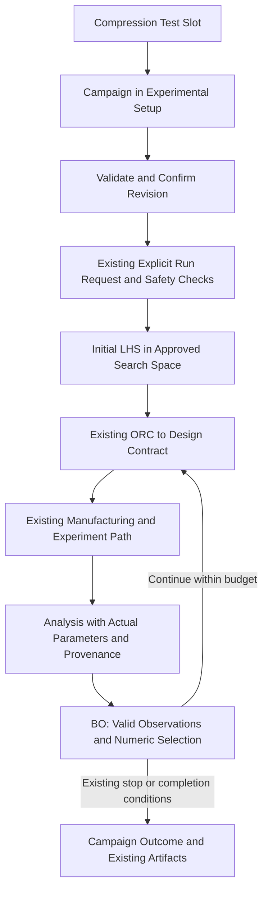

# 실험 슬롯·연구 캠페인·BO 연속값 통합 설계안

- 작성일: 2026-09-07
- 갱신일: 2026-09-07
- 상태: 합의한 방향을 반영한 통합 설계 — 미구현, 상세 설계 검토용
- 범위: 압축시험 슬롯 1개 + Experimental Setup에 통합하는 연구 캠페인 + BO 연속값의 전체 폐루프 전달
- 기준 문서: 이 파일이 최신 설계의 기준이다. 기존 링크 보존을 위해 파일명은 유지한다.
- 대체 범위: 이전의 슬롯 단독 설계와 캠페인·연속값을 제외한 구현 범위. 외부 검토 폴더의 초기 개선안은 당시 검토 기록이다.
- 실행 계획: [에이전트 소유 설정·실제 변경 전파·연속 BO 통합 구현안](../plans/2026-09-07-agent-owned-campaign-continuous-bo.md). [이전 슬롯 단독 구현안](../plans/2026-09-07-single-compression-experiment-slot.md)은 폐기된 범위이므로 그대로 실행하지 않는다.

## 1. 목표와 핵심 결정

**ATR은 여러 실험으로 확장할 수 있는 플랫폼이고, 압축시험은 첫 번째 실험 슬롯이다. 그 슬롯에서 연구 캠페인을 설정하고, BO가 연속값까지 제안하여 기존 폐루프를 수행하게 하는 것이 이번 개선의 전체 목표다.** 슬롯 구조는 캠페인·BO 개선을 담는 상위 구조이지 두 기능을 대체하는 작업이 아니다. 다른 실험 슬롯이나 범용 실행기를 미리 만들지는 않는다.

앞선 개선안에서 슬롯을 설정·바인딩 위치로 설명한 것은 이 설계에서 대체한다. 슬롯은 실험 유형 단위이고, 설정은 그 슬롯 내부의 구성값이다.

| 개념 | 의미 | 압축시험 사례 |
|---|---|---|
| Experimental Slot | 플랫폼이 제공하는 실험 유형·계약의 연결 단위 | Compression Test |
| Research Campaign | 각 에이전트 소유 설정의 참조·확정 버전·의존 관계·실행 이력을 묶는 연구 단위 | 특정 재료/시험 조건에서 에너지 밀도 최적화 |
| Experimental Setup | 현재 캠페인의 연구 조건을 조회·편집·확인하는 기존 UI | 목표, 치수, 변수 종류/범위, 예산, 장비 모드 참조 |
| Run / Cycle / Specimen | 기존 실행·반복·시편 식별 단위 | 후보 생성부터 측정·분석까지의 기존 실행 기록 |
| Artifact | 실행에서 생성한 파일·결과·증거 | STL, G-code, CSV, SS-curve, BO trace |

## 2. 상위 구조

```text
ATR 플랫폼
├─ 공통 기반
│  └─ ORC · Guardian · 실행 관리 · 장비 연결 · 아티팩트 관리
│
└─ Experimental Slots
   └─ 압축시험 슬롯 — 이번에 연결할 유일한 슬롯
      ├─ 실험별 설정·프로필·입출력 계약 참조
      └─ 연구 캠페인 — 현재 활성 캠페인 하나
         ├─ Experimental Setup: 목표·변수 공간·예산·실행 조건
         ├─ 확인된 캠페인 revision → 기존 ORC·BO·Design 입력
         ├─ 초기 LHS → Design → 기존 실험 → Analysis → BO → 다음 Design
         └─ 기존 run/cycle/specimen 기록과 산출물 참조
```

공통 기능을 슬롯 안으로 복사하지 않는다. 압축시험 슬롯은 필요한 기존 기능과 계약을 참조하는 얇은 실험 정의다. 실제 실행 책임은 기존 에이전트·runtime·Guardian에 남는다.

이번에는 현재 controller 실행 맥락에서 활성 캠페인 하나를 다룬다. 여러 캠페인의 기록은 구분할 수 있어야 하지만 동시 실행·장비 자원 배분·다중 캠페인 스케줄러까지 만들지는 않는다. 캠페인을 단순 브라우저 session_id와 동일시하지 않는다.

## 3. 최소 슬롯 정의

이번 슬롯에 필요한 정보는 다음 수준으로 제한한다. 구체적인 저장 형식과 이름은 기존 설정 구조를 먼저 확인해서 결정한다.

| 정보 | 목적 |
|---|---|
| 안정적인 슬롯 식별자 | 현재 선택과 실행 기록을 같은 슬롯에 연결 |
| 표시명·설명 | 압축시험 슬롯임을 화면과 ORC에서 안내 |
| 설정·프로필 참조 | 기존 압축시험의 설정을 Experimental Setup에서 조회 |
| 실행 경로 참조 | 기존 압축시험 실행 진입점·그래프에 연결 |
| 입출력·분석 계약 참조 | 기존 에이전트와 아티팩트 의미를 유지 |

슬롯의 등록 여부와 실제 실행 준비 상태는 다르다. 슬롯이 존재한다고 장비 연결·설정 검증·Guardian 승인이 끝난 것으로 표시하지 않는다.

재료·시편 크기·압축 조건 변경은 같은 압축시험 슬롯의 설정 변경이다. 측정 CSV·설계 파일·분석 결과는 기존 아티팩트이며 슬롯이 아니다. 서로 다른 run이나 시편을 각각 새로운 슬롯으로 만들지 않는다.

## 4. 사용자 진입 흐름

```text
현재 슬롯 조회: 압축시험
        ↓
Experimental Slots 영역의 압축시험 카드 + ORC 안내
        ↓ 클릭 또는 채팅
기존 Experimental Setup에서 연구 캠페인 조건 확인·편집
        ↓
공통 검증 → 기존 확인·승인 경로 → 캠페인 revision 확정
        ↓ 별도의 실행 요청
기존 시작 검사·Guardian → 초기 LHS / 후속 BO → 기존 압축시험 실행
        ↓
Analysis 관측 → 같은 캠페인의 다음 BO / 종료 → 기존 아티팩트 보관
```

- 현재 슬롯은 하나이므로 최초 기본 연결을 압축시험으로 둘 수 있다. 슬롯 기본 연결은 실험 설정의 확정이나 장비 승인이 아니다.
- 매 세션마다 하나뿐인 슬롯을 다시 선택하게 강제하지 않는다.
- 카드는 Experimental Setup보다 상위의 실험 선택 개념으로 표시하되, 별도 workspace나 실행 시스템을 만들지 않는다.
- 압축시험 카드를 클릭하면 기존 Experimental Setup을 연다. 클릭 자체로 실험을 시작하지 않는다.
- 채팅과 클릭은 같은 슬롯·설정 상태를 사용하고 기존 조회·검증·반영 경로를 우선 재사용한다.
- 연구 캠페인의 입력·검증·확정은 Experimental Setup에 통합한다. 외부 레포의 별도 intake 패널을 추가로 복사하지 않는다.
- 기존 설정과 프로필에 값이 있으면 먼저 채운다. 캠페인마다 고정된 전체 문답을 반복하지 않고 누락·충돌·수정 항목만 확인한다.
- 확인되지 않은 제안값을 확정값처럼 표시하지 않는다. 기존에 필요한 승인을 재사용하며 연구 확인과 동일 의미의 승인 단계를 중복 추가하지 않는다.
- 과거 보고서 조회로 현재 슬롯 선택이 바뀌지 않게 한다.

최초 안내의 한글 예시:

> 현재 실험 슬롯은 압축시험입니다. 현재 연구 캠페인의 목표와 설계 범위를 Experimental Setup에서 확인하거나 채팅으로 변경할 수 있습니다.

캠페인이 아직 없으면 있다고 꾸미지 않고 `연구 캠페인은 아직 설정되지 않았습니다`라고 안내한다. 캠페인 이름·확정 여부·누락 조건은 서버 상태에서 가져온다. 슬롯 카드는 클릭 가능한 상위 진입점이고, 설정의 실제 편집 대상은 현재 캠페인이다.

미확정·입력 누락이 있으면 실제 상태를 덧붙인다. 단순 현재 슬롯 안내는 서버 상태를 기준으로 제공하며 별도 필수 LLM 호출을 추가하지 않는다. 조회 실패를 기본 연결 성공으로 숨기지 않는다. 새로고침과 주기적 상태 갱신마다 같은 안내를 중복 누적하지 않는다.

GUI 라벨은 기존 영어 원칙을 유지하고, ORC 채팅은 사용자 언어를 따른다. 이 문서는 한글 개선안이다.

## 5. 기존 경로 우선 원칙

**기존 경로 재사용 → 기존 경로 최소 확장 → 불가피한 경우만 신규 추가** 순서를 따른다.

1. 기존 압축시험 경로를 첫 슬롯에 연결한다. 슬롯용 대체 실행 경로를 만들지 않는다.
2. 기존 Experimental Setup, planning session, 채팅·이벤트 갱신, 설정·프로필 경로를 먼저 사용한다.
3. 기존 장비별 모드, 안전 잠금, Guardian, 복구·재시도 정책을 유지한다.
4. 슬롯 선택과 설정 조회·편집이 실행 시작 또는 물리 승인으로 전환되지 않게 한다.
5. 기존 run 기록에 슬롯 식별 참조가 필요하면 최소한으로 추가하고, 아티팩트 경로나 저장소를 새로 만들지 않는다.
6. 새 API·서비스가 필요하다고 판단되면 기존 경로로 해결하지 못하는 책임과 이유부터 명시한다.
7. 현재 ObjectiveService의 목적함수 검증·승인·활성화와 기존 BO/Design 전달 계약을 재사용한다. 외부 계약 세 개를 그대로 복제하여 별도 권위 원본을 만들지 않는다.
8. 기존 BoTorch 백엔드는 유지한다. 캠페인 입력→BO→ORC→Design의 제한·보정 경계를 필요한 만큼 바꾸어 연속값을 연결한다. 기존 경로 우선은 핵심 기능을 제외한다는 뜻이 아니다.

## 6. 이번에 하지 않을 것

- 인장·굽힘 등 추가 슬롯 구현 또는 작동하는 것처럼 보이는 가짜 카드.
- 슬롯 생성 마법사, 동적 플러그인 로더, 설치·배포 관리, 다중 캠페인 스케줄러.
- 기존 에이전트 코드 전체를 슬롯 폴더로 이동하거나 복제하는 리팩터링.
- 모든 미래 실험에 압축시험 순서·특정 장비·BO 사용을 강제하는 공통 규칙.
- 새로운 범용 슬롯 상태 머신이나 승인 체계의 일괄 도입.
- 목적함수의 과학적 의미 변경, 장비 구동 순서·명령·안전 정책 변경.
- 별도 ERP 실행 엔진, 임의 단계별 추가 승인, 반복 3회 자동 스케줄러, 실행 중 자연어 명령의 범용 제약 적용 엔진.

**연구 캠페인과 BO·Design 연속값 지원은 이번 필수 범위다.** 캠페인의 최소 revision·검증·실행 참조도 포함한다. 모든 미래 실험을 위한 범용 설정 프레임워크나 조직/자원 관리 ERP로 범위를 확대하지 않는다는 뜻이지 캠페인 관리를 뺀다는 뜻이 아니다.

## 7. 구조 검증 기준

- 플랫폼 수준 코드가 압축시험을 유일한 실험 유형으로 가정하지 않고 현재 슬롯 참조를 통해 연결한다.
- 실제 제공하는 슬롯은 압축시험 하나뿐이며, 추가 슬롯이 구현되었다고 표시하지 않는다.
- 슬롯 카드·ORC 안내·Experimental Setup이 같은 현재 슬롯을 가리킨다.
- 기존 이산 설정과 장비 실행 경로의 동작은 보존한다. 새로 승인한 연속 설정은 같은 경로에서 수용한다.
- 슬롯 조회·선택·편집만으로 장비 동작이나 실행 task가 시작되지 않는다.
- 결과물은 기존 아티팩트이며 슬롯으로 재분류되지 않는다.
- 향후 새 슬롯을 추가할 경계는 설명할 수 있지만, 아직 쓰지 않는 실행기나 플러그인 기능은 만들지 않는다.
- 캠페인에서 확인한 목표·변수 종류/범위·예산·프로토콜이 실제 BO와 Design 입력까지 일치한다.
- 이산 목록에 없는 연속 후보도 제조 조건에 적합하면 형상 생성과 후속 관측까지 전달되고, 중간에서 이산값으로 치환되지 않는다.
- 초기 LHS와 후속 BO, 유효 관측 집계와 실패 처리, 종료 상태가 같은 캠페인 기록에 연결된다.

검증은 우선 정적·비구동으로 수행한다. 별도 테스트 전용 실행 경로를 만들지 않고, 필요한 경우 기존 실제 연결 경로에서 장비 호출 경계만 대체한다.

## 8. 설계 의견

이번 단계에서는 **확장성을 기능 수가 아니라 경계로 보여주는 것**이 적절하다. 압축시험 하나를 사용하더라도 화면과 코드의 소유 관계에서 플랫폼·실험 슬롯·설정을 구분하면 된다.

첫 슬롯은 압축시험의 실험별 계약을 연결하고, 캠페인은 연구 조건과 진행 이력을 관리하며, BO는 승인된 설계 공간에서 다음 점을 선택한다. 이 세 책임을 분리하되 기존 실행 경로로 연결하는 것이 이번 개선이다. 두 번째 실제 실험의 요구가 생기기 전에 공통 실행 엔진을 다시 설계하지 않는다.

이 문서는 구조 설계만 정리한다. 현재 요청으로 코드 수정·장비 구동·커밋·푸시는 수행하지 않는다.

## 9. 외부 레포에서 채택하는 특징과 보완점

아래 구현 확인은 다운로드한 소스의 정적 검토 결과이며 외부 코드의 실행 성공을 뜻하지 않는다.

| 외부 특징 | 채택/적용 | 그대로 가져오지 않을 부분 |
|---|---|---|
| 연구 조건 수집·결정론적 검증 | 기존 Setup과 채팅이 같은 캠페인 조건을 검증 | 고정 10개 입력을 플랫폼의 실험 슬롯으로 해석하지 않음 |
| ResearchPlan → BO/Design 계약 생성 | 하나의 확인된 캠페인 revision에서 기존 하위 계약 생성 | 외부 계약 간 누락된 실행 방식·프로토콜·목적함수 식별 연결을 보완 |
| revision/digest | 오래된 UI 변경 감지, 확정 조건의 실행 추적 | 승인 파일 하나를 덮어써 이전 연구 조건을 잃는 방식 제외 |
| ORC 제공 연속 bounds 사용 | 셀 크기·상대밀도의 승인 범위를 끝단까지 전달 | 외부 BO의 연속 전용 검사를 복사해 기존 이산 지원을 제거하지 않음 |
| LHS/수치 최적화 선택값 보존 | 수치 trace와 다음 Design 입력 일치 | 숨은 기본값·임의 clamp·LLM 재순위화로 후보 바꾸기 제외 |
| 관측 유효성·실패 명시 | 잘못된 관측은 학습 제외, 실행 실패는 기존 기록·안전 경로 유지 | 실패를 임의의 낮은 목적값으로 만들어 GP에 넣지 않음 |

외부 Human 레포는 입력·검증·계약 생성 계층이지 완성된 다중 캠페인 ERP가 아니다. 외부 ORC catalog는 이산 셀 크기를 내보내지만 외부 BO는 연속 범위를 요구한다. 외부 BO 설계도 Design의 이산 제한 해제를 범위 밖으로 명시한다. 따라서 두 레포를 합치면 완성되는 기능으로 간주하지 않고 우리 경로에서 계약을 연결한다.

현재 ATR과 외부 두 저장소의 `learning/botorch_backend.py`는 2026-09-07 정적 재검토에서 파일 해시가 동일했다. GP/LogEI 엔진을 외부 신규 기능으로 다시 만들지 않는다. 현재 supervisor·Guardian·장비 상태 관리도 유지한다.

## 10. 연구 캠페인의 최소 계약과 생명주기

### 10.1 캠페인에 묶을 정보

| 정보 | 권위 원본 및 연결 원칙 |
|---|---|
| `campaign_id`, `slot_id`, revision/hash | 캠페인의 연구 조건 식별. 브라우저 세션·개별 시편과 별도 |
| 연구 목표/목적함수 | 기존 ObjectiveService의 id/version/hash, metric/unit/direction 참조 |
| 실험 조건 | 구조·재료·초기 치수·시험 프로토콜·제조 제약. 기존 experiment spec/profile 재사용 |
| 설계 공간 | 각 변수의 종류(`discrete`, `continuous`, `fixed`), 단위, 값/범위 |
| 초기 설계/예산 | 기존 LHS 개수·seed, 고유 설계 예산, 적용 가능한 기존 반복·재시도 한도 |
| 실행 조건 | 선택한 모드·per-device profile의 기존 실행 snapshot 참조 |
| 진행·결과 | 기존 run/cycle/attempt/specimen/observation/artifact 식별자의 연결 |

연구 조건의 확인은 장비 실행 허가가 아니다. 프로필을 참조했다고 해당 장비가 연결됐다고 표시하지 않는다. 실행 시 기존 프로필 확정·검사 경로가 실제 사용할 값을 결정하고 그 기록을 캠페인 revision과 연결한다.

### 10.2 입력·검증·확정

1. 기존 spec·프로필·목적함수에서 현재 값을 읽어 캠페인 초안을 구성한다. 읽기나 슬롯 클릭만으로 확정하거나 실행하지 않는다.
2. Setup에서의 편집과 채팅 수정은 같은 필드 검증/변경 경로를 사용한다. LLM은 설명과 입력 해석을 돕지만 수치 범위·단위·제약의 최종 판단자는 아니다.
3. 변경 대상 설정의 소유 에이전트가 검증하고, 선언된 연결에 따라 영향받는 소유 에이전트에도 변경을 전달한다. 누락·해석 모호함·값 오류·조합 충돌은 구분하되 충돌 검사만으로 연동이 구현됐다고 보지 않는다.
4. 각 소유 에이전트가 실제 사용할 설정 버전을 저장하고 실행 입력 생성 경로로 다시 읽어 적용 결과를 확인한다. 기존 확인/승인 경로를 재사용하고 목적함수 변경은 ObjectiveService를 통한다.
5. 모든 필수 소유 에이전트의 적용 확인 후 해당 설정 참조 묶음으로 캠페인 revision을 확정한다. `campaign_id`와 revision/hash를 공통 출처로 연결한다. 일부만 반영된 묶음은 실행 가능 상태로 공개하지 않는다.
6. 별도의 기존 실행 요청이 들어오면 기존 안전 검사 후 시작한다. 연구 확인 버튼이나 초안 저장을 자동 실행으로 연결하지 않는다.

동시 화면 편집은 revision을 비교하여 오래된 변경을 거절하고 현재 값을 다시 보여준다. 새 승인 체계·DB를 별도로 만들기보다 기존 session/action 계약을 필요한 만큼 확장한다. 기존 경로로 불가능한 부분에만 얇은 캠페인 검증·변환 기능을 추가한다.

### 10.3 변경·종료·보관

- 실행은 시작 때 참조한 캠페인 revision을 고정한다. 진행 중 편집은 초안이며 현재 시편의 치수·시험 조건·목적값을 소급 변경하지 않는다.
- 새 revision의 적용은 기존 제어 경로가 허용하는 안전한 실행 경계에서 명시적으로 한다. 지원하지 않는 중간 적용은 보류하고 정지/종료 뒤 기존 시작 절차를 사용한다. 자동 resume/retry 기능을 추가하지 않는다.
- 목표·단위·시험 프로토콜·geometry 정규화 기준이 달라진 관측은 같은 학습 데이터로 자동 혼합하지 않는다. 같은 캠페인의 이전 revision이라도 호환성 검증이 필요하다.
- 확정된 revision은 기존 기록/아티팩트 저장 체계 안에 변경 불가능한 snapshot으로 남긴다. 현재 revision 참조만 바꾸며 과거 snapshot을 덮어쓰지 않는다. 기존 run/cycle 디렉터리 이관이나 중복 아티팩트 원장은 만들지 않는다.
- 캠페인의 실행 진행 상태는 기존 run 상태와 예산에서 투영한다. 별도의 경쟁하는 runtime 상태 머신을 만들지 않는다. 실패·운영자 정지·안전 차단을 정상 연구 완료로 표시하지 않는다.
- 현재 범위는 기존 반복 정책을 유지한다. 외부 기본 반복 3회를 자동 도입하지 않는다. 고유 설계 수, 측정 반복 수, 실행 시도 수를 구분하고 같은 설계의 중복 측정을 새로운 LHS 점으로 세지 않는다.
- 예산의 단위를 명시한다. `고유 설계 N개`를 기존 loop attempt N회와 동의어로 표시하지 않는다. 기존 재시도/시도 한도를 함께 유지하고, 유효 관측이 모이지 않을 때 무제한 실행하지 않는다. 최종 시점에 예산 미충족이면 미완료 사유를 보고한다.

## 11. BO 연속값 지원과 끝단 일관성

### 11.0 에이전트 소유와 실제 설정 연동 — 추가 합의

설정 스키마·검증·저장·적용의 소유권은 담당 에이전트에 있다. 캠페인은 다른 에이전트의 설정 원본이 아니며 ORC가 값의 의미를 독자적으로 결정하지 않는다. 슬롯은 실험에 필요한 소유 설정과 연결 계약을 참조한다. Setup과 각 에이전트 workspace는 같은 소유 설정 서비스에 연결한다.

| 소유 주체 | 소유 항목 | 연결되는 소비자 |
|---|---|---|
| Design | 초기 치수·재료/형상 조건·제조 가능 범위 | Specimen Making·Lab Equipment·CAE/Analysis·BO |
| Lab Equipment | 시험 프로토콜·종료 변형률·실제 method 입력 매핑 | CAE/Analysis의 시험 연동 설정 |
| Analysis | 계산 지표·계산 구간·정규화·현재 코드상 CAE 요청 설정 | BO 목적값/관측 계약 |
| BO | 탐색 공간 선택·초기 LHS·seed·최적화 설정 | Design의 실제 후보 입력 |
| ORC | 연구 실행 예산·종료/반복 운영 조건 | 기존 cycle 제어와 BO 요청 여부 |
| 각 장비 담당 에이전트 | 자기 실행 모드·프로필 | 기존 해당 bridge/실행 경로 |

현재 CAE 요청은 AnalysisAgent가 생성하므로 이를 별도 CAE 에이전트가 이미 소유한다고 꾸미거나 새 에이전트를 만들지 않는다. 목적함수의 공통 검증/승인 저장은 기존 ObjectiveService를 사용하되 계산 의미는 Analysis 계약, 최적화 사용은 BO 계약에 남긴다.

각 연결은 `소유 필드 → 소비 필드 → 변환 → 버전 → 적용 범위`를 명시한다. 소비자는 `follow`이면 원본 변경을 받아 실제 자기 실행 설정을 바꾸고, 사용자에게 명시적으로 고정된 값이면 자동 덮어쓰지 않는다. 임의 표현식 실행이나 무제한 양방향 동기화 대신 압축시험의 선언된 연결만 사용하며 순환 연결은 거절한다.

예: 종료 변형률을 40%로 변경하고 초기 높이가 30 mm이면 Lab Equipment는 압축 변위 12 mm를 도출한다. 장비 method가 stroke를 쓰는지 지그 간격을 쓰는지는 해당 장비 소유 매핑이 결정한다. `Height`를 무조건 18 mm로 쓰거나 기존 Start Height 32 mm/로봇 진입 높이를 압축 변위로 오인하지 않는다.

1. Lab Equipment의 실행 설정과 method 입력값을 실제 변경한다.
2. 시험 종료를 따르는 CAE 설정은 `target_strain=0.4`로 변경한다.
3. 시험 종료를 따르는 Analysis 구간은 `evaluation_strain=0.4`로 변경하여 실제 적분/구간 최대하중 계산에 사용한다.
4. BO 목적이 그 연동 지표를 사용하면 Analysis 구간·목적함수 버전까지 일치하는 새 계약을 사용한다. 기존 이름에 `50pct`가 들어간 지표의 의미를 40%로 바꾸지 않는다.
5. 고정 50% 목적을 유지하는 경우는 임의로 40%로 바꾸지 않고 연구 조건의 충돌로 드러낸다. 사용자가 연결형 목적을 선택·확인한 뒤의 후속 변경은 선언된 연결대로 전파한다.

`검증됨`, `소유 설정에 반영됨`, `실행 입력에 반영됨`, `장비 설정 읽기 확인됨`을 구분한다. ACK나 캠페인 JSON 변경만으로 실제 반영 성공을 표시하지 않는다. 장비 측 변경은 기존 실행 요청 뒤 UTM 시작 직전의 설정 적용/확인 단계에서 수행하며, 미연결 장비를 편집 시 임의 호출하지 않는다. UI에는 아직 장비 확인 전임을 명시한다.

설정 변경은 진행 중인 물리 동작을 소급 수정하지 않는다. 변경안은 다음 허용 실행 경계의 설정 버전으로 준비하고, 전파 실패·버전 불일치·장비 읽기 확인 실패 시 해당 새 revision의 실행을 막는다. 운영 run의 이전 버전을 조용히 교체하거나 자동 재개하지 않는다.

### 11.0.1 숨은 고정값을 설정 변수로 전환

시편 치수·시험 목표·분석 구간·설계 범위·LHS 크기·seed·예산을 에이전트 소유의 명시적 변수로 뺀다. **변수화와 사용자 설정/연동은 별개다. 사용자가 설정하지 않거나 캠페인이 없어도 현재 동작을 보존하는 에이전트별 기본 설정으로 실행할 수 있어야 한다.** 초기 구성값은 읽고 수정할 수 있는 버전 관리 기본 설정이며 실행 함수 곳곳의 `or 0.5`, 치수 20 mm fallback, 고정 도메인 clamp로 흩어두지 않는다.

값 출처는 명시적 사용자 값, 선언된 연결 원본, 기존 저장 프로필, 에이전트 기본 설정으로 구분해 기록한다. 기본 설정은 정상적인 출처이며 오류 은폐용 fallback과 다르다. 연결을 사용하지 않으면 기본 설정을 쓰고 나중에 `follow`로 바꿔 연결할 수 있다. 연결을 명시적으로 켰는데 원본 조회/검증이 실패하면 기본값으로 몰래 되돌아가지 않는다. 값이 제공됐지만 잘못된 경우도 기본값으로 대체하지 않는다. 사용자 값·프로필·기본 설정 어디에도 유효한 값이 없는 경우에만 미설정 오류를 반환한다.

사용자가 선택한 `fixed` 변수, 장비의 검증된 안전 한계, 단위 변환 상수, 이름 자체가 50%를 뜻하는 기존 과학 지표 정의는 제거 대상이 아니다. 이를 모두 가변화하여 안전 경계를 느슨하게 하거나 기존 지표 의미를 바꾸지 않는다. 기존 run은 기존 snapshot으로 해석하고 새 실행은 내부에서 기본 설정까지 해석한 계약을 사용한다. 사용자에게 캠페인 작성이나 모든 변수 입력을 새 필수 절차로 강제하지 않는다.

### 11.1 변수 종류를 명시하는 캠페인 입력

```json
{
  "cell_size_mm": {"kind": "continuous", "bounds": [5.0, 10.0], "unit": "mm"},
  "relative_density": {"kind": "continuous", "bounds": [0.20, 0.48], "unit": "1"}
}
```

위 숫자는 설명용 범위이며 새로운 전역 기본값이 아니다. 실제 값은 사용자에게 확인받은 캠페인 조건을 사용한다. 기존 이산 셀 크기는 `kind=discrete, values=[5,6,7.5,10]`으로 보존할 수 있고, 셀 크기를 6 mm로 고정하는 경우는 `kind=fixed, value=6.0, unit=mm`로 표현한다. `[5,10]`만 보고 두 선택지인지 연속 범위인지 추측하지 않는다.

이 명시적 캠페인 표현을 기존 BOParameterSpace/백엔드가 받는 형식으로 변환한다. 기존 배열 표현의 연속/이산 구분을 타입 정보 없이 재해석하지 않는다. 필요한 타입 전달은 기존 변환 계층을 최소 확장하고 수치 최적화 엔진은 교체하지 않는다.

### 11.2 초기 LHS부터 후속 Design까지



- 초기 LHS는 첫 실험 데이터 없이 기존 초기 설계 경로에서 생성한다. 캠페인 초기화를 Analysis 결과가 있어야 하는 후속 BO 호출에 억지로 연결하지 않는다.
- 초기 LHS 개수·seed는 BO 소유의 명시적 설정을 사용한다. 8개는 현재 구성 사례이지 플랫폼에 고정할 값이 아니다. 설정한 초기 설계 개수보다 예산이 부족하면 실행 전 조건 충돌을 알리고 몰래 LHS 수를 줄이지 않는다. 알고리즘의 최소 관측 요구는 BO가 별도로 검증한다.
- 테스트/실제 실행 모두 같은 캠페인 입력을 소비한다. 새로운 테스트 전용 사이클을 만드는 대신 실제 경로의 장비 호출 경계를 mock하여 검증한다.
- 연속 공간에서는 연속 최적화, 이산/연속 혼합에서는 기존 혼합 최적화를 허용한다. 외부 코드의 `optimize_acqf` 전용 검사로 정상 혼합 경로를 거부하지 않는다.
- 수치 선택점은 BO 출력→ORC 전달→Design 요청에서 값이 보존되어야 한다. 예를 들어 승인 범위 안의 `cell_size_mm=6.37`을 `6`이나 `7.5`로 바꾸지 않는다.
- 현재 Design의 `{5,6,7.5,10}` membership 검사는 연속 변수에 대해 캠페인 범위와 제조 제약 검증으로 바꾼다. 이산 변수에는 기존 membership 의미를 유지한다.
- controller/BO/Design 중간의 default, clamp, 고정 셀 크기 잠금, 반올림이 승인한 후보를 바꾸지 않는지 모두 확인한다. 표현상 직렬화 외의 값 변경은 명시적으로 처리한다.
- 형상 생성까지 해당 연속값을 실제 사용해야 한다. 제조 불가하면 사유를 보고하고 기존 실패 경로를 따르며 임의 후보로 대체하지 않는다.
- Analysis 관측은 실제 사용한 설계값과 초기 치수를 갖고 BO에 돌아온다. 제안값과 실제 생성값이 달라졌다면 조용히 같은 후보의 관측으로 학습시키지 않는다.

### 11.3 목적값·관측·실패

현재 목적값 `energy_density_50pct_MJ_per_m3`, 즉 초기 치수로 정규화한 SS-curve에서 engineering strain 50%까지 적분한 에너지 밀도의 의미와 기존 실행 호환성을 유지한다. 새로 선택하는 시험 연동형 지표는 `energy_density_at_target_strain_MJ_per_m3`처럼 구분된 계약과 실제 목표 변형률을 갖고, ObjectiveService의 새 승인 버전으로 사용한다. 외부 SEA로 변경하지 않는다. 활성 목적함수의 정확한 id/version/hash·단위·프로토콜·계산 구간을 캠페인과 관측에서 확인한다.

실제 측정곡선에서 목표 구간 도달 여부를 확인하며 부족한 구간을 임의 외삽하여 유효 관측으로 만들지 않는다. 실험/해석 fidelity 이름과 기존 구분을 보존하고 `utm_high`·`cae_mid`를 외부 이름에 맞춰 무조건 변환하거나 동일 GP 관측으로 섞지 않는다.

누락·비유한 값·목적 불일치·출처 미확인·유효성 실패 관측은 학습에서 제외하고 이유와 원본 아티팩트는 보존한다. 중복 측정은 고유 LHS 관측 수를 늘리지 않는다. 실패를 가짜 목적값 penalty로 만들거나 수치 최적화 실패를 LLM/임의 후보로 대체하지 않는다. 학습 제외는 안전 실패나 재시도 관리에서 삭제한다는 뜻이 아니다.

## 12. 통합 시 재사용할 책임 경계

| 기존 위치 | 통합 책임 | 보존할 것 |
|---|---|---|
| `app/controller.py` | 현재 슬롯/캠페인 투영, 기존 설정 action, 초기 LHS 및 BO→Design 전달 | start/handoff·안전 잠금·mode/profile·cycle 경로 |
| `web/static/planning.js` | 슬롯 카드와 Setup 캠페인 편집/상태, 채팅 동일 상태 연결 | 기존 planning/event 갱신, 과거 report 조회 |
| `objectives/service.py` | 현재 목적함수 승인·활성화와 캠페인 참조 연결 | 목적값 의미·단위·버전 검증 |
| `agents/bo_agent.py` | 명시적 설계 공간 소비, 선택점/관측 검증, 숨은 보정 제거 | 기존 수치 백엔드·목적값·필요한 이산/혼합 지원 |
| `learning/botorch_backend.py` | 기존 LHS/GP/acquisition 계산 | 재구현하지 않음; 계약 소비 호환성 검증 |
| `agents/design_agent.py` | 연속값 수용 및 실제 형상 생성까지 파라미터 보존 | 제조 제약·기존 이산 설정·기존 생성 경로 |
| 기존 Analysis·artifact 보관 | 실제 파라미터/목적/캠페인 출처 연결 확인 | CSV/SS-curve 계산 의미와 기존 루프별 저장 |
| 기존 runtime·Guardian·장비 bridge | 기존 경로로 실행·정지·차단 | 외부 controller/runtime으로 덮어쓰지 않음 |

이 표는 설계상 수정 책임이며 모든 파일을 반드시 수정하라는 뜻은 아니다. 기존 기능이 이미 계약을 충족하면 그대로 재사용한다.

## 13. 비구동 수용 기준

| 검증 | 통과 기준 |
|---|---|
| 슬롯 개념 | 압축시험 카드 하나, 캠페인·run·artifact와 분리 |
| 화면/채팅 | 같은 campaign/revision 편집, 오래된 수정 감지, 기존 값 재사용 |
| 읽기·저장·확정 | 슬롯 클릭/설정 저장/연구 확인만으로 장비 동작이나 자동 시작 없음 |
| 실행 계약 | 확인한 목표·공간·프로토콜·모드 참조가 실제 하위 계약과 일치 |
| 연속 후보 | 이산 목록 밖의 유효한 후보가 BO→ORC→Design→형상 생성→관측까지 동일 |
| 실제 변경 전파 | 40% 입력이 소유 설정·장비 method 요청·CAE 입력·Analysis 계산 인자·연동형 BO 목적 계약까지 실제 반영 |
| 반영 증거 | 저장/요청/장비 읽기 확인을 구분; fake ACK·일부 실패·stale revision을 성공으로 표시하지 않음 |
| 변수화 | 서로 다른 치수·범위·변형률·LHS 개수에서도 동작, 필수값 누락 시 하드코딩 fallback 없음 |
| 무설정 실행 | 사용자 설정/캠페인/연결 없이 기존 저장 프로필과 소유 기본값으로 실행, 출처 표시; 나중에 같은 변수에 연결 가능 |
| 기존 이산 경로 | 기존 값/제약/혼합 최적화가 유지되고 정상 실행 계약 생성 |
| 잘못된 범위·제조 불가 | 설명 가능한 오류, 숨은 기본값·clamp·fallback 없음 |
| 초기 데이터 없음 | 기존 초기 LHS 경로로 후보 생성, 초기 Analysis 의존 없음 |
| LHS/예산 | 유효한 고유 설계와 반복·시도 수 구분, 부족 예산 조기 안내 |
| 목적값·fidelity | 현재 에너지 밀도 계약 유지, 비호환 관측 자동 혼합 없음 |
| 수정·재실행 | 이전 revision 보존, 진행 중 물리 시험 조건 소급 변경 없음 |
| 안전·장비 모드 | 기존 출력 skip/이젝션/텔레옵/UTM/Guardian 정책 변화 없음 |
| 기록·UI | run/cycle별 artifact 경로 유지, 과거 보고서가 현재 캠페인을 바꾸지 않음 |
| 종료 | 성공 완료·예산 미충족·오류·운영자 정지·안전 차단을 구분 |

단위 계약 검증 뒤 기존 전체 경로에서 장비/외부 서비스 호출만 대체한 비구동 사이클을 검증한다. 모든 handoff를 성공 반환으로 바꾼 테스트를 전체 연결 증거로 쓰지 않는다. 실장비 검증 없이 실증 성공으로 문서화하지 않는다.

## 14. 근거와 후속 범위

- 외부 ORC 계약 생성: [compiler.py](https://github.com/somedaybegreat/autonomous_researcher_human_orchestration/blob/62f0f22692921d11fa61329d11b103c3a4521f76/orchestrator/research_intake/compiler.py).
- 외부 ORC 입력 상태/검증: [service.py](https://github.com/somedaybegreat/autonomous_researcher_human_orchestration/blob/62f0f22692921d11fa61329d11b103c3a4521f76/orchestrator/research_intake/service.py).
- 외부 ORC 저장 방식의 한계: [store.py](https://github.com/somedaybegreat/autonomous_researcher_human_orchestration/blob/62f0f22692921d11fa61329d11b103c3a4521f76/orchestrator/research_intake/store.py).
- 외부 BO 연속값과 Design 미연결 범위: [BO cleanup design](https://github.com/somedaybegreat/autonomous_researcher_bo/blob/f03189a7c9b55b4e5bd046bd65311ced3345871f/docs/superpowers/specs/2026-09-02-bo-orchestrator-bounds-logei-cleanup-design.md).
- 현재 런타임 reference: [Autonomous experiment runtime](../../runtime/autonomous_experiment_runtime.md).
- 현재 ORC reference: [Orchestrator agent](../../agents/orchestrator_agent.md).

후속 구현안은 슬롯/캠페인 계약 → Setup·ORC 연결 → BO·Design 연속값 연결 → 기존 폐루프 회귀검증과 문서 순서로 분해한다. **계획을 나누더라도 캠페인이나 연속값을 선택적 후속 작업으로 빼지 않는다.** 아직 실행하지 않은 구현 계획을 완료로 표시하거나 현재 runtime reference에 구현됐다고 적지 않는다.
