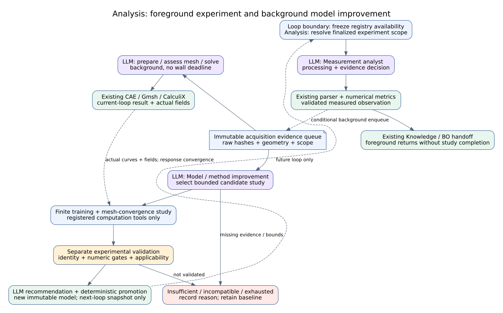

# Analysis Agent: 실험–해석–멀티피델리티 개선 설계

## Summary

**승인된 목표 설계이며 구현 사실과는 구분한다.** 2026-09-09, 기준 커밋 `3e28dbe`의 코드 조사와 공식 문서·연구 문헌을 바탕으로 작성했다. 사용자는 기본 실험 루프와 백그라운드 고도화를 분리하는 방향을 승인했다. 검증은 비구동으로 수행하며 실제 장비 조작, 커밋·푸시는 이번 실행 범위에 포함하지 않는다.

- 외부 폐루프의 Analysis 노드는 유지하고 내부에 **해석 담당 / 시험 데이터 분석·가공 담당 / 실험 기반 모델·방법론 개선 담당** 세 LLM 역할을 둔다.
- 각 역할은 근거를 검토하고 등록된 전문 툴을 선택한다. 수치 계산, solver, 필수 검증은 코드가 수행한다.
- 지표·목적값·불확실성은 **정의하고 사용하거나 제거**한다. 점수 수를 늘리는 것이 목적이 아니다.
- 해석 개선은 비교 조건 확인, 수치 검증, 보정, 독립 검증, 버전 채택을 구분한다.
- 컨투어는 실제 해석 필드와 메쉬로 만들며, 상용 후처리 도구를 참고한 기능·수치·화면 품질 검수를 모두 통과해야 한다.
- 본문에서 ‘목표’, ‘제안’, 새 계약명은 구현 사실이 아니다. 기존 압축시험은 첫 적용 프로파일이며 공통 구조를 그 시험에 고정하지 않는다.

## Problem

설계 전 기준 버전의 Analysis LLM은 최종 요약만 작성했다. 해석 실행과 계산은 있으나 분석 전략·증거 판정·모델 개선을 LLM이 책임지지 않았다. 동시에 임의 종합점수, 휴리스틱 불확실성, 신뢰 점수가 서로 다른 의미를 섞었다. 아래 Current Context는 그 기준 버전의 조사이며, 구현 현황은 문서 말미와 현재 Reference에서 구분한다.

컨투어는 외형만 개선해서 해결되지 않는다. 실제 필드 보관·변환·단위·평균화·변형 정보가 먼저 확보되어야 한다. **메쉬 품질이 좋음, 수치해가 수렴함, 실험을 잘 설명함, 그림이 보기 좋음은 서로 다른 판정이다.**

## Goals and Non-goals

목표는 기존 경로를 재사용하는 세 역할의 실질적 LLM 판단, 근거 있는 물리 지표와 관측 계약, 검증 가능한 모델 업데이트, 실제 필드 기반 후처리다.

비목표는 외부 그래프에 세 stage를 추가하는 것, 별도 모델 서버 세 개를 띄우는 것, 장비 브릿지를 직접 제어하는 것, LLM의 자유 Python/입력 deck 생성, BO 알고리즘 교체, 무제한 solver 반복, 실험 결과를 맞추기 위한 목적함수 변경이다. 현재 상하면 frictionless 구속을 비롯한 승인된 시험 프로파일은 유지한다. 새로운 접촉·재료 모델 등은 지원 기능 등록과 별도 검증 없이 활성화하지 않는다.

## Current Context

| 코드 근거 | 현재 관찰 | 설계상 처리 |
|---|---|---|
| `agents/analysis_agent.py::_summary` | `analysis_reasoning`으로 끝난 결과의 요약 생성 | 세 역할의 판단/툴 선택으로 확대; 요약은 결정 기록에서 생성 |
| `_run_cae`, `graphs/modules/analysis/module.yaml` | `cae.run_static_analysis` 사용 | 이 진입점과 기존 계산 브릿지 우선 재사용 |
| `_objective_score`, `_uncertainty`, `_trust_score` | 고정 가중 종합점수와 출처·행 수·경고 기반 불확실성/신뢰 점수 | 아래 유지·제거 계약을 먼저 적용 |
| `_handoff_payloads`, `agents/bo_agent.py` | 바인딩된 목적함수 우선; 기본 물리 목적값 경로 별도. GP 관측오차에는 명시적 `observation_standard_error`만 사용 | 관측과 예측 분리 유지; 목적함수 해시 보존 |
| `agents/knowledge_agent.py`, `agents/guardian_agent.py` | 기존 스칼라 uncertainty 및 trust gate를 소비 | 단순 필드 삭제 금지; 소비자·저장 스키마까지 최소 호환 수정 |
| `device_bridges/calculix_bridge.py::mesh_stl` | Gmsh 실행 성공 및 INP 존재/크기 확인 | 요소별 품질, 형상 보존, 수렴 검증은 별도 추가 필요 |
| `utils/calculix_quasistatic.py::build_compression_deck` | 상부 노드 집합에 `U,RF`; 요소 필드 `S,E,PEEQ` 출력 요청 | 전체 변형 형상용 U 범위 확인/확장 필요; 기존 반력 이력 보존 |
| `CalculiXBridge.postprocess` | DAT/FRD 존재 확인, `field_asset_path`는 비어 있음 | 실제 필드 파싱·변환·검증을 구현할 위치 |
| `device_bridges/cae_bridge.py::_write_contour_svg` | 시험용 등가 경로에서 위치·삼각함수로 색 배치 | 실제 결과 표시에서는 사용하지 않음. 과거 파일은 보존 |
| `_calibrate_quasistatic_curve` | 시험용 proxy 곡선을 참고 에너지로 스케일링 | 물리 모델 식별/검증으로 인정하지 않음; 새 보정 루프와 명확히 분리 |

현재 LIVE CAE는 CalculiX job 경로로 분기한다. 시험용 proxy 컨투어/스케일링을 실제 solver 필드·실험 기반 파라미터 식별과 혼동하지 않는다.

## Options Considered

| 방안 | 장점 | 문제/결정 |
|---|---|---|
| 하나의 거대 프롬프트가 전부 처리 | 호출 수 적음 | 파싱 판단·수치 검증·모델 선택 책임이 섞여 채택하지 않음 |
| 외부 독립 에이전트 세 개와 새 그래프 | 명시적 분리 | 현재 인계·GUI·런 복구 변경 범위가 커서 이번에는 채택하지 않음 |
| **기존 Analysis 내부 세 LLM 역할** | 기존 폐루프 유지, 단계별 근거·툴 권한 분리 | **권장안**. 동일 등록 모델 사용 가능; 역할별 요청/응답 계약 분리 |

## Decision

Analysis가 세 역할을 소유하되 측정 CSV 분석·검증과 BO 인계는 전경, 선택적 FEM 준비·실행 및 반복 고도화는 Analysis 소유의 비동기 작업자로 실행한다. 유효한 측정값의 BO 인계와 다음 실험 루프는 선택적 FEM 완료를 기다리지 않는다. simulation-only/preflight처럼 해석 자체가 입력 데이터인 경로는 기존 선행 의존성을 유지한다. 해석 미설정·데이터 부족이면 해당 역할은 근거와 함께 `not_applicable` 또는 `needs_more_data`를 반환한다. 필수 선행 검증 실패를 모델에게 재심사시켜 통과시키지 않는다.

## Architecture and Contracts

### 1. 지표와 판단값: 유지·제거 계약

| 항목 | 결정 | 정의와 소비자 |
|---|---|---|
| 물리 지표 | 필요한 것 유지 | 이름, 물리량, 단위, 수식/방법 버전, 구간, 입력 해시, 유효 조건, 실제 소비자를 등록 |
| 목적값 | 한 명세의 평가 결과로 통일 | 실행에 고정한 `objective_id/version/hash`, 방향, metric과 단위. Analysis가 계산하고 BO가 사용 |
| 기존 임의 복합 objective score | 활성 경로에서 제거 | 목적함수에 명시된 가중합만 허용. 범용 종합점수로 실험/CAE를 임의 혼합하지 않음 |
| 기존 휴리스틱 `uncertainty` | 신규 계산/판정에서 제거 | 출처·행 수·CAE 실행 성공을 통계적 오차로 간주하지 않음 |
| 기존 가중 `trust_score` | 신규 권한 판정에서 제거 | 데이터 적합성, 수치 검증, 적용 범위, 출처 상태를 개별 사실로 전달 |
| 데이터 품질 | 명시적 검사로 유지 | 단위 확인, 수치 유효성, 구간 도달, 신원 연결, 파싱 상태와 실패 사유 |
| 실험–해석 차이 | residual로 별도 유지 | 공통 축·구간·단위에서 계산한 곡선 잔차와 목적량 차이. 불확실성으로 자동 치환하지 않음 |
| 진짜 불확실성 | 근거가 있을 때만 계산 | 아래 종류·추정법·단위·적용 범위를 함께 전달. 없으면 `not_estimated`, 값은 null |

물리 지표의 예: 압축 프로파일은 초기 apparent 단면적/높이로 engineering S-S를 만들고, 목적 구간의 에너지 밀도·최대하중·명시 구간 회귀 강성 등을 계산한다. `W = A0 H0 ∫σ dε`를 단위 검사에 이용할 수 있다. 특정 높이·변형률·재료 상수는 공통 프롬프트에 넣지 않는다. 이미 바인딩된 목적 구간을 LLM이 바꾸지 못한다. 구간을 측정하지 못했다면 외삽으로 채우지 않는다.

불확실성은 최소한 다음을 구별한다.

| 종류 | 산정 근거 | 전달 원칙 |
|---|---|---|
| 관측/계측 불확실성 | 계측기 정보 및 오차 전파, 또는 독립 반복시험 | 목적량 단위의 표준불확실성. 시편 간 변동과 평균의 표준오차 구분 |
| 수치 이산화 오차 추정 | 유효한 메쉬/증분 수렴 연구 | 물리 측정오차나 GP noise로 넣지 않음 |
| 보정 파라미터 불확실성 | 식별 가능성을 확인한 추정 절차 | 파라미터별 단위·구간·가정·추정법 기록 |
| 예측 불확실성 | 검증한 surrogate/posterior의 예측 분포 | 모델 버전과 적용 범위별 기록; 관측 불확실성과 분리 |

알 수 없음을 0 또는 1 같은 가짜 숫자로 대체하지 않는다. 반복시험 없이 한 CSV의 많은 행을 독립 반복시험으로 취급하지 않는다. GP에는 목적량과 단위가 맞는 관측 오차만 전달하며, 없으면 기존 BO의 오차 미지정 경로를 사용한다. 데이터 품질 통과와 불확실성 미산정은 양립 가능하다.

품질 규칙도 물리 상황에 맞게 정의한다. 예를 들어 단조 압축에서 최대값이 목적 구간 끝에 있다는 사실만으로 시험 실패라 하지 않는다. `column_mapping_confidence` 같은 이름은 검증되지 않은 확률처럼 사용하지 않고, 단위/열 매핑의 확인 근거와 모호성 상태로 바꾼다. 정규화에 필요한 시편 치수가 없으면 임의 기본 크기를 실측 치수처럼 사용하지 않는다.

**마이그레이션 선행 조건:** Knowledge의 float 변환, Guardian의 임계값 분기, 저장 스키마, BO 필터, GUI와 objective evaluation의 소비 목록을 확정한다. 신규 구조의 적합성/실패 사유를 읽도록 좁게 수정하고 기존 하드 안전 검증은 유지한다. 삭제 전후 고정 입력에서 목적값·인계·차단 사유를 비교한다. 기존 아카이브는 재작성하지 않고 legacy 값의 의미를 표시한다. 사용처 조사 없이 ‘안 쓰는 점수’로 단정해 지우지 않는다.

### 2. 세 역할과 5영역 책임

| LLM 역할 | 질문과 판단 | 전문 툴 | 산출물 |
|---|---|---|---|
| 시험 데이터 분석·가공 | 이 데이터에 어떤 등록 처리법이 타당한가? 이상은 계측/파싱/현상 중 무엇을 의심해야 하는가? | 기존 파서·정규화·구간 선택·metric 계산·검사 | 처리 recipe, 계산 결과, 품질 사실, 채택/보류 근거 |
| 해석 | 어떤 지원 모델·방법·정밀도가 목적량에 적합한가? 메쉬/수렴 결과를 채택할 수 있는가? | 기존 CAE job, 준비/solve/postprocess, 품질·수렴·field 도구 | 모델/해석 recipe, 계산 영수증, 필드·곡선, 수치 검증 |
| 모델·방법론 개선 | 잔차는 데이터·수치·파라미터·모델 형식 중 무엇으로 설명할 수 있는가? 어떤 추가 계산이 판별에 도움이 되는가? | 비교, 민감도 분석, 제한된 식별, 재해석, holdout 검증 | 가설, 업데이트 후보, 검증 성적, 유지/채택/보류 |

| 공통 영역 | Analysis 내 책임 |
|---|---|
| High | 위임된 연구 질문·목적함수·예산·필수 산출물을 받고 기존 인계 계약으로 반환. 다음 물리 실험 선정은 BO/Orchestrator |
| Middle | 위 세 LLM 역할의 방법 선택·근거 해석·툴 요청·결과 채택 |
| Low | parser, metric evaluator, mesher, solver, field converter, renderer 및 수치 최적화 실행 |
| Guardian / Safety | 입력/범위/예산/단위/신원/stop 검증, 모델 채택 조건. 기존 장비 인터록과 별개인 계산 안전 경계 |
| Knowledge / Evidence | 원본/가공 데이터, 실패 계산, 후보 모델, 학습·검증 분할, 결정·툴 로그, 버전 이력 보존 |

LLM 입력은 구조화된 지표·검사·로그·방법 설명과 같은 결과에서 생성한 곡선/메쉬/컨투어 이미지다. 이미지를 보았다는 이유로 없는 필드를 있다고 판단하거나 숫자를 픽셀에서 읽어 원본 필드를 덮어쓰지 않는다. 원인 가설은 가설로, 검증된 사실은 tool evidence로 구분한다.

### 3. 전체 흐름과 해석 개선 루프

#### 승인된 실행 분리

- 전경: 현재 시험 프로파일의 측정 CSV 분석·검증과 기존 Knowledge/BO 인계. 측정 데이터가 유효하면 선택적 기본 FEM도 기다리지 않는다. simulation-only/preflight의 필수 해석 데이터 의존성은 유지하며 인장/압축 여부를 바꾸지 않는다.
- 배경 FEM: 확정된 입력 snapshot을 큐에 넣고 메쉬 준비·평가·solve·비교·수렴 연구를 수행한다. 한 acquisition으로 실행할 수 있고, 독립 holdout 부족은 FEM 실행 차단 조건이 아니다. 동일 성공 작업을 중복 실행하지 않는다.
- 별도 모델 고도화: 누적 근거에 대한 잔차 진단, 민감도·보정·독립 검증을 선언된 후보/검증 범위 안에서 수행한다. 데이터 부족·정체·예산 소진이면 보류한다. FEM 실행 허용을 자동 재료 보정·승격 허용으로 해석하지 않는다.
- 고도화 상태는 실험 완료 상태와 분리한다. 실패/취소 시 기존 모델과 실측 관측을 유지한다. 재시작한 작업자는 이전 running 작업을 중단된 것으로 기록하고 무조건 재실행하지 않는다.
- 후보와 채택 모델은 불변 버전이다. 검증된 모델도 현재 루프에 적용하지 않고 다음 루프 경계에서 적용 범위를 확인한 뒤 고정한다. 기존 CSV/BO 관측값을 덮어쓰거나 중복 인계하지 않는다.
- LLM/solver 자원은 실험 우선이다. 배경 판단은 기존 낮은 우선순위 모델 경로를 쓰되 native 계산 중에는 LLM lease를 점유하지 않는다. native FEM은 한 번에 하나만 실행한다. 배경 FEM/worker의 wall-clock 종료 예산은 두지 않으며 `timeout_s: null`을 명시한다. 취소, 유한 mesh/action/job 수와 solver 증분·수치 종료·요소 수·thread 제한은 유지한다. 프로세스/서버 종료 시 작업 상태를 보존한다.
- 양쪽 결과에 같은 실제 필드 컨투어 계약을 적용한다. 기본 해석 품질을 낮추지 않으며 고해상도 출력 등 읽기 전용 후처리는 별도로 요청할 수 있다.

아래 1–2와 9의 측정값 반환은 기본 루프의 작업이다. 측정값이 있는 경우 3의 FEM 및 4–8의 반복 개선은 배경에서 수행하며, 9는 3–8 완료를 기다리지 않는다. 7–8의 독립 검증·승격은 배경 FEM job과도 별도 계약이다.

**Figure A-1 — 승인 구조.** 전경 분석과 비동기 개선을 분리한 설계/코드 inspection 투영이며 물리 실증 그림이 아니다. 현재 루프에서는 모델 레지스트리 가용 버전을 고정하고, 개선 모델은 다음 루프부터 적용한다. 측정 BO 관측은 개선 완료를 기다리지 않는다.

1. **현재 작업 고정:** run/loop/specimen, 입력 CSV·형상 해시, 시험 조건, 목적함수, 모델 버전과 방법·계산 예산을 snapshot으로 고정한다.
2. **데이터 경로:** LLM이 적합한 등록 recipe를 선택 → 기존 코드로 분석 → 결과·품질·곡선을 LLM이 검토한다. raw를 보존하고 변환 이력을 남긴다.
3. **배경 해석 경로:** 동일 작업 조건의 baseline을 재사용하거나 등록된 CAE 준비/solve 경로로 실행한다. LLM 준비 선택 → deterministic 메쉬 근거 → LLM solve/remesh/hold 선택 → 실제 solver 결과 → LLM 비교/추가 수렴 판단 순서다. 메쉬 품질과 목표 상태 도달·응답 수렴을 구별한다.
4. **비교 준비:** 시편·형상·단위·구간·경계조건·출처·재료 상태가 비교 가능한지 검증한다. 누락 신원이나 다른 STL은 자동 보정 대상이 아니다.
5. **잔차 진단:** LLM이 곡선/필드/로그/품질 근거로 가설을 제시하고 이를 구분할 계산을 고른다. 수치 오류를 재료 파라미터로 흡수하지 않는다.
6. **후보 생성:** 수치 수렴이 부족하면 메쉬/증분 연구, 파라미터 문제가 의심되면 민감도·식별, 모델 형식 문제면 등록 방법 후보를 비교한다. 변경 축과 이유를 기록한다.
7. **독립 검증:** 학습에 쓰지 않은 시편/실험으로 baseline과 후보를 비교한다. 동일 CSV의 행을 나눠 독립 실험 검증이라고 하지 않는다. 데이터가 적으면 다음 시험을 prospective holdout으로 남긴다.
8. **채택/보류:** LLM 제안과 deterministic acceptance gate를 모두 통과한 모델만 버전으로 채택한다. 현재 job snapshot은 바꾸지 않고 후속 계산부터 사용한다. 학습 적합성만 확보했다면 `calibrated_unvalidated` 후보로 남긴다.
9. **반환:** 확정된 실험 목적값, 별도 fidelity 해석 결과, 모델 개선 상태를 기존 Knowledge/BO 인계에 구조적으로 넣는다.

데이터 부족에서도 개선 담당 LLM은 근거를 검토하고 ‘현재는 식별 불가, 필요한 추가 근거’를 반환할 수 있다. 자체적으로 장비 재시험이나 다음 시편을 실행하지 않는다. 선택적 해석/개선 실패 시 측정 관측의 BO 준비 여부는 별도로 판단한다. 작업이 해석/개선 산출물을 필수로 요구했다면 누락을 성공으로 처리하지 않는다.

#### 2026-09-09 구현 계약: 비차단 FEM과 Live 카드

`agents/analysis_fem.py::run_fem_study(evidence, choose, call_tool, emit)`가
단일 acquisition의 FEM 비교를 담당한다. 입력은 frozen payload/CSV·STL hash,
run/loop/specimen/job 신원, 전체 실험 곡선, 시편 치수와 policy다. 준비/solve 전마다
hash를 다시 확인하고 job-derived attempt ID로 결과 경로를 분리한다. 이미 진행 중인
다음 루프의 원본 파일이나 전경 BO 산출물을 덮어쓰지 않는다.

- `fem_mesh`: 등록 `cae.prepare_static_analysis` 또는 hold를 선택한다.
- 준비 응답의 `prepared_input`과 `mesh_quality`로 `fem_mesh_assessment`를 수행한다.
  invalid mesh는 solve 불가, poor/unknown quality는 remesh/hold 후 수렴 근거 요구다.
  LLM이 없는 숫자를 만들거나 gate를 해제할 수 없다.
- `cae.run_static_analysis({...payload, prepared_input})`는 평가한 메쉬를 재사용한다.
  재료·하중·목적함수·원본 형상을 바꾸지 않고 선언된 refinement에서 체적 mesh와
  surface-remesh edge length를 함께 조정한다.
- `fem_result`는 실제 곡선·공통 구간 오차·가용 field/이미지 근거를 받아 추가 수렴,
  conclude 또는 hold를 선택한다. 수치 summary는 LLM 문장이 아니라 코드 계산이다.
- 수렴에는 동일한 전체 계획 target에 도달한 서로 다른 최소 3개 해상도가 필요하다.
  연속 두 refinement의 peak/work/peak-normalized RMSE가 선언 tolerance 안에 있어야
  한다. partial solver는 전체 구간 수렴 근거가 아니며 GCI를 자동 주장하지 않는다.

기본 mesh factors는 `[1, 0.75, 0.5]`, `max_fem_jobs`는 3,
`max_mesh_actions`는 후보 수, `convergence_tolerance_pct`는 5다. 품질 기본 정책은
corner-scaled-Jacobian minimum > 0, 하위 5 percentile ≥ 0.1,
diagnostic threshold 이하 비율 ≤ 0.05다. 이는 해당 backend 지표에 묶인 응용 정책으로
보편적 품질/정확도 보증이 아니다. 실패 mesh가 후보를 소비하면 3개 full solve가
확보되지 않을 수 있으며, 그 경우 `insufficient_evidence`를 남긴다.

비교 좌표는 명시한다. runtime의 `contact_threshold`는 **전체 측정 곡선**의 첫 force를
baseline으로 빼고 `max(2 N, raw peak의 1%)`를 처음 넘은 displacement를 offset으로
쓴다. 최소 잔차를 만들기 위한 축 이동 최적화는 하지 않는다. raw 측정 BO 목적값은
그대로 유지하고, 명시적 정렬이 없는 직접 study는 raw displacement를 쓴다. FE target은
계획 치수·loading에서 유지한다. 실패한 실제 partial 곡선도 보존하되 끝을 외삽하지
않고 공통 구간 `end_mm`, signed peak/work error 및 `rmse_N`만 계산한다.

Live GUI는 **Experiment vs FEM / FEM Response / Solver Contour / Agentic Progress**
4개 카드를 항상 유지한다. Previous/Next로 동일 카드 안의 attempt와 가용 contour
frame을 선택하고 실제 stress/displacement field와 F-D/S-S를 전환한다. 새 결과마다
카드를 추가하지 않으며 run/loop/specimen/job이 바뀌면 이전 결과를 현재 결과로 표시하지
않는다. 읽기/렌더/탐색은 Analysis, solver 또는 장비를 실행하지 않는다.

`GET /api/analysis/fem/jobs?run_id=…&loop_key=…&specimen_id=…`는 영속 job만 조회하고
worker를 시작/재개하지 않는다. 명시적
`POST /api/analysis/fem/jobs/{job_id}/cancel?run_id=…`는 지정 Analysis 계산만 취소하며
장비 정지 API가 아니다. `GET /api/cae/fields/metadata`와 기존 saved-field render/viewer를
카드 탐색에 재사용한다. job 결과는 aligned `experiment_curve`,
`coordinate_convention`, `convergence`, attempts와 summary를 제공한다.

자원 관측은 phase/PID, phase elapsed time, Linux `/proc`의 해당 subprocess CPU time과
RSS다. host 전체/GPU/자손 프로세스 합계 사용률이 아니며 미수집 CPU percentage를
추정값으로 채우지 않는다. 취소 시 소유한 native process group을 종료하고 영수증·로그·
가용 partial 곡선을 보존한다. 성공 study 상태는 `completed`, native solve 상태는
`complete`로 구별한다.

remeshed yield-35 MPa FE는 **유지하는 비교 baseline**이며 검증된 재료 모델로 승격한
것이 아니다. 기본 explicit isotropic profile은 edge 0.6 mm, 8 iterations,
최대 surface distance 0.05 mm이고, 사용자가 제공한 material/loading을 덮어쓰지 않는다.
한 번의 측정 적합도와 독립적인 물리 검증은 구별한다.

#### 잔차와 식별 목적의 명확한 정의

공통 비교 축을 `x`, 같은 구간의 관측 응답을 `y_exp`, 후보 모델 응답을 `y_sim(θ)`로 정의한다. 프로파일이 축·구간·보간법·응답 종류를 고정하며 측정 구간 밖 외삽과 잔차를 숨기는 임의 축 이동을 금지한다.

- 주 지표: `RMSE_y = sqrt(sum(w_i * (y_sim_i - y_exp_i)^2) / sum(w_i))`. `w_i`는 공통 축 적분 간격에서 정하거나 명세된 가중치이며, 응답 단위를 유지한다. CSV 저장 빈도가 더 높다는 이유만으로 영향이 커지지 않게 한다.
- 보조 지표: 목적량의 절대 차이 `ΔQ`와 명시된 nonzero 기준값으로 나눈 상대 차이. 기준이 0 근처면 절대 차이를 사용한다.
- 정규화 잔차가 필요하면 `response_scale`의 의미·단위·값을 고정한다. 일반 스케일 정규화를 통계적 표준편차 가중으로 부르지 않는다.
- 식별은 등록된 파라미터·단위·물리적 bounds 안에서 수치 툴이 수행한다. 알려진 오차 공분산이 있을 때만 해당 통계 모델로 가중한다. 제약·정규화/regularization도 명시한다.
- LLM은 최적화 수치 대신 식별 대상·방법과 근거를 고른다. 민감도가 없거나 파라미터가 강하게 혼동되면 식별 불가/부분 식별로 처리한다.

잔차 최소화에 의한 보정과 오차 분산 가중은 [Dakota의 nonlinear least-squares 설명](https://snl-dakota.github.io/docs/6.19.0/users/usingdakota/studytypes/nonlinearleastsquares.html)을 참고한다. 여기서는 먼저 기존 Python 수치 도구를 감싸며 Dakota를 필수 신규 의존성으로 도입하지 않는다. [Sandia MatCal](https://github.com/sandialabs/matcal/blob/main/README.rst)의 실험 기반 보정 도구 구성도 참고하되, 패키지 설치/교체는 별도 결정이다.

#### 종료 및 채택 조건

별도 보정/승격 연구는 `max_solver_jobs`, `max_calibration_evaluations`, `max_wall_time_s`, `max_mesh_elements`, `max_memory_mb`, `max_llm_calls` 같은 선언 정책을 따를 수 있다. 이를 비차단 FEM worker의 wall-clock deadline으로 적용하지 않는다. FEM은 위의 유한 mesh/action/job 후보, 수치 종료 및 취소로 제한한다. 예산·후보 범위 없이 무제한 반복을 시작하지 않으며 기준 충족, 정체, 식별 불가, 입력 변경, stop 또는 후보/평가 횟수 소진으로 종료한다. 캐시 키는 형상/재료/방법/solver 버전/mesh/output 설정까지 포함하여 동일 성공 계산을 반복하지 않는다.

모델 채택에는 수치 유효성, holdout의 주 지표 개선, 사전 정의한 다른 목적량의 허용 퇴행, 물리 bounds, 계산 비용 상한을 모두 기록한다. 기준은 분석 전에 고정하며 LLM이 사후 완화하지 못한다. 독립 검증 데이터가 없으면 새 모델의 자동 기본값 승격을 보류하고 현 모델을 유지한다.

### 4. 멀티피델리티 계약

저비용 모델·더 정교한 해석·실험은 **같은 목적량을 설명하되 다른 출처와 오차 구조를 가진다.** ‘요소 수가 많다’만으로 high fidelity라고 선언하지 않는다. 형상·물리 모델·수치 해상도·검증 범위·비용을 기록한다. 저비용 모델을 이용하면서 고정밀 근거를 유지하는 방향은 [Peherstorfer·Willcox·Gunzburger의 survey](https://arxiv.org/abs/1806.10761)를 참고한다.

| 기록 | 필수 내용 |
|---|---|
| 측정 관측 | specimen/candidate ID, CSV hash, 목적함수 hash, metric·단위·구간, 품질 사실, 관측 불확실성 상태 |
| 해석 평가 | model/version, physics/method, mesh/version, solver/version, 동일 목적량, 수치 검증, 비용, 적용 범위 |
| 보정 데이터셋 | 독립 실험 단위의 학습/검증/향후 검증 분할과 해시, 후보별 접근 이력 |
| 업데이트 후보 | parent model, 변경 파라미터/방법, 근거, 비교 성적, 채택 상태와 효력 시점 |

저비용 모델에는 별도 검증한 analytical/reduced/surrogate 모델을 등록할 수 있다. 현재 테스트 stub/proxy는 검증 없이 연구용 저피델리티 관측으로 승격하지 않는다. 물리 파라미터 보정과 경험적 discrepancy 보정은 별도 방법/버전으로 분리한다. BO는 기존에 지원하는 입력만 소비하며, 새로운 fusion 모델 구현은 이번 Analysis 설계의 자동 포함 범위가 아니다.

### 5. 메쉬 평가: 최소 유효성 + 형상 품질 + 수치 수렴

| 검사 | 목적과 판정 | 표시/산출물 |
|---|---|---|
| 연결성·유한 좌표·체적/방향 | 비정상 연결, 퇴화/역전 요소, 누락 domain을 탐지; 유효성 실패 시 solver/채택 차단 | 요소 ID·좌표·실패 원인 |
| Jacobian determinant | 각 요소 형식의 지정 위치에서 mapping 유효성 확인. 고차 요소는 꼭짓점만 검사하지 않음 | min, 실패 개수, 평가 방식 |
| minSICN 또는 backend-defined scaled Jacobian | 왜곡·sliver 진단; 한 종류를 주 품질 지표로 선택 | min, 하위 1/5 percentile, 임계 이하 비율·요소 집합 |
| 형상 보존/국소 해상도 | 원 형상과 경계 오차, 얇은 부분/고곡률 부위 해상도, 승인 경계 노드 집합 보존 | 거리/체적 차이, 관심 영역 메쉬 뷰 |
| 목적량의 mesh/증분 변화 | 메쉬가 좋아도 해가 달라지는지 별도 확인 | 목적량–DOF/비용 그래프, 단계별 차이 |

주 품질 지표를 여러 비슷한 숫자로 중복 종합하지 않는다. aspect ratio 등은 문제 진단에 필요할 때 추가한다. 최소 체적·Jacobian tolerance는 형상 스케일과 요소 정의를 포함한 정책으로 설정한다. 품질 임계값은 요소 종류/차수·backend 버전에 묶이며 서로 다른 정의에 복사하지 않는다.

[Gmsh 공식 API](https://gmsh.info/doc/texinfo/gmsh.html#gmsh_002fmodel_002fmesh_002fgetElementQualities)는 `minDetJac`, `minSJ`, `minSICN`, `volume` 등 요소별 평가를 제공하므로 현재 Gmsh 경로에 결합하는 것을 우선한다. [Cubit tetrahedral 지표 문서](https://www.sandia.gov/files/cubit/15.8/help_manual/WebHelp/mesh_generation/mesh_quality_assessment/tetrahedral_metrics.htm)의 scaled Jacobian 0.2 기준은 그 정의의 참고치이지 ATR/Gmsh 전체의 고정 통과 기준이 아니다. 고차 요소를 corner-only로 평가하는 지표의 한계도 구분한다.

수렴 연구는 동일 물리 문제·재료·비교 구간에서 coarse/medium/fine의 체계적 refinement를 우선한다. 최대하중, 목적 구간 에너지, 지정 구간 강성 등 프로파일이 선정한 목적량을 비교한다. 국소 최대 응력은 특이점·평균화 영향 때문에 유일한 수렴 기준으로 쓰지 않는다. 비선형 경로가 달라지거나 비단조 수렴이면 그 상태를 보고하고 GCI를 억지로 계산하지 않는다.

[NASA의 grid-convergence 설명](https://www.grc.nasa.gov/www/wind/valid/tutorial/spatconv.html)은 세 수준 비교와 점근 수렴 확인을 권장한다. 이는 CFD 문헌이므로 본 설계에는 일반적인 이산화 검증 원칙으로 가져오며, 구조 비선형 문제의 자동 정확도 보증으로 인용하지 않는다. GCI는 적용 조건을 만족할 때만 선택 산출물이다. 준정적 검증도 solver 종류별로 정의한다. 현재 implicit-static에 없는 운동/내부 에너지 비율을 필수 측정값처럼 요구하지 않으며, dynamic 방법이 지원될 때만 해당 에너지 기준을 추가한다.

### 6. 컨투어: 상용 후처리 수준을 필수 목표로

**현재 장식성 SVG를 손보는 방안은 채택하지 않는다.** 실제 topology와 field 기반의 결과 뷰어 및 고해상도 렌더러를 만든다. 여기서 ‘상용 수준’은 Abaqus/ANSYS 전체 기능 동등성 약속이 아니라 아래 필수 기능·정확성·화면 검수 조건을 의미한다.

#### 데이터 경로

기존 `CalculiXBridge.postprocess`를 우선 확장한다: `INP + FRD/DAT → ID/단위/step 검증 → 필드 데이터셋(VTU/PVD 등) → 렌더 → 기존 artifact 조회/GUI`.

- 원본 FRD/DAT/INP를 보존하고 node/element ID와 connectivity, 배열 성분·좌표계·step/increment, 원본 hash를 유지한다.
- 현재 TOP 한정 U 출력은 전체 변형 형상에 충분하지 않을 수 있으므로 결과 출력 범위를 확장하는 명세를 포함한다. 하중 이력용 TOP 반력 출력은 유지한다.
- `frd2vtu`는 현재 health 항목이지만 실제 변환 완료 경로는 아니다. 설치본이 지원하는 요소/필드/step mapping을 시험한 뒤 사용한다. 미지원 시 변환 실패를 명시하고 가짜 field를 만들지 않는다.
- 새 요소/고차 요소는 node ordering, curved geometry, 성분 mapping을 검증해야 한다. 미지원 데이터를 조용히 선형화하지 않는다.
- `field_manifest`에 `association=point|cell|integration_point|element_node`, 응력/변형률 정의, averaging/extrapolation, 단위와 좌표계를 기록한다. FRD에서 이미 평균화된 결과로 원래 비평균 결과를 복원했다고 주장하지 않는다.
- 비평균 결과가 필요하면 해당 원본 출력과 요소별 불연속 표현을 별도로 확보한다. [CalculiX 공식 매뉴얼 2.20](https://www.dhondt.de/ccx_2.20.pdf)의 `*EL FILE`/`*EL PRINT` 계약을 참고하되 실제 설치 solver 버전과 요소별 출력은 구현 검증에서 확인한다.

#### 필수 기능 및 시각 규격

| 영역 | 필수 요구 |
|---|---|
| 실제 형상 | 실제 시편 3D, 회전·이동·줌·fit/reset, 정면/측면/상면/등각, 좌표축 표시 |
| 결과 종류 | 가용 필드의 변위 크기/성분, 응력 성분·주응력·von Mises, 변형률/PEEQ. 없는 결과는 비활성화 |
| 변형 형상 | 원형/변형형상/중첩, 배율 표시, 실제 배율 1 기본. 누락 U로 전체 변형을 추정하지 않음 |
| 컨투어 표현 | smooth/banded, mesh edge/wireframe, averaging 상태, material/region 경계 보존 |
| 내부 관찰 | 이동 가능한 절단면과 slice, 특정 부품/영역 숨김·격리. clipping cap은 실제 체적 field 보간에서 생성 |
| 수치 조회 | 클릭 지점의 실제 ID/좌표/값·단위·association, 선택 영역 통계, min/max 위치. LOD mesh를 계산 원본으로 사용하지 않음 |
| 단계 탐색 | step/increment 선택, 재생·정지·스크럽. curve cursor와 같은 해석 상태 연결; 임의 frame 보간은 명시 |
| 범례 | 물리량/성분/단위, 수치 tick, min/max, NaN/범위 초과 표시, 자동/수동 범위, 색상표 선택 |
| 비교 | baseline/candidate 동기 카메라·동일 물리 상태·공통 색상 범위. 모델이 다른 경우 step 번호가 같다는 이유만으로 비교하지 않음 |
| 논문 출력 | 흰색 또는 투명 배경, 과한 발광/반사 없음, 선명한 경계, anti-aliasing, 4K PNG 및 목표 인쇄 크기 300 dpi 이상, 텍스트/범례 잘림 없음 |
| 기록 | camera, field, frame, range, averaging, deformation factor, clip plane, renderer 버전을 recipe로 저장해 재현 |

기본 색상은 순차량에 perceptually ordered sequential map, 부호가 중요한 성분/차이에 0 중심 diverging map을 쓴다. 상용식 spectrum도 선택 가능하되 오직 색으로 수치를 판정하지 않는다. 표면 조명은 형태를 읽을 수준으로만 사용하고 field 색과 고광택 효과를 혼동시키지 않는다. 구멍·격자 얇은 벽을 표면 smoothing으로 지우지 않는다.

[Abaqus contour options](https://docs.software.vt.edu/abaqusv2025/English/SIMACAECAERefMap/simacae-c-connavigating.htm)의 범례/색상·표현 제어, [step/frame별 contour](https://docs.software.vt.edu/abaqusv2025/English/SIMACAECAERefMap/simacae-t-conproduce.htm), [ANSYS averaged/unaveraged 결과 설명](https://ansyshelp.ansys.com/public/Views/Secured/corp/v252/en/wb_sim/ds_Unaveraged_Results.html)을 기능 기준으로 참고했다. vendor 화면 복제가 아니라 결과를 조사·비교·출력할 수 있는 동등 종류의 작업을 목표로 한다.

#### 구현 선택안과 검수

서버 측 VTK/PyVista 기반 렌더·필드 검증과 웹의 vtk.js 조합을 권장한다. [PyVista의 변형 표시](https://docs.pyvista.org/api/core/_autosummary/pyvista.datasetfilters.warp_by_vector)와 [체적 slicing](https://docs.pyvista.org/examples/01-filter/slice.html)을 활용할 수 있다. [VTK.js 공식 설명](https://kitware.github.io/vtk-js/docs/)은 browser rendering과 서버 연계 기능을 제공하지만 C++ VTK의 모든 필터를 제공하지는 않는다. 따라서 full volume/high-order 후처리는 서버가 수행하고 웹은 검증된 표면/절단면·필드 mapping을 렌더한다. 브라우저 기능/성능이 부족하면 같은 데이터 계약의 서버 렌더 경로를 검증하며, 인터랙티브 뷰어 없이 PNG만 내는 단계는 최종 완료가 아니다.

GUI 진입은 기존 Analysis/CAE 결과 영역을 재사용한다. Live GUI에는 최신 결과 preview와 자세히 보기를 두고, 기존 CAE 결과 화면에서 field/step/변형 배율/절단/비교를 조절한다. 이 조작은 후처리·조회만 수행하며 solver나 장비를 다시 실행하지 않는다. 모델 업데이트 실행과 읽기 전용 결과 관찰 버튼은 권한·상태를 분리한다.

전체 체적 데이터를 매 프레임 웹으로 보내지 않는다. 서버에 full-resolution field를 보관하고 필요한 표면/절단면/step만 지연 로드하며 display LOD와 숫자 조회 원본을 분리한다. 캐시 키에 결과 hash와 render recipe를 포함한다. 초기 설계 단계의 설치/GUI 변경은 별도 실행 계획에 위임했으며, 현재 구현 사실은 위 비차단 FEM 계약과 문서 말미에서 구분한다.

완료 검수는 다음을 모두 요구한다.

1. 균일장·선형장·서로 다른 인접 요소 값의 fixture에서 값/단위/ID/평균화/변형 위치를 독립 계산과 대조한다.
2. 실제 대표 격자 시편의 원형·변형형상·절단면·불량 요소 강조·baseline/candidate·단계 재생을 고정 gallery로 남긴다. 막대 그림이나 임의 heatmap은 대체물이 아니다.
3. 같은 FRD를 독립 후처리 도구로 읽은 probe 값과 대조한다. 상용 라이선스가 있으면 같은 모델·필드 설정으로 비교 가능하나 도구 보유를 가정하지 않는다.
4. 웹/4K 출력 모두 legend 겹침·잘림·깜빡임·잘못된 조명·missing cells가 없어야 한다. 대표 dataset과 실제 테스트 머신에서 성능을 기록한다.
5. 잠정 UX 목표는 캐시된 화면의 선택 응답 p95 200 ms 이내, 대표 표시 mesh 회전 30 fps 이상, 최초 표시 3 s 이내다. 데이터 크기·GPU·browser·네트워크를 명시한 기준 dataset을 먼저 확정하며 모든 모델에서의 보장값으로 쓰지 않는다.
6. **사용자가 대표 결과 화면과 논문용 출력을 보고 품질을 승인해야 최종 완료**다. 수치 테스트 통과만으로 ‘상용 수준’을 선언하지 않는다.

### 7. 툴·출력·보관 계약

다음 이름은 제안된 agent-local operation이며 지금 등록된 API라고 주장하지 않는다.

| 요청 | 재사용 우선 경로 | 제한 |
|---|---|---|
| `analyze_measurement` | 기존 Analysis parser/curve/metrics | 등록 recipe, 고정 입력·목적 구간 |
| `run_simulation` | 기존 `cae.run_static_analysis` → CalculiX job | 승인 모델·계산 예산, 물리 장비 호출 없음 |
| `inspect_mesh`, `inspect_fields` | mesh artifact, 확장된 기존 postprocess | 읽기·계산만, field 존재·단위·신원 검사 |
| `compare_results` | 기존 비교를 버전화된 공통 축 계약으로 확장 | 비교 가능한 입력만 |
| `run_mesh_study`, `calibrate_model`, `validate_candidate` | 기존 job을 호출하는 Analysis 계산 절차 | 유한 후보/평가 횟수, 학습/검증 분리 |
| `accept_result`, `propose_model_update`, `request_review` | 기존 결과·인계/Knowledge 기록 | code-owned gate 통과, 임의 변경 불가 |

LLM 출력은 역할/phase, 허용된 tool, 불변 proposal 참조, 근거 refs, 짧은 이유로 구성한다. Equipment에서 검증한 현재 단계 설명과 정확한 응답 후보 방식, 공통 이미지 프로토콜·등록 API/vLLM 라우팅을 재사용한다. 역할별 permission은 분리하고 이미지/로그를 지시문으로 실행하지 않는다. 실패한 요청을 임의 정답으로 보정하거나 성공 계산을 반복시키지 않는다.

`analysis_result`에는 measurement/simulation/model_update 상태를 독립 기록한다. `model_update`에는 parent/candidate version, dataset split/hash, parameter/method change, comparison metrics, validation scope, promotion decision을 넣는다. 새 계약은 기존 BO handoff와 충돌하지 않게 명시적 adapter를 둔다.

전경 결과는 기존 `runs/<run>/runtime/loops/<loop>/analysis_agent/<attempt>/` manifest에 귀속한다. 루프 완료 뒤에도 진행되는 배경 작업은 `runs/<run>/runtime/analysis_improvement/`에 두고 각 job의 `loop_key`, 입력 해시와 모델 버전으로 원래 루프에 연결한다. 원본/가공 곡선, 메쉬 품질, convergence study, FRD/DAT, field assets, render recipes, 결정/툴 로그, 실패·보류까지 구분 보관한다. 기존 producer 디렉터리·조회 경로를 교체하지 않으며 과거 결과를 새로운 모델로 덮어쓰지 않는다.

#### 재사용 가능한 실제 FE 모델 패키지

CAE prepare는 `artifacts.model_package_path`와 `model_package_manifest_path`로
standalone 모델을 내보낸다. `model.inp`는 실제 실행 가능한 mesh/material/하중·구속
입력이며, 가용한 `mesh.inp`, `source.stl`, `preparation.json`을 함께 복사한다.
`model.json`의 `cae_reusable_model.v1`에는 단위, 전달된 신원/파라미터와 상대 파일명별
SHA-256/크기를 기록한다. unresolved `*INCLUDE`는 export에서 거부한다.

README는 전체 폴더를 복사해 호환 CalculiX에서 `ccx -i model`로 실행하는 방법을
설명한다. ATR 서버나 원래 absolute path 없이 재실행 가능하지만 solver 버전/thread
및 다른 해석기의 요소·재료·경계조건 호환성은 별도 확인해야 한다. 이는 재사용 방법
설명이며 새 실행을 요청하는 동작이 아니다. `validation_status=not_promoted`를 유지하고
실제 결과·컨투어·측정 비교는 소유 FEM job에 연결한다. 패키지 존재만으로 계산 성공,
재료 보정, 수렴 또는 물리 예측 타당성을 주장하지 않는다.

## Failure and Safety Design

- 측정 신원·단위·필수 구간 실패는 측정 BO 인계를 차단한다. LLM 해석으로 면제하지 않는다.
- solver 실패·역전 메쉬·field 변환 실패는 해당 계산 결과를 차단한다. 실험 관측 자체의 실패로 자동 치환하지 않는다.
- baseline/candidate의 모델·단위·구간·좌표계가 다르면 직접 차이 컨투어를 만들지 않는다. 필요한 mapping/투영을 명시적으로 검증한다.
- 고차 field 또는 integration-point 자료를 지원하지 않으면 `unsupported`, 누락은 `unavailable`; 0값으로 채우지 않는다.
- 모델 보정이 실패하거나 검증이 불충분하면 기존 모델 유지. 이미 진행 중인 job과 과거 관측을 새 모델로 재라벨링하지 않는다.
- 계산 중 모델 판단으로 solver 내부 루프를 간섭하지 않는다. tool 종료 후 리뷰한다. 배경 FEM은 wall-clock timeout 없이 실행하지만 취소·수치 종료·선언 resource/action 제한은 Runtime/bridge가 강제한다.

## Acceptance Criteria

| 단계 | 완료 증거 |
|---|---|
| A. 의미 정리 | metric catalog와 제거 목록, 모든 소비자 매핑, 임의 점수의 신규 gate 사용 제거, unknown 처리 호환 테스트 |
| B. 세 역할 | 각 역할이 등록 모델로 판단/툴 선택, 명시적 부적합·증거 부족 판단, 기존 목표·가드 보존 |
| C. 수치·필드 | mesh 품질 fixture, refinement 수렴 fixture, 실제 solver field round-trip/독립 probe 비교 |
| D. 모델 개선 | baseline 유지/후보 채택/보류, 신원 불일치·과적합·식별 불가·예산 소진·holdout 누출 방지 테스트 |
| E. 멀티피델리티 | 실험/해석/후보모델 lineage 분리, 기존 BO 소비 호환, 하나의 측정이 중복 관측이 되지 않음 |
| F. 컨투어 | 위 필수 viewer 기능, 대표 gallery, 수치 검증, 성능 기록, 사용자 시각 승인 |
| G. 회귀·문서 | 비구동 기존 폐루프, API·로컬 아티팩트 교차검증, 재호출/루프별 보관, 5영역 Reference/표/SVG 연결 |

검증용 기존 CSV는 실제 입력과 perturbation을 구분한다. 해석 모델 업데이트 검증에는 matching geometry·조건이 확인된 자료만 쓴다. 실제 장비 구동은 별도 승인 범위다. 비용 큰 solver benchmark 및 등록 모델 실행은 구현 검증 단계에서 수행하며 이번 문서에는 통과했다고 쓰지 않는다.

## Open Questions

설계 권장안은 확정 가능하나, 구현 전 다음 적용 프로파일을 확인해야 한다: 식별할 재료/모델 파라미터와 bounds, calibration/validation으로 연결 가능한 실험 세트, 목적량별 허용오차·계산 예산, viewer benchmark용 대표 mesh 크기·머신. 이 정보가 없으면 자동 보정/승격은 활성화하지 않고 inspection·미산정 상태로 처리한다. 사용자에게 지금 즉시 수치 입력을 요구하는 것이 아니라 구현 단계의 명시적 설정/승인 항목이다.

## Related Evidence and Plan

상위 계약은 [5영역 설계](2026-09-07-five-area-agent-restructuring-contract-design.md), 현재 구현 설명은 [Analysis Reference](../../agents/analysis_agent.md), 초기 작업 순서는 [승인 후 구현 계획](../plans/2026-09-09-analysis-background-improvement.md), 후속 실행은 [비차단 FEM/Live 카드 계획](../plans/2026-09-09-nonblocking-fem-live-cards.md), 실행 근거는 [비구동 검증 기록](../../paper/evidence/2026-09-09-analysis-improvement-validation.md)에 둔다.

### 구현 범위와 후속 목표

| 항목 | 이번 구현 | 남은 검증/범위 |
|---|---|---|
| 세 LLM 역할 | 동일 Analysis 내부 phase별 응답 후보/툴 선택 | 새 API·로컬 모델 실호출 검증은 별도 |
| 전경/배경 분리 | 측정 BO/다음 루프가 선택적 FEM을 기다리지 않음; 영속 job·불변 입력·취소 | 실제 FEM 실행 및 별도 복사 해석 중 2회 소프트웨어 루프 완료 확인 |
| 배경 FEM | 1 acquisition 허용; 단계별 LLM prepare/quality/solve/remesh/result 결정; 3수준 full-target 수렴 판정 | partial 또는 품질 통과를 수렴/물리 정확도로 간주하지 않음 |
| 개선 방법 | 승인 범위 내 재료 후보, 메쉬 3수준 연구, 학습/별도검증 | 새로운 구성방정식·접촉 모델 자동 생성은 미구현 |
| 실제 필드 | ASCII FRD/C3D4, 전체 U, S/E/PEEQ 및 평균 텐서 기반 Mises | 고차·혼합 요소, 원시 적분점 및 주응력 미지원 |
| 컨투어 | 실제 메쉬·필드 기반 조작/단면/비교/4K 내보내기 | 대표 시편 화면 승인 및 상용 후처리 동등성 검증 필요 |
| Live 카드 | 4개 고정 카드, attempt/frame Previous/Next, field/F-D/S-S 선택, 신원별 read-only polling | 가용 field와 실제 자원 관측만 표시 |
| 기존 완주 자료 | 동일 STL 참조와 원본 CSV 재처리 확인; 사용자 물리 시편 동일성 확인 별도 기록 | 과거 등가 해석을 실제 FE 검증으로 재분류하지 않음 |

작업자는 유한한 후보/평가 횟수로 새 근거를 처리한다. 배경 FEM에는 worker/native wall-clock deadline을 두지 않는다. GUI 시작은 중단 작업 메타데이터를 복구할 뿐 해석을 자동 실행하지 않는다. 실행 중인 루프에서 계산 처리를 활성화하고 대기 job을 순차 처리한다. native 계산 동안 LLM lease를 점유하지 않고 명시적 취소를 처리한다. 측정 CSV→BO는 계산 admission을 기다리지 않으며 simulation-only 요청은 필요한 native 계산 입장을 기다릴 수 있다.

### 장시간 FEM cycle 근거 — 실행 확인

2026-09-09 저장된 동일 STL/CSV로 실제 CalculiX가 목표까지 완료했다.
초기 작업 32.58분, 프로세스 트리 peak sampled RSS 1.12 GiB이며, 비교 구간의
최대하중 오차 −11.12%, 적분 에너지 오차 +26.90%다. 필드 원본을 제외한 요약으로
실제 API 결과 판단을 재수행했으며 완료된 FEM 자체는 재실행하지 않았다.
LLM은 3해상도 수렴 근거가 없어 검증 승인을 보류했다. 별도 복사 모델의 실제
FEM 계산 중 소프트웨어 2회 루프가 12.72초에 완료됐고 검증용 해석은 취소했다.
실제 장비는 사용하지 않았다. 수치·그림·자원 범위와 아티팩트 위치는
[Analysis 문서](../../agents/analysis_agent.md#completed-native-fem-case--2026-09-09)에 기록한다.
1회 해석을 3해상도 수렴이나 재료의 독립 검증으로 확대하지 않는다.

## Limitations and Known Gaps

LLM의 가설이 물리적 원인 입증은 아니다. 한 실험의 적합도로 전 형상/재료 범위의 일반화를 주장할 수 없다. 모델 형식의 식별 가능성, 불연속/좌굴 문제의 수렴, 고차 요소 field 변환, 대표 대형 mesh의 렌더 성능은 구현 검증이 필요하다. 인용 자료는 기능/방법 선택의 근거이지 이 시스템의 정확도·성공률 증거가 아니다.

## Verification

2026-09-09에 기준 코드와 공식 자료를 조사한 후 사용자가 승인한 전경/배경 분리 구현을 진행했다. 실제 수행 범위는 연결된 검증 기록을 따른다. 수치 픽스처·기존 아티팩트 재처리·브라우저 검증을 물리 모델 정확도나 새 장비 실증으로 확대 해석하지 않는다. 상용 수준은 기능 목록뿐 아니라 대표 결과의 사용자 시각 승인까지 필요한 목표다.

`tests/integration/test_analysis_background_cycle.py`는 실제 AnalysisAgent/runtime/
study/store와 fixture 등록 prepare/solve를 연결해, solver barrier가 닫힌 동안 측정
BO가 반환되고 1 acquisition job이 나중에 completed가 되며 aligned 전체 곡선과 전경
BO/아티팩트 불변성이 유지됨을 비구동으로 검증한다. 모델·native solver·장비 실호출
증거와는 구분한다.

## Related Documents

- [Analysis 현재 Reference](../../agents/analysis_agent.md)
- [CAE 계산 브릿지 현재 Reference](../../device_bridges/cae_computation_bridges.md)
- [5영역 공통 계약](2026-09-07-five-area-agent-restructuring-contract-design.md)
- [루프별 아티팩트 보관](../../runtime/loop_artifact_archiving.md)
