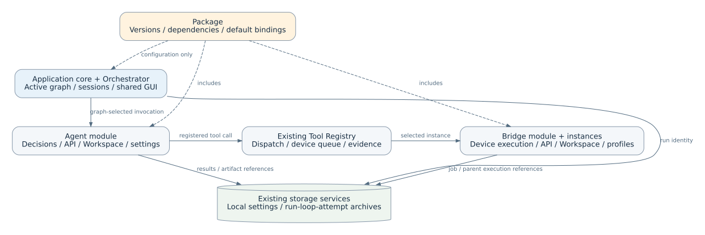

<!-- atr-doc
doc_type: design
subtype: architecture
status: review
authority: proposal
audience: [developer, maintainer, researcher]
scope: [packages, agent_modules, bridge_modules, frontend_backend_ownership, configuration, storage]
summary: 프로그램 코어와 Orchestrator를 유지하면서 에이전트·브릿지의 코드, 화면, 설정, 저장 계약을 모듈로 묶고 Package로 조합하는 설계.
decision_status: proposed
related_docs:
  - docs/superpowers/specs/2026-09-07-five-area-agent-restructuring-contract-design.md
  - docs/superpowers/specs/2026-09-13-executable-agent-ide-contract-design.md
  - docs/superpowers/plans/2026-09-13-executable-agent-ide.md
  - docs/superpowers/specs/2026-09-12-orchestrator-dynamic-experimental-setup-design.md
  - docs/agents/README.md
  - docs/device_bridges/README.md
  - docs/runtime/runtime_ide.md
  - docs/runtime/loop_artifact_archiving.md
  - docs/knowledge/wiki_memory.md
  - docs/knowledge/publication.md
  - docs/standards/documentation_standard.md
supersedes: []
-->

# Package · Agent · Device Bridge 모듈화 설계

## Status at a Glance

| At a glance | Details |
|---|---|
| 설계 상태 | 상위 방향 합의; 아래 상세 계약은 검토안 |
| 모듈화 대상 | 전문 에이전트와 디바이스 브릿지, 각각의 backend·frontend·설정·저장 계약 |
| 프로그램 코어 | 기본 에이전트 ORC·KNW·GRD, LangGraph, 세션, 공통 GUI 및 서비스 연결 유지 |
| Package | Agent Package는 owner 단위, Experimental Package는 플랜·설정·연결을 포함한 실험 조합 |
| 소프트웨어 기준점 | `9d11cf923f556e6abe87df3084dbbd5c022a5ea6`; 모듈별 전환 전에 동작 비교 근거 확정 |
| Implementation status | Design/Specimen/Vision/Manipulation/Equipment/Analysis/BO installed modules and live reports; ORC/KNW/GRD implementation sources are grouped under `agents/core/` with exact flat-import aliases and unchanged explicit bootstrap registration. Analysis composes the installed CAE bridge and its internal CalculiX provider; BO references existing numerical services without a bridge. Shared PINN remains inactive. Validation and scope are recorded in the owner execution plans. |
| 실증 경계 | 소프트웨어 호환성 검증과 기존 물리 동작 stable 실증을 별도로 관리 |

## Summary

첫 적용은 [Design 모듈 구현안](../plans/2026-09-13-design-agent-module.md)과
[현재 Design 문서](../../agents/design_agent.md#module-ownership-and-layout)에 정리한다.
기존 등록부에 선택적 코드 계약을 추가하고 `agents/design/`에 실행·판단·보고·전용
GUI를 묶는다. 기존 그래프·API·설정·저장 경로는 유지하며 아래 전체 목표 계약을
모두 구현했다고 간주하지 않는다.

Runtime IDE 내부 구조는 단순 설명 그림이 아니라 **실행 정의를 편집하는 화면**이다.
Design·Specimen과 코어 Orchestrator의 `run()`은 각 owner의 같은 `execution_graph`를 실행하고,
IDE와 문서 SVG도 그 정의에서 생성한다. 유효한 경로 편집은 기존 검증·활성화
절차를 거쳐 다음 런에 반영되며, 백엔드 정의 변경은 재조회 시 화면에 반영된다.
이는 소스 코드를 화면에서 임의 생성하거나 모든 내부 함수를 자동 노출한다는 뜻이 아니다.
구현·비구동 검증 범위는 [실행 그래프 완료 기록](../plans/2026-09-13-executable-agent-ide.md#verification-record--2026-09-13)에 정리한다.

에이전트 모듈과 브릿지 모듈은 자기 기능에 필요한 백엔드, API, 전용 화면,
설정 스키마, 저장 형식, 테스트와 문서를 소유한다. **Agent Package는 owner 모듈과
의존성을 묶고, Experimental Package는 이 패키지들과 오케스트레이션 플랜을 조합**한다.
포함한 플랜도 가져오기 직후에는 초안이며 실행 순서와 실험 참여는 기존 활성 LangGraph가 결정한다.

Orchestrator·Knowledge·Guardian는 플랫폼 기본 에이전트로 유지한다. 공통 GUI는 모듈의 화면과 카드를 연결하고,
공통 저장 서비스는 실행 식별자와 저장 위치를 제공한다. 전문 판단과 설정 적용은
담당 에이전트, 장비 실행과 장비별 상태는 담당 브릿지가 소유한다.

기존 5영역 계약은 각 에이전트의 내부 책임 구조로 유지한다. 이번 설계는 그 구조를
외부에서 등록·구성·호출·관찰하는 계약이며, 다섯 폴더나 프로세스를 강제하지 않는다.

## Problem

현재 에이전트·툴·그래프 등록과 UI descriptor는 이미 존재하지만, 모듈에 관련된
실행 코드, API, 화면, 설정 파일과 문서가 여러 위치에 분산되어 있다.
새 모듈을 추가할 때 어느 파일까지 바꿔야 하는지와, 모듈 제거 후 무엇을 보존해야
하는지가 하나의 계약으로 정리되어 있지 않다.

폴더 이동만으로는 `app/main.py`의 모듈별 라우트·표시 기본값이나 bootstrap의
개별 등록을 줄일 수 없다. 모듈이 공개하는 정보와 코어가 소비하는 경계를 함께 정한다.

## Goals and Non-goals

### 목표

- 에이전트·브릿지를 독립적으로 등록·교체하고 Package로 묶을 수 있게 한다.
- 기존 `AgentRegistry`, `ToolRegistry`, handler registry, graph/module/UI 경로를 재사용한다.
- 이미 독립적으로 동작하는 모듈은 기존 위치·호출 방식을 유지하고 부족한 공개 계약만 보완한다.
- 기능, 설정, API, 화면, 산출물의 소유자를 일관되게 선언한다.
- 활성 그래프 변경이 ORC의 가용 기능, Setup 블록, Live 카드에 같은 revision으로 반영되게 한다.
- 기존 인계, 테스트 모드, 취소·정지, 비동기 작업, 파일 접근의 관찰 가능한 동작을 보존한다.

### 이번 설계 범위 밖

- Orchestrator 분리 배포, 새 실행 엔진, 별도 에이전트 통신 버스, 모듈별 필수 서버.
- 공개 패키지 마켓·원격 코드 자동 다운로드·범용 의존성 버전 해결기.
- 새 실험 도메인·물리 절차·해석 모델 개발 또는 장비 실증 재인증.
- 전체 미사용 코드 일괄 삭제나 기존 문서·실험 파일 일괄 이동.

## Current Context

아래는 기준 커밋에서 확인한 재사용 지점이다. 목표 기능의 구현 완료를 뜻하지 않는다.

| 현재 경로 | 확인한 역할 | 전환 시 사용 방식 |
|---|---|---|
| [agents/base_agent.py](../../../agents/base_agent.py) | `run(state, ctx)`, `AgentResult`, 공통 모델·툴·지식 서비스 | 기존 호출 표면을 유지하고 서비스 접근 및 상태 소유권을 명시 |
| [agents/registry.py](../../../agents/registry.py) | 이름별 에이전트 register/get/names | 검증된 모듈 진입점으로 등록을 모으고 중복 ID 정책 추가 |
| [agents/core/orchestrator/capabilities.py](../../../agents/core/orchestrator/capabilities.py) | 그래프 연결 owner, Setup callback, 가용성, 실행 snapshot | ORC와 Setup의 실행 가능 owner 판정에 재사용; 기존 flat import는 exact alias |
| [graphs/module_store.py](../../../graphs/module_store.py), [graphs/schema.py](../../../graphs/schema.py) | IDE module 설정 저장·버전과 스키마 | 구현 모듈 선언과 IDE 편집 설정을 연결 |
| [graphs/modules/design/module.yaml](../../../graphs/modules/design/module.yaml), [ui.yaml](../../../graphs/modules/design/ui.yaml) | 인계 설명·pre-execution·내부 단계 및 표시 descriptor | 현재 형식에 맞춰 점진적으로 공통 선언 참조 |
| [graphs/registry.py](../../../graphs/registry.py) | 허용된 실행 handler 조회 | 모듈 선언을 임의 실행 코드로 해석하지 않고 등록 handler 연결 |
| [mcp_tools/tool_registry.py](../../../mcp_tools/tool_registry.py) | 툴 호출·장비 큐·리소스·산출물 기록 | 에이전트와 브릿지 간 기존 툴 경로 보존 |
| [device_bridges/base_bridge.py](../../../device_bridges/base_bridge.py) | `execute(command, payload)` 기본 계약 | 구현별 기존 방식에 adapter를 적용; 모든 브릿지의 상속을 가정하지 않음 |
| [app/main.py](../../../app/main.py), [app/bootstrap.py](../../../app/bootstrap.py) | API·화면·manifest 병합·등록·설정 파일 연결 | 모듈별 구현을 이관하고 공통 mount·주입·조합 유지 |
| [보관 계약](../../runtime/loop_artifact_archiving.md) | run/loop/agent/attempt 및 독립 세션 구분 | 파일 위치 호환과 실행별 기록을 유지 |

## Options Considered

| 방식 | 이점 | 비용·제약 | 결정 |
|---|---|---|---|
| 기존 파일 위치에서 중복만 정리 | 작은 변경 | 모듈별 추가·교체 범위가 계속 분산됨 | 일부 정리 단계에 사용 |
| 코어 + 모듈 + 선언형 Package | 현재 실행 경로를 보존하며 코드·화면·저장 소유권 확립 | 전환 중 기존 경로 adapter 관리 필요 | 채택안 |
| 모듈별 독립 서비스·별도 프론트엔드 앱 | 배포 격리 | 통신·운영·버전 관리 부담 증가 | 이번 범위 제외 |

## Decision

아래를 목표 계약으로 채택한다. Package 관리 기능은 기존 Module Management와
Runtime IDE에 연결한다. UI 기술은 현재 HTML/JavaScript와 공통 서버 구성을 사용한다.
브릿지가 이미 원격 프로세스나 별도 환경에서 실행되면 그 배포 방식을 유지한다.

**기존 모듈화 재사용이 우선이다.** 모듈의 완성도를 폴더 이전량으로 평가하지 않는다.
먼저 기존 단위를 선언만으로 연결하고, 독립 등록·설정·실행·관찰을 방해하는 결합만
해당 owner 안으로 옮긴다. 같은 기능의 새 registry, API, 이벤트 버스, 저장소를 병설하지 않는다.

| 기존 구성 | 우선 적용 | 새 코드가 필요한 조건 |
|---|---|---|
| `AgentRegistry`와 `HandlerRegistry` | 기존 ID·등록·조회 사용 | module descriptor 연결·충돌 검사 등 없는 계약만 추가 |
| `ToolRegistry`와 장비 job queue | 기존 호출·직렬화·기록 사용 | capability/instance binding이 표현되지 않는 부분만 보완 |
| `graphs/modules`와 `ModuleConfigStore` | 기존 module·UI·version 저장 재사용 | 배포 구현 참조 및 편집 설정과의 구분이 필요할 때 확장 |
| `OwnerCatalog`와 Setup callback | 기존 graph 기반 조회·검증·apply·readback 사용 | 새 모듈이 자신의 실제 지원 항목을 제공하도록 연결 |
| UI descriptor와 공통 renderer | 기존 cards·report·workspace 연결 사용 | descriptor로 표현할 수 없는 화면만 모듈 전용 renderer 제공 |
| 이미 분리된 API router·domain service | 기존 파일을 manifest의 구성 파일로 참조 | 다른 owner 내부 의존성이 독립 사용을 막을 때만 추출 |
| archive·producer 저장 경로 | 기존 위치·API·실행 식별자 유지 | 소유권·instance·버전 참조가 누락된 부분만 보완 |

이 재사용 기준은 모듈별 이관 목록에도 `재사용 / 계약 보완 / 책임 분리`로 표시한다.
실제 필요가 확인되지 않은 파일 이동·공통화·추상화는 구현 항목에 넣지 않는다.

## Architecture and Contracts

### 1. 구조와 책임



**Figure Package-1.** 목표 구조도. 점선은 설치·구성 관계, 실선은 실행·조회 관계다.
Package의 모듈 구성과 활성 그래프의 실행 선택을 구분하며, 현재 구현 실증을 나타내지 않는다.

| 단위 | 소유 | 다른 단위와의 경계 |
|---|---|---|
| 코어 + 기본 에이전트 | ORC·KNW·GRD, Chat·세션·그래프·공통 GUI·서비스 주입 | 전문 알고리즘·브릿지 프로토콜은 모듈에 위임 |
| Agent module | 역할에 맞는 LLM 판단, 설정 적용, 작업 결과·진행·전용 화면 | 다른 owner 설정과 상태를 직접 변경하지 않음 |
| Bridge module | 장비·계산 provider 연결, 명령, 상태, 장비별 설정·전용 화면 | 연구 목적·다음 에이전트를 결정하지 않음 |
| Agent Package | 에이전트 모듈, 버전, 브릿지 의존성, 권장 binding·문서 | 모듈 소유권·파일 경로를 바꾸지 않음 |
| Experimental Package | Agent Package 조합, Orchestration/Knowledge/Guardian Plan 참조·버전, 휴대 가능한 설정·binding | 별도 스케줄러·설정 소유자·장비 실행 주체가 아님; 후속 두 플랜은 계약 설계 대상 |
| Module instance | 선택한 모듈 구현의 개별 설정·연결·작업 상태 | 동일 브릿지 구현의 여러 장비를 구분 |

에이전트와 브릿지는 다대다 연결을 허용한다. 연결 대상은 모듈 개수가 아니라
필요한 capability와 선택된 instance로 결정하며 기존 tool ID는 유지한다.
Guardian와 Knowledge는 교체 가능한 전문 Agent Package 대상에서 제외하고
Orchestrator와 함께 플랫폼 기본 에이전트로 구분한다. 기본 제공은 모든 단계에서
무조건 실행한다는 뜻이 아니다. 기존 그래프의 호출 시점, 인계 및 강제 제한을 유지한다.

### 기본 에이전트와 실험별 플랜 — 2026-09-14 합의

전문 패키지 전환은 BO까지 진행한다. BO는 기존 LHS·BoTorch 계산 서비스를
참조하며, 수치 최적화를 장비로 취급하는 새 Device Bridge를 만들지 않는다.
BO 이후 별도 단계에서 기본 에이전트 소유 코드를 `agents/core/orchestrator/`,
`agents/core/knowledge/`, `agents/core/guardian/`로 구분했다. 기존 전문 에이전트
폴더는 다시 이동하지 않았고, 공개 import·handler·API·저장 경로는 exact alias와
기존 bootstrap으로 호환을 유지한다. 이 배치는 소유권 구분이며 새 Package나
플랜 runtime을 만들지 않는다.

| 플랜 | 소유자 | 설정할 책임 | 바꾸지 않는 경계 |
|---|---|---|---|
| Orchestration Plan | ORC | 참여 에이전트, 실행 조건, 인계 관계 | 기존 LangGraph 실행 엔진 |
| Knowledge Plan | KNW | 지식 공급 대상·범위, 결과 분류, 메모리 보관 | 기존 Wiki·RAG·메모리 서비스, 개인정보 접근 범위 |
| Guardian Plan | GRD | 검토 지점·근거, 승인·재시도·중단 정책 | 코어 강제 안전 제한, 기존 장비 인터록 |

Knowledge/Guardian Plan은 기본 에이전트가 읽는 **실험별 설정 계약**으로
설계한다. 별도 스케줄러·저장소·에이전트 통신 버스를 신설하지 않는다.
Experimental Package는 세 플랜의 참조와 버전을 함께 묶고, 가져온 플랜은
기존 검증·활성화 절차를 거치는 초안으로 취급한다. 기본값은 기존 동작을 보존하며,
플랜이 생겼다는 이유로 호출 순서·횟수·장비 동작을 변경하지 않는다.
Knowledge Plan은 기존 접근 범위를 넓히거나 개인 메모리를 공개 패키지에 포함하지
않으며, Guardian Plan은 강제 제한을 해제할 수 없다.

진행 순서는 **BO 패키지 구현·비구동 검증 → 기본 에이전트 폴더 구분 →
Knowledge/Guardian Plan 상세 계약 설계**다. 후속 플랜의 실행 구현은 해당 계약을
검토한 뒤 별도 범위로 정한다.

### 2. 식별자와 버전

| 항목 | 의미 |
|---|---|
| `package_id` + `kind` | `agent` / `experimental` 구성 묶음 ID; agent 종류는 에이전트 ID와 일치 |
| `module_id` + `kind` | 구현의 고유 ID와 `agent` / `bridge` 구분 |
| `instance_id` | 해당 구현의 설정·연결 인스턴스; 최초 에이전트는 기본 인스턴스 하나 |
| `handler_id`, `tool_id` | 기존 실행 호출 ID; 이동해도 호환 alias 보존 |
| `graph_node_id` | 실행 그래프의 위치; 하나의 owner가 여러 노드에 등장할 수 있음 |
| `version`, `contract_version` | 구현 버전과 외부 계약 버전; 독립적으로 기록 |
| `run_id`, `loop_index`, `execution_id`, `attempt_index`, `job_id` | 기존 실행·호출 식별자를 보존하고 비동기 작업과 연결 |

첫 버전은 선택된 모듈 버전을 정확히 고정한다. 동일 모듈의 충돌 버전을 동시에
한 Python 프로세스에 로드하지 않는다. 같은 ID·버전·digest는 공유하며, ID·버전이
같아도 내용 digest가 다르면 충돌로 반환한다. 별도 환경이 필요한 브릿지는 기존 원격
실행 환경으로 연결하고 연결 프로토콜의 호환 버전도 기록한다.

### 3. 모듈 선언과 기존 그래프의 관계

아래의 구현 선언과 IDE 설정은 논리적 역할 구분이다. 기존 schema와 파일이 두 역할을
명확히 표현할 수 있으면 그 위치를 확장하여 사용한다. 독립 배포를 위해 별도 파일이
필요한 모듈만 아래의 분리 배치를 사용한다.

목표 구현용 `module.yaml`은 코드와 함께 배포하는 읽기 전용 구현 선언이다.
기존 `graphs/modules/<id>/module.yaml`은 IDE의 편집 가능한 실행 설정으로 유지한다.
두 파일의 역할은 다음과 같이 구분하며 같은 필드를 두 군데서 독립 편집하지 않는다.

| 원본 | 정의하는 내용 |
|---|---|
| 구현 모듈 선언 | ID·버전·등록 진입점, 지원 capability, schema, API·UI·storage 선언, 기본값 |
| IDE graph/module 설정 | node·handler 연결, 기존 pre-execution, owner가 허용한 실행 설정 override |
| `ui.yaml` | 기존 표시 descriptor; 원본은 모듈로 옮기고 IDE 사용자 변경분만 별도로 저장 |
| owner callback | 설정 검증·적용·readback, 현재 가용성, 실제 작업 수용 여부 |
| 실행 snapshot | 위 정의를 검증·해결한 해당 런의 고정 구성 |

전환 중에는 기존 graph/module 파일을 계속 읽는다. 참조 방식으로 이관한 모듈만
모듈 선언을 읽어 현재 API가 기대하는 형태로 제공한다. 기존 파일과 신규 선언을
동시에 authoritative하게 병합하지 않으며, 적용 출처와 override를 조회 가능하게 한다.

모듈 선언의 필수 범위는 `schema_version`, `kind`, `id`, `version`,
`contract_version`, `entrypoints`, `capabilities`, `requires`, `configuration`,
`ui`, `storage`, `documentation`이다. 전용 화면 등이 없으면 빈 선언을 사용한다.
`requires`는 capability·버전·필수 여부를 표현한다. tool handler와 실행 함수는
코드 등록으로 제공하고, 사용자가 편집한 YAML의 임의 import 경로를 실행하지 않는다.

### 4. Agent Package / Experimental Package 계약

2026-09-13 사용자 합의로 Package를 두 종류로 구분한다. **Agent Package**는
에이전트 이름을 ID로 사용하고 에이전트 모듈·전용 UI/API/문서/저장 계약과 필요한
브릿지 의존성을 참조한다. `design`은 직접 브릿지 없이, `specimen`은 기존 Printer
Fleet 브릿지를 연결한다. 브릿지는 별도 모듈로 남아 다른 패키지도 공유할 수 있다.
같은 패키지에 포함되어도 브릿지 코드의 폴더는 **`device_bridges/`**로 유지한다.
`agents/<agent_id>/`나 패키지 폴더 아래로 복사·중첩하지 않으며 manifest로 참조한다.
이관하는 각 브릿지는 `device_bridges/<bridge_id>/` 폴더에 구현·설정 계약·의존성
안내를 묶는다. `requirements.txt`에는 해당 브릿지의 실제 Python 의존성을 적고,
슬라이서·드라이버·별도 프로세스 등 외부 요구사항은 README에서 구분한다. 기존 flat
import는 필요한 호환 adapter로 유지하며 모든 미이관 브릿지를 한 번에 옮기지는 않는다.

**Experimental Package**는 Agent Package의 버전 목록, 브릿지 binding, 실험 설정과
오케스트레이션 플랜을 함께 보관·내보내기·가져오기하는 조합이다. Orchestrator 자체는
코어에 유지하며, 패키지가 새 실행 엔진이나 설정 소유자가 되지 않는다. 다른 실험에서는
기존 에이전트를 재배치·연결하여 새 Experimental Package를 구성한다.

가져오기는 로컬에 이미 설치된 코드와 버전·handler·설정 호환성을 검사하여 **비활성
초안**을 만든다. 가져오기만으로 현재 그래프·장비 설정을 덮어쓰거나 장비를 실행하지
않는다. 현지 장비 binding과 기존 IDE 검증·저장·활성화 절차를 거쳐야 참여가 바뀐다.
원격 코드를 다운로드하거나 문서의 import 경로를 실행하지 않는다. 내보내기에는
로컬 연결값·인증 정보·사용자 메모리·실행 세션·산출물을 포함하지 않는다.

패키지를 제거해도 다른 패키지·그래프·작업에서 사용하는 모듈과 과거 결과를 지우지
않는다. 배포 목록은 참조 집합이며 실행 순서는 포함된 플랜의 명시적 연결이 정한다.

#### Module composition example

Agent Package는 공통 loader가 읽는 `package.yaml`과 안내 문서를 갖는다. 아래는 목표
schema의 예시이며 실제 구현 schema는 이관 시 검증한다. Experimental Package의
교환 파일은 선언형 JSON으로 플랜과 선택한 모듈 설정을 포함한다. 원격 코드 설치 파일이 아니다.

```yaml
schema_version: ax4lab.agent_package.v1
kind: agent
id: specimen
version: 1.0.0
modules:
  - {kind: agent, id: specimen, version: 1.0.0}
  - {kind: bridge, id: printer_fleet, version: 1.0.0}
bindings:
  - consumer: {kind: agent, id: specimen}
    capability: printer.prepare
    provider: {kind: bridge, id: printer_fleet}
    instance: operator_selected
presets: []
documentation: README.md
```

- package의 `modules`는 배포에 포함하거나 이미 설치된 모듈을 참조한다. 동일 모듈은 복제 실행하지 않는다.
- binding은 기본 연결 제안이다. 설치는 장비 연결값 입력이나 자동 구동을 의미하지 않는다.
- 의존성은 코드·라이브러리·외부 실행 환경을 구분하여 각 모듈이 선언한다. 초기에는 로컬 소스와 명시된 설치 절차를 사용한다.
- package preset은 새 구성 초안에만 제공한다. 기존 사용자 설정을 덮어쓰지 않는다.
- 패키지 포함 관계는 집합이다. 모듈 순서를 그래프 실행 순서로 해석하지 않는다.
- 제거 시 package의 참조만 해제한다. 다른 package·graph·실행 작업이 참조하는 모듈은 유지한다.
- 자동 데이터 삭제는 하지 않는다. 미사용 코드 제거와 데이터 정리는 각각 명시적 작업이다.

### 5. 에이전트·브릿지 실행 계약

| 계약 | 에이전트 | 브릿지 |
|---|---|---|
| 기술 | 기능·입출력 schema·의존성·설정·화면 선언 | 명령·결과 schema·실행 효과·연결·지원 모드 선언 |
| 시작 조건 | 기존 owner admission, 입력·scope·현재 가용성 확인 | 선택 instance·연결·장비별 기존 preflight 확인 |
| 실행 | 기존 `run(state, ctx)`와 등록된 전문 메서드 | 기존 툴 → provider/bridge 명령 경로 |
| 결과 | 기존 `AgentResult`와 owner별 payload·산출물 참조 | 기존 결과와 정규화된 상태·작업·산출물 참조 |
| 비동기 | 작업 접수와 완료를 구분하고 원래 run/attempt에 결과 연결 | `job_id`로 상태·취소·종료 확인; timeout을 종료로 간주하지 않음 |
| 설정 | 기존 descriptor → validate → apply → readback | 장비 Workspace에서 기존 설정 검증·적용·readback |
| 취소·재시도 | 기존 stop/cancel 경로와 시도 식별자 | 알려진 무효과·효과 불명·완료를 구분하고 성공 명령 재실행 방지 |

첫 전환에서는 공통 envelope 안에 기존 payload를 보존한다. status와 `success`의
관계는 모듈별로 명시한다. `accepted`, `running`, `completed`, `failed`, `cancelled`와
owner의 `blocked`/`unknown`을 혼동하지 않는다. archive 완료도 작업 완료와 구분한다.
LLM 판단은 기존 국소 decision/tool-calling 경로를 유지한다.

공통 state는 코어가 조합하고, 각 모듈은 자신이 쓰는 필드와 읽는 필드를 선언한다.
초기 adapter는 기존 state 접근을 유지하되 읽기·쓰기 목록을 검증한다. 전문 계산을
코어로 옮기거나 모든 모듈에 동일 payload를 강제하지 않는다.

### 6. 설정과 테스트 모드

적용 우선순위는 **모듈 기본값 → 사용자가 선택한 package preset → 저장한 instance
설정 → 모드별 설정 → 해당 런의 owner가 검증한 override**다. 각 단계의 변경 가능
필드와 적용 시점은 owner schema가 결정한다. 인증 정보는 값 대신 로컬 참조로 전달한다.

Setup에서의 변경은 ORC → 담당 에이전트의 기존 apply/readback 경로를 따른다.
에이전트가 브릿지에 적용할 수 있다고 선언한 항목만 기존 tool 경로로 내려간다.
지원하지 않는 설정은 unsupported로 표시한다. 장비 Workspace의 직접 설정은 해당
브릿지가 소유하며, 연구 설정을 브릿지 파라미터에 임의로 연결하지 않는다.

기존 test mode, 실제 프린터 테스트 경로, 출력·냉각 skip, virtual/real 조합은
현재 모드 의미를 보존한다. 패키지 기본값으로 모드를 바꾸지 않는다. 지원하지 않는
조합은 실행 전에 구체적인 원인을 반환하며 조용히 가상 장비나 다른 provider로 바꾸지 않는다.
virtual manipulation → real equipment 등의 인계는 기존 teleop 완료·종료 및 Vision 경로를 따른다.

### 7. 프론트엔드·백엔드 연결

| 화면/기능 | 소유 모듈 | 공통 host의 역할 |
|---|---|---|
| Agent Workspace | 전문 설정·판단·작업 상세, 전용 API | 메뉴·라우터·공통 테마·세션 연결 |
| Bridge Workspace | 연결·instance 선택·장비 설정·수동 조작 | 장비 카탈로그·상태 표시·기존 실행 gate 연결 |
| Experimental Setup | 에이전트 설정 schema와 필요 시 전용 편집기 | 기존 블록 공간·세로 스크롤·Chat 연결·revision 동기화 |
| Live GUI | 모듈별 카드·리포트 descriptor와 필요한 전용 renderer | 활성 owner별 배치·표시·이벤트 라우팅 |
| Package / Module Management | 각 manifest와 전용 상세 링크 | 설치·의존성·graph 참여 상태를 구분하여 표시 |

현재 `/api/modules`, `/api/runtime/agent-manifests`, `/api/bridges`를 우선 확장한다.
전용 API는 모듈이 router를 제공하고 코어가 mount한다. API·static·card·event ID는
kind/module/instance로 구분하고 충돌은 등록 단계에서 반환한다. 기존 URL은 alias로
유지하며, 새 주소는 namespace 안에 추가한다. 공통 HTTP client·이벤트 연결·UI 스타일을
재사용하고 모듈별 중복 polling·전역 CSS·전역 이벤트 listener를 만들지 않는다.

descriptor로 표현 가능한 카드는 기존 renderer를 사용한다. 전용 renderer는 설치된
모듈의 등록된 로컬 자산으로 제공하며 mount/unmount에서 구독을 생성·해제한다.
그래프·세션 revision이 바뀌면 이전 요청을 취소하거나 늦게 도착한 응답을 배제한다.
화면 표시 선언이 새로운 장비 실행 권한을 만들지는 않는다.

### 8. 등록·활성화·런 고정

#### Runtime IDE 내부 구조 표현 계약

각 에이전트 모듈화에 기존 편집 그래프의 5영역 구조 표현을 포함한다.
High / Middle / Low를 중심에, Guardian / Safety와 Knowledge / Evidence를
교차 책임 영역으로 구분하고 레전드를 표시한다. 별도 읽기 전용 뷰나
기존 단계 보기로 전환하는 버튼은 만들지 않는다. Design과 Orchestrator에
먼저 적용하며, Orchestrator는 프로그램 코어에 남긴다.

- module descriptor의 `execution_graph`를 backend 실행·IDE 편집·문서 SVG의 공통 원본으로 사용한다. `metadata.control_view`의 장식용 체크포인트 순서는 실행 원본이 아니다.
- 노드는 owner catalog에 등록된 기존 함수를 호출한다. ID·handler·포트·저장 좌표를 유지하고, 실행 순서는 노드 배열이 아닌 명시적 outcome edge로 결정한다.
- 기존 bounded LLM 판단·툴 루프는 composite 노드로 표시하고, 없는 책임은 명시한다. 내부 함수가 모두 별도 편집 가능하거나 5개 순차 실행 단계인 것처럼 표현하지 않는다.
- composite 내부를 숨기지는 않는다. owner catalog의 `implementation_structure`로 실제 함수·툴·검증·근거 및 관측 반환 관계를 같은 캔버스에 펼친다. 실선 실행 노드와 파선 CODE 노드를 구분하고, CODE 선택은 기존 Inspector의 owner·소스 참조로 연결한다. CODE 관계를 추가 실행 명령이나 개별 완료 상태로 취급하지 않는다.
- High는 각 에이전트 내부의 LLM 추론·의사결정이다. Middle은 API·툴 디스패치·계산·조회·내부 프로세스이며, Low는 실제 장비/브릿지 실행 경계다. Guardian / Safety와 Knowledge / Evidence는 횡단 책임이다. 소프트웨어 전용 에이전트에 가짜 Low를 만들지 않는다.
- 실제 High 판단 노드에는 **LLM**, 판단용 문맥을 전달하고 응답을 받아 처리하는 프로세스에는 **LLM call**을 표시한다. 같은 파일에 포함된다는 의미가 아니며, Middle에 LLM 판단을 분류하거나 모든 모드에서 실제 호출됐음을 뜻하지 않는다. 기존 배경 영역과 실행·호출 관계는 유지한다.
- 기존 composite handler는 그대로 유지하고, 내부 LLM 판단만 High CODE로 펼쳐 표시한다. 분류를 맞추기 위해 호출 순서·툴·인계·안전조건을 바꾸거나 실행 노드를 쪼개지 않는다. 기존 checkpoint 모듈은 `metadata.control_view.areas` 및 `checkpoint_details`로 표시만 분류하며 실행 계약은 유지한다.
- 실선·파선·점선은 edge의 `execution`·`validation`·`evidence` 종류를 표현한다. 실제 상태는 module·run·loop·revision·invocation이 일치하는 실행 trace로 표시한다.
- Runtime IDE의 색상·노드·포트·줌·스크롤 체계를 사용한다. 데스크톱과 좁은 화면에서 겹침·잘림·가독성을 검증한다.
- `blocked`·`next`·`accepted` 같은 outcome 라벨은 기존 스타일의 짧은 캡슐로 해당 연결선 위에 배치한다. 충돌 시 선 밖의 임의 좌표가 아닌 같은 곡선의 다른 지점을 우선 탐색한다. 라벨 선택·분기 편집은 유지하며 확대·축소 후 선 부착과 노드 겹침을 검증한다. 이는 표시 규칙이며 outcome·실행 경로를 바꾸지 않는다.
- 미완성 draft는 화면에서 편집 가능하되, 잘못된 owner operation·분기·의존성·종료 결과는 저장 전에 거절한다. 라벨·좌표 변경은 표현만 바꾸고, 유효한 경로 변경은 활성화 후 실행을 바꾼다.
- backend reload는 최신 정의를 읽되 dirty draft를 무단 덮어쓰지 않는다. 진행 중인 런은 시작 시 정의를 유지한다. 미전환 모듈의 기존 표현·handler override는 유지한다.
- 문서 SVG는 공통 구조 데이터·renderer를 사용하되 **문서용 테마**로 생성한다. IDE의 어두운 배경·네온 강조를 복사하지 않고 흰 배경·짙은 글자·절제된 영역 색상을 쓴다. 생성 결과 일치와 실제 브라우저 편집 동작을 검사한다.

#### Device Bridge 내부 구성 보기

2026-09-13 추가 합의: Runtime IDE의 Device Bridges 항목을 클릭하면 기존 IDE 안에서
**Agent Package → Device Bridge** 포함 관계를 볼 수 있게 한다. 브릿지 내부를
에이전트의 5영역 실행 단계처럼 새로 구성하지 않고, 어떤 패키지가 어떤 브릿지를
묶어 사용하는지에 집중한다.

- 관계의 원본은 설치된 Agent Package/Bridge 선언과 현재 Experimental Package draft다. 프론트엔드 전용 연결 목록을 따로 만들지 않는다.
- 패키지명과 브릿지 ID·버전, 공유 관계를 표시한다. provider 구성 요소가 선언되어 있으면 해당 브릿지 아래에 표시하되, 독립 모듈로 등록되지 않은 provider를 독립 모듈처럼 표현하지 않는다.
- 설치된 패키지의 의존성과 현재 draft에 포함된 패키지를 구분한다. 패키지 추가·제거 또는 재조회 시 표시도 갱신한다. 브릿지가 없는 패키지는 Package Manager에 빈 상태를 표시하며, 브릿지 구조도에 가짜 연결을 만들지 않는다.
- 이 화면은 구성 관계 조회이며 실제 연결 상태 확인·장비 탐색·명령 실행을 하지 않는다. 기존 그래프 실행 편집과 브릿지 설정 경로는 유지한다.
- 클릭·내부 진입·뒤로 이동, 공유 브릿지, 추가·제거, 빈 상태와 좁은 화면 가독성을 비구동 테스트로 확인한다.

2026-09-13 화면 및 패키지 경계 확정:

- **Package Manager**: 별도 IDE 탭에서 패키지 포함 여부·의존성·Experimental Package Import/Export를 제공한다. 기존 구성 관리 화면은 이 이름으로 보존한다.
- **Device Bridges**: 그래프의 Device Bridge Plane 및 Infra에서 같은 계약 그래프를 연다. 상위에는 **Agent Package → Device Bridge**만 표시한다. 패키지는 연결 계약이고 브릿지는 장비 모듈이며 서로 다른 개념이다.
- 개별 브릿지를 더블클릭하거나 Inspector의 Open bridge internals를 누르면 그 브릿지 내부만 별도 탭에서 표시한다. Printer Fleet의 manager·Bambu·Prusa는 이 안에서만 표시한다. Back은 내부 → Plane → 이전 Main/agent 순서로 돌아간다.
- 기존 IDE의 **공통 그래프 renderer·캔버스 배경·크기 좌표계·노드·포트·라인 라벨·레전드·Mini Map·Inspector**를 그대로 사용한다. 별도 SVG renderer나 독립 브릿지 테마를 만들지 않는다. 관계 라벨은 uses/contains/exposes로 구분하며 현재 연결 상태나 실행 성공을 의미하지 않는다.
- 설치 선언의 runtime_bridge_ids로 기존 런타임 ID를 같은 브릿지에 대응시켜 중복을 제거한다. 미패키지화 런타임 브릿지도 보여주되 가짜 패키지 소유 관계를 만들지 않는다. 연결·조작 UI는 기존 workspace에 유지한다.
- **Printer Fleet은 단일 Device Bridge Package**다. Bambu·Prusa는 내부 provider이며 독립 패키지나 Fleet과 동급인 브릿지로 표시하지 않는다. 구현·requirements는 `device_bridges/printer_fleet/`에 모으고 옛 경로는 같은 런타임 객체를 가리키는 호환 alias로만 남긴다.
- 공통 매니저의 canonical 경로는 `device_bridges.printer_fleet.bridge`다. Bambu transport 구현은 전역 의존성과 기존 monkeypatch 동작 보존을 위해 공통 런타임에 유지하고 내부 provider 진입점이 이를 참조한다. 물리 동작 재작성이나 제조사별 런타임 완전 분리는 이번 변경에 포함하지 않는다.
- 두 조회 탭은 실행 그래프가 아니다. Main/agent의 미저장 편집·Dry-run Trace를 보존하며 그래프 활성화와 장비 호출을 발생시키지 않는다.

#### 다음 에이전트 모듈의 필수 인수 항목

다음 모듈부터도 코드·화면 분리만으로 전환을 완료 처리하지 않는다.
기존 함수와 실행 경로를 먼저 대응시킨 뒤 아래 항목을 같은 이관 작업에 포함한다.

| 계약 | 인수 증거 |
|---|---|
| Owner operation catalog | 입력·산출물·분기별 산출물·허용 outcome·설정 schema 선언; 미등록 호출 거절 |
| 실제 내부 실행 구조 | 명시적 edge, 각 종료 경로의 새 `AgentResult`, branch별 의존성 검증; 기존 bounded LLM 루프는 composite로 유지 |
| 내부 관계와 문서 테마 | 실제 소스에 연결된 함수·검증·툴·근거 및 관측 반환 관계 공개; 실행 편집과 구분, 문서 SVG는 별도 밝은 테마 |
| 프론트 → 백엔드 | 기존 IDE에서 유효한 경로 편집·저장·활성화 후 실제 owner 함수의 호출 순서 확인; 구조 dry-run만으로 대체하지 않음 |
| 백엔드 → 프론트 | 재조회 시 정의 반영; dirty draft·늦은 저장 응답·탭 전환에서 편집 내용 보존 |
| 실행과 표시의 일치 | 런 시작 정의 고정, module/run/loop/revision/invocation별 trace 분리; 과거 완료 표시 재사용 금지 |
| 기존 경로·문서 보존 | 비구동 모드별 회귀·실패·취소·archive 확인; agent Reference·matrix·5영역 SVG·레전드 동시 갱신 |

적용 대상은 각 모듈이 선언한 실행 경계다. Orchestrator의 프로그램 코어 소유권과
기존 Chat/Setup 진입 경로는 유지하며, 내부 그래프 편집을 외부 orchestration plan의
자동 작성이나 장비 bridge 직접 제어 권한으로 확대하지 않는다.

1. **설치:** manifest와 코드·자산 존재, 버전·의존성·ID 충돌을 검사한다.
2. **등록:** 기존 agent/tool/handler registry와 공통 API·UI host에 연결한다.
3. **구성:** instance와 binding을 선택하고 owner가 설정을 검증한다.
4. **graph 활성화:** 기존 IDE 검증·버전·활성화 경로로 실행 참여를 결정한다.
5. **런 시작:** module/package 버전·digest, graph, binding, 유효 설정 revision을 고정한다.

설치·등록된 모듈은 관리 Workspace에서 조회할 수 있다. ORC의 실행 가능 기능과
Setup·Live owner 목록은 실제 graph 실행 binding에서 산출한다. overlay와 pre-execution도
기존 의미를 보존한다. 비활성 모듈의 카드를 현재 실행 카드로 표시하지 않으며 과거 결과는 남긴다.

새 구성은 다음 런에 적용한다. 실행 중인 런의 설정 snapshot, registry 객체와 코드 버전을
유지하며, 해당 코드의 교체·unload는 그 코드를 사용하는 작업이 끝난 뒤 수행한다.
Analysis의 background FEM처럼 루프가 끝나도 진행하는 작업은 별도 사용 참조를 유지한다.
이미 보장된 긴급 정지·취소와 실시간 장비 상태 확인은 snapshot으로 고정하지 않는다.

### 9. 코드와 문서 배치

다음은 신규 또는 책임 분리가 필요한 모듈의 권장 배치다. 기존 모듈이 이미 명확한
경계를 갖고 있으면 현재 위치를 manifest에서 참조하여 같은 배포 단위로 묶는다.
현재 모듈 ID·import 경로와 충돌하지 않는 이름은 개별 이관에서 확인하며, 이동한
기존 import는 필요한 범위에서 compatibility adapter로 유지한다.

```text
packages/agents/<agent_id>/
  package.yaml
  README.md
packages/experiments/<experiment_package_id>/  # explicitly published portable presets only
  package.json
agents/<module_id>/                  device_bridges/<module_id>/
  module.yaml                         module.yaml
  backend/                            backend/
  frontend/{templates,static}/        frontend/{templates,static}/
  schemas/                            schemas/
  defaults/                           defaults/
  tests/                              tests/
  docs/                               docs/
graphs/modules/<existing_id>/
  module.yaml       # IDE configuration / implementation-module reference
  ui.yaml           # existing form first, explicit user overrides after migration
```

폴더는 실제 파일이 있을 때만 만든다. 물리적으로 흩어진 파일도 하나의 모듈이
소유하고 manifest에 명시하여 함께 배포할 수 있다. 현재 Knowledge 같은 도메인 서비스는
모듈의 소유 관계를 먼저 선언한 뒤 옮긴다. 물리적 위치 변경을 위해 공유 서비스를 복제하지 않는다.
장비 실행 환경·설치 스크립트·배포 원본도 브릿지의 구성 파일 목록에 포함한다.

현재 `docs/agents`와 `docs/device_bridges`의 Reference·SVG는 canonical 위치를
유지한다. manifest가 해당 문서를 참조하고 배포 bundle에 포함한다. `docs/`는 모듈에
필요한 추가 문서용이며 동일 Reference를 두 군데서 편집하지 않는다. 추후 Reference
자체를 이동할 때는 문서 standard·index·inbound link·validator를 함께 변경한다.

### 10. 파일 저장 계약

**저장 형식·생명주기는 모듈이 선언하고, 실제 경로와 실행 식별자는 공통 저장 계층이 제공한다.**
Package는 실험 원본의 저장 소유자가 되지 않는다.

| 데이터 | 목표 위치·정책 | 전환 호환 |
|---|---|---|
| 코드·기본 설정·schema·공개 문서 | 모듈/package 소스, Git 추적 | 현재 canonical 문서는 참조로 포함 |
| 설치 구성 | `memory/packages/`의 선택 모듈·버전·binding 기록 | 개인 설치 정보는 로컬 유지 |
| 사용자 설정·장비 프로필 | `memory/modules/<kind>/<module_id>/<instance_id>/` | 기존 설정 파일을 adapter로 읽고 명시적 이전 이후 새 위치에 저장 |
| 교정값·연결 정보 | 해당 bridge instance의 로컬 설정, 비밀값은 별도 참조 | 기존 calibration/profile의 단위와 의미 보존 |
| 런 구성 | `runs/<run_id>/runtime/`의 모듈·binding·비밀값 제외 설정 snapshot | 기존 run 파일에 추가, 이전 run에 가짜 snapshot 생성 금지 |
| 실행 산출물 | 기존 `runtime/loops/loop-N/<agent_name>/attempt-N/` | manifest·파일·stream·download 경로 보존 |
| 브릿지 독립 작업 | 독립 bridge session, module·instance·job ID로 식별 | 기존 LeRobot·Windows 등의 producer 저장 위치 우선 사용 |
| 장시간 작업·대형 파일 | 기존 producer 저장소, 소유 모듈·job 및 원 실행 참조 | 중복 대형 복사 없이 기존 snapshot 정책과 파일 참조 재사용 |
| 재생성 가능한 캐시 | 설정 가능한 로컬 cache root에 module/version별 구분 | 증거·원시 데이터·모델 checkpoint와 혼용 금지 |

초기 전환은 기존 경로를 사용한다. 새 설정 위치는 이전 기록·원본 보존·readback 검증을
거친 모듈만 사용하고, 신규·구형 파일에 동시에 쓰지 않는다. 저장 schema 업그레이드는
버전과 이전 함수를 명시하며, 이전에 실패하면 기존 설정을 유지한다.

실험 중 브릿지 작업에는 부모 agent execution과 bridge instance/job 참조를 함께 기록한다.
독립 Workspace 실행에는 존재하지 않는 loop를 생성하지 않는다. 지연 완료 결과는 원래
execution에 귀속하며 현재 표시 중인 다른 런에 붙이지 않는다.
작업 성공·기록 완료·파일 존재를 구분하고, 상대 경로·크기·digest·생성 주체를 기록한다.

모듈 비활성화·package 제거 후에도 공통 파일 조회 API는 보존된 archive를 읽을 수 있어야 한다.
사용자 메모리, 장비 연결값, 런 및 세션 데이터는 기존 publication boundary를 적용한다.
배포 파일은 허용한 소스·기본값·문서 목록에서 조립하며 module 폴더 전체를 무조건 압축하지 않는다.

## Failure and Safety Design

| 상황 | 목표 동작 |
|---|---|
| 등록 중 중복 ID·API 경로·버전 충돌 | 충돌 원인을 반환하고 기존 활성 구성을 유지 |
| 필수 agent/capability 누락 | 해당 graph 활성화·신규 런 시작을 차단; 관리·진단 화면은 제공 |
| optional module 없음 | 해당 선택 기능만 unavailable로 표시 |
| 모듈 import·자산 로딩 실패 | partially registered 상태를 남기지 않고 시작 전 검증 실패로 반환 |
| 실제 명령 timeout | 기존 instance/job 상태로 결과 확인; 효과 불명 명령 자동 재전송 금지 |
| 모듈 제거 요청과 실행 작업 충돌 | 사용 중으로 반환하고 다음 유지보수 시점에 변경 |
| 일부 설정 적용 후 오류 | 적용·미적용 항목과 readback 보관; 불확실한 상태로 다음 실행을 시작하지 않음 |
| 사용자 설정과 새 module schema 불일치 | 명시적 migration 후 검증; 조용한 default 초기화 금지 |
| 잘못된 renderer·늦은 이벤트 | 해당 카드 오류 또는 무시 처리; 다른 owner 상태 오염 방지 |

모듈화는 기존 성공 작업 중복 실행 방지, stop/cancel, 장비 큐, handoff 및 가용성의
freshness 규칙을 유지한다. 공통 adapter를 추가해 기존 실행 검증 경로를 우회하지 않는다.

## Acceptance Criteria

| ID | 검증 사례 | 합격 조건 |
|---|---|---|
| M01 | 기존 코드와 모듈 adapter에 같은 비구동 입력 전달 | 입력·출력·툴 호출 순서·인자·상태 전이·오류·취소 의미 동일 |
| M02 | 에이전트 하나 교체 | 내부 구현 import를 소비자가 변경하지 않고 동일 계약으로 인계 |
| M03 | graph에서 에이전트 추가·제거 | ORC·Setup·Live가 동일 revision의 owner 목록 반영; 실행 중 런은 유지 |
| M04 | optional / required dependency 제거 | 선택 기능만 비활성 또는 해당 graph 시작 전 명시적 실패 |
| M05 | package 두 개가 동일 bridge 사용 | 코드 등록 1회, 선택된 instance별 설정과 job 상태 분리 |
| M06 | package 기본 binding·preset 적용 | 현재 설정·graph가 자동 변경되지 않고 초안 검증 후 반영 |
| M07 | 등록 실패·충돌 버전 | 기존 registry·API·graph에 부분 변경 없음 |
| M08 | 같은 모듈의 두 Workspace·Live 카드 | CSS·event·파일 scope 격리, unmount 후 구독 종료 |
| M09 | 다음 loop와 background FEM 동시 실행 | 원래 execution의 artifact 보존, 모듈 unload 방지 |
| M10 | virtual 및 real-printer 모드의 비구동 경로 검사 | 기존 skip·ejection·handoff·분석·BO 경로 의미 보존; 실제 장비 호출은 fake transport로 대체 |
| M11 | 실패·취소·재호출·늦은 결과 | 성공 작업 재실행 없음, attempt 분리, 원래 run 귀속 |
| M12 | package 제거 후 과거 결과 조회 | 기존 API·문서·파일 참조 유지, 데이터 삭제 없음 |
| M13 | module 배포 목록 검사 | 사용자 정보·장비 연결값·개인 메모리·실험 산출물이 배포에 포함되지 않음 |
| M14 | API·등록 로컬 모델 decision 검증 | 기존 결정 schema·tool-calling·참조 전달 경로 유지; 장비 transport 대체 |
| M15 | 문서·화면 직접 확인 | 실제 API 등록·Workspace·Setup·Live 동작과 Reference·matrix·figure 일치 |
| M16 | 기존 모듈 그대로 패키지에 포함 | 기존 경로 참조만으로 등록·화면·저장이 연결되며 중복 registry·API·데이터 사본이 생기지 않음 |
| M17 | Runtime IDE 실행 구조와 외형 | 공통 execution_graph를 backend·IDE·SVG가 사용; 유효한 프론트 수정의 실제 실행 반영, backend reload, run/revision/invocation별 trace, 5영역·명시적 edge·composite LLM 레전드, 데스크톱·좁은 화면 확인 |

비구동 검증은 모듈화의 소프트웨어 계약을 증명한다. 기존 물리 실증 기록은 해당
커밋·경로의 근거로 유지하고, 새 모듈에 대한 물리 실증으로 다시 표기하지 않는다.

## Migration Sequence

| 단계 | 결과물 | 진행 조건 |
|---|---|---|
| 1. 경계 명세 | 실제 owner·API·화면·설정·파일·의존성 및 재사용/보완/분리 대응표 | 연결된 caller와 각 모드의 기준 입력·결과 확인 |
| 2. 공통 계약 | 기존 registry·graph·UI에 맞춘 선언 확장과 필요한 adapter | 기존 모듈이 기존 경로 그대로 동작; M16 확인 |
| 3. 첫 이관 | Design처럼 장비 효과가 없는 agent의 backend·UI·설정 이관 | M01~M04 및 관련 UI·모델 검증 |
| 4. bridge 이관 | 해당 장비 Workspace·API·instance·저장 연결 | fake transport로 명령·취소·저장 호환 확인 |
| 5. package 조합 | 이관된 agent와 bridge의 실제 설치·binding 묶음 | 공유·충돌·제거·기존 설정 보존 검증 |
| 6. 순차 확대 | 나머지 모듈을 같은 계약으로 이관 | 모듈별 결과·Reference 갱신 후 다음 모듈 |
| 7. 코드 정리 | 더 이상 소비되지 않는 compatibility 코드 제거 | 호출처·회귀 검증·데이터 및 문서 호환 근거 확인 |

단계 3의 agent와 단계 4의 bridge가 직접 연결되지 않으면 단계 5 전에 실제 소비 agent도
이관한다. Package 검증을 위해 Design이 장비를 직접 호출하는 새 경로를 만들지 않는다.
이는 작업 분해 순서이며 구현 계획·실행 승인은 별도로 기록한다.

## Open Questions

첫 묶음은 `specimen` Agent Package와 `printer_fleet` Bridge Module로 확정했다.
`design`은 브릿지 없는 Agent Package이며, Fleet의 기존 Bambu/Prusa 구현은
하나의 `device_bridges/printer_fleet/` 패키지에 둔다. 기존 Bambu/Prusa 경로는
호환 alias로 유지한다.
다음 owner의 이전 순서는 별도 확정한다. 기존 실행 경로 확인 없이 provider를
새로 분리하거나 장비 종류를 추가하지 않는다.

## Related Evidence and Plan

- [5영역 재구성 계약](2026-09-07-five-area-agent-restructuring-contract-design.md): 내부 판단·툴·문서의 기본 계약.
- [공통 실행 정의](2026-09-13-executable-agent-ide-contract-design.md): frontend/backend 양방향 편집·검증·실행·SVG의 원본 계약.
- [실행 그래프 구현·검증 기록](../plans/2026-09-13-executable-agent-ide.md): Design/ORC 적용 범위, 실제 화면 편집→함수 실행 및 비구동 회귀 결과.
- [동적 Setup 설계](2026-09-12-orchestrator-dynamic-experimental-setup-design.md): owner 기반 설정·Chat·가용성 연결.
- [저장 계약](../../runtime/loop_artifact_archiving.md): 실행별 archive와 독립 bridge session의 구분.
- [첫 Design 구현·검증 계획](../plans/2026-09-13-design-agent-module.md): 기존 경로 보존을 확인하는 선행 적용. 이 문서는 전체 모듈 전환의 완료 보고서가 아니다.
- [Specimen·Package 적용 및 검증](../plans/2026-09-13-specimen-agent-packages.md): 기존 제작 경로, 브릿지 폴더, 초안 교환 및 가상 장비 모델 호출 검증.

## Limitations and Known Gaps

- Design/Specimen/Vision/Manipulation/Equipment/Analysis/BO는 owner 코드·전용 화면·실행 정의를 모듈 계약에 연결했다. 설치 catalog와 활성 binding을 분리하며, IDE 탭 열기/닫기는 활성화가 아니다. [적용 수명주기 계획·검증](../plans/2026-09-13-design-ide-module-lifecycle.md)을 기준으로 한다. 로컬 Package catalog와 비활성 Experimental Package 초안 교환은 추가했으나, 원격 코드 설치·전체 Bridge 이전은 구현 범위가 아니다.
- 전체 API·화면·파일 소유권 실사는 미완료이며, Current Context는 조사한 연결 지점이다.
- 코어에 남는 module별 분기는 개별 이관 시 확인한다. 모든 분기의 제거를 미리 보장하지 않는다.
- 과거 archive에 없는 module 버전·장비 instance를 소급하여 만들어 넣지 않는다.
- 초기 버전은 동일 프로세스 다중 코드 버전·무중단 코드 교체·원격 package marketplace를 지원 대상으로 삼지 않는다.

## Verification

### Manipulation Implementation Update — 2026-09-13

`manipulation@1.0.0`은 `agents/manipulation/`의 owner와
`lerobot@1.0.0` Bridge Module을 조합한다. 기존 task 전체와 result delivery를
두 Middle operation으로 유지하고, CODE 관계에서 실제 agent-local LLM 판단은
High, API·내부 소프트웨어·복합 작업은 Middle, 장치·bridge 실행은 Low로 표시한다.
Guardian/Safety와 Knowledge/Evidence는 횡단 책임이다. CODE 관계는 실행 명령이
아니며 transfer·stop·clearance handler를 영역 채우기 목적으로 분해하지 않았다.

LeRobot 구현과 도구 등록은 `device_bridges/lerobot/`에 있고 이전 import는 같은
module identity의 alias이다. Manipulation과 Vision은 같은 `lerobot@1.0.0`을
참조하며 runtime identity는 `lerobot_bridge` 하나다. IDE는 package 연결과
10개 bridge 내부 component를 보여 준다. `/lerobot` workspace, API, script,
설정·세션·보정·dataset·archive 경로는 기존 위치를 descriptor에서 참조한다.
Agent Package는 장치가 아니라 조합 계약이다.

owner frontend factory는 기존 Manipulation 카드 8개와 report 구성을 제공한다.
공통 polling, joint/gripper sample stream, 3D viewer, event 상태, 검증 lifecycle은
기존 host에 남아 있다. 비활성·미설치 owner는 현재 Manipulation 카드를 만들지 않는다.
문서 SVG와 IDE는 동일한 source-bound execution catalog를 사용한다.

49개 guarded original-mode/hybrid 검사와 등록 API 모델 가상장치 cycle이 통과했다.
cycle은 10개 owner의 실제 모델 호출 34/34회, 물리 호출 0회, denied effect 0회로
다음 Design까지 완료했다(392.336초). 첫 시도는 Vision에서 중단되어 통과 근거가
아니다. 장치·측정 데이터는 가상이고 FEM은 실행하지 않았다. 기존 물리 실증
provenance는 유지한다. 상세 명령·제한·브라우저 확인은
[Manipulation 실행 계획](../plans/2026-09-13-manipulation-agent-package.md)에 기록한다.

### Vision Implementation Update — 2026-09-13

Vision now follows the installed AgentModule/BridgeModule contract: package
`vision@1.0.0` binds owner `vision@1.0.0` and observation bridge
`camera_vision@1.0.0`. Owner execution, bounded decision code, live report projector
and frontend composition live under `agents/vision/`; observation services and
tools live under `device_bridges/camera_vision/`. Legacy imports retain canonical
module identity and local configuration/evidence paths. LeRobot owns motion,
ActiveCam capture/return and rollout stop; this remains a shared dependency.

The execution graph exposes the existing prepare, composite observation/clearance
and delivery boundaries. Source-bound CODE relationships show the five areas
inside these operations without introducing extra model calls. The IDE and light
document SVG share the installed catalog. The existing six Vision cards, images,
verification tabs and shared host lifecycle remain available through the module
descriptor. API projection preserves current-state observation precedence through
transient context and does not persist a second report store.

The fresh registered API-model virtual-device cycle completed 34/34 model attempts
across ten owners through the next Design, in 357.934 seconds, with zero physical
calls and no denied effects. The separate guarded mode suite passed 44 tests. These
results establish software integration with virtual equipment, not hardware proof.
Detailed implementation and remaining integration checks belong to the
[Vision execution plan](../plans/2026-09-13-vision-agent-package.md).

### Equipment Implementation Update — 2026-09-13

`equipment@1.0.0` now owns the canonical agent, decision, workflow, source
catalog, report projection and Live composition under `agents/equipment/`.
The package composes the existing `windows_pyautogui@1.0.0` bridge under
`device_bridges/windows_pyautogui/`; flat legacy imports remain exact aliases.
The existing task and delivery stay as two Middle composite operations. Actual
suitability and terminal-review model calls are High, software/API supervision
is Middle, selected Windows/local execution is Low, and Guardian/Evidence remain
cross-cutting CODE relationships. No operation was split to populate an area.

The generic Runtime IDE and light document SVG consume the installed executable
and source catalog. Equipment's eight-block Profile Skill Flow remains a
separate workspace and cannot overwrite a catalog-backed module tab. The
module-owned frontend preserves the existing report and nine card IDs; the host
continues to own polling, process/run synchronization and delegated actions.
Package and Device Bridge views show Package → Windows/PyAutoGUI → actual
selected/bundled/local worker components rather than a new management graph.

Focused verification passed 38 Node frontend/runtime tests, 69 API/control-view
tests, 19 Runtime IDE editor tests, and 16 Live Equipment/host layout tests. The
unchanged second guarded registered-model attempt completed the virtual cycle
through the next Design with 34 saved-provider calls across all ten owners,
zero physical calls and no denied effects (`1 passed` in 470.15 seconds; cycle
469.367 seconds). The first attempt remains recorded: Knowledge violated its
search-identity tool contract and Guardian blocked before BO. This demonstrates
one successful guarded virtual integration cycle with an observed stochastic
reliability caveat, not hardware proof or a universal model success rate. See
the [Equipment implementation plan](../plans/2026-09-13-equipment-agent-package.md).
The 1920×1080 browser check confirmed the generic five-area map, separate Flow,
package-to-bridge drilldown, original Live cards and Design → Equipment owner
switching with no console warning/error; physical calls remained zero.

### Analysis Implementation Update — 2026-09-13

`analysis@1.0.0` now owns the canonical agent, bounded decisions, executable and
source catalogs, report projection and Live composition under `agents/analysis/`.
Exact flat legacy imports remain aliases. The package composes `cae@1.0.0` under
`device_bridges/cae/`; CAE and its internal CalculiX provider retain the existing
tool IDs, runtime identity, settings, artifacts, admission and cancellation.
Analysis is not a bridge, CalculiX is not a separate package dependency, and the
shared PINN adapter remains inactive.

The task and delivery remain two Middle composite operations. Actual model
decisions are High; parsing, numerical solvers and APIs are Middle; Low is empty;
Guardian/Evidence are cross-cutting CODE relationships. The generic Runtime IDE
and light document SVG consume this catalog. The owner frontend consumes the full
existing report projection and preserves one host-owned FEM controller. Its four
evidence panels are independent common Live dashboard cards whose attempt/contour
controls update in place. No new report store, poller, unload API or worker
cancellation was introduced.

Focused Node and guarded Python owner/asset/source-contract tests pass. A scoped
registered GPT-5.5 Analysis run reached BO readiness in 7.06 seconds with two
actual `data_processing`/`data_validation` decisions and without waiting for FEM;
an offline two-loop resource-held background check passed in 45.26 seconds. These
are software/virtual-boundary results with zero physical calls, not new hardware
or numerical-model validation. The whole real-API virtual cycle did not pass:
two attempts stopped at upstream Vision/Manipulation/Guardian gates before
Analysis, and that outcome is retained rather than reported as an Analysis pass.

### BO Implementation Update — 2026-09-14

`bo@1.0.0` now owns the canonical agent, decision loop, executable/source
catalogs, report projection and Live composition under `agents/bo/`. Exact flat
legacy imports remain aliases. The public `run` and `run_with_settings` paths
both execute one composite `bo.task` followed by `bo.deliver`, while retaining
normal persisted/default settings versus explicit settings and one public
archive attempt per invocation.

BO has no bridge dependency. The installed package references the existing
parameter-space, BoTorch and benchmark services without changing their numeric
authority, domain handling, objective, budget/seed or exact selected
coordinates. The source-backed IDE/document projection has High strategy and
result-review calls, Middle numerical work, Guardian checks, Knowledge evidence
and an intentionally empty Low area. The module-owned frontend retains initial
LHS, posterior/acquisition, decision, ranking and Design-handoff surfaces through
the shared host, with no new settings/report store or polling lifecycle.

Post-move regression retained 74 focused BO tests. Five guarded route scenarios
also passed with zero device calls. A guarded registered `gpt-5.5` check covered
both LHS and real BoTorch acquisition through `run_with_settings`, with three
BO-policy calls per case, unchanged optimizer coordinates and zero physical
calls. It used explicitly synthetic observations and was not a whole-cycle or
hardware validation. Detailed RED/GREEN and scoped evidence belongs to the
[BO implementation plan](../plans/2026-09-14-bo-agent-package.md).
Final review also retained 44 plotting contracts, four guarded BO API contracts,
a clean 37-file staged publication scan and the post-fix 1920×1080 owner view;
no Critical or Important finding remained.

Printer Fleet 단일화 및 두 IDE 탭 분리 후, 기존 프린터 계열 164개 검사와
Specimen 모드별 경로·모듈/API 19개 검사를 통과했다. 별도 등록 API 비구동 사이클은
10개 owner의 모델 호출 34회 전부 성공, 물리 호출 0회로 다음 Design까지 완료했다
(사이클 393.809초). 장비·측정 데이터는 가상이며 신규 물리 실증을 뜻하지 않는다.
브라우저에서는 두 탭의 분리와 내부 provider 선택을 확인했다.
상세 조건·제한은 [실행 검증 기록](../plans/2026-09-13-specimen-agent-packages.md#printer-fleet-consolidation-and-ide-separation--2026-09-13)에 남긴다.

2026-09-13에 기준 커밋의 registry, owner catalog, graph/module store, tool 경계,
API·UI 연결 및 보관 문서를 읽고 목표 계약과 대조했다.

| 검사 | 결과 |
|---|---|
| 기존 `validate_document`로 새 설계 및 수정한 Documentation Index 검사 | metadata·로컬 링크 통과 |
| Graphviz로 SVG를 임시 위치에 재생성 후 `cmp` 비교 | 일치; 렌더링 이미지에서 글자·연결 배치 확인 |
| `git diff --check` | 통과 |
| 전체 `scripts/validate_documentation.py` | 미통과: 기존 Windows 브릿지 Reference의 metadata·필수 절·figure 계약과 PLC 설계의 front matter 오류; 이 변경에서는 해당 파일을 수정하지 않음 |

위 표는 최초 경계 설계의 문서 검사 기록이다. 이후 Design 모듈과 Design/ORC 실행
그래프를 구현했으며, 다음 증거로 현재 적용 범위를 구분한다. 검사 묶음은 중복되므로
합산하지 않는다.

| 구현 검증 | 기록된 결과·범위 |
|---|---|
| 공통 실행 정의·owner·API·수명주기·기준 결과·모드 profile | 116 passed; 분기 의존성·종료 결과·기존 결과 비교 포함 |
| 기존 LangGraph 런타임 | 70 passed; 기존 stage·승인·미전환 handler override 유지 |
| Setup·후속 사이클·루프별 archive | 54 passed; 장비 효과를 차단한 기존 경로 검사 |
| 프론트 비동기 편집·trace / API·SVG·실제 브라우저 | 각각 19 / 11 passed; 기존 API 저장 후 실제 `plan → mission → decide → report` 호출 확인 |

상세 명령·검증 경계는 연결된 완료 기록을 따른다. 실제 장비 구동·운영 서버 재시작·
실시간 모델 검증은 이번 전환에서 수행하지 않았다. Package 설치와 나머지 agent/bridge
이관을 완료했다는 근거로 이 결과를 확장하지 않는다.

## Related Documents

- [Agent Reference Index](../../agents/README.md)
- [Device Bridges](../../device_bridges/README.md)
- [Runtime IDE](../../runtime/runtime_ide.md)
- [Wiki and Memory](../../knowledge/wiki_memory.md)
- [Publication Boundary](../../knowledge/publication.md)
- [Documentation Standard](../../standards/documentation_standard.md)
