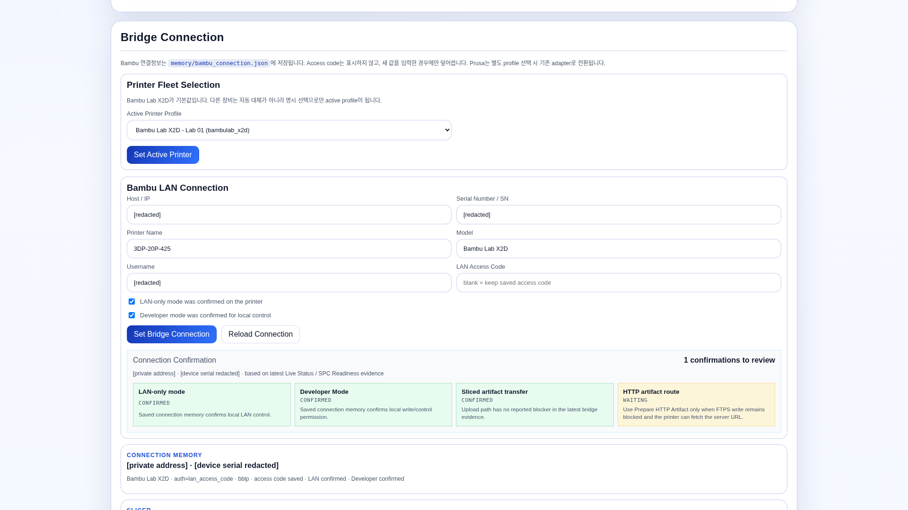
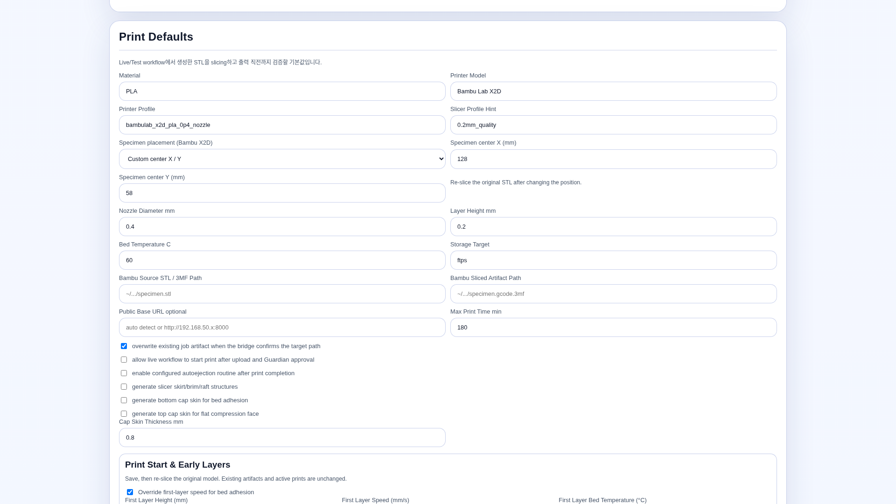
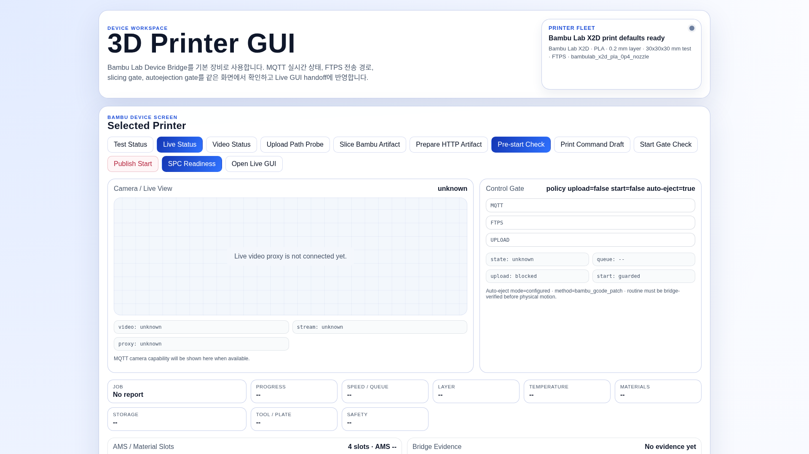
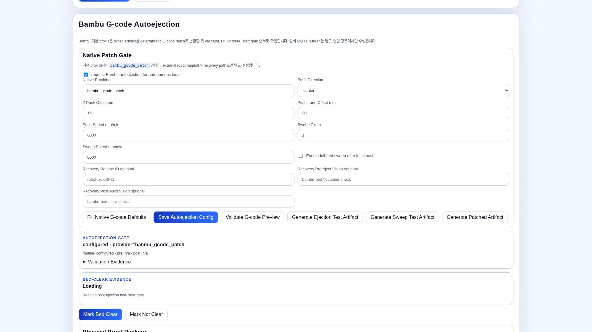
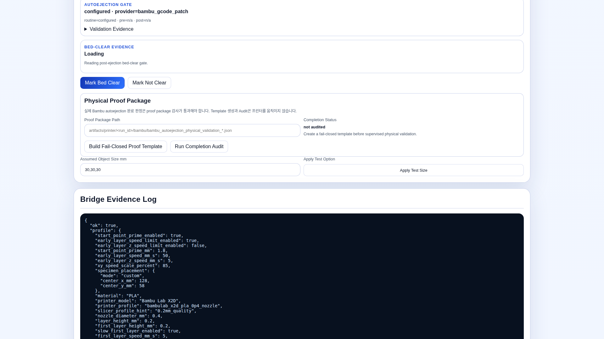
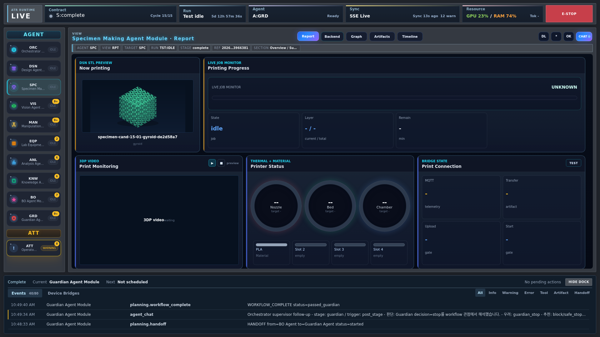

<!-- atr-doc
doc_type: guide
subtype: tutorial
status: active
authority: procedural
audience: [user, operator, researcher]
scope: [gui_tutorial, operator_workflow]
summary: Printer profile persistence, slicing-only verification and guarded physical execution.
source_of_truth:
  - web/templates/printer.html
  - web/static/printer.js
  - device_bridges/printer_fleet/bridge.py
last_verified: 2026-09-29
verified_against: fcfba9f
related_docs:
  - docs/gui/visual_structure.md
  - docs/runtime/test_mode.md
supersedes: []
-->

# 3D Printer Tutorial — Save, Slice, Inspect, Then Print

[한국어](device_workspace_3dp_usage.ko.md) · [Tutorial index](first_autonomous_run.md)

## Goal and preparation

This guide has two stopping points. First, save a print profile and create a sliced
artifact **without starting a print**. Continue to the optional physical section
only when you intend to use the device under supervision. Saving defaults, creating
a file and completing a physical print are three different outcomes.

Prepare a selected printer/slicer profile and an STL or supported 3MF that the
server can read. A path on your browser's computer is not necessarily a path on
the server. For device work, prepare the correct connection, a clear work area
and the approvals for the intended print/ejection sequence. If an active run owns
the printer, inspect its report instead of starting competing workspace operations.

Open **Main → Device Workspaces → 3D Printer**, or `/printer`.
Figures are 1920 × 1080 captures from 29 September 2026. Their values are saved
installation examples, not a recommended profile. No slicing, transfer, print or
configuration save was triggered for these screenshots.

## Save settings and produce an artifact

### Step 1 — Select the intended printer

Start at **Bridge Connection**. The selected provider determines which connection
and slicing path will be used; do not treat a second printer as an automatic fallback.

1. In **Printer Fleet Selection**, inspect **Active Printer Profile**.
2. If changing devices, select the intended printer and click **Set Active Printer**.
3. For Bambu, inspect **Bambu LAN Connection**. Enter the actual host, serial and
   access code only in your private installation.
4. Confirm LAN-only/developer-mode checkboxes only after checking the printer.
5. Click **Set Bridge Connection**, then **Reload Connection** to verify persistence.

Use the figure to locate the fleet selector and private connection fields. After
reload, confirm that the selected printer and connection still match your device.
An empty access-code field preserves the saved code; it does not mean no password
is configured. Bambu is the default provider, and the slicing buttons below describe
that path. For a deliberately selected Prusa or other fleet path, follow the
[printer-fleet reference](../device_bridges/printer_fleet_bridge.md). Keep connection
JSON and credential-bearing screenshots private.

### Step 2 — Set geometry placement and base print settings

In **Print Defaults**, prepare the settings that will be consumed by the next
slice. Use the experiment's validated material and geometry requirements, not
numbers copied from this screenshot.

1. Match material, printer/nozzle profile, layer height and bed temperature to the
   actual setup and validated experiment.
2. Choose **Specimen placement**. For **Custom center X / Y**, enter the intended
   center in millimetres. Do not substitute a specimen edge coordinate.
3. Check skirt/brim/raft and cap-skin choices against the specimen design.
4. Enter **Bambu Source STL / 3MF Path** for the model you will slice.

The figure locates **Specimen placement** within the defaults. Check that the
specimen fits both the bed and the intended handling path, with center coordinates
in millimetres. If X/Y changes, re-slice the original model; saving a new placement
cannot move the toolpath already stored in an existing G-code file.

### Step 3 — Save start, speed and calibration options

Use **Print Start & Early Layers** to decide which startup and early-layer changes
belong in the new artifact. A saved number and an enabled option are separate:
check both when you want a setting applied.

| Control | What to check |
|---|---|
| First-layer override | First-layer height, speed and bed temperature are separate inputs |
| XYZ speed scale (%) | Enter 1–100 inclusive; 100 means no scaling reduction |
| Start-point prime | Separate enable checkbox and extrusion amount in mm; not a Z lift |
| Layer 2–5 speed cap | Independent enable checkbox and speed in mm/s |
| Early-layer Z cap | Independent enable checkbox for the configured early-layer interval |
| Bed leveling / flow calibration | Separate requested options, not proof that a calibration ran |

The shared scale applies to **XYZ motion**, not just XY. The
[Bambu control semantics](../device_bridges/bambu_x2d_bridge.md#control-semantics)
explain the persisted fields, including the historical key `xy_speed_scale_percent`.

1. Enter values even if a corresponding checkbox is currently off.
2. Check only the options you want applied.
3. Click **Save Print Defaults**.
4. Reload the page and verify both numbers and checkbox states.

Compare the reloaded numbers and checkboxes with the choices you made. A disabled
option can retain its number without applying it. These defaults do not modify
an existing artifact or an active print; the next step creates the new artifact.
**Test Specimen Defaults** supplies a fallback specimen, not the BO search space.

### Step 4 — Generate a sliced artifact without printing

Slicing turns the source model and saved defaults into a specific file. Keep its
returned path and hash so that later checks refer to the file you actually prepared.

1. Confirm the source path belongs to the intended specimen.
2. Click **Slice Bambu Artifact** near the top of the workspace.
3. Wait for the response in **Bridge Evidence Log**.
4. Check the returned sliced-artifact path, hash and placement evidence.
   On success, **Bambu Sliced Artifact Path** is populated.
5. Inspect the generated project/G-code and available slicer mass/time evidence.

The top-level figure places preparation and execution controls close together:
for this step, use **Slice Bambu Artifact**, not a start control. Confirm “sliced
artifact ready” evidence with **no upload or MQTT publish**. A nonempty path without
a successful response is insufficient. If slicing fails, read the failure code and
check the server-local input, slicer executable and profile before trying again.

You have finished the slicing-only task when the saved settings survive reload and
the output path/hash, placement and available mass/time evidence can be inspected.
Record them with the original source path. No physical completion is claimed; stop
here unless you have a separate supervised hardware task.

## Optional: prepare and supervise physical execution

The following steps are not prerequisites for a successful slice. They prepare or
inspect a real-device workflow. Ejection artifacts can move hardware when executed,
and **Publish Start** can start the printer. Confirm the actual bed state, clear
motion area, current approvals and device ownership before crossing that boundary.
For a run-owned job, use the Live/SPC sequence rather than a parallel manual start.

### Step 5 — Inspect auto-ejection separately

If the approved print includes automatic ejection, open **Bambu G-code Autoejection**.
Review the routine as its own motion program, not as an incidental slice setting.

1. Inspect native provider, direction, push offset/lane and sweep settings.
2. If editing, save with **Save Autoejection Config**.
3. Use **Validate G-code Preview** to inspect the generated routine.
4. Use **Generate Patched Artifact** when creating an artifact that includes the
   configured routine. Verify the returned path and validation evidence before use.

The figure separates configuration from preview and artifact generation. Verify
the generated file and validation evidence before use; they establish what is
prepared, not that an ejection occurred. **Fill Native G-code Defaults** only fills
the local form and still requires save/generation. Do not execute an ejection or
sweep test artifact simply to test a button.

### Step 6 — Understand physical proof and start gates

Use the **Physical Proof Package** area in the figure to distinguish evidence
preparation from a completed physical action. **Build Fail-Closed Proof Template**
creates an evidence form to fill; **Run Completion Audit** checks that evidence.
Neither performs or proves ejection on its own. Inspect the actual bed before
using **Mark Bed Clear**: it asserts a physical condition, not an error reset.

For a supervised physical run, prefer the existing Live loop and its SPC handoff.
Standalone preparation exposes **Pre-start Check**, **Print Command Draft**,
**Start Gate Check** and **Publish Start**. They are not interchangeable:

| Control or operation | What its result means |
|---|---|
| Pre-start Check | Inspect current readiness and any blocking reason |
| Print Command Draft | A command has been prepared, not executed |
| Start Gate Check | The start conditions were checked; printing has not thereby occurred |
| Publish Start | Can issue the physical start; requires the intended artifact and current approval |
| Upload-path probing / transfer | Can contact or write to the printer, even before printing |

Use the exact prepared artifact and current approvals; never substitute an older
success record. Refer to the [Bambu bridge](../device_bridges/bambu_x2d_bridge.md)
for transport, cleanup and completion contracts.

### Step 7 — Watch the run-owned SPC evidence

Once the approved run starts, open **SPC → Report** in Live. Match its job identity
and artifact to what was prepared, then check transfer/start results, telemetry
freshness, remaining time, camera and the post-print handoff. The screenshot is a
historical report that locates these checks, not current proof about your printer.

Completion evidence must belong to this run and artifact. An idle printer or an
old finished job does not establish that this job completed. A frozen camera frame
also does not establish a stopped printer: inspect telemetry and frame timestamps
separately. If the run is waiting, preserve its evidence and follow
[printer wait recovery](../gui/printer_wait_recovery.md) before attempting Resume.

## Troubleshooting and completion

| Symptom | Check first |
|---|---|
| Saved checkbox comes back differently | Save Print Defaults response, then reload; distinguish defaults from old artifact settings |
| Placement or speed did not change | Re-slice the original model and use the new artifact/hash |
| Slicer cannot find input | Server-local source path and selected slicer profile |
| Upload succeeds but no start | Current start-gate reasons and explicit execution approval |
| FTPS/video/MQTT disagree | Each channel's status and freshness; one does not prove another |
| Ejection shown as configured | Validation/proof and actual completion are separate |
| Values differ from screenshots | Use your saved/validated profile, not the illustration |

For a slicing-only task, retain the source path, saved configuration, output
path/hash and validation result. For a physical run, also retain the run/job ID,
start and actual completion evidence, including the required post-print handoff.
Keep the two outcomes explicitly distinct. [Artifact preservation](../gui/artifact_preservation.md)
explains how to retain the referenced files; an unresolved physical state needs
operator inspection, not another publish attempt.

## Further reading

- [Printer fleet](../device_bridges/printer_fleet_bridge.md)
- [Bambu settings and implementation](../device_bridges/bambu_x2d_bridge.md)
- [SPC agent evidence](../agents/specimen_agent.md)
- [Execution profiles](../runtime/test_mode.md)
- [Operator walkthroughs](user_manual.en.md)
