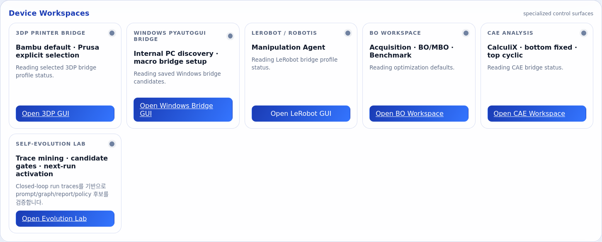
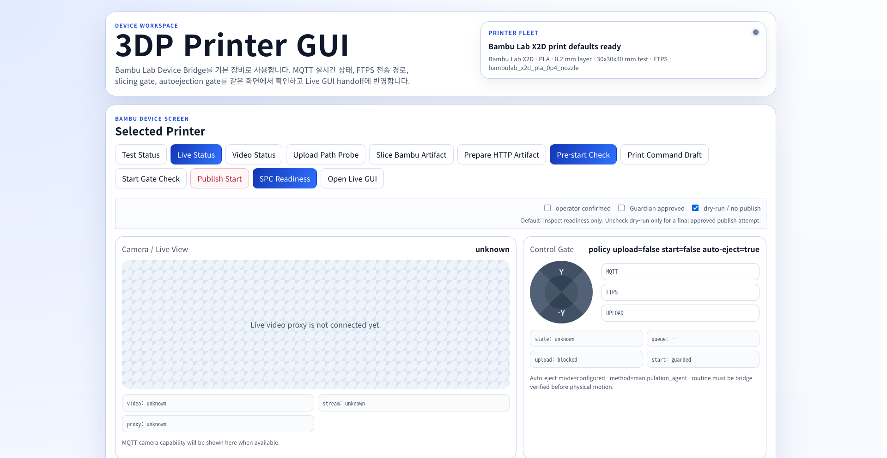
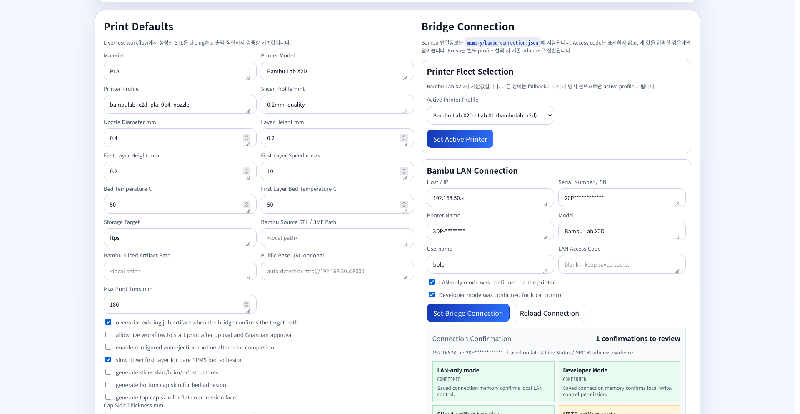
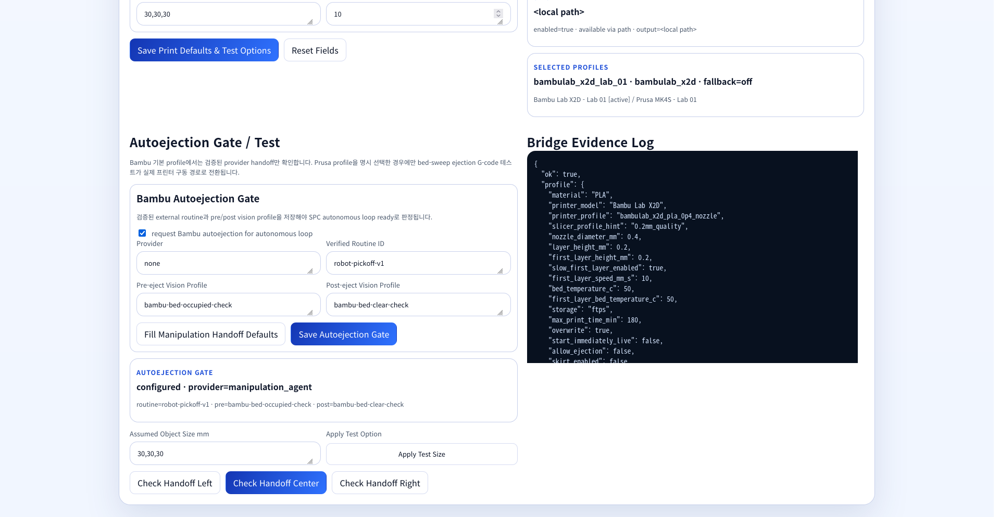

# Device Workspaces 사용법: 3DP Printer Bridge

이 문서는 Main GUI의 **Device Workspaces** 영역과 3DP Printer GUI(`/printer`)를 실제 운영자가 어떻게 쓰는지 정리한 페이지입니다. Live GUI 화면은 아직 UI 조정 대상이므로 여기서는 다루지 않습니다.

## 1. 진입 경로

ATR 서버를 실행한 뒤 브라우저에서 Main GUI를 엽니다.

```bash
atr up
```

- 기본 접속: `http://127.0.0.1:7860/`
- 같은 내부망 장비가 서버 artifact를 가져가야 하는 경우: 서버를 `0.0.0.0`로 띄운 상태에서 LAN IP를 사용합니다.
- 3DP GUI 직접 접속: `http://127.0.0.1:7860/printer`

Main GUI의 **Device Workspaces**에서 장비별 전용 GUI로 이동합니다.



각 카드의 의미는 다음과 같습니다.

| 카드 | 역할 |
|---|---|
| 3DP Printer Bridge | Bambu Lab 기본, Prusa 명시 선택 방식의 3D 프린터 bridge 설정/검증 |
| Windows PyAutoGUI Bridge | Windows PC의 UTM/장비 제어 macro bridge 설정/테스트 |
| LeRobot / ROBOTIS | teleoperation, recording, training, rollout, manipulation bridge 관리 |
| BO Workspace | acquisition function, BO/MBO, benchmark 설정 |
| CAE Analysis | CAE/FEM 해석 bridge, 경계조건, simulation 설정 |
| Self-Evolution Lab | trace mining, candidate gate, next-run activation 관리 |

## 2. 3DP Printer GUI 개요

`Open 3DP GUI`를 누르면 `/printer`가 새 창으로 열립니다. 현재 구조에서 Bambu Lab X2D가 기본 printer provider이며, Prusa MK4S는 fallback이 아니라 **명시적으로 선택했을 때만** active printer가 됩니다.



상단 버튼의 용도는 다음과 같습니다.

| 버튼 | 용도 | 실제 구동 여부 |
|---|---|---|
| Test Status | test mode 기준 bridge 상태 조회 | 장비 구동 없음 |
| Live Status | live mode 기준 bridge 상태 조회 | 상태 조회만 수행 |
| Video Status | Bambu MQTT/video capability 조회 | 영상/상태 조회만 수행 |
| Upload Path Probe | 업로드 경로/저장소 접근성 점검 | 파일 쓰기/접근성 확인 가능 |
| Slice Bambu Artifact | Bambu Studio CLI로 STL/3MF를 Bambu용 artifact로 slicing | slicing만 수행 |
| Prepare HTTP Artifact | 프린터가 fetch할 수 있는 HTTP artifact route 준비 | 파일 노출만 수행 |
| Pre-start Check | slicing, HTTP route, start gate, SPC readiness 통합 점검 | MQTT start publish 없음 |
| Print Command Draft | publish 전 command payload 초안 확인 | 명령 전송 없음 |
| Start Gate Check | operator/Guardian/dry-run gate 확인 | dry-run 기본값이면 publish 없음 |
| Publish Start | 승인된 조건에서 실제 start publish | 실제 시작 가능 |
| SPC Readiness | Specimen Making Agent 관점의 printer readiness 집계 | 상태 집계만 수행 |
| Open Live GUI | Live GUI로 이동 | 별도 화면 열기 |

운영 기본값은 `dry-run / no publish`가 켜져 있습니다. 실제 publish 전에는 최소한 `operator confirmed`, `Guardian approved`, `dry-run 해제`가 의도적으로 설정되어야 합니다.

## 3. Print Defaults와 Test Options 설정

아래 영역은 Live/Test workflow에서 만든 STL을 slicing하고 출력 직전까지 검증할 때 쓰는 기본값입니다.



주요 입력값은 다음과 같습니다.

| 항목 | 설명 |
|---|---|
| Material | 필라멘트 소재. 예: `PLA` |
| Printer Model | 화면 표시 및 profile 판별용 모델명 |
| Printer Profile | slicing/profile hint. 예: `bambulab_x2d_pla_0p4_nozzle` |
| Slicer Profile Hint | Bambu Studio/PrusaSlicer 쪽 품질 profile 힌트 |
| Nozzle Diameter mm | 노즐 직경 |
| Layer Height mm | 일반 layer 높이 |
| First Layer Height mm | 첫 레이어 높이. 일반 layer와 불일치하면 bed adhesion 문제가 생길 수 있습니다. |
| First Layer Speed mm/s | 첫 레이어 속도. TPMS bare structure는 낮게 두는 편이 안정적입니다. |
| Bed Temperature C | 일반 bed 온도 |
| First Layer Bed Temperature C | 첫 레이어 bed 온도 |
| Storage Target | Bambu는 `ftps` 또는 HTTP artifact route를 사용합니다. |
| Bambu Source STL / 3MF Path | slicing할 원본 STL/3MF 경로 |
| Bambu Sliced Artifact Path | slicing 결과 artifact 경로 |
| Public Base URL optional | 프린터가 서버 artifact를 가져갈 때 사용할 LAN URL |
| Max Print Time min | Guardian/start gate가 허용할 최대 출력 시간 |

체크박스 의미는 다음과 같습니다.

| 체크박스 | 의미 | 권장 기본값 |
|---|---|---|
| overwrite existing job artifact | 같은 artifact 이름 덮어쓰기 허용 | 켬 |
| allow live workflow to start print | Live workflow가 upload 후 start까지 진행 가능 | 실제 출력 전까지 끔 |
| enable configured autoejection routine | 출력 완료 후 autoejection routine 요청 | provider 검증 후 켬 |
| slow down first layer | 첫 레이어 저속 출력 | 켬 |
| generate slicer skirt/brim/raft structures | skirt/brim/raft 생성 | 필요할 때만 켬 |
| generate bottom cap skin | 바닥 adhesion용 bottom cap 생성 | 필요 시 켬 |
| generate top cap skin | 압축면 평탄화용 top cap 생성 | FDM에서는 무너질 수 있어 보통 끔 |

`Test Options`는 Device Workspace와 agent test flow에서 공통으로 참조하는 기본 시편 조건입니다.

- `Test Specimen Size mm`: 예: `30,30,30`
- `Test Unit Cell Size mm`: 예: `10`
- 저장 버튼: `Save Print Defaults & Test Options`
- 저장 파일: `memory/prusa_print_profile.json`

파일명은 legacy 이름을 유지하지만, 현재는 선택된 active printer provider에 맞춰 Bambu/Prusa profile로 adapt됩니다.

## 4. Printer Fleet과 Bambu LAN Connection

`Printer Fleet Selection`에서 active printer를 고릅니다.

- 기본값: Bambu Lab X2D
- Prusa 사용: Prusa profile을 명시 선택해야 합니다.
- 선택 저장 버튼: `Set Active Printer`
- 저장 파일: `memory/printer_fleet.json`

`Bambu LAN Connection`에는 다음 값을 저장합니다.

| 항목 | 설명 |
|---|---|
| Host / IP | 프린터의 내부망 IP. 문서/로그에는 실제 값을 넣지 않습니다. |
| Serial Number / SN | Bambu 프린터 SN |
| Printer Name | 운영자가 구분하기 쉬운 장비명 |
| Model | 예: `Bambu Lab X2D` |
| Username | Bambu LAN mode 기본 사용자. 보통 `bblp` |
| LAN Access Code | 프린터에서 확인한 LAN access code. 화면에는 저장값을 다시 표시하지 않습니다. |
| LAN-only mode confirmed | 프린터에서 LAN-only mode를 확인했는지 |
| Developer mode confirmed | local write/control 권한 확인 여부 |

저장 버튼은 `Set Bridge Connection`입니다. 저장 파일은 `memory/bambu_connection.json`이며, 이 파일은 gitignore 대상입니다. Access code는 문서, 커밋, 스크린샷에 남기지 않습니다.

## 5. Bambu pre-start check 절차

실제 출력 전에는 바로 `Publish Start`를 누르지 말고 아래 순서로 확인합니다.

1. `Live Status`로 MQTT/FTPS/connection 상태를 확인합니다.
2. `Slice Bambu Artifact`로 현재 STL/3MF를 Bambu artifact로 변환합니다.
3. `Prepare HTTP Artifact`로 프린터가 접근 가능한 artifact URL을 준비합니다.
4. `Start Gate Check`로 operator/Guardian/dry-run gate를 확인합니다.
5. `SPC Readiness`로 Specimen Making Agent 기준 readiness를 확인합니다.
6. `Pre-start Check`로 위 절차를 한 번에 점검합니다.

정상적인 dry-run 점검 결과는 다음 원칙을 만족해야 합니다.

- `will_publish=false`
- `published=false`
- `motion_started=false`
- `ready_to_publish_not_started` 또는 이에 준하는 상태

즉, pre-start check는 **출력 직전까지 갔는지** 확인하는 절차이지, 기본적으로 출력 시작 명령을 내리는 절차가 아닙니다.

실제 출력은 다음 조건이 의도적으로 충족된 뒤에만 진행합니다.

1. artifact가 올바른 STL/3MF에서 생성됨
2. HTTP/FTPS route가 프린터에서 접근 가능함
3. `operator confirmed` 체크
4. `Guardian approved` 체크
5. `dry-run / no publish` 해제
6. `Publish Start` 실행

## 6. Autoejection Gate / Test

Bambu 기본 profile에서는 Prusa처럼 bed-sweep G-code를 직접 생성하지 않습니다. 대신 검증된 외부 routine과 Manipulation Agent consumer가 준비됐는지 확인하고, provider handoff payload를 만듭니다.



입력값 의미는 다음과 같습니다.

| 항목 | 설명 |
|---|---|
| request Bambu autoejection | autonomous loop에서 Bambu autoejection을 요청할지 여부 |
| Provider | 외부 routine provider. 예: `manipulation_agent` |
| Verified Routine ID | 이미 검증된 robot pickoff/ejection routine ID |
| Pre-eject Vision Profile | ejection 전 bed occupied 확인 profile |
| Post-eject Vision Profile | ejection 후 bed clear 확인 profile |
| Assumed Object Size mm | ejection/handoff 판단용 시편 크기. `Apply Test Size`로 Test Options 값을 가져올 수 있습니다. |

버튼 동작은 다음과 같습니다.

| 버튼 | 의미 |
|---|---|
| Fill Manipulation Handoff Defaults | 로컬 입력칸에 기본 provider/vision 값 채우기 |
| Save Autoejection Gate | `memory/bambu_autoejection.json`에 operator-verified 설정 저장 |
| Check Handoff Left/Center/Right | Bambu에서는 provider handoff readiness만 확인. 실제 robot motion은 시작하지 않음 |

Autoejection이 autonomous loop ready가 되려면 두 종류가 모두 준비되어야 합니다.

1. Bambu autoejection provider gate: routine ID와 pre/post vision profile이 저장되어야 합니다.
2. Manipulation Agent consumer readiness: `memory/manipulation_agent_bridge.json`에 실제 policy/profile 경로가 준비되어야 합니다.

consumer가 준비되지 않으면 `BAMBU_AUTOEJECTION_CONSUMER_NOT_READY`가 나올 수 있습니다. 이때는 LeRobot/Manipulation workspace에서 rollout policy와 profile 저장 상태를 먼저 확인합니다.

## 7. Device Workspace에서 확인해야 하는 상태 요약

| 상태 | 의미 | 다음 조치 |
|---|---|---|
| `policy upload=false start=false` | upload/start gate가 닫혀 있음 | 실제 출력 전에는 정상. publish 전 gate 확인 필요 |
| `dry-run / no publish` checked | start publish가 차단된 검사 모드 | 실제 시작 전까지 유지 |
| `Connection Confirmation`에 warning | LAN/Developer/storage/HTTP route 중 검토 항목 존재 | 카드의 action을 따라 connection/profile 수정 |
| `SPC Readiness ready` | Specimen Making Agent 기준 handoff 가능 | live/test workflow에 넘길 수 있음 |
| `provider_handoff_ready` | Bambu autoejection handoff payload 생성 가능 | 실제 motion은 Manipulation Agent consumer가 별도로 수행 |

## 8. 문제 해결

| 증상 | 가능 원인 | 확인 위치 |
|---|---|---|
| `BAMBU_HTTP_ARTIFACT_URL_NOT_PRINTER_REACHABLE` | 서버 URL이 프린터 내부망에서 접근 불가 | `Public Base URL optional`, 서버 bind 주소, 방화벽 |
| `BAMBU_LAN_MODE_NOT_CONFIRMED` | LAN-only mode 체크/저장 누락 | Bambu LAN Connection 체크박스 |
| `BAMBU_DEVELOPER_MODE_NOT_CONFIRMED` | local write/control 권한 확인 누락 | Bambu LAN Connection 체크박스 |
| `BAMBU_AUTOEJECTION_NOT_CONFIGURED` | provider routine 또는 vision profile 미저장 | Autoejection Gate / Test |
| `BAMBU_AUTOEJECTION_CONSUMER_NOT_READY` | Manipulation Agent policy/profile 미준비 | LeRobot/Manipulation workspace, `memory/manipulation_agent_bridge.json` |
| slicing 실패 | Bambu Studio CLI 또는 source path 문제 | `Slice Bambu Artifact`, `Bridge Evidence Log` |
| publish가 안 됨 | dry-run 유지 또는 operator/Guardian gate 미승인 | 상단 start gate controls |

## 9. 관련 API와 저장 파일

GUI 버튼은 아래 API를 호출합니다. CUI/agent 쪽에서도 같은 contract를 따라야 합니다.

| 기능 | API |
|---|---|
| printer status | `GET /api/printer/status?mode=live` |
| video status | `GET /api/printer/video-status` |
| fleet read/save | `GET/POST /api/printer/fleet` |
| connection read/save | `GET/POST /api/printer/connection` |
| upload path probe | `POST /api/printer/upload-path-probe` |
| start command draft | `POST /api/printer/start-command-draft` |
| start gate | `POST /api/printer/start-gate` |
| publish start | `POST /api/printer/start-publish` |
| SPC readiness | `POST /api/printer/spc-readiness` |
| Bambu slicing | `POST /api/printer/bambu-slice-artifact` |
| HTTP artifact route | `POST /api/printer/http-artifact-route` |
| Bambu pre-start check | `POST /api/printer/bambu-prestart-check` |
| autoejection status/config/test | `GET /api/printer/autoejection-status`, `POST /api/printer/autoejection-config`, `POST /api/printer/autoejection-test` |

저장 파일은 모두 local runtime state이며 git에 올리지 않습니다.

| 파일 | 내용 |
|---|---|
| `memory/printer_fleet.json` | active printer 선택 |
| `memory/bambu_connection.json` | Bambu LAN connection과 access code |
| `memory/bambu_autoejection.json` | Bambu autoejection provider gate |
| `memory/prusa_print_profile.json` | active printer에 adapt되는 print defaults/test options |
| `memory/manipulation_agent_bridge.json` | autoejection handoff를 받을 Manipulation Agent consumer 설정 |

## 10. 운영 규칙

- Device Workspace에서 하는 check는 기본적으로 **확인/준비** 단계입니다.
- 실제 출력 시작은 `Publish Start`에서만 일어나야 합니다.
- Bambu autoejection check는 실제 robot motion을 시작하지 않아야 합니다.
- Access code, API key, SN 전체값, 내부망 IP 전체값은 docs/commit/log 공유용 자료에 넣지 않습니다.
- 장비가 바뀌면 fallback에 의존하지 말고 `Printer Fleet Selection`에서 active printer를 명시 선택합니다.
- GUI와 backend가 서로 다른 상태를 보이면 `Reload Connection`, `Live Status`, `SPC Readiness` 순서로 다시 확인합니다.
