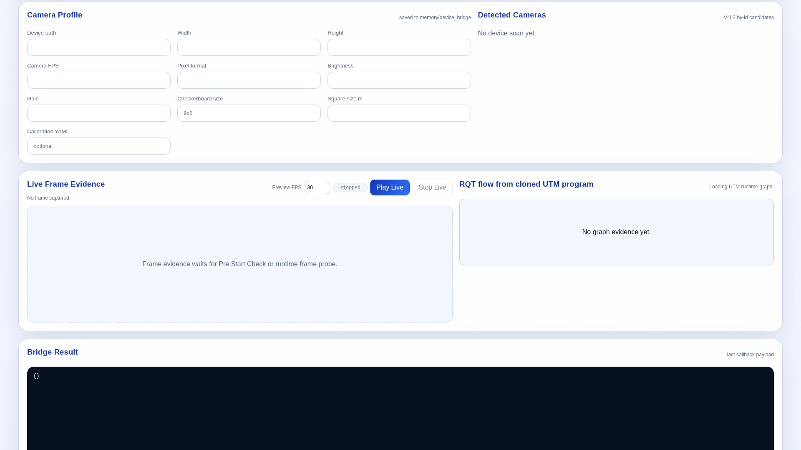
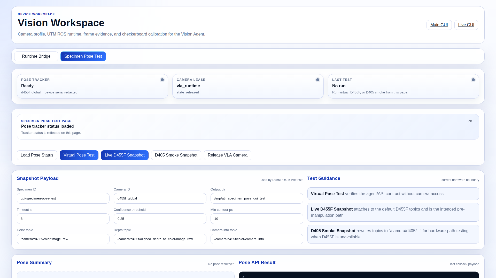
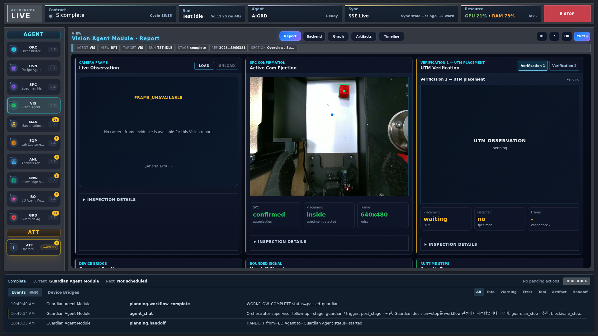

<!-- atr-doc
doc_type: guide
subtype: tutorial
status: active
authority: procedural
audience: [user, operator, researcher]
scope: [gui_tutorial, operator_workflow]
summary: Camera configuration, frame freshness, pose diagnostics and run-bound verification walkthrough.
source_of_truth:
  - web/templates/vision_utm_device_bridge.html
  - web/static/vision_utm_device_bridge.js
  - app/main.py
last_verified: 2026-09-29
verified_against: fcfba9f
related_docs:
  - docs/gui/visual_structure.md
  - docs/runtime/test_mode.md
supersedes: []
-->

# Vision Tutorial — Camera Setup and Evidence Checks

[Korean](device_workspace_vision_camera_bridge_usage.ko.md) · [Tutorial index](first_autonomous_run.md)

## Goal and preparation

Configure the UTM camera, verify a fresh frame, and distinguish a workspace pose
test from a run's Vision decision. Use a configured ROS/UTM installation and the
correct camera. Coordinate with the operator before starting/stopping ROS or
releasing a camera owned by an active robot session.

Open **Main → Device Workspaces → Vision**, or `/device-bridge/vision-utm`.
The 1920 × 1080 figures were captured read-only on 29 September 2026; camera capture,
ROS commands and configuration saves were not executed for documentation.
Blank fields and panels reflect a state that has not been queried, not a successful setup example.

## Step 1 — Read the current camera configuration

1. Select **Runtime Bridge**.
2. Click **Load Config** to read the stored settings.
3. Inspect **Camera Profile**, device path, dimensions, camera FPS and pixel format.
4. Check the runtime/status banner before changing anything.

**Expected:** the saved camera profile is displayed. Do not infer a correct device
from an empty form or from a previously captured image.
The UTM camera configuration is distinct from LeRobot's top/wrist camera settings.

## Step 2 — Select and save the actual device

1. If configuration is needed, click **Detect Devices**.
2. Select the intended entry in **Detected Cameras**, then check **Device path**.
3. Set width/height, camera FPS and a pixel format supported by this device.
4. Click **Apply Camera**, then **Load Config** to verify persistence.

**Expected:** the intended device/profile survives reload. Configuration is stored
locally under `memory/device_bridge/utm_camera_config.json`.
Do not copy the camera path from another computer or use private serials from a
screenshot. For supported settings and dependencies, see
[UTM Vision Bridge](../device_bridges/utm_vision_bridge.md).

## Step 3 — Start or check the UTM ROS runtime

1. Confirm no active experiment depends on the runtime you intend to change.
2. Use **ROS Loading** when startup is required.
3. Run **Pre Start Check** and read **Bridge Result**.
4. Verify the selected camera, ROS/frame evidence and any failure details.

**Expected:** a fresh frame with matching source and usable runtime evidence.
This screenshot deliberately shows no captured frame; it does not demonstrate ROS
or camera success. A graph picture or a loaded-process label alone is insufficient.
**ROS Unloading** and **Release Camera Ports** change resource ownership; do not use
them during a working run merely to refresh the browser.

## Step 4 — Check the preview without confusing rates

1. In **Live Frame Evidence**, set **Preview FPS**.
2. Click **Play Live**.
3. Verify that the image changes and its status/evidence is current.
4. Click **Stop Live** when you finish observing.

**Expected:** a current preview from the configured topic.
Preview FPS requests a browser delivery rate, not a higher camera acquisition rate.
Before increasing it, check source/frame freshness. If the source is slow, check
the camera/USB/ROS stream.
See [UTM ROS bridge](../hardware/utm_ros_vision_runtime_bridge.md).

## Step 5 — Use pose diagnostics for their stated purpose

Select **Specimen Pose Test**.

1. Use **Load Pose Status** to inspect tracker/camera-lease state.
2. For a non-camera contract check, use **Virtual Pose Test**.
3. A supervised **Live D455F Snapshot** uses the configured D455F topics.
4. **D405 Smoke Snapshot** is a separate hardware-path diagnostic.
5. Inspect **Snapshot Payload**, **Pose Summary** and **Pose API Result** together.

**Expected:** the result identifies its source/mode and specimen. A virtual result
does not prove detection in a real scene. A D405 smoke test is not a replacement for
the loop's chosen camera.
**Release VLA Camera** can disrupt the session using the camera; do not press it while inference
is active simply because this panel says no result.

## Step 6 — Inspect the run's actual verification

Return to Live and select **VIS → Report**.

Check the run/cycle, selected observation (Active Cam or verification slot), captured
image, ROI and decision evidence. A new image and a completed LLM decision occur at
different times. Image delivery alone is not a verification pass.

**Expected:** a current run-bound capture and matching decision for the required step.
Workspace diagnostics do not mark that step complete. If the camera moved, realign
the physical view to the configured ROI or follow an explicitly reviewed calibration
change; do not change thresholds just to obtain a pass.
See [Vision Agent](../agents/vision_agent.md).

## Step 7 — Calibrate only when required

1. Prepare the actual checkerboard and measure its square size in metres.
2. Enter **Checkerboard size**, **Square size m** and the intended calibration file.
3. Use **Calibrate** only in a maintenance window with the camera available.
4. Inspect the calibration output; **Stop Calibrate** closes that calibration session.

**Expected:** calibration evidence for that camera and target, not just a filled path.
A placeholder such as 9×6 is not an instruction to use a different board.
Do not recalibrate a working experiment as part of ordinary page navigation.

## Troubleshooting and completion

| Symptom | First check |
|---|---|
| No device found | OS/USB connection, permissions and Detect Devices result |
| Empty frame | Camera selection, runtime, topic and Pre Start Check details |
| Old image | Capture/frame timestamp and source, not only visible pixels |
| Busy camera | Active owner/lease; coordinate before releasing it |
| Slow preview | Actual acquisition/ROS rate versus preview delivery rate |
| Pose test passes but VIS waits | Test mode/source versus the required run-bound verification |

To complete this exercise, verify saved settings and a fresh authorized frame in your
own environment; documentation screenshots do not count. Continue with
[operator walkthroughs](user_manual.en.md).
