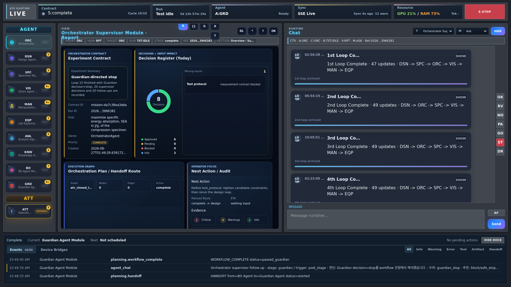
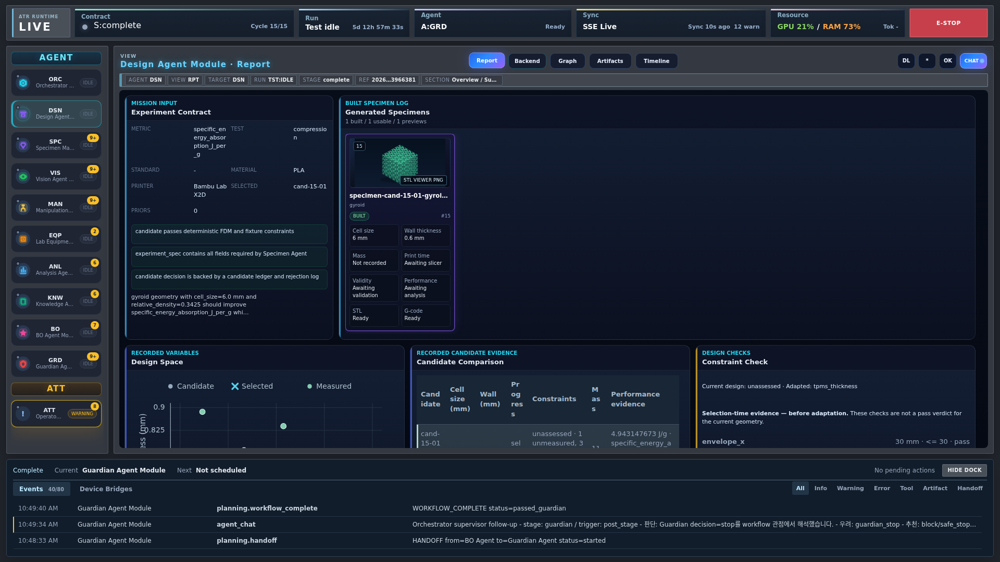

<!-- atr-doc
doc_type: guide
subtype: tutorial
status: active
authority: procedural
audience: [user, operator, researcher]
scope: [gui_tutorial, operator_workflow]
summary: Screenshot-led first virtual run, evidence inspection and recovery checkpoints.
source_of_truth:
  - web/templates/index.html
  - web/static/app.js
  - web/templates/planning.html
  - web/static/planning.js
  - utils/test_mode_execution_profiles.py
last_verified: 2026-09-29
verified_against: fcfba9f
related_docs:
  - docs/gui/visual_structure.md
  - docs/runtime/test_mode.md
supersedes: []
-->

# 첫 자율 실험 — 단계별 따라 하기

[English](first_autonomous_run.en.md) · [전체 튜토리얼](first_autonomous_run.md) · [한국어 문서 목차](../README.ko.md)

## 목표와 준비물

Live에서 **가상 실험 한 사이클**을 요청하고, 설계 후보가 각 단계를 거쳐
결과 파일로 남는 과정을 따라갑니다. 끝나면 실험 ID와 설계·분석 근거를 직접
찾을 수 있어야 합니다. 프린터와 로봇은 필요하지 않으며, 가상 데이터로 만든
결과를 실제 측정값으로 해석하지 않습니다.

설치된 AX4LAB, 사용 가능한 LLM 백엔드, 브라우저가 필요합니다.
설치 전이라면 [설치 안내](../../install/README.md)를 먼저 따릅니다.
화면은 1920 × 1080 기준입니다. 캡처 속 숫자와 저장값은 해당 설치 환경의
예시이지 그대로 복사할 권장 설정이 아닙니다.

## Step 1 — 서버와 메인 화면 열기

설치된 Linux/WSL 워크스테이션의 터미널에서 실행합니다.

```bash
atr up
```

네이티브 Windows에서는 설치 안내에 따라 `.venv`를 활성화하고
`python -m app.serve`를 사용합니다.

`http://localhost:7860`에 접속합니다. 이미 서버가 실행 중이면 그 서버를
사용합니다. 이 실습 때문에 진행 중인 실험을 재시작하지 않습니다.


그림에서 모델·백엔드 설정 아래의 **Run Control**을 찾고, 본인 화면에도
같은 영역이 보이는지 확인합니다. 모델 로딩 표시는 사용할 준비가 되었다는
뜻이지 실험 실행 표시가 아닙니다. 접속되지 않으면 장비를 조작하기 전에
실행 터미널의 오류와 로컬 서버 상태를 확인합니다.

## Step 2 — 가상 실행 프로필 선택하기

먼저 이번 실험에서 허용할 장비 동작 범위를 정합니다. 대화창을 열기 전에
가상 실행 설정을 저장합니다.

1. **Run Control → Test Mode Settings**를 누릅니다.
2. **Virtual Bridge**를 선택합니다.
3. 에이전트별 물리 실행 경계를 확인합니다. 첫 실습에서는 가상/preflight
   설정을 유지하고 **Real device**로 바꾸지 않습니다.
4. **Total Cycles**를 `1`로 입력하고 **Save profile**을 누릅니다.
5. **Reload**로 다시 읽어 저장값을 확인합니다. 새 런에 적용되는 설정이며
   이미 실행 중이거나 복구한 런의 사이클 수를 바꾸지 않습니다.


**Reload** 후 저장 버전, **Virtual Bridge**, 사이클 수 `1`이 유지되는지
확인합니다. 프로필 이름뿐 아니라 에이전트별 값도 확인해야 합니다. 그림의
사이클 수는 촬영 당시 값이며 이 실습에서 입력할 값이 아닙니다.

‘테스트’라는 이름만 보고 다른 프로필을 선택하면 안 됩니다.

| 프로필 | 프린터 경로 | 나머지 장비 |
|---|---|---|
| Virtual Bridge | 가상/preflight 경로 | 가상 프로필에서는 실제 장비 호출 없음 |
| Installed Printer | 슬라이싱 후 배출 전용 파일 전송, 출력 본문·냉각 생략 | 비전·로봇·UTM은 실제 동작 가능 |
| Physical Print | 전체 출력·냉각·설정된 자동 배출 | 비전·로봇·UTM은 실제 동작 가능 |

저장된 에이전트별 override도 확인합니다. 상세 계약은
[Test Mode](../runtime/test_mode.md)에 있습니다.

## Step 3 — Live 대화창 열기

1. Main으로 돌아갑니다.
2. 준비된 **Inference** 백엔드를 고르고 모델/API 연결을 확인합니다.
3. **Mode = live**로 바꾼 뒤 **Start**를 누릅니다.
4. 창이 안 뜨면 로컬 사이트의 팝업 허용을 확인합니다.


별도 Live 창에서 초기 대화가 시작되어야 합니다. 왼쪽 에이전트 목록으로
리포트를 보고 채팅 영역에서 계획을 검토합니다. Main의 **test → Start**는
실험을 직접 시작하는 별도 경로입니다. 이 대화 기반 실습 도중에 그 경로로
바꾸어 다시 시작하지 않습니다.

그림에는 과거 런 정보가 있습니다. Live 창을 열었다는 사실만으로 새 실험이
승인·시작되었다고 판단하지 않습니다.

## Step 4 — 테스트 요청과 실험 계획 검토하기

Live 채팅에 아래 예시를 입력합니다.

```text
테스트 모드, 가상 브릿지
```

준비된 테스트 시나리오가 Orchestrator 대화 경로로 계획 질문에 응답합니다.
**Experiment Contract**와 **Experimental Setup**이 나오면 내용을 읽고
검토합니다. 환영 메시지가 나왔다는 것만으로 계획이 확정된 것은 아닙니다.

목표·단위, 시편 크기·재료, 설계변수·범위, 실행 프로필, 사이클 수를 확인합니다.
Gyroid 경로의 설계변수는 **cell size와 wall thickness**입니다. 과거 relative
density 탐색 범위를 그대로 사용하지 않습니다. 의도와 다르면 채팅으로 정정합니다.



Orchestrator 리포트에 검토한 계획이 있는지 확인하고, 작업이 시작되면 리포트나
**Timeline**에서 새로운 실험·사이클의 기록을 찾습니다. 환영 메시지나 과거
계약, 창이 열렸다는 사실은 새 실험의 시작 근거가 아닙니다. 새 run ID가
표시되면 기록해 두고 이후 파일이 같은 실험에 속하는지 대조합니다.

계획 동의와 실행 동의는 별개입니다. 시나리오는 일반적인 검토 응답을 제공할
수 있지만 누락된 연결 정보를 알거나 실제 장비 동작을 목격할 수는 없습니다.
가상 실습에서 물리 동작 확인을 요구하면 그 요청에서 멈추고 저장 프로필을
다시 확인합니다. 하지 않은 동작을 했다고 답하지 않습니다.

## Step 5 — 설계와 시편 준비 확인하기

**DSN → Report**에서 만들 시편을 확인합니다. 그림은 후보를 살펴볼 위치를
보여 줍니다. 본인의 실험에는 후보 수나 값이 다르게 표시될 수 있습니다.



1. 선택 후보가 이번 런·사이클에 속하는지 확인합니다.
2. **Generated Specimens**, **Design Space**, **Candidate Comparison**,
   **Constraint Check**를 읽습니다.
3. **Artifacts**에서 STL을 열어 후보와 연결되는지 확인합니다.
4. **SPC**로 이동해 슬라이싱·준비 근거를 확인합니다.

하나의 후보 ID에서 제약 검사 결과와 STL까지 연결해서 찾을 수 있어야 합니다.
썸네일이 있다는 것만으로 제약 검사를 통과한 것은 아닙니다. 슬라이싱 전에는
질량·출력 시간이 아직 없을 수 있습니다. 공란을 0으로 읽거나 그림의 값으로
채우지 말고, 나중에 기록된 슬라이서·분석 출처를 확인합니다.

## Step 6 — 장비를 따로 실행하지 않고 흐름 관찰하기


왼쪽 목록에서 **SPC**(시편 준비), **VIS**(비전), **MAN**(조작), **EQP**(장비)의
진행을 따라가며 리포트를 읽습니다. 이 실습의 가상 결과와 사전 점검(preflight)은
실제 출력·로봇 이동·압축 시험을 완료했다는 증거가 아닙니다.

그림에서 SPC 준비 근거의 위치를 찾습니다. 카드가 pending이면 현재 실험의
**Timeline**과 **Artifacts**부터 확인합니다. 실행 중인 실험이 장비 순서를
관리하므로 카드를 통과시키려고 워크스페이스에서 출력이나 롤아웃을 따로
시작하지 않습니다.

**확인:** 이번 런의 단계별 근거가 쌓이고 ANL로 이어집니다.
멈추면 해당 에이전트의 **Timeline**, **Artifacts**부터 보고 Step 9를 따릅니다.

## Step 7 — 분석과 BO 결과 읽기

**ANL → Report**의 선택 시편을 앞에서 기록한 후보와 대조합니다.
힘–변위(**FD**), 응력–변형률(**SS**) 곡선의 축과 단위를 읽고, 원본 데이터와
질량 출처, 계산된 물성값을 확인합니다. 이어 **BO → Report**를 엽니다.
베이지안 최적화(BO)는 받아들인 관측값을 바탕으로 다음 후보를 제안합니다.


우선 분석이 이번 후보에 속하고 가상 데이터 출처가 남아 있는지 확인합니다.
한 사이클 실습에서 새 BO 추천까지 반드시 생성되는 것은 아닙니다. 가상
데이터로 계산한 비에너지흡수량(**SEA**)은 실측 SEA가 아닙니다.

최적화 결과를 더 살펴보려면 관측 개수부터 확인합니다. 가우시안 프로세스
(**GP**) 모델에는 충분한 관측값이 필요하므로 초기 라틴 하이퍼큐브 표본 추출
(**LHS**)만 있고 예측 분포가 없는 상태를 곧바로 그래프 오류로 보지 않습니다.
결과가 있으면 2D/3D 평균·불확실성·획득함수를 cell size·wall thickness 후보
좌표와 함께 봅니다. 과거 1D 표시만으로 두 변수의 전체 탐색 공간을 해석할 수는
없습니다. 자세한 해석은 [분석 안내](../agents/analysis_agent.md)와
[BO 근거](../agents/bo_agent.md)를 참고합니다.

이 그림은 과거 다중 사이클 런의 화면입니다. 한 사이클만 수행해 동일한
그래프가 나와야 한다는 의미가 아닙니다.

## Step 8 — 산출물과 다시보기 찾기

1. 해당 에이전트의 **Artifacts**를 선택합니다.
2. **All files** 또는 이미지 필터를 선택합니다. 필터가 비었다고 파일이
   사라졌다고 단정하지 않습니다.
3. 실제 존재하는 STL, 곡선 이미지·데이터, BO 파일을 엽니다.
4. 파일 경로와 함께 run ID, cycle, candidate ID를 기록합니다.


런 기록은 `runs/<run-id>/`, 산출물은 별도 `artifacts/`에도 있습니다.
모든 파일이 런 폴더 안에 있다고 가정하지 말고 기록된 참조를 따릅니다.
Main에서 **replay → Experiment session 선택 → Start**로 다시보기를 엽니다.


새 창에 **REPLAY**와 저장된 시점이 표시되고 장비 동작은 없어야 합니다.
이 기능은 실험 기록을 읽는 기능이지 로봇 동작 재생이 아닙니다. 저장된 시점만
선택할 수 있고 오래된 세션에는 일부 사이클이 없을 수 있습니다.
[Replay](../gui/run_replay.md)에서 시점 이동 방법을,
[산출물 보관](../gui/artifact_preservation.md)에서 파일 보존 방법을 확인합니다.

## Step 9 — 완료 확인 또는 오류 진단하기

최종 실행 상태를 확인하고, 수행된 단계가 만든 설계·분석 파일을 직접 엽니다.
실험·사이클·후보 ID가 서로 맞아야 합니다. 오류가 보이지 않아도 종료 결과가
없으면 완료로 판단하지 않습니다. 멈췄다면 부분 산출물과 정확한 사유를
보존합니다. 실패 파일을 지우는 대신 그 근거에서 복구를 시작합니다.

| 증상 | 먼저 볼 것 | 하지 말 것 |
|---|---|---|
| Live 창이 안 열림 | 팝업 허용, Main의 live 모드 | Start 연타로 새 런 만들기 |
| LLM 응답 대기 | 선택 백엔드·모델·API 오류/할당량 | API 오류를 피해 실험 목표 바꾸기 |
| 물리 확인 요청 | 저장 프로필과 에이전트별 실행 경계 | 하지 않은 동작 확인하기 |
| 카드 공란/pending | 현재 run/cycle, Timeline, 파일 필터·출처 | 과거 성공 결과를 이번 근거로 재사용 |
| 일시정지/오류 | 미해결 원인 수정 후 기존 Resume | 새 Start로 이전 런을 이어가려 하기 |
| 복구 중 물리 동작 필요 | 현장 감독과 실제 장비 상태 | 가상 실습 승인을 장비 승인으로 간주 |

시스템이 idle이고 종료하려는 경우 `atr down`을 실행합니다.
네이티브 Windows에서는 작업이 끝난 뒤 서버 터미널에서 `Ctrl+C`로 종료합니다.
`atr restart`는 [기존 실험 재개](../gui/run_resume.md)의 대체 수단이 아닙니다.

## 다음 실습

향후 사용할 사이클 수로 설정을 되돌립니다.
실제 장비를 선택하기 전 [운영자 실습](user_manual.ko.md)과
[프린터 설정](device_workspace_3dp_usage.ko.md)을 진행합니다.

## 검증 범위

`fcfba9f`의 템플릿·브라우저 핸들러·런타임 문서와 절차를 대조했습니다.
2026-09-29 화면은 읽기 전용으로 촬영했으며 문서 작성용 새 실험은 돌리지
않았습니다. 화면·절차 검증이지 캡처 속 장비 상태의 새 물리 검증이 아닙니다.
