<!-- atr-doc
doc_type: guide
subtype: tutorial
status: active
authority: procedural
audience: [user, operator, researcher]
scope: [gui_tutorial, operator_workflow]
summary: Practical operator exercises for devices, evidence, recovery and read-only replay.
source_of_truth:
  - web/templates
  - web/static
  - app/main.py
  - app/run_review_routes.py
last_verified: 2026-09-29
verified_against: fcfba9f
related_docs:
  - system/runtime/gui/visual_structure.md
  - system/runtime/test_mode.md
supersedes: []
-->

# 운영자 실습 가이드

[English](user_manual.en.md) · [첫 실행](first_autonomous_run.ko.md) · [튜토리얼 목차](first_autonomous_run.md)

## 시작 전

첫 가상 런을 마친 다음 진행하는 실습입니다. 각 실습은 목표·실제 버튼·완료
확인을 함께 설명합니다. 첫 장비 설정은 숙련된 운영자와 진행하며, 이 문서는
무인 로봇/UTM 동작을 승인하는 문서가 아닙니다.

설치는 [Requirements](../project/REQUIREMENTS.md)를 따릅니다. 설치가 끝났으면
`atr up` 후 `http://localhost:7860`에 접속합니다.
문서 실습 때문에 진행 중인 런을 재시작하지 않습니다.

그림은 2026-09-29의 1920 × 1080 캡처이며 과거 런이나 idle 상태도 포함합니다.
새 물리 실험 증거가 아닙니다. 연결 정보·로컬 경로는 마스킹했고 화면의
숫자를 모든 장비에 적용할 기본값으로 사용하지 않습니다.

## Exercise 1 — 올바른 워크스페이스 찾기

**목표:** 설정 화면과 그 설정을 사용하는 실험 런을 구분합니다.

1. Main에서 **Device Workspaces**로 스크롤합니다.
2. 설정하려는 장비를 고릅니다.
3. 런의 지시·승인·리포트는 Live GUI에서 처리합니다.

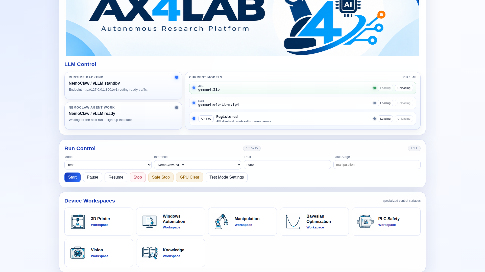

| 작업 | 워크스페이스 | 따라 할 문서 |
|---|---|---|
| 출력 설정·슬라이싱·전송 | 3D Printer, `/printer` | [프린터 실습](device_workspace_3dp_usage.ko.md) |
| 포트·녹화·롤아웃 | Manipulation, `/lerobot` | 아래 실습 3–4 |
| UTM 카메라·ROS | Vision, `/device-bridge/vision-utm` | [비전 실습](device_workspace_vision_camera_bridge_usage.ko.md) |
| Windows 브릿지·Skills | Windows Automation, `/equipment/windows` | 실습 5 |
| BO 설정 | Bayesian Optimization, `/bo` | 실습 6 |
| 장비 인터록 | PLC Safety, `/plc` | [PLC 브릿지](../../system/device_bridges/plc_safety_bridge.md) |
| 축적 지식 | Knowledge, `/knowledge` | 실습 7 |

**완료 확인:** 다른 장비 동작을 시작하지 않고 기존 Live 런으로 돌아올 수 있습니다.
페이지를 연 것은 에이전트 단계 완료가 아닙니다.

## Exercise 2 — 가상 테스트에서 실제 장비로 전환하기

**목표:** 새 런을 시작하기 전에 물리 실행 범위를 정합니다.

1. Main의 **Test Mode Settings**를 엽니다.
2. **Installed Printer**, **Physical Print**를 비교합니다.
3. 각 에이전트 경계, 출력 본문·냉각, 자동 배출을 확인합니다.
4. 사용할 프로필만 저장하고 다시 읽어 확인합니다.
5. Live에 `테스트 모드, 실제 프린터` 또는 `테스트 모드, 실제 출력`으로
   선택한 경로를 명시합니다.

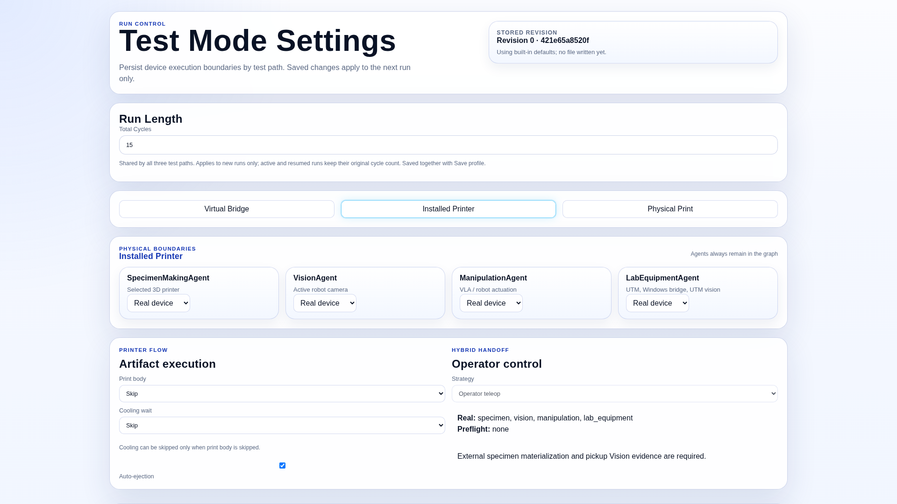

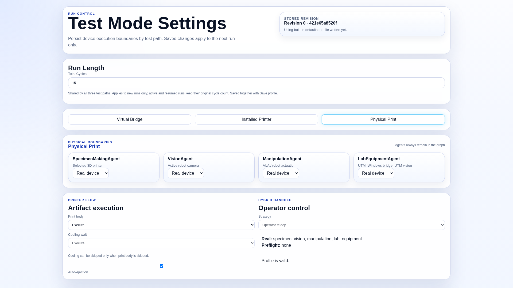

**완료 확인:** 승인된 계약과 선택 프로필이 같습니다.
Installed Printer는 dry-run이 아닙니다. 배출 및 이후 실제 장비를 작동시킬 수
있습니다. 시편을 직접 공급한다면 현재 확인 요청에 따라 실제로 놓거나 치운 뒤
응답합니다. Physical Print는 전체 출력 경로를 사용합니다.

실제 프린터 경로 통과만으로 첫 층 접착·전체 출력 시간·노즐 정리가 검증되지는
않습니다. 실제 출력은 별도 현장 감독하에 검증합니다. 프로필 변경은 다음
승인 런부터 적용됩니다. 상세는 [Test Mode](../../system/runtime/test_mode.md)를 봅니다.

## Exercise 3 — 로봇 포트 설정과 데모 한 편 녹화하기

**목표:** 녹화·학습·실험 실행을 혼동하지 않고 식별 가능한 로컬 데모를 만듭니다.

1. **Manipulation → Profile**에서 사용할 로봇 프로필을 선택합니다.
2. **2. Device Port Setup**을 펼쳐 follower·leader·카메라 저장값을 확인합니다.
3. 설정이 필요하면 대상 장치에서 **Baseline → ID Detect & Save** 순으로 화면
   안내를 따릅니다. 수동 설정은 **Manual Port Override**의 역할/카메라 key를
   고른 뒤 **Save Manual Port**를 사용합니다. 저장·장치 탐색 작업입니다.
4. 동작 전에 [LeRobot 브릿지](../../system/device_bridges/lerobot_bridge.md)에 따라
   캘리브레이션과 카메라 점유 상태를 확인합니다.

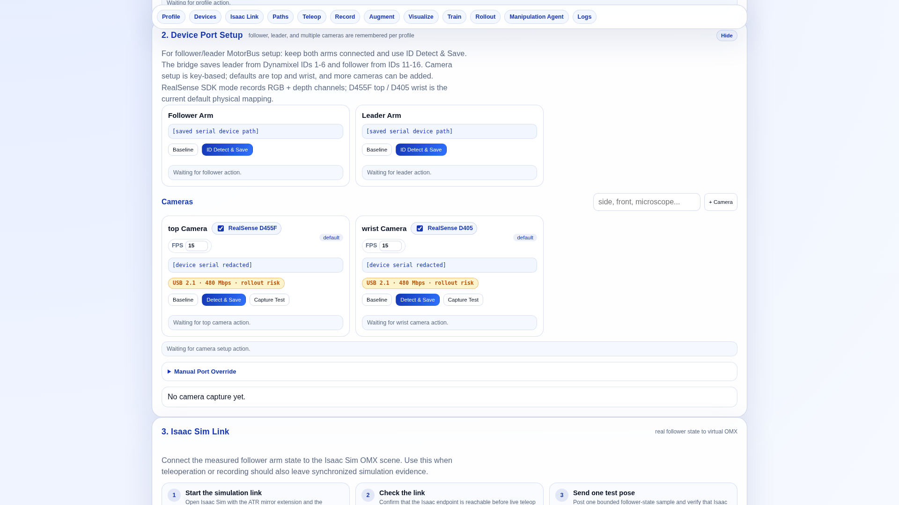

5. **4. Local Paths**에 dataset root와 dataset repo ID/local name을 지정합니다.
   새 녹화는 새 데이터셋 이름을 사용합니다. **Resume dataset**은 호환되는
   기존 데이터셋에만 사용하며, 폴더 삭제가 resume 방법은 아닙니다.
6. **6. Recording**에서 **Task Instruction**, **Episodes**,
   **Episode Time (s)**, **Reset Time (s)**를 입력합니다.
   첫 감독 실습은 한 에피소드로 진행합니다.
7. 로봇 동작 범위를 비운 뒤 **Start Record**를 누릅니다.

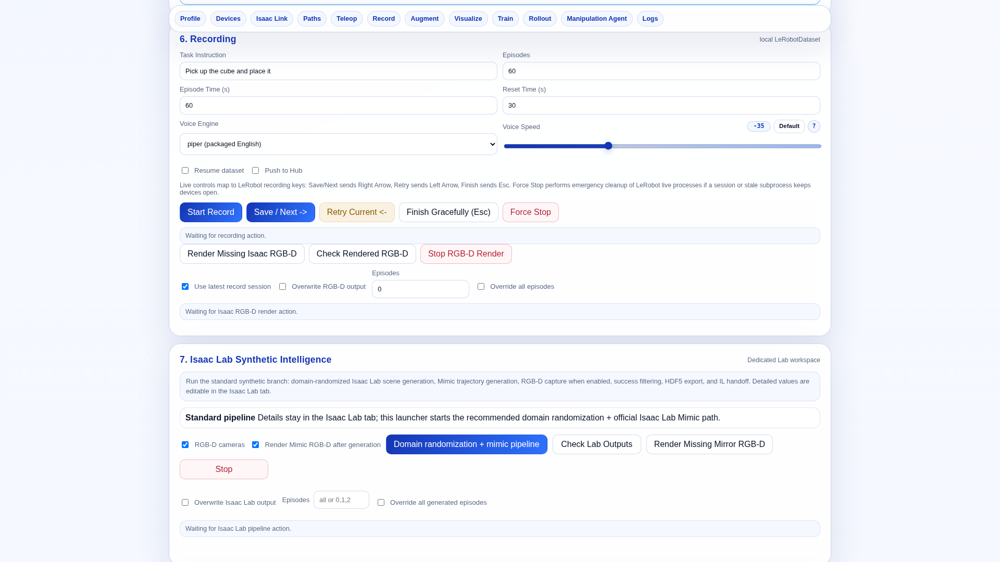

8. **Save / Next →**는 수락, **Retry Current ←**는 현재 에피소드 재시도,
   **Finish Gracefully (Esc)**는 정상 종료입니다.
   **Force Stop**은 비상 정리이며 일반 저장 버튼이 아닙니다.
9. 학습 전에 동작 상태·로그와 데이터셋 저장 결과를 확인합니다.

**완료 확인:** 원하는 경로에 카메라·관절 채널을 가진 에피소드가 저장됩니다.
프로세스가 실행됐다는 것만으로 녹화 성공은 아닙니다.
실패하면 세션 로그·포트·캘리브레이션·데이터셋 이름을 봅니다.
다른 세션이 점유한 장치 재연결이나 캘리브레이션 삭제로 해결하지 않습니다.

## Exercise 4 — 단독 인퍼런스와 에이전트 설정 구분하기

**목표:** 다른 경로의 저장 버튼을 눌러 설정이 안 바뀌는 혼동을 피합니다.

1. 감독하의 단독 시험은 **10. Inference / Rollout**에서 설정합니다.
2. 체크포인트·task·action rate를 확인합니다.
3. 선형 보간과 RTC 사용 여부를 명시합니다. 보간 출력 Hz는 정책/action FPS와
   별개이며 입력 rate보다 낮으면 안 됩니다. GUI 상한은 100 Hz입니다.
4. **Save Rollout Defaults**로 저장합니다. 주변이 안전할 때만 실행합니다.

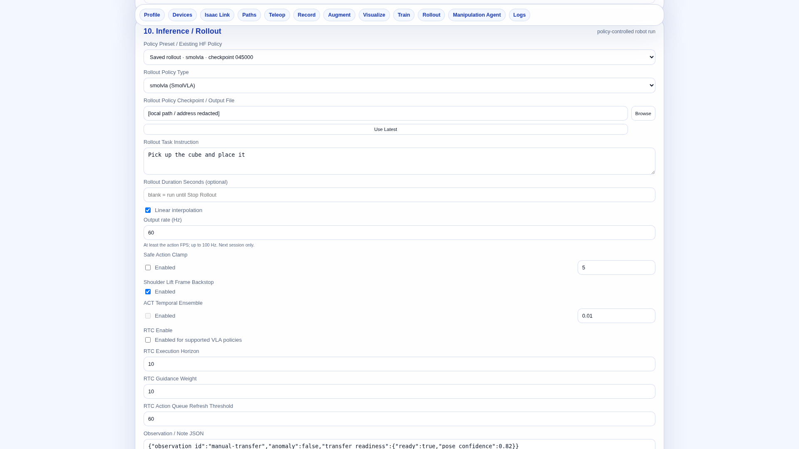

5. 루프에 사용할 값은 **11. Manipulation Agent Bridge**에서 설정합니다.
6. 해당 task를 선택하고 그 task의 정책·rate·옵션을 확인한 뒤
   **Save Task Defaults**를 누릅니다. 단독 설정 저장을 에이전트 task 저장과
   동일하게 취급하지 않습니다.

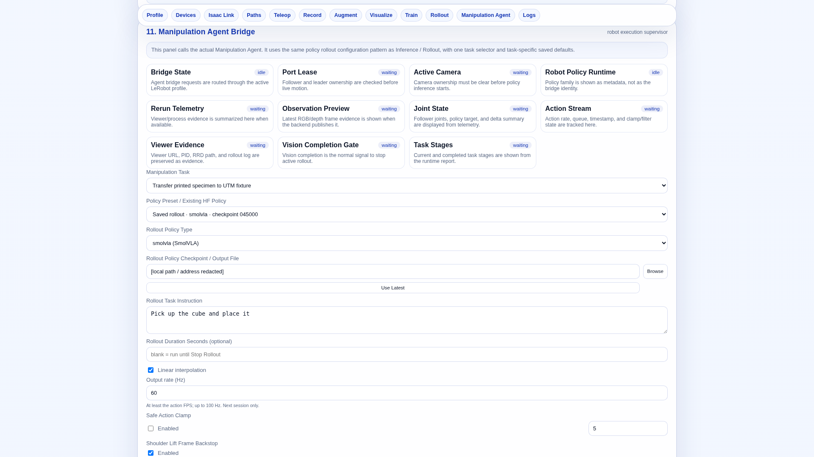

**완료 확인:** 다음 세션의 task별 저장값이 의도와 일치합니다.
실행 중 MAN의 telemetry·policy tracking·산출물을 확인합니다.
3D 로봇이 보이는 것만으로 파지/배치 성공이 아닙니다.
루프가 MAN을 사용 중일 때 단독 롤아웃을 중복 실행하지 않습니다.

## Exercise 5 — Windows/UTM 자동화 준비하기

**목표:** 실행 승인 전에 실제 대상 화면과 장비 순서를 확인합니다.

1. **Windows Automation**에서 브릿지·worker 연결을 확인합니다.
2. 수신 화면이 로그인·업데이트·다른 창이 아닌 의도한 UTM 앱인지 확인합니다.
   장비 운영자와 조율합니다.
3. 사용할 Skills와 증거를 읽습니다. 화면을 채우려는 목적으로 실행하지 않습니다.

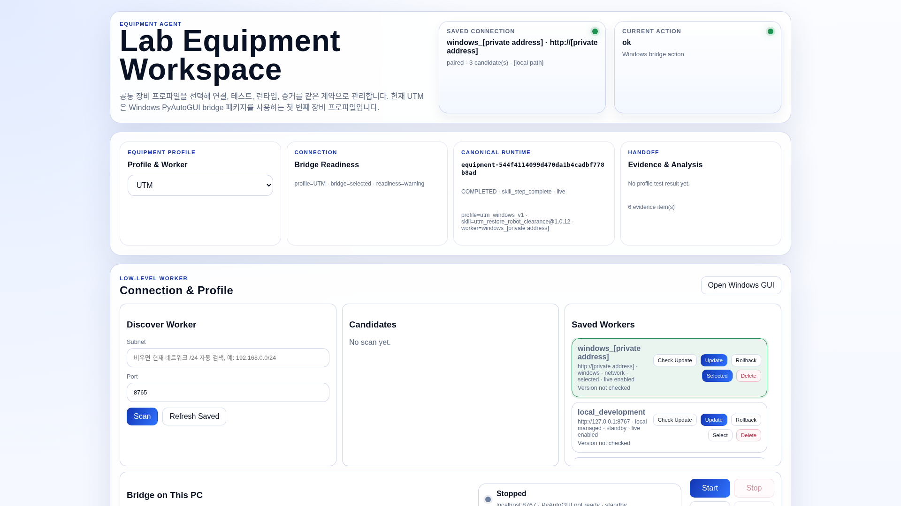

4. `/equipment/agent-manager`에서 **Equipment Flow**와 프로필을 확인합니다.
5. Skill 순서·Vision slot을 사용할 메소드와 대조합니다.
   [Equipment Agent](../../system/agents/equipment_agent.md),
   [Windows 브릿지](../../system/device_bridges/windows_pyautogui_bridge.md)를 따릅니다.
   실패한 동작을 건너뛰려고 실행 중 flow를 편집하지 않습니다.

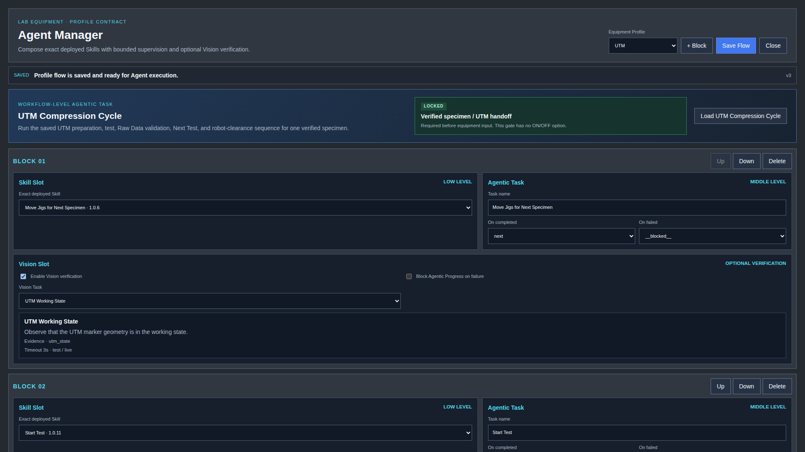

**완료 확인:** worker·화면·메소드·flow가 맞고 EQP 진입 전 현재 관측 근거가
이번 런에 연결됩니다. 연결 표시가 초록이라고 압축·높이 복귀 완료는 아닙니다.

## Exercise 6 — 한 후보를 설계부터 BO까지 추적하기

**목표:** 서로 다른 사이클의 결과를 섞지 않습니다.

1. Live의 **DSN → Report**에서 후보 ID, cell size, wall thickness,
   형상 파일, 제약 결과를 기록합니다.
2. **ANL → Report**에서 선택 사이클·SS/FD 축과 단위·원본 CSV·SEA 질량
   출처·실제 적분/strain 근거를 확인합니다.
3. **BO → Report**에서 목적함수·최대화/최소화·관측 개수를 확인합니다.
4. GP가 있으면 2D/3D 평균·불확실성·획득함수·다음 후보를 봅니다.

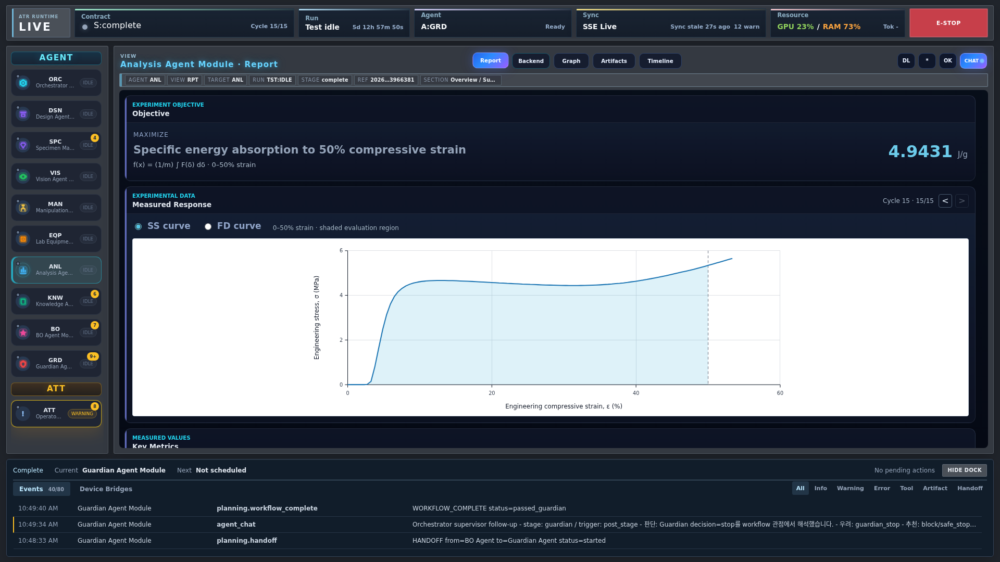

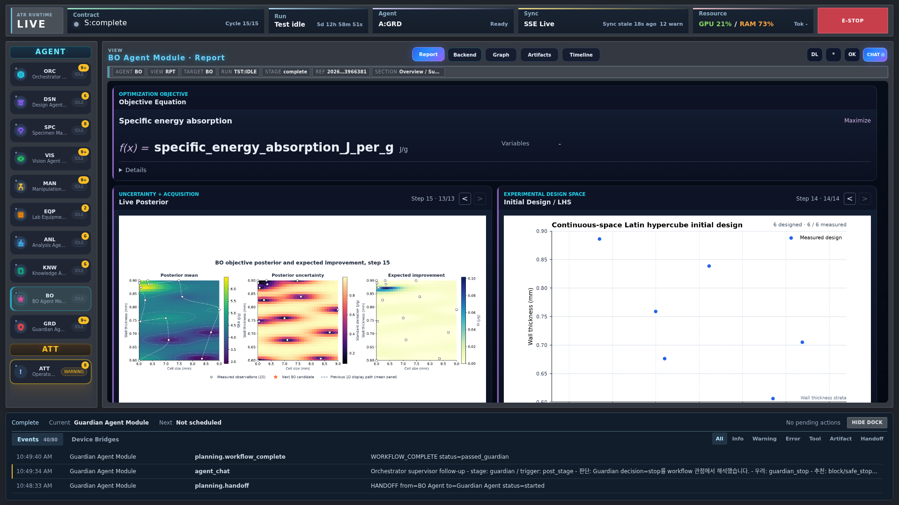

**완료 확인:** 설계 → 원본 측정 → 분석 물성 → BO 관측이 같은 ID로 이어집니다.
슬라이싱 전 질량 공란은 미확인이며 이후에는 분석에 사용된 기록값을 사용합니다.
다른 형상 추정치로 대체하지 않습니다. 추천 후보는 이미 실험한 시편이 아닙니다.
초기 LHS 단계에 GP가 없는 것은 정상일 수 있습니다.
[ANL](../../system/agents/analysis_agent.md), [BO](../../system/agents/bo_agent.md)를 참고합니다.

## Exercise 7 — 축적 지식의 출처 확인하기

1. **Knowledge → Wiki**를 엽니다.
2. 글을 선택하고 출처·적용 범위를 읽습니다.
3. **Source Library**로 원문 출처를 봅니다.
   Memory·Agent Delivery는 별도 조회 화면이지 추가 물리 센서가 아닙니다.

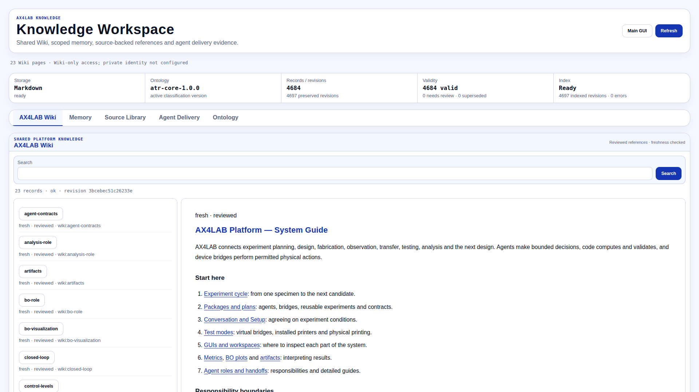

**완료 확인:** 과거 정보·절차 설명·현재 실험 근거를 구분할 수 있습니다.
Wiki의 문장이 오늘의 장비 실행을 증명하지 않습니다.
Private 화면은 권한이 필요하며 401을 우회하지 않습니다.
[Knowledge 운영](../../system/knowledge/markdown_memory_operations.ko.md)을 참고합니다.

## Exercise 8 — 같은 런을 진단하고 재개하기

1. run ID·cycle·agent와 정확한 미해결 사유를 기록합니다.
2. 해당 에이전트의 **Timeline**, **Artifacts**, 필요시 **Backend**를 봅니다.
3. 실제 원인인 연결·입력·물리 상태를 수정하며 현재 근거를 보존합니다.
4. 런타임이 복구를 제공하면 기존 **Resume**을 사용합니다.
5. 같은 run ID·의도한 재개 지점·새 근거를 확인합니다.

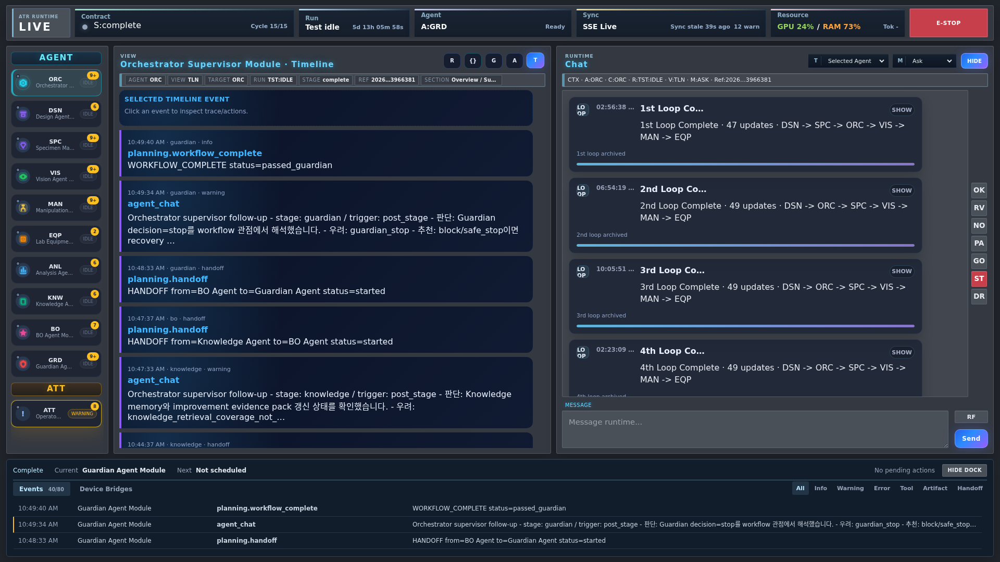

**완료 확인:** 완료 플래그를 복사한 새 런이 아니라 기존 런의 복구로 기록됩니다.
Resume은 복구 가능한 단계를 반복할 수 있으므로 물리 동작 exactly-once를
무조건 보장하지 않습니다. 동작 승인 전에 요청 경로·실제 장비 상태를 봅니다.
과거 실패 기록 삭제, PLC 무조건 해제, Start를 Resume처럼 쓰는 행동은 피합니다.
[런타임 흐름·복구](../../system/runtime/closed_loop_and_pages_reference.md)를 참고합니다.

## Exercise 9 — 읽기 전용 다시보기 열기

1. Main에서 **Mode = replay**를 고릅니다.
2. **Experiment session → Start**로 새 창을 엽니다.
3. Contract 영역의 시점 선택을 사용합니다.
4. 좌우 키는 저장 시점, 상하 키는 존재하는 사이클 사이를 이동합니다.
   텍스트/select 입력 중에는 방향키를 가로채지 않습니다.

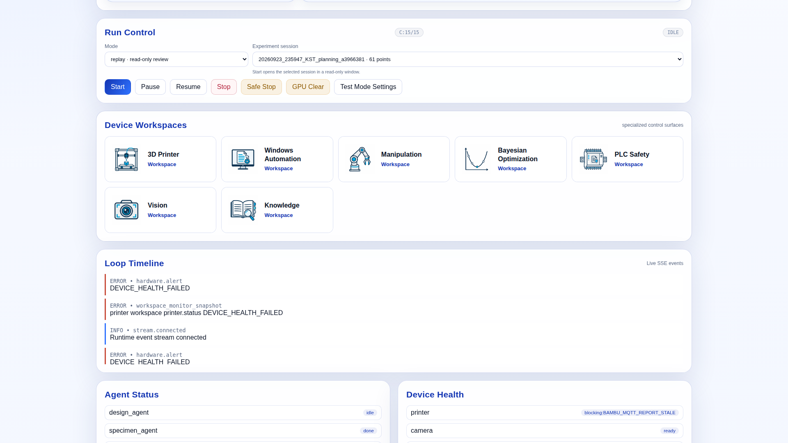

**완료 확인:** **REPLAY** 표시와 선택 run/cycle/point가 바뀌고 장비 동작은 없습니다.
없는 스냅샷을 새 카메라 촬영으로 채우지 않습니다.
파일은 선택 시점 이후에 생성됐을 수도 있으므로 시점 근거와 일반 보관 파일을
구분합니다. [Replay](../gui/run_replay.md)를 참고합니다.

## Exercise 10 — 루프를 바꾸지 않고 런타임 구조 살펴보기

1. `/ide`에서 graph와 node/module 설정을 읽습니다.
2. 연결 계약과 관련 실행 근거를 찾아봅니다.
3. 별도의 개발 작업에서만 draft validation/compile/dry-run 후 저장 버전 적용을
   진행합니다. 이 실습에서는 편집본을 활성화하지 않습니다.

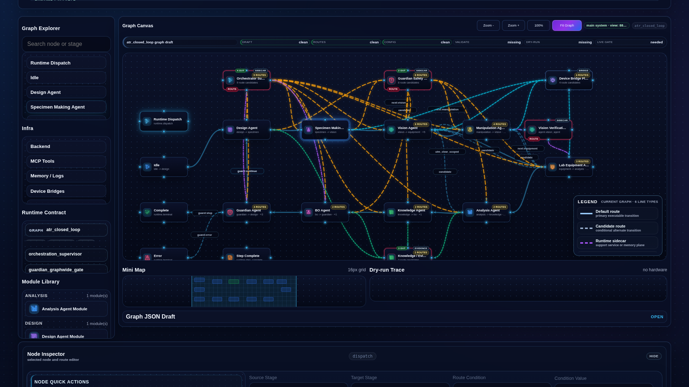

**완료 확인:** UI 리포트·모듈 구현·패키지 연결 계약·실행 graph를 구분합니다.
화면 표시 정보 변경이 장비 권한을 부여하지 않습니다.
[Runtime IDE](../../system/runtime/runtime_ide.md), [모듈화](../../system/modularity.md),
[Module Management 화면](../../system/runtime/gui/visual_structure.md)을 참고합니다.

## 완료 체크와 추가 문서

- 새 런 전에 물리 실행 범위를 선택할 수 있습니다.
- 프린터·단독 롤아웃·에이전트 task별 저장 버튼을 구분합니다.
- 한 후보의 원본 근거와 보관 파일을 찾을 수 있습니다.
- Resume, 새 Start, 읽기 전용 Replay를 구분합니다.
- 과거 스크린샷을 현재 물리 증거로 사용하지 않았습니다.

보관할 때 `runs/<run-id>/`와 참조 산출물을 함께 유지합니다.
`memory/`의 연결·설정에는 비밀정보가 있을 수 있으므로 공개 첨부하지 않습니다.

개발 환경·테스트·기여 절차는 [CONTRIBUTING](../project/CONTRIBUTING.md),
전체 화면 지도는 [GUI 구조](../../system/runtime/gui/visual_structure.md)를 참고합니다.
