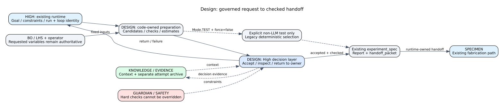

# Design Agent — Specifications and Candidate Review

## Runtime decision reference

Design reviews the supplied candidate and manufacturing evidence. The current validated request owns coordinates, parameter bounds, fixed conditions and required checks. Documentation examples are not candidate inputs, test results or additional constraints.

## Overview

Design (DSN) turns experiment requests and BO coordinates into a checked specimen specification. Code prepares candidates, checks and geometry; the LLM chooses further checks, acceptance or owner review from supplied evidence. Acceptance is neither fabrication success nor validated performance prediction.

## Inputs and outputs

Inputs are objectives, constraints, fixed material/geometry settings, and BO's requested parameters and parameter space. Outputs are the experiment specification, design candidate and handoff packet consumed by Specimen Making.

Coordinates retain their precision: a requested cell size of 7.13789 mm must not become 7 mm for display convenience. Out-of-range values and manufacturing violations are rejected with reasons, not silently adjusted.

## Reading the report

| Section | Meaning |
|---|---|
| Design Space | Requested variables, ranges and fixed conditions |
| Candidate Comparison | Available evidence for comparing candidates |
| Constraint Checks | Compliance and missing evidence |
| Handoff | Exact specification for fabrication |

Historical scores remain historical evidence, not measured performance or physical validation of the current candidate. Suitability checks and measured objective evaluation are separate stages.

## Internal structure

High covers LLM decisions. Middle covers candidate generation, checks, previews and handoffs. There is no direct-device Low task. Runtime IDE explains the same execution definition; CODE boxes are not additional execution stages.

[Design reference](../../agents/design_agent.md), [BO role](bo-role.md), [Specimen Making role](specimen-role.md).
