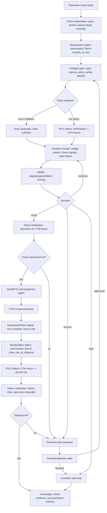

# 04. Manipulation Agent 고도화안 - Pi0.5 VLA + SARM Agentic Loop

작성일: 2026-05-28
대상: `agents/manipulation_agent.py`, `device_bridges/lerobot_bridge.py`, `submodules/sarm/*`, LeRobot GUI, LangGraph orchestration

## 1. 결론

현재 방향인 "Pi0.5 기반 inference + SARM으로 작업 단계 관리"는 큰 방향은 맞다. 다만 설계 경계는 조금 바꾸는 것이 좋다.

권장 구조는 다음과 같다.

1. Pi0.5는 agentic planner가 아니라 bounded low-level VLA policy executor로 둔다.
2. Manipulation Agent와 LangGraph가 작업 단계, 안전 게이트, 재시도, 장비 handoff를 관리한다.
3. SARM은 로봇을 직접 제어하는 controller가 아니라 progress/risk/reward supervisor로 둔다.
4. Guardian Agent가 SARM의 failure precursor와 Vision anomaly를 보고 recover/stop 권한을 가진다.
5. LeRobot bridge는 계속 단일 실행 경계로 둔다. Manipulation Agent가 shell command를 직접 만들면 안 된다.

즉 최종 형태는 다음이다.

```text
LangGraph/Manipulation Agent = supervisor
Pi0.5/LeRobot rollout        = bounded motor policy
Vision Agent                 = perception signal bus
SARM                         = stage-aware progress/risk/reward model
Guardian                     = stop/recover authority
Knowledge                    = rollout evidence + failure/success memory
```

이렇게 두면 "완전 자율 실험실" 목표에 맞게 로봇 조작을 자동화하면서도, VLA의 불확실성을 agent loop가 흡수할 수 있다.

추가로 현재 Manipulation Agent가 맡아야 하는 실제 조작 task는 하나의 long-horizon VLA inference로 묶지 말고, 다음 두 개의 bounded short task로 나누는 것을 권장한다.

```text
Task A: 3DP output/basket에서 specimen을 집어서 UTM fixture datum에 올리기
Task B: UTM test 완료 후 fixture에서 specimen을 빼서 discard bin에 버리기
```

전체 실험 목표는 LangGraph가 long-horizon으로 관리하고, Pi0.5 inference는 Task A와 Task B를 각각 짧고 검증 가능한 manipulation skill로 실행하는 구조가 더 안정적이다. Task A의 마지막 자세는 Task B와 UTM 장비 동작을 방해하지 않도록 `standby/retreat pose`로 끝내는 것이 좋다.

## 2. 조사 요약

### 2.1 실제 VLA 운용 방식

VLA 모델은 보통 다음 방식으로 실사용된다.

- 자연어 task + 카메라 관측 + robot state를 입력으로 받고, robot action 또는 action chunk를 출력한다.
- long-horizon 전체 계획을 VLA 하나에 맡기기보다, 상위 planner가 하위 skill/policy를 호출하는 구조가 안정적이다.
- target robot, camera view, action schema, control frequency가 맞지 않으면 base model만으로는 성공률을 기대하기 어렵다.
- 실제 현장에서는 target domain demonstration을 수집하고, 그 데이터로 fine-tuning하거나 LoRA/RA-BC 같은 방식으로 적응시킨다.

근거:

- RT-2는 vision-language model을 robot trajectory data와 co-fine-tune해서 관측을 action으로 매핑하는 VLA 패러다임을 제시했다. 출처: [RT-2 arXiv](https://arxiv.org/abs/2307.15818)
- OpenVLA는 인터넷 규모 vision-language data와 970k robot demonstrations 기반 VLA이며, 새 환경 적용에는 fine-tuning이 핵심이라고 설명한다. 출처: [OpenVLA arXiv](https://arxiv.org/abs/2406.09246), [OpenVLA GitHub](https://github.com/openvla/openvla)
- SayCan은 LLM의 고수준 의미 지식과 low-level skill/value function을 결합해, 물리적으로 가능한 행동으로 grounding하는 구조를 제시했다. 이 구조가 우리 Manipulation Agent 설계와 잘 맞는다. 출처: [SayCan arXiv](https://arxiv.org/abs/2204.01691)

### 2.2 Pi0.5의 의미

Pi0.5는 Physical Intelligence의 VLA 계열 모델로, heterogeneous data co-training을 통해 open-world generalization을 목표로 한다. 중요한 점은 Pi0.5가 고수준 subtask prediction과 저수준 continuous action을 함께 다루지만, 실사용에서는 여전히 robot embodiment, camera setup, dataset 품질, fine-tuning이 중요하다는 것이다.

우리 환경에서 Pi0.5를 쓰는 해석은 다음이 가장 안전하다.

```text
Task A: "3DP output area에서 specimen을 집고 UTM fixture datum에 놓기"
Task B: "UTM test가 끝난 specimen을 fixture에서 빼서 discard bin에 버리기"
라는 두 개의 bounded task instruction을 Pi0.5 policy rollout으로 각각 실행한다.
```

Pi0.5에게 전체 실험 계획, UTM test 대기, 실패 판정, 장비 handoff, recovery 정책까지 맡기면 안 된다. 그 부분은 LangGraph와 agent들이 맡아야 한다.

근거:

- Pi0.5 논문/블로그는 heterogeneous robot data, web data, subtask labels, language instruction data를 함께 써서 generalization을 얻는다고 설명한다. 출처: [Physical Intelligence Pi0.5 blog](https://www.pi.website/blog/pi05), [Pi0.5 paper PDF](https://www.physicalintelligence.company/download/pi05.pdf), [Pi0.5 arXiv](https://arxiv.org/abs/2504.16054)
- OpenPI는 Pi0.5 base checkpoint를 fine-tuning base로 제공하며, expert checkpoints도 target robot에서 fine-tuned된 것이라고 명시한다. 출처: [OpenPI GitHub](https://github.com/Physical-Intelligence/openpi)
- LeRobot의 Pi0.5 문서는 `policy.type=pi05`, `lerobot/pi05_base`, training command, relative action, dataset stats를 전제로 한다. 출처: [LeRobot Pi0.5 docs](https://huggingface.co/docs/lerobot/pi05)

### 2.3 Pi0.5/flow policy inference에서 RTC가 중요한 이유

Pi0.5류 flow-matching VLA는 단일 action이 아니라 action chunk를 만든다. 모델이 큰 만큼 inference latency가 생기고, chunk 간 불연속이 로봇 동작을 흔들 수 있다. 그래서 LeRobot은 RTC(Real-Time Chunking)를 제공한다.

우리 코드가 이미 `rollout_inference_type=rtc`, `rollout_rtc_execution_horizon`, `rollout_rtc_max_guidance_weight` 필드를 지원하고 있는 것은 좋은 방향이다.

적용 원칙:

- Pi0.5 rollout 기본값은 `inference.type=rtc`로 둔다.
- 초기 live rollout은 `rollout_action_clamp=true`, `rollout_max_relative_target=5`를 유지한다.
- continuous rollout은 operator stop 또는 SARM/Guardian stop signal과 결합한다.
- Vision Agent가 물체 이탈, 충돌 위험, 목표 위치 도달을 감지하면 Manipulation Agent가 rollout을 중단하거나 다음 stage로 넘긴다.

근거:

- LeRobot RTC 문서는 Pi0, Pi0.5, SmolVLA 같은 large flow-matching policy가 chunk를 생성하며, RTC가 다음 chunk를 비동기 생성하고 이전 chunk와 부드럽게 맞춘다고 설명한다. 출처: [LeRobot RTC docs](https://huggingface.co/docs/lerobot/en/rtc)
- LeRobot rollout 문서는 `lerobot-rollout`이 trained policy를 실제 로봇에 deploy하는 단일 CLI이며, base/sentry/highlight/dagger 전략과 RTC backend를 제공한다고 설명한다. 출처: [LeRobot Policy Deployment docs](https://huggingface.co/docs/lerobot/main/inference)

### 2.4 SARM의 올바른 역할

SARM은 Stage-Aware Reward Modeling이다. long-horizon manipulation에서 task stage와 stage 내부 progress를 예측하고, demonstration 품질이 섞여 있을 때 좋은 구간에 높은 weight를 주는 데 쓴다.

따라서 "SARM으로 가중치를 받아서 작업 단계를 관리"한다는 방향은 다음처럼 바꾸면 좋다.

좋은 해석:

- SARM이 `pre_grasp -> grasp -> lift -> transfer -> place -> release -> retreat -> verify` 단계별 progress를 예측한다.
- SARM이 `failure_precursor`, `recovery_suggested`, `progress_delta`를 Manipulation Agent와 Guardian에 제공한다.
- SARM progress를 offline에서 RA-BC weight로 써서 Pi0.5/ACT policy fine-tuning 품질을 올린다.
- live에서는 SARM을 "advisory signal"로 시작하고, 충분히 검증된 뒤에 stop/retry gate에 반영한다.

피해야 할 해석:

- SARM weight가 직접 robot actuator command를 조절한다.
- SARM이 live 고주파 control loop에서 매 step command를 덮어쓴다.
- SARM이 Guardian 없이 recovery motion을 자동 실행한다.

근거:

- LeRobot SARM 문서는 SARM이 video-based reward model이며 progress signal을 예측하고 RA-BC나 RL에 쓸 수 있다고 설명한다. 출처: [LeRobot SARM docs](https://huggingface.co/docs/lerobot/sarm)
- SARM 논문은 long-horizon/contact-rich task에서 stage와 fine-grained progress를 함께 예측하고, RA-BC로 demonstration을 filtering/reweighting한다고 설명한다. 출처: [SARM arXiv](https://arxiv.org/abs/2509.25358)

## 3. 현재 로컬 코드 진단

### 3.1 이미 잘 잡혀 있는 부분

현재 코드에는 Manipulation Agent 고도화를 위한 중요한 기반이 이미 있다.

- `agents/manipulation_agent.py`
  - `pi05_lerobot_policy` 전략이 있다.
  - specimen이 ready이면 기본적으로 Pi0.5 rollout을 선택한다.
  - `lerobot.rollout.start`를 통해 LeRobot bridge를 호출한다.
  - `policy_type=pi05`, `device=cuda`, `camera_enabled=true`, `continuous_rollout`, `rollout_action_clamp`, `rollout_temporal_ensemble`, `rollout_inference_type`, RTC field를 payload로 전달한다.
  - `manipulation`, `sarm`, `protocol_note` output contract가 이미 있다.

- `device_bridges/lerobot_bridge.py`
  - live/test 모드 gate가 있다.
  - live rollout에는 실제 policy path/checkpoint/repo가 필요하다.
  - Pi0.5면 `--policy.type=pi05`, `--inference.type=rtc`, `--strategy.type=base`, `--device=<device>`를 붙인다.
  - action clamp, temporal ensemble, RTC parameter를 bridge에서 명령으로 변환한다.
  - Pi0.5 train/rollout은 `lerobot-pi05` conda env와 `HF_HOME=/home/jin/.cache/huggingface_pi05` 쪽으로 분리되어 있다.

- `configs/lerobot.yaml`
  - `pi05_conda_env_name: lerobot-pi05`
  - `pi05_repo_root: /home/jin/lerobot_pi05`
  - `pi05_hf_home: /home/jin/.cache/huggingface_pi05`
  - `pi05_base_policy: lerobot/pi05_base`
  - `robotis_omx_ai` profile과 fake profile이 있다.

- `docs/runtime/lerobot_dataset_policy_naming.md`
  - Pi0.5 dataset v3.0 변환 규칙, rollout dataset naming, continuous rollout, action clamp 정책이 정리되어 있다.

- `agents/guardian_agent.py`
  - `latest_analysis["sarm"]`의 failure precursor와 recovery signal을 읽어 stop/recover/retry 결정을 내린다.

### 3.2 현재 한계

지금 Manipulation Agent는 구조는 있지만 아직 "자율 실험실급 조작 루프"는 아니다.

주요 한계:

1. SARM이 실제 learned reward model이 아니다.
   - 현재 `submodules/sarm`은 `grasp_score`, `anomaly`, `retry_count` 기반 deterministic scorer다.
   - stage-aware progress, subtask annotation, RA-BC weight 계산이 아직 없다.

2. policy rollout이 stage machine으로 쪼개져 있지 않다.
   - 지금 stage는 거의 `policy_rollout` 하나다.
   - 실제 조작은 `preflight -> approach -> grasp -> lift -> transfer -> place -> release -> verify`로 나뉘어야 한다.

3. closed-loop monitoring이 약하다.
   - `lerobot.rollout.start` 결과를 받는 구조는 있으나, 중간 상태를 Vision/SARM/Guardian이 구조적으로 평가하는 loop가 부족하다.

4. 성공 판정이 약하다.
   - `response.ok`와 fake `grasp_score=0.86`만으로는 UTM fixture에 정확히 놓였는지 알 수 없다.
   - Vision Agent의 post-place verification이 필요하다.

5. dataset/evidence loop가 약하다.
   - 성공/실패 video, step trace, SARM score, Vision signal을 Knowledge Agent가 재학습 자산으로 저장해야 한다.

6. live readiness report가 부족하다.
   - 실제 live 실행 전 policy checkpoint, camera map, robot profile, dataset schema, operator confirm, action clamp, RTC 상태가 한눈에 보여야 한다.

## 4. 우리 환경 기준 가능 범위

### 4.1 지금 바로 가능한 것

현재 코드와 GUI 구조에서 바로 설계 가능한 범위:

- `manipulation_report` 스키마 추가
  - policy plan
  - preflight result
  - rollout runtime
  - stage machine
  - SARM state
  - Vision signal input
  - Guardian handoff
  - dataset/evidence payload

- SARM-lite 확장
  - 현재 deterministic scorer를 stage-aware wrapper로 감싼다.
  - learned SARM이 없더라도 stage별 progress/risk field를 먼저 만든다.
  - GUI와 Guardian이 같은 field를 보게 만든다.

- Pi0.5 preflight gate 강화
  - `profile_id`, `policy_type=pi05`, `policy_path/repo/checkpoint`, `camera_enabled`, `device`, `runtime_mode`, `confirm_live_execute`, `rollout_action_clamp`, `RTC` 상태를 검사한다.

- LeRobot bridge path 유지
  - Manipulation Agent는 계속 `lerobot.rollout.start`만 호출한다.
  - shell command 생성/검증은 bridge에서만 한다.

- GUI live report 개선
  - 현재 실행 중인 task instruction, policy, robot profile, stage, SARM risk, Vision anomaly, stop/recover hint를 표시한다.

- test mode loop 강화
  - fake `lerobot.rollout.start`를 계속 쓰되, fake step trace를 stage별로 풍부하게 만든다.
  - 실제 live 없이도 LangGraph/GUI/Guardian handoff를 검증한다.

### 4.2 Linux/LeRobot runtime 준비 후 가능한 것

다음은 Linux 환경과 실제 LeRobot/Pi0.5 runtime이 준비되면 가능하다.

- `/home/jin/lerobot_pi05` + `lerobot-pi05` env에서 Pi0.5 inference 실행
- `lerobot/pi05_base` 또는 fine-tuned checkpoint prefetch
- ROBOTIS OMX follower/leader/camera identity 저장
- real camera observation 기반 rollout
- Pi0.5 v3.0 dataset 변환 및 fine-tuning
- rollout/eval dataset 저장
- SARM training dataset 구성
- SARM progress를 RA-BC weight로 계산한 뒤 Pi0.5/ACT policy training에 반영

### 4.3 지금 바로 하면 안 되는 것

- Pi0.5 base만으로 `3DP output -> UTM fixture` transfer가 바로 안정적으로 될 것이라고 가정하는 것
- SARM learned weight가 있다고 가정하는 것
- SARM이 직접 actuator-level controller가 되는 것
- Vision Agent 검증 없이 `handoff_status=ready_for_equipment_agent`를 확정하는 것
- Guardian/operator gate 없이 live recovery motion을 자동 실행하는 것
- LangGraph가 고주파 servo loop처럼 로봇 action을 매 프레임 수정하는 것

## 5. 권장 Agentic Loop

### 5.1 전체 흐름

실험실 관점에서는 long-horizon workflow지만, VLA inference 관점에서는 `transfer_to_utm`과 `clear_utm_to_disposal` 두 개의 short task로 쪼갠다. 중간에 Lab Equipment Agent가 UTM test를 수행하므로, 하나의 VLA rollout이 기다렸다가 다음 동작까지 이어가는 구조는 피한다.



### 5.2 Manipulation Agent 내부 subgraph

현재 `graphs/modules/manipulation/module.yaml`의 internal graph를 다음처럼 확장하는 것이 좋다.

```text
1. resolve_transfer_task
2. collect_vision_and_specimen_context
3. validate_policy_profile_and_live_gates
4. select_policy_backend
5. start_bounded_rollout
6. monitor_rollout_events
7. score_sarm_stage_progress
8. request_post_place_vision_verification
9. decide_recover_stop_or_handoff
10. package_manipulation_report
11. store_rollout_evidence
```

핵심은 `start_bounded_rollout` 이후에 바로 성공 처리하지 않는 것이다. Task A는 Vision/SARM/Guardian 검증 후 Lab Equipment Agent로 넘기고, Task B는 UTM 완료 신호를 받은 뒤 별도 rollout으로 실행해야 한다.

## 6. Pi0.5 적용 설계

### 6.1 Policy backend 설계

초기에는 backend를 하나로 고정하지 말고, runtime backend field를 두는 것이 좋다.

```json
{
  "policy_backend": "lerobot_cli",
  "policy_type": "pi05",
  "policy_ref": "lerobot/pi05_base or local checkpoint",
  "device": "cuda",
  "inference_type": "rtc",
  "action_clamp": {
    "enabled": true,
    "max_relative_target": 5
  }
}
```

권장 backend:

- `lerobot_cli`: 현재 환경의 기본값. `lerobot.rollout.start` 사용.
- `openpi_server`: 미래 확장. OpenPI remote inference/websocket 구조를 붙일 때 사용.
- `fixed_kinematic`: baseline/fallback.
- `act_policy`: Pi0.5 대비 benchmark용.

OpenPI는 remote inference를 통해 강한 GPU 서버에서 policy를 실행하고 robot 쪽으로 action을 streaming하는 방식을 제공한다. 다만 현재 프로젝트는 이미 LeRobot bridge 중심으로 짜여 있으므로, 처음부터 OpenPI server를 직접 붙이기보다 `policy_backend` field만 열어두는 편이 좋다.

근거: [OpenPI GitHub - remote inference/fine-tuning](https://github.com/Physical-Intelligence/openpi)

### 6.2 Task instruction canonicalization

Pi0.5에 넣는 자연어 instruction은 매번 흔들리면 안 된다. 실험실 task는 `task_id`별 canonical template로 고정해야 한다.

권장 Task A template:

```text
Move {specimen_id} from the 3D printer output basket at {source_location}
to the UTM fixture datum at {target_location}.
Approach slowly, grasp the specimen without deforming it, lift clear of the basket,
transfer above the table, place the flat compression face on the fixture datum,
release, retreat, and stop.
```

Task A의 terminal pose는 다음 조건을 만족해야 한다.

- gripper open
- arm is outside the UTM compression path
- camera/vision view is not occluded
- UTM pyautogui/equipment operation에 간섭하지 않음
- Task B를 시작하기 쉬운 standby pose

권장 Task B template:

```text
After the UTM test is complete and the fixture is safe to access,
pick up {specimen_id} from the UTM fixture datum,
move it to the discard bin at {target_location},
release it fully into the bin,
retreat to standby pose,
and stop.
```

Vision Agent가 제공해야 할 context:

```json
{
  "task_id": "transfer_to_utm | clear_utm_to_disposal",
  "pickup_target": {
    "object_id": "specimen-001",
    "pose_estimate": "...",
    "bbox": "...",
    "confidence": 0.91
  },
  "target_fixture": {
    "fixture_id": "utm_fixture",
    "pose_estimate": "...",
    "datum_visible": true
  },
  "transfer_readiness": {
    "printer_ejected": true,
    "basket_has_object": true,
    "compression_flatten_clear": true
  },
  "anomaly": false
}
```

### 6.3 Rollout boundary

Pi0.5 rollout은 무제한 자유 실행이 아니라 bounded execution이어야 한다.

권장 boundary:

- `max_duration_s`: 초기 15-30초
- `continuous_rollout`: GUI/manual stop이 있을 때만 true
- `stage_timeout_s`: stage별 timeout
- `vision_stop_conditions`: object lost, human/hand intrusion, fixture occupied unexpectedly, robot out of safe zone
- `sarm_stop_conditions`: failure precursor >= live stop threshold
- `guardian_stop_conditions`: device unhealthy, operator stop, repeated recovery

현재 bridge는 continuous rollout을 지원하지만, agent loop에서는 stage/verification gate를 더해야 한다.

## 7. SARM 적용 설계

### 7.1 Stage taxonomy

우리 task는 하나의 stage list로 합치지 말고, task별 sparse stage를 분리하는 것이 좋다.

Task A: `transfer_to_utm`

```text
0. preflight
1. approach_source
2. pre_grasp_align
3. grasp
4. lift_clear
5. transfer_to_fixture
6. place_on_datum
7. release
8. retreat
9. post_place_verify
```

Task B: `clear_utm_to_disposal`

```text
0. preflight
1. wait_for_utm_safe
2. approach_fixture
3. pre_grasp_align_tested_specimen
4. grasp_tested_specimen
5. lift_clear_fixture
6. transfer_to_discard_bin
7. release_into_bin
8. retreat
9. verify_fixture_clear_and_discarded
```

SARM-lite는 처음에는 이 stage list를 `task_id`별로 고정하고, Vision/bridge event 기반으로 progress를 추정한다.

나중에 learned SARM을 붙이면 각 stage 내부 tau를 예측한다.

```json
{
  "stage_index": 5,
  "stage_name": "transfer_to_fixture",
  "stage_confidence": 0.82,
  "stage_tau": 0.54,
  "global_progress": 0.61,
  "progress_delta": 0.08,
  "failure_precursor": 0.27,
  "recovery_suggested": false
}
```

### 7.2 SARM input

SARM이 받아야 할 input은 다음이다.

```json
{
  "task_id": "transfer_to_utm",
  "task": "move specimen from 3DP output basket to UTM fixture",
  "video_keys": ["observation.images.top", "observation.images.wrist"],
  "state_key": "observation.state",
  "robot_events": [],
  "vision_signals": {
    "object_present": true,
    "object_in_gripper": true,
    "object_on_fixture": false,
    "anomaly": false
  },
  "bridge_status": {
    "ok": true,
    "status": "POLICY_ACTIVE",
    "step_trace": []
  },
  "retry_count": 0
}
```

### 7.3 SARM output

SARM output은 기존 `sarm` key를 유지하되, 아래 field를 확장한다.

```json
{
  "source": "deterministic_stage_scorer | learned_sarm",
  "reward_model_path": "",
  "stage_index": 5,
  "stage_name": "transfer_to_fixture",
  "stage_confidence": 0.82,
  "stage_tau": 0.54,
  "progress_score": 0.61,
  "progress_delta": 0.08,
  "failure_precursor": 0.27,
  "failure_precursor_score": 0.27,
  "recovery_suggested": false,
  "recovery_hint": "none",
  "recovery_type": "",
  "rabc_weight_hint": 0.91,
  "evidence": {
    "frame_ids": [],
    "episode_index": null,
    "dataset_repo_id": ""
  }
}
```

### 7.4 SARM을 가중치로 쓰는 단계

SARM weight는 세 곳에 써야 한다.

1. Live advisory weight
   - stage progress가 낮고 anomaly가 있으면 recovery suggestion을 높인다.
   - 단, 바로 actuator command를 바꾸지 않는다.

2. Dataset curation weight
   - 실패/성공 episode에서 좋은 progress 구간과 나쁜 구간을 표시한다.
   - Knowledge Agent가 rollout evidence와 함께 저장한다.

3. Policy training weight
   - SARM progress delta를 RA-BC weight로 계산한다.
   - Pi0.5/ACT fine-tuning에서 좋은 demonstration 구간을 더 크게 반영한다.

이 방식이 사용자의 "SARM으로 가중치를 받아서 작업 단계를 관리"하려던 의도와 가장 잘 맞는다.

## 8. Manipulation Report 스키마

현재 output contract는 유지한다.

```json
{
  "manipulation": {},
  "sarm": {},
  "protocol_note": ""
}
```

여기에 GUI/Knowledge용으로 `manipulation_report`를 추가한다.

```json
{
  "manipulation_report": {
    "report_version": "manipulation_pi05_sarm_v1",
    "run_id": "",
    "session_id": "",
    "mode": "test | live",
    "task": {
      "task_id": "transfer_to_utm | clear_utm_to_disposal",
      "task_sequence_index": 1,
      "task_family": "specimen_transfer",
      "canonical_instruction": "",
      "source_location": "3dp_output_area",
      "target_location": "utm_fixture",
      "intended_terminal_pose": "standby_clear_of_utm",
      "specimen_id": "",
      "candidate_id": ""
    },
    "policy_plan": {
      "strategy": "pi05_lerobot_policy",
      "policy_backend": "lerobot_cli",
      "policy_type": "pi05",
      "policy_ref": "",
      "device": "cuda",
      "inference_type": "rtc",
      "continuous_rollout": true,
      "action_clamp_enabled": true,
      "max_relative_target": 5
    },
    "preflight": {
      "status": "pass | warn | fail",
      "profile_id": "robotis_omx_ai",
      "robot_ready": false,
      "camera_ready": false,
      "policy_ready": false,
      "operator_confirmed": false,
      "blocking_reasons": []
    },
    "vision_context": {
      "observation_id": "",
      "pickup_target_ready": false,
      "fixture_visible": false,
      "anomaly": false,
      "signals": {}
    },
    "rollout_runtime": {
      "tool": "lerobot.rollout.start",
      "status": "",
      "command_preview": [],
      "started_at": "",
      "ended_at": "",
      "duration_s": 0,
      "step_trace": [],
      "events": []
    },
    "stage_machine": {
      "task_id": "transfer_to_utm",
      "current_stage": "policy_rollout",
      "completed_stages": [],
      "blocked_stage": "",
      "next_expected_stage": "post_place_verify"
    },
    "sarm": {
      "source": "deterministic_stage_scorer",
      "progress_score": 0.0,
      "failure_precursor": 0.0,
      "recovery_suggested": false,
      "stage_index": 0,
      "stage_name": "",
      "stage_tau": 0.0,
      "stage_confidence": 0.0
    },
    "decision": {
      "handoff_status": "blocked | ready_for_equipment_agent | ready_for_disposal_task | completed_disposal",
      "completion_status": "not_complete | reported_complete | verified_complete",
      "recommended_next_agent": "vision_agent | lab_equipment_agent | guardian_agent",
      "reason": ""
    },
    "knowledge_payload": {
      "rollout_dataset_repo_id": "",
      "evidence_paths": [],
      "failure_tags": [],
      "success_tags": []
    }
  }
}
```

## 9. Live GUI 표기안

Manipulation Agent GUI에는 다음 블록이 필요하다.

1. Policy Plan
   - task id: `transfer_to_utm` 또는 `clear_utm_to_disposal`
   - strategy
   - policy type
   - policy path/repo/checkpoint
   - backend
   - device
   - RTC on/off
   - action clamp

2. Live Readiness
   - profile valid
   - follower/leader/camera identity saved
   - policy available
   - LeRobot env available
   - operator confirm
   - live gate status

3. Vision Context
   - pickup target visible
   - specimen in basket
   - fixture visible
   - compression flatten clear/occupied
   - anomaly

4. Rollout Runtime
   - session id
   - status
   - duration
   - current bridge step
   - command preview
   - stop button

5. SARM Stage Progress
   - current stage
   - progress bar
   - failure precursor
   - recovery hint
   - confidence

6. Decision/Handoff
   - `blocked`
   - `needs_post_place_vision`
   - `ready_for_equipment_agent`
   - `ready_for_disposal_task`
   - `completed_disposal`
   - `recover_requested`
   - `safe_stop_requested`

7. Evidence
   - rollout dataset
   - captured video/frame
   - successful/failed episode tag
   - Knowledge storage status

이 GUI는 단순 tool calling status가 아니라 "왜 다음 agent로 넘어가는지"를 설명하는 live report가 되어야 한다.

## 10. LangGraph 통합 설계

### 10.1 Stage transition

현재 큰 stage 순서는 유지한다.

```text
Specimen Making -> Vision -> Manipulation -> Lab Equipment
```

단, Manipulation 내부에 substage를 둔다.

```text
manipulation.preflight
manipulation.policy_rollout
manipulation.sarm_monitor
manipulation.post_place_verify
manipulation.handoff
```

### 10.2 Agent 간 signal

Vision Agent -> Manipulation Agent:

```json
{
  "agent_signal_type": "transfer_readiness",
  "printer_output": "ejected",
  "basket_object_present": true,
  "pickup_pose": {},
  "utm_fixture_pose": {},
  "compression_flatten_occupied": false,
  "anomaly": false
}
```

Manipulation Agent -> Vision Agent:

```json
{
  "agent_signal_type": "verification_request",
  "verify": "object_on_utm_fixture",
  "session_id": "",
  "expected_specimen_id": ""
}
```

Manipulation Agent -> Lab Equipment Agent:

```json
{
  "agent_signal_type": "equipment_handoff",
  "handoff_status": "ready_for_equipment_agent",
  "fixture_object_present": true,
  "specimen_id": "",
  "utm_action": "start_compression_test"
}
```

Manipulation Agent -> Guardian Agent:

```json
{
  "agent_signal_type": "sarm_risk",
  "failure_precursor": 0.27,
  "recovery_suggested": false,
  "safe_stop_requested": false,
  "blocking_reasons": []
}
```

Manipulation Agent -> Knowledge Agent:

```json
{
  "agent_signal_type": "rollout_evidence",
  "session_id": "",
  "task": "",
  "policy_ref": "",
  "sarm_progress": {},
  "vision_verification": {},
  "outcome": "success | failure | recovered | stopped"
}
```

## 11. 고도화 단계

### Phase 1. Report-first 고도화

목표: 실제 motion은 바꾸지 않고 live GUI와 output contract를 먼저 고도화한다.

작업:

- `manipulation_report` 추가
- policy/preflight/vision/sarm/decision/evidence field 생성
- GUI에 report panel 추가
- test mode fake rollout에서 stage trace 생성
- Guardian이 기존 `sarm` key는 그대로 읽도록 backward compatibility 유지

성공 기준:

- live 하드웨어 없이도 전체 manipulation report가 GUI에 표시된다.
- Pi0.5 policy 준비 여부와 blocking reason이 명확히 보인다.

### Phase 2. SARM-lite stage machine

목표: learned SARM 없이도 stage-aware progress 구조를 만든다.

작업:

- deterministic stage scorer 추가
- stage taxonomy 고정
- Vision signal과 bridge event로 stage 추정
- `failure_precursor`, `recovery_hint`, `stage_confidence`를 stage별로 계산

성공 기준:

- `policy_rollout` 하나가 아니라 현재 조작 단계가 표시된다.
- anomaly/retry/object lost가 risk에 반영된다.

### Phase 3. Pi0.5 preflight/readiness gate

목표: live 실행 전 실패할 조건을 먼저 막는다.

작업:

- policy path/repo/checkpoint 확인
- Pi0.5 env availability 확인
- camera identity 확인
- `confirm_live_execute` 확인
- action clamp/RTC 기본값 확인
- fixture occupancy 확인

성공 기준:

- live mode에서 준비 안 된 항목은 `blocked`로 보고된다.
- command preview와 blocking reason이 GUI에 뜬다.

### Phase 4. Rollout monitor + stop/recover hook

목표: rollout 도중 Vision/SARM/Guardian feedback을 받아 중단/복구 판단을 한다.

작업:

- bridge event callback을 report event로 누적
- Vision Agent의 anomaly/object state signal 연결
- SARM risk threshold에 따른 `recover_requested` 생성
- Guardian safe stop 연동

성공 기준:

- object lost/anomaly/high precursor 상황에서 handoff가 막힌다.
- recovery proposal은 생성되지만 live motion은 Guardian/operator gate를 거친다.

### Phase 5. Post-place Vision verification

목표: Lab Equipment Agent로 넘기기 전 fixture placement를 검증한다.

작업:

- Manipulation 완료 후 Vision Agent에 `verification_request`
- Vision Agent가 `object_on_utm_fixture`, `compression_flatten_occupied`, `fixture_alignment_score` 반환
- verified일 때만 `ready_for_equipment_agent`

성공 기준:

- 단순 `response.ok`가 아니라 fixture 확인 후 handoff된다.

### Phase 6. Dataset/evidence loop

목표: 성공/실패 조작 데이터를 지식으로 축적한다.

작업:

- rollout dataset id, video path, frame ids, SARM score 저장
- Knowledge Agent가 success/failure memory에 기록
- 실패 유형 taxonomy: object lost, bad grasp, collision risk, misplace, fixture occupied, policy timeout

성공 기준:

- 실패한 조작을 다음 실험 설계/시편 제작/vision calibration에 반영할 수 있다.

### Phase 7. Learned SARM + RA-BC

목표: deterministic SARM-lite를 실제 reward model로 전환한다.

작업:

- manipulation rollout dataset에 subtask annotation 추가
- SARM single_stage 또는 dual mode training
- progress visualization 검증
- `sarm_progress.parquet` 생성
- Pi0.5/ACT fine-tuning에 RA-BC weight 적용

성공 기준:

- SARM이 stage/progress를 영상 기반으로 예측한다.
- low-quality demonstration이 policy training에서 down-weight된다.

### Phase 8. Pi0.5 live policy deployment

목표: fine-tuned Pi0.5로 실제 `3DP output -> UTM fixture` transfer를 수행한다.

작업:

- teleoperation demonstration 수집
- LeRobot dataset v3.0 변환
- Pi0.5 fine-tuning
- test rollout
- operator-gated live rollout
- Vision/SARM/Guardian closed-loop 검증

성공 기준:

- 최소 반복 조건에서 specimen transfer 성공률과 실패 유형이 수치로 기록된다.
- fixed_kinematic/ACT/Pi0.5 baseline 비교가 가능하다.

## 12. 설계 방향 수정 제안

사용자의 원래 방향:

```text
Pi0.5 inference를 실행하고, SARM으로 가중치를 받아 작업 단계를 관리한다.
```

추천 수정:

```text
Manipulation Agent가 작업 단계를 관리하고,
Pi0.5는 각 bounded transfer skill을 실행하며,
SARM은 stage-aware progress/risk/reward weight를 제공한다.
```

이 수정이 필요한 이유:

- VLA는 generalization 능력이 있지만, target lab setup에서는 fine-tuning과 safety gate가 필요하다.
- SARM은 reward/progress model이지 actuator controller가 아니다.
- 완전 자율 실험실에서는 "실행 policy"보다 "실패를 감지하고 다음 agent에 정확히 넘기는 loop"가 더 중요하다.
- LangGraph가 supervisor 역할을 하고, Vision/SARM/Guardian이 서로 cross-check해야 자율성이 올라간다.

추천 architecture:

```text
Pi0.5 = 손
Vision Agent = 눈
SARM = 진행도/위험 감각
Manipulation Agent = 조작 감독자
Guardian = 안전 권한자
Knowledge = 경험 기억
```

## 13. 우선순위

1. `manipulation_report`와 GUI live report부터 만든다.
2. deterministic SARM-lite를 stage-aware로 확장한다.
3. `transfer_to_utm`과 `clear_utm_to_disposal`을 별도 bounded task로 분리한다.
4. Pi0.5 preflight gate를 강화한다.
5. post-place Vision verification과 post-disposal verification을 handoff 조건으로 만든다.
6. rollout evidence 저장을 Knowledge와 연결한다.
7. 이후 Linux runtime에서 Pi0.5 fine-tuning/live rollout을 붙인다.
8. 충분한 rollout dataset이 쌓이면 learned SARM과 RA-BC를 붙인다.

즉, 지금 당장 코드를 설계한다면 "Pi0.5 inference 자체"보다 "Pi0.5를 안전하게 감싸는 agentic loop"가 먼저다.

## 14. 출처

- Physical Intelligence, "Pi0.5: a VLA with Open-World Generalization" blog: https://www.pi.website/blog/pi05
- Physical Intelligence, Pi0.5 paper PDF: https://www.physicalintelligence.company/download/pi05.pdf
- Pi0.5 arXiv: https://arxiv.org/abs/2504.16054
- OpenPI GitHub: https://github.com/Physical-Intelligence/openpi
- Hugging Face LeRobot Pi0.5 docs: https://huggingface.co/docs/lerobot/pi05
- Hugging Face LeRobot policy deployment docs: https://huggingface.co/docs/lerobot/main/inference
- Hugging Face LeRobot RTC docs: https://huggingface.co/docs/lerobot/en/rtc
- Hugging Face LeRobot SARM docs: https://huggingface.co/docs/lerobot/sarm
- SARM arXiv: https://arxiv.org/abs/2509.25358
- OpenVLA arXiv: https://arxiv.org/abs/2406.09246
- OpenVLA GitHub: https://github.com/openvla/openvla
- RT-2 arXiv: https://arxiv.org/abs/2307.15818
- SayCan arXiv: https://arxiv.org/abs/2204.01691

## Live GUI 고도화 추가안 - 고도화안 기준

Manipulation Agent의 Live GUI는 VLA inference가 낸 action을 그대로 보여주는 것이 아니라, 우리가 정한 short-task 기반 장기 작업 관리 방식을 operator가 추적할 수 있게 해야 한다. 즉 "잡아서 UTM에 옮기기"와 "UTM에서 빼서 버리기"를 독립 skill episode로 보되, Orchestrator가 둘 사이의 준비 자세와 precondition을 관리한다는 점이 화면에 드러나야 한다.

### Live GUI chat에 떠야 할 메시지

- task 선택: `place_specimen_to_utm` 또는 `remove_specimen_to_discard` 중 어떤 short task가 실행되는지 표시한다.
- precondition check: Vision signal, robot home pose, gripper state, UTM/flatten occupancy, Guardian gate 결과를 한 줄로 보여준다.
- policy profile: pi0.5/OpenVLA/LeRobot policy checkpoint, camera set, action horizon, SARM rollout mode를 표시한다.
- progress: approach, grasp, lift, transfer, place, retreat 같은 phase와 현재 confidence/risk를 표시한다.
- intervention: grip 실패, pose drift, occlusion, collision risk, UTM not-ready가 감지되면 stop/retry/manual-confirm 선택지를 올린다.
- episode handoff: task 종료 pose, 다음 task 준비 여부, Vision evidence 저장 여부를 남긴다.

### Manipulation Agent 특화 보고서 페이지

- Skill episode board: short task별 start/end state, success flag, terminal pose, next precondition.
- VLA/SARM panel: policy version, prompt/task instruction, checkpoint, action latency, retry count.
- Perception dependency: 사용한 Vision signal과 confidence, stale frame 여부.
- Trajectory evidence: keyframe video, gripper state, phase timeline, failure frame.
- Risk and recovery: collision margin, workspace violation, fallback action, Guardian approval 기록.
- Dataset logging: successful/failed episode 저장 위치, LeRobot dataset episode_id, label proposal.
- Handoff packet: `robot_task_result.v1` with specimen_id, location_after, terminal_pose, evidence refs.

### 현재 시스템에 맞춘 event/report 필드

- `live_chat_message.v1`: `agent_id=manipulation`, `message_type=status|decision|warning|artifact|handoff|approval`, `task_id`, `skill_id`, `episode_id`, `risk_score`.
- 기존 `process_steps`는 robot phase timeline으로 렌더링하고, `artifacts`에는 video/keyframe/trajectory log를 묶는다.
- long-horizon 하나로 묶지 말고, Live GUI도 두 short task를 별도 episode card로 보여준다. 단, Orchestrator report에서는 두 episode를 하나의 experiment loop로 엮어 보여준다.

### 참고 출처

- LeRobot inference docs는 policy rollout과 camera/robot record 흐름의 기준이다: https://huggingface.co/docs/lerobot/main/inference
- AutoGen Studio는 agent workflow를 chat으로 테스트하고 inner monologue/action/profiling을 보는 UI 패턴을 제공한다: https://autogenhub.github.io/autogen/docs/autogen-studio/usage/
- LangGraph interrupt는 위험 action 전 approval/edit/reject UI에 적합하다: https://docs.langchain.com/oss/python/langgraph/interrupts
- NN/g user control and freedom 원칙상 robot 작업에는 pause, retry, manual-confirm 같은 회복 경로가 보여야 한다: https://www.nngroup.com/articles/ten-usability-heuristics/
