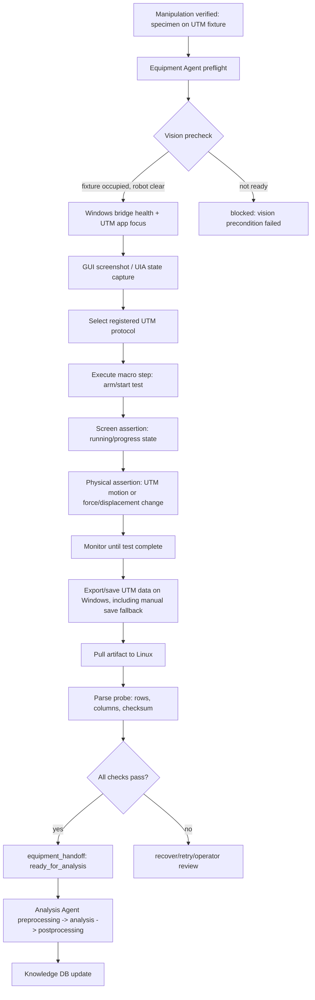

# 05. Lab Equipment Agent 고도화안 - UTM 시각제어/화면제어 + 데이터 회수 루프

작성일: 2026-05-28
대상: `agents/equipment_agent.py`, `device_bridges/windows_pyautogui_bridge.py`, `install/windows_pyautogui_bridge_server.py`, `agents/analysis_agent.py`, Vision Agent, Live GUI

## 1. 결론

Lab Equipment Agent의 핵심은 단순히 "Windows PC에서 PyAutoGUI macro를 호출했다"가 아니라 다음 네 가지를 모두 닫는 것이다.

```text
1. 화면제어 성공: UTM software의 올바른 버튼/상태가 눌리고 바뀌었는가?
2. 물리동작 성공: UTM crosshead/fixture가 실제로 움직였고 테스트가 진행됐는가?
3. 데이터 회수 성공: UTM 결과 CSV/JSON이 Linux PC로 돌아와 Analysis Agent가 읽을 수 있는가?
4. 저장 책임 성공: UTM software가 자동 저장을 하지 않으면 Equipment Agent가 save/export UI까지 수행했는가?
```

따라서 권장 구조는 `macro ok` 하나로 handoff하지 않고, 다음 cross-check를 통과해야 `ready_for_analysis`로 넘기는 것이다.

```text
Windows GUI state check
+ Vision/physical equipment state check
+ UTM data artifact check
+ explicit save/export check when auto-save is not guaranteed
= Lab Equipment verified complete
```

현재 프로젝트 방향성은 맞다. Linux PC가 Windows bridge를 통해 PyAutoGUI 프로그램을 호출하는 방식은 현 환경에서 실용적이다. 다만 PyAutoGUI는 화면 좌표/이미지/포커스/레이턴시에 취약하므로, 실행 macro를 "클릭 스크립트"가 아니라 "assertion이 포함된 registered protocol"로 바꿔야 한다.

## 2. 현재 로컬 코드 진단

### 2.1 이미 있는 기반

현재 Lab Equipment 경로에는 다음 기반이 있다.

- `agents/equipment_agent.py`
  - `equipment.pyautogui.health`
  - `equipment.pyautogui.list_programs`
  - `equipment.pyautogui.run`
  - legacy `utm.run_protocol`
  - Windows bridge 결과를 `equipment_result`, `equipment_handoff`, `tool_results`, `tool_plan`으로 반환

- `device_bridges/windows_pyautogui_bridge.py`
  - simulator/live bridge client
  - token 기반 Windows bridge 연결
  - `health`, `list_programs`, `run`
  - allowlisted action model
  - `screenshot`, `locate_image`, `click`, `press`, `hotkey`, `write`, `wait` 같은 action 이름이 config에는 등록되어 있음
  - live mode fail-closed 구조

- `install/windows_pyautogui_bridge_server.py`
  - Windows PC에서 실행하는 minimal HTTP bridge
  - `/health`, `/programs`, `/execute`
  - 현재는 `program1` demo macro 중심

- `configs/devices.yaml`
  - `devices.equipment.provider: windows_pyautogui`
  - bridge URL/token/env/memory
  - live execution gate
  - artifact dir
  - allowed actions

- `agents/analysis_agent.py`
  - `state.run_metadata.equipment_result`에서 UTM curve를 읽음
  - inline key: `utm_data`, `utm_curve`, `curve`, `measurements`, `samples`, `data`, `raw_data`
  - file key: `result_file`, `result_path`, `csv_path`, `utm_result_file`, `utm_csv_path`, `artifact_path`
  - live mode에서 데이터가 없으면 `UTM_DATA_REQUIRED`로 block

즉 Analysis Agent 쪽 입력 계약은 이미 꽤 좋다. 부족한 부분은 Lab Equipment Agent가 실제 UTM 데이터 파일을 Linux local path로 만들어 `equipment_result.result_file` 또는 `utm_csv_path`에 넣어주는 것이다.

### 2.2 현재 한계

현재 구조의 위험 지점은 다음이다.

1. `equipment.pyautogui.run.ok=true`가 UTM 동작 성공을 의미하지 않는다.
   - macro가 버튼을 눌렀다고 해도 UTM software가 통신 오류/레이턴시/팝업 때문에 움직이지 않을 수 있다.

2. live Windows bridge server는 아직 실제 UTM protocol macro가 아니다.
   - 현재 설치 helper는 `program1` demo 중심이다.
   - `screenshot`, `locate_image`, file artifact download 같은 live endpoint가 충분히 구체화되어 있지 않다.

3. 화면제어가 화면 상태 assertion과 묶여 있지 않다.
   - click 후 expected UI state가 바뀌었는지 확인해야 한다.
   - "Start를 클릭했다"와 "Test Running 상태가 되었다"는 다른 사건이다.

4. Vision Agent와의 cross-check가 아직 명시적이지 않다.
   - UTM fixture에 specimen이 있는지
   - robot이 UTM path 밖으로 빠졌는지
   - crosshead가 실제 움직였는지
   - test 종료 후 fixture가 접근 가능한지
   이런 신호를 Equipment Agent가 받아야 한다.

5. Windows -> Linux 데이터 회수 경로가 아직 약하다.
   - Analysis Agent는 파일을 읽을 준비가 되어 있지만, Equipment Agent가 Windows의 UTM export file을 Linux artifact로 가져오는 도구가 없다.

## 3. 조사 요약

### 3.1 PyAutoGUI는 가능하지만 fragile하다

PyAutoGUI는 mouse/keyboard, screenshot, image locate를 제공하므로 현재 방식에 맞다. 그러나 공식 문서 기준으로도 다음 한계가 있다.

- PyAutoGUI는 mouse/keyboard로 다른 애플리케이션을 제어한다.
- screenshot과 image locate가 가능하다.
- locate 함수는 화면 이미지 매칭 기반이며, 1920x1080 화면에서 1-2초 걸릴 수 있다.
- `confidence` 기반 image matching은 OpenCV 설치가 필요하다.
- fail-safe는 기본 활성화되어 있고 끄지 않는 것이 권장된다.

따라서 UTM 제어 macro는 단순 좌표 click이 아니라 다음처럼 구성해야 한다.

```text
screenshot -> locate/assert -> click -> wait -> screenshot -> assert state changed
```

출처:

- PyAutoGUI overview: https://pyautogui.readthedocs.io/en/latest/index.html
- PyAutoGUI screenshot/locate: https://pyautogui.readthedocs.io/en/latest/screenshot.html
- PyAutoGUI keyboard: https://pyautogui.readthedocs.io/en/latest/keyboard.html
- PyAutoGUI mouse: https://pyautogui.readthedocs.io/en/latest/mouse.html

### 3.2 UI Automation/pywinauto가 가능하면 좌표 macro보다 우선이다

Windows GUI software가 UI Automation tree를 잘 노출하면 PyAutoGUI 이미지 매칭보다 pywinauto/UIA가 더 안정적이다.

추천 우선순위:

```text
1. UTM vendor API / serial / TCP / file export automation
2. Windows UI Automation / pywinauto
3. PyAutoGUI image locate + screenshot assertion
4. fixed coordinate click
```

현재 프로젝트는 PyAutoGUI bridge가 있으므로 3번을 먼저 현실화하되, macro registry에는 `locator_backend: uia | image | coordinate`를 열어두는 것이 좋다.

출처:

- Microsoft UI Automation automated testing: https://learn.microsoft.com/en-us/windows/win32/winauto/uiauto-usefortesting
- pywinauto getting started: https://pywinauto.readthedocs.io/en/0.6.3/getting_started.html

### 3.3 UTM이 직접 통신 인터페이스를 제공하면 장기적으로는 그쪽이 더 좋다

UTM controller나 software가 TCP/IP, USB, RS232, VISA/SCPI, OPC UA, vendor SDK 같은 인터페이스를 제공한다면 그 경로가 최종적으로는 제일 좋다. GUI macro는 human UI를 대신 누르는 방식이라 latency/popup/focus에 취약하다.

다만 지금 환경에서는 Windows UTM software를 PyAutoGUI로 제어하는 것이 현실적이므로, 먼저 GUI automation을 안정화하고, 나중에 direct instrument backend를 추가하는 것이 좋다.

출처:

- PyVISA는 USB, Ethernet, GPIB, RS-232 기반 계측기 제어를 지원한다. https://www.pyvisa.org/docs
- PyVISA interface configuration: https://www.pyvisa.org/docs/interfaces

### 3.4 데이터 회수는 file-watch + artifact pull 구조가 맞다

UTM software가 결과를 CSV/Excel/TXT로 export한다면 Windows PC의 export folder를 감시하고, 파일이 stable해진 뒤 Linux로 가져오는 구조가 좋다.

권장 방식:

```text
Windows UTM software exports CSV
-> Windows bridge spool directory
-> bridge returns file metadata/artifact id
-> Linux pulls file and stores under artifacts/equipment/<run_id>/utm/
-> equipment_result.utm_csv_path points to Linux local file
-> Analysis Agent parses it
```

file size가 변하는 동안 읽으면 partial file을 잡을 수 있으므로, `stable_size_for_sec`, `sha256`, `min_rows`, `parse_probe`를 통과한 뒤 handoff해야 한다.

출처:

- watchdog는 file system event monitoring을 위한 Python API와 shell utility를 제공한다. https://python-watchdog.readthedocs.io/
- watchdog quickstart는 Observer와 event handler로 directory tree를 monitor하는 패턴을 설명한다. https://python-watchdog.readthedocs.io/en/stable/quickstart.html

### 3.5 비전-GUI 자동화로 장비를 제어한 사례가 있다

현재 방향성은 특이한 편이 아니라, API가 없는 상용 장비 software를 자동화할 때 이미 쓰이는 현실적인 우회로다.

가장 직접적인 사례는 FACS sorter 자동화 논문이다. 이 시스템은 장비 API가 없어서 Python/PyAutoGUI로 상용 sorter GUI의 아이콘을 찾고 클릭하고, sample name과 file path를 입력하고, GUI popup/error를 화면 모니터링으로 감지했다. 한 sample당 약 60개의 GUI interaction이 필요했고, 최종 데이터 export와 요약 report 생성까지 자동화했다. 이건 우리 UTM software 상황과 매우 닮아 있다.

이 사례에서 가져올 장점:

1. 장비 vendor API가 없어도 기존 상용 software를 그대로 사용할 수 있다.
2. 이미지 reference와 설정 파일을 분리하면 protocol별 UI 변경을 관리할 수 있다.
3. 화면을 계속 감시하면 popup, error, stalled state를 감지할 수 있다.
4. file path 입력과 export/save까지 macro가 책임지면 데이터 누락이 줄어든다.
5. 오류 시 screenshot을 함께 저장하면 나중에 failure memory로 재학습/디버깅하기 좋다.

다만 visual GUI testing 연구들은 synchronization issue와 image recognition failure가 실제 문제라고 보고한다. 그래서 우리 설계도 "화면을 봤다"에서 끝내면 안 되고, Vision Agent의 물리 상태 확인과 데이터 artifact 검증까지 묶어야 한다.

추가 추천:

```text
Windows GUI locator stack:
1. pywinauto/UI Automation selector
2. PyAutoGUI/OpenCV image matching
3. OCR/text recognition for status and dialog labels
4. fixed coordinate only inside calibrated window region
```

`SikuliX` 같은 visual automation 도구는 "보이는 것을 스크립트한다"는 접근을 명확히 구현한 선례다. 당장 Java 기반 SikuliX로 갈 필요는 없지만, 우리 Windows bridge의 action set은 SikuliX식으로 `wait(image)`, `click(image)`, `assert(image)`, `type(text)`, `observe(error_popup)` primitives를 갖추는 게 좋다.

출처:

- FACS automation case: https://journals.plos.org/plosone/article?id=10.1371/journal.pone.0299402
- SikuliX visual automation docs: https://sikulix.github.io/docs
- Visual GUI testing industrial case study: https://arxiv.org/abs/2005.09303
- Survey on MLLM-based GUI agents: https://arxiv.org/abs/2504.13865

## 4. 권장 전체 루프



## 5. Vision Agent와의 역할 분담

Lab Equipment Agent는 화면을 다루고, Vision Agent는 실제 장비/시편 상태를 본다.

### 5.1 Equipment -> Vision 요청

```json
{
  "agent_signal_type": "equipment_vision_check_request",
  "check_id": "utm_pre_start",
  "expected": {
    "specimen_on_utm_fixture": true,
    "robot_clear_of_utm": true,
    "compression_flatten_occupied": true,
    "human_intrusion": false
  },
  "timeout_s": 5
}
```

```json
{
  "agent_signal_type": "equipment_vision_check_request",
  "check_id": "utm_motion_confirm",
  "expected": {
    "utm_crosshead_motion": "started_or_force_curve_active",
    "specimen_remains_aligned": true,
    "fixture_slip_detected": false
  },
  "timeout_s": 10
}
```

```json
{
  "agent_signal_type": "equipment_vision_check_request",
  "check_id": "utm_test_complete",
  "expected": {
    "utm_crosshead_stopped": true,
    "fixture_safe_to_access": true,
    "specimen_tested_or_crushed": true
  },
  "timeout_s": 10
}
```

### 5.2 Vision -> Equipment 응답

```json
{
  "agent_signal_type": "equipment_vision_check_result",
  "check_id": "utm_motion_confirm",
  "ok": true,
  "confidence": 0.87,
  "signals": {
    "utm_crosshead_motion": true,
    "specimen_on_fixture": true,
    "robot_clear_of_utm": true,
    "anomaly": false
  },
  "evidence": {
    "observation_id": "obs-run-001",
    "frame_ids": ["frame-102", "frame-118"]
  }
}
```

## 6. 화면제어 설계

### 6.1 Macro는 action list가 아니라 protocol이어야 한다

현재 `program_id` registry는 좋은 방향이다. UTM용 macro는 아래처럼 metadata를 가져야 한다.

```json
{
  "program_id": "utm_compression_start_v1",
  "description": "Start UTM compression test and export result CSV.",
  "target_app": "UTM software name",
  "target_window": "main_window_title_or_regex",
  "locator_backend": "uia | image | coordinate",
  "preconditions": [
    "windows_bridge_ready",
    "utm_app_visible",
    "specimen_verified_on_fixture",
    "robot_clear_of_utm"
  ],
  "expected_screen_before": [
    {"name": "ready_state", "locator": "image_or_uia_id", "required": true}
  ],
  "actions": [
    {"action": "focus_window", "window": "main"},
    {"action": "assert_visible", "target": "ready_state"},
    {"action": "click", "target": "start_button"},
    {"action": "wait_until", "target": "running_state", "timeout_s": 10}
  ],
  "expected_screen_after": [
    {"name": "running_state", "required": true}
  ],
  "save_policy": {
    "auto_save_expected": false,
    "manual_save_required_if_no_artifact": true,
    "save_actions": [
      {"action": "wait_until", "target": "complete_state", "timeout_s": 300},
      {"action": "hotkey", "keys": ["ctrl", "s"]},
      {"action": "type_path", "value": "C:/ATR/utm_exports/{run_id}/{specimen_id}.csv"},
      {"action": "press", "key": "enter"},
      {"action": "wait_for_file", "pattern": "C:/ATR/utm_exports/{run_id}/{specimen_id}*.csv", "timeout_s": 20}
    ]
  },
  "output_artifacts": [
    {"kind": "utm_csv", "pattern": "C:/ATR/utm_exports/{run_id}/{specimen_id}*.csv"}
  ],
  "max_retries": 1,
  "safe_abort": {"action": "press", "key": "esc"}
}
```

### 6.2 Click 후 반드시 state transition을 확인한다

각 click은 다음 중 하나 이상의 assertion과 짝이 되어야 한다.

- button disabled/enabled state 변화
- status text: `Ready -> Running -> Complete`
- elapsed time counter 증가
- force/displacement curve area 변화
- progress bar 변화
- output file 생성
- Vision Agent가 crosshead movement 감지

실패 조건:

```text
CLICK_NO_STATE_CHANGE
UI_LOCATOR_NOT_FOUND
UTM_RUNNING_STATE_TIMEOUT
UTM_NO_MOTION_AFTER_START
UTM_SAVE_DIALOG_TIMEOUT
UTM_SAVE_CONFIRMATION_FAILED
UTM_DATA_TIMEOUT
```

### 6.3 화면제어 backend 우선순위

```text
UIA/pywinauto control id
-> PyAutoGUI locate_image(region + confidence)
-> pixel/text/OCR check
-> fixed coordinate fallback
```

fixed coordinate는 마지막 수단으로만 둔다. 쓸 때는 screen size, DPI scaling, target window rect, screenshot before/after hash를 함께 기록해야 한다.

## 7. UTM 동작 cross-check

UTM start macro 성공 후 바로 `ready_for_analysis`로 넘기면 안 된다.

최소 cross-check:

1. Screen check
   - UTM software가 `Running`, `Test Started`, progress/timer/curve update 상태인지 확인

2. Vision check
   - crosshead나 fixture movement가 감지되는지
   - specimen이 fixture에서 이탈하지 않았는지
   - robot arm이 compression path에 없는지

3. Data check
   - force/displacement sample이 증가하는지
   - export/save file이 생성되고 stable해졌는지
   - 자동 저장이 확인되지 않으면 Equipment Agent가 save/export dialog를 끝까지 수행했는지
   - 최소 row count와 column mapping이 맞는지

가능하면 추가할 check:

- direct UTM status API 또는 serial/TCP query
- load cell force nonzero
- displacement monotonicity
- emergency stop/limit status
- UTM controller communication error dialog detection

## 8. 데이터 회수 설계

### 8.1 Windows-side export

Windows bridge는 UTM software macro가 저장한 파일을 bridge spool directory로 옮기거나, export folder를 감시해야 한다. UTM software가 자동 저장을 보장하지 않는다면, 저장 버튼/단축키/Save As dialog까지 Equipment Agent의 registered protocol에 포함해야 한다.

저장 책임 규칙:

```text
1. test complete state 확인
2. auto-save artifact 존재 여부 확인
3. 없으면 manual save/export macro 실행
4. file path를 run_id/specimen_id 기반으로 입력
5. save confirmation 또는 파일 생성 확인
6. stable file check 통과 후 Linux pull
```

즉, `test complete`만으로는 부족하고 `save complete`가 별도 gate여야 한다.

권장 Windows path:

```text
C:\ATR\utm_exports\<run_id>\<specimen_id>_<timestamp>.csv
C:\ATR\utm_exports\<run_id>\<specimen_id>_<timestamp>.json
```

필수 metadata:

```json
{
  "artifact_id": "utm_csv_run001_specimen001",
  "windows_path": "C:/ATR/utm_exports/run001/specimen001.csv",
  "filename": "specimen001.csv",
  "size_bytes": 42188,
  "sha256": "...",
  "created_at": "2026-05-28T00:00:00Z",
  "stable_for_sec": 2.0,
  "row_count_probe": 1200,
  "columns_probe": ["time_s", "displacement_mm", "force_N"]
}
```

### 8.2 Linux-side pull

가장 단순하고 현재 구조에 맞는 방식은 Windows bridge HTTP에 artifact endpoint를 추가하는 것이다.

권장 endpoint:

```text
GET  /artifacts
GET  /artifacts/{artifact_id}
POST /execute  -> returns output_artifacts[]
```

Linux는 파일을 아래로 저장한다.

```text
artifacts/equipment/<run_id>/utm/<artifact_id>.csv
```

그 뒤 Equipment Agent는 `equipment_result`에 Linux local path를 넣는다.

```json
{
  "equipment_result": {
    "ok": true,
    "status": "verified_complete",
    "program_id": "utm_compression_start_v1",
    "utm_csv_path": "artifacts/equipment/run001/utm/specimen001.csv",
    "result_file": "artifacts/equipment/run001/utm/specimen001.csv",
    "data_integrity": {
      "sha256": "...",
      "size_bytes": 42188,
      "row_count_probe": 1200,
      "columns": ["time_s", "displacement_mm", "force_N"]
    }
  }
}
```

이렇게 하면 현재 `AnalysisAgent`가 별도 구조 변경 없이 `result_file` 또는 `utm_csv_path`를 읽을 수 있다.

### 8.3 대안: 공유 폴더

HTTP artifact endpoint가 늦어지면 Windows export folder를 SMB 공유로 열고 Linux에서 mount하는 방식도 가능하다.

```text
Windows: C:\ATR\utm_exports shared
Linux: /mnt/utm_exports mounted
Equipment Agent: wait for /mnt/utm_exports/<run_id>/*.csv
```

다만 SMB/mount 권한, 파일 잠금, 부분 파일 읽기 문제가 생길 수 있으므로, 장기적으로는 bridge artifact API가 더 깔끔하다.

## 9. Report 스키마

기존 output key는 유지한다.

```json
{
  "equipment_result": {},
  "protocol_note": "",
  "equipment_bridge": "windows_pyautogui",
  "equipment_handoff": {}
}
```

여기에 GUI/Knowledge/Analysis용 `equipment_report`를 추가한다.

```json
{
  "equipment_report": {
    "report_version": "lab_equipment_utm_visual_control_v1",
    "run_id": "",
    "mode": "test | live",
    "task_id": "utm_compression_test",
    "bridge": {
      "provider": "windows_pyautogui",
      "bridge_url_host": "",
      "connection_status": "ready | unreachable | blocked",
      "pyautogui_available": true,
      "live_execute_enabled": false
    },
    "preconditions": {
      "manipulation_handoff_status": "ready_for_equipment_agent",
      "vision_fixture_object_present": true,
      "vision_robot_clear": true,
      "utm_app_ready": true,
      "blocking_reasons": []
    },
    "control_plan": {
      "program_id": "utm_compression_start_v1",
      "locator_backend": "image",
      "macro_version": "v1",
      "max_retries": 1
    },
    "screen_checks": [
      {
        "checkpoint": "before_start",
        "ok": true,
        "state": "ready",
        "screenshot_artifact": ""
      },
      {
        "checkpoint": "after_start",
        "ok": true,
        "state": "running",
        "screenshot_artifact": ""
      },
      {
        "checkpoint": "after_complete",
        "ok": true,
        "state": "complete",
        "screenshot_artifact": ""
      }
    ],
    "physical_checks": {
      "vision_motion_confirmed": true,
      "specimen_alignment_ok": true,
      "fixture_safe_to_access": true,
      "evidence_frame_ids": []
    },
    "data_acquisition": {
      "status": "pulled_to_linux",
      "save_method": "auto_save | manual_save_dialog | export_menu | unknown",
      "save_attempted_by_agent": true,
      "save_confirmation_screen_ok": true,
      "windows_path": "",
      "linux_path": "",
      "sha256": "",
      "size_bytes": 0,
      "row_count_probe": 0,
      "columns_probe": []
    },
    "cross_checks": {
      "screen_started": true,
      "physical_motion_started": true,
      "save_completed": true,
      "data_file_created": true,
      "data_parse_probe_ok": true
    },
    "decision": {
      "equipment_status": "verified_complete",
      "handoff_status": "ready_for_analysis",
      "failure_code": null,
      "recommended_next_agent": "analysis_agent"
    }
  }
}
```

## 10. 실패 보완책

### 10.1 Macro/화면 실패

증상:

- 버튼 이미지 못 찾음
- 창 focus가 다른 곳에 있음
- 팝업이 떠 있음
- DPI scaling/해상도 변경
- click 후 화면 상태가 변하지 않음

대응:

- `focus_window` 먼저 수행
- screenshot 저장
- UIA locator -> image locator -> coordinate fallback 순서
- click retry는 최대 1회
- retry 전 반드시 screenshot 재촬영
- state transition 없으면 `CLICK_NO_STATE_CHANGE`
- 팝업 locator가 잡히면 macro 중단 후 operator review

### 10.2 UTM 통신/레이턴시 실패

증상:

- Start 버튼은 눌렸지만 UTM이 움직이지 않음
- software status가 running인데 force/displacement가 안 바뀜
- 장비 통신 에러 dialog 발생
- latency 때문에 running state가 늦게 뜸

대응:

- `start_click` 후 `running_state_timeout_s`를 둔다.
- 화면 running만으로 성공 처리하지 않는다.
- Vision motion 또는 data sample 증가를 추가 확인한다.
- latency는 retry가 아니라 wait budget으로 처리한다.
- wait budget 초과 시 `UTM_NO_MOTION_AFTER_START` 또는 `UTM_RUNNING_STATE_TIMEOUT`
- 위험 가능성이 있으면 stop macro 또는 Guardian safe stop으로 넘긴다.

### 10.3 데이터 회수 실패

증상:

- UTM test는 끝났지만 file export가 안 됨
- UTM software가 자동 저장을 하지 않음
- Save As dialog가 열렸지만 파일명 입력/확인이 실패함
- 덮어쓰기 확인 dialog 또는 권한 dialog에서 멈춤
- CSV가 partial file임
- Linux로 복사 실패
- column alias가 안 맞음

대응:

- auto-save artifact가 없으면 save/export macro를 test complete 후 별도로 실행
- 저장 경로와 파일명은 agent가 입력하고, run_id/specimen_id 기반으로 표준화
- save confirmation screen 또는 파일 생성 이벤트를 확인
- file stable check: size/hash가 일정 시간 유지되는지 확인
- parse probe: 최소 row count, force/displacement column 확인
- Linux local copy 성공 후에만 `ready_for_analysis`
- 실패 시 `UTM_SAVE_DIALOG_TIMEOUT`, `UTM_SAVE_CONFIRMATION_FAILED`, `UTM_DATA_TIMEOUT`, `UTM_EXPORT_FILE_MISSING`, `UTM_DATA_PARSE_FAILED`

## 11. Live GUI 표기안

Lab Equipment GUI는 다음 섹션을 보여야 한다.

1. Windows Bridge
   - selected bridge
   - token configured 여부
   - health
   - PyAutoGUI available/failsafe/pause
   - live execution gate

2. UTM Program
   - selected `program_id`
   - macro version
   - target app/window
   - locator backend
   - allowed retries

3. Vision Preconditions
   - specimen on fixture
   - robot clear
   - fixture safe
   - anomaly

4. Screen State
   - before screenshot
   - running screenshot
   - complete screenshot
   - detected UI state

5. Physical Cross-check
   - UTM movement detected
   - specimen stayed aligned
   - crosshead stopped

6. Data Artifact
   - auto-save detected 여부
   - manual save/export attempted 여부
   - save confirmation status
   - Windows path
   - Linux path
   - checksum
   - row count
   - parse status

7. Analysis Handoff
   - `ready_for_analysis`
   - blocking reason
   - failure code

## 12. LangGraph/Agent 통합

기존 stage 순서는 유지한다.

```text
Manipulation -> Lab Equipment -> Analysis
```

단, Lab Equipment Agent 내부 graph는 다음처럼 확장한다.

```text
1. receive_manipulation_handoff
2. request_vision_precheck
3. check_windows_bridge
4. focus_utm_software
5. capture_pre_start_screen
6. execute_start_macro
7. confirm_screen_running
8. confirm_physical_motion_or_data_stream
9. monitor_until_test_complete
10. check_auto_saved_artifact
11. execute_manual_save_or_export_if_needed
12. confirm_saved_artifact
13. pull_result_to_linux
14. parse_probe_for_analysis
15. package_equipment_report
16. handoff_analysis
```

Analysis Agent로 넘어가는 조건:

```text
equipment_result.ok == true
equipment_result.status in {"verified_complete", "data_ready"}
save_completed == true
equipment_result.result_file or equipment_result.utm_csv_path exists on Linux
data_parse_probe_ok == true
```

## 13. 고도화 단계

### Phase 1. Report-first 고도화

- `equipment_report` 추가
- 기존 `equipment_result`, `protocol_note`, `equipment_handoff` 유지
- screen/physical/data cross-check field를 test mode에서도 생성
- GUI에 Equipment verified status 표시

### Phase 2. Windows bridge action 강화

- live `/execute`에서 `screenshot`, `locate_image`, `wait_until_image`, `focus_window`, `assert_visible` 지원
- screenshot artifact 저장
- screenshot artifact id 반환
- state transition assertion 추가

### Phase 3. UTM registered protocol 추가

- `utm_compression_start_v1`
- `utm_export_csv_v1`
- `utm_manual_save_csv_v1`
- `utm_stop_or_abort_v1`
- macro마다 precondition, expected_before/after, save_policy, output artifact pattern 정의

### Phase 4. Vision cross-check 연결

- Equipment Agent가 Vision Agent에 pre-start/motion/complete check 요청
- Vision Agent 응답 없거나 confidence 낮으면 handoff block
- UTM motion 확인은 화면 status만으로 대체하지 않음

### Phase 5. 데이터 회수

- Windows bridge artifact endpoint 추가
- auto-save 미확인 시 manual save/export macro 실행
- Linux artifact 저장 경로 표준화
- file stable check, checksum, parse probe 추가
- `equipment_result.result_file`에 Linux local path 저장

### Phase 6. Analysis handoff 강화

- Analysis Agent가 `equipment_report.data_acquisition`도 읽을 수 있게 확장
- UTM curve preprocessing 결과를 `analysis.source`에 명확히 기록
- DB/Knowledge에 raw artifact link, metrics, failure tags 저장

### Phase 7. Direct UTM backend 검토

UTM 장비나 software가 API/serial/TCP/export automation을 제공하면 `equipment_backend`를 확장한다.

```text
windows_pyautogui
windows_uia
utm_vendor_api
pyvisa
file_watch
simulator
```

최종 목표는 GUI macro를 완전히 버리는 것이 아니라, 가능한 곳은 direct/data backend로 보강하고 GUI macro는 operator UI 제어에만 쓰는 것이다.

## 14. 우리 환경 기준 우선순위

지금 바로 가능한 설계:

1. `equipment_report` 스키마 추가
2. `equipment_result.status=verified_complete` 개념 추가
3. `ready_for_analysis` 조건을 data artifact 존재/parse probe와 묶기
4. Windows bridge에 screenshot/artifact metadata를 명시
5. Vision Agent와 주고받을 signal schema 확정
6. auto-save가 없을 때 실행할 manual save/export protocol 확정
7. UTM result file을 Analysis Agent가 읽는 기존 계약에 맞춰 반환

Linux/Windows live 환경에서 준비 후 가능한 것:

1. 실제 UTM software 화면 screenshot matching
2. registered UTM macro 실행
3. save/export dialog 제어
4. export folder 감시
5. Windows -> Linux artifact pull
6. Vision Agent motion/fixture cross-check
7. Analysis Agent live UTM curve 분석

지금 하면 안 되는 것:

1. `program_id` 실행 성공만으로 UTM test 성공 처리
2. `equipment_result.ok=true`만으로 Analysis Agent에 handoff
3. Windows bridge 실패 시 live mode에서 simulator로 fallback
4. data file 없이 live analysis synthetic curve 생성
5. fixed coordinate click만으로 UTM start를 운영

## 15. 추천 최종 방향

Lab Equipment Agent는 다음 정체성이 맞다.

```text
Lab Equipment Agent = 화면제어/장비제어 supervisor
Windows Bridge      = 제한된 GUI automation executor
Vision Agent        = 물리 상태 cross-check sensor
Analysis Agent      = UTM curve preprocessing/analysis/postprocessing owner
Knowledge Agent     = raw artifact + metric + failure memory owner
Guardian            = 위험/반복 실패 stop authority
```

핵심 원칙:

```text
클릭 성공 != 장비 성공
장비 성공 != 데이터 성공
데이터 성공 != 분석 성공
```

각 단계를 report와 handoff gate로 분리해야 완전 자율 실험실에 맞는다.

## 16. 출처

- PyAutoGUI documentation: https://pyautogui.readthedocs.io/en/latest/index.html
- PyAutoGUI screenshot and locate functions: https://pyautogui.readthedocs.io/en/latest/screenshot.html
- PyAutoGUI keyboard control: https://pyautogui.readthedocs.io/en/latest/keyboard.html
- PyAutoGUI mouse control: https://pyautogui.readthedocs.io/en/latest/mouse.html
- Microsoft UI Automation for automated testing: https://learn.microsoft.com/en-us/windows/win32/winauto/uiauto-usefortesting
- pywinauto getting started: https://pywinauto.readthedocs.io/en/0.6.3/getting_started.html
- PyVISA documentation: https://www.pyvisa.org/docs
- PyVISA interface configuration: https://www.pyvisa.org/docs/interfaces
- watchdog documentation: https://python-watchdog.readthedocs.io/
- watchdog quickstart: https://python-watchdog.readthedocs.io/en/stable/quickstart.html
- PLOS One FACS automation with PyAutoGUI and commercial instrument GUI: https://journals.plos.org/plosone/article?id=10.1371/journal.pone.0299402
- SikuliX visual automation documentation: https://sikulix.github.io/docs
- Visual GUI testing in practice, industrial case study: https://arxiv.org/abs/2005.09303
- A Survey on MLLM-Based GUI Agents: https://arxiv.org/abs/2504.13865

## Live GUI 고도화 추가안 - 고도화안 기준

Lab Equipment Agent의 Live GUI는 Windows PC의 PyAutoGUI 호출 성공 여부만 보여주면 부족하다. 고도화안 기준으로는 "명령을 보냈는가, 화면이 실제로 바뀌었는가, UTM이 물리적으로 움직였는가, 데이터 파일이 Linux PC로 들어왔는가"까지 cross-check하는 equipment control console이어야 한다.

### Live GUI chat에 떠야 할 메시지

- bridge 상태: Windows bridge 연결, remote script version, latency, last heartbeat.
- macro command: start test, return UTM, save/export, file transfer 등 실행한 command와 target UI를 표시한다.
- visual assertion: 버튼 클릭 전/후 screenshot, UI state match confidence, 예상 화면과 다른 경우 warning.
- physical cross-check: Vision Agent가 감지한 UTM motion/fixture state와 장비 command 결과가 일치하는지 표시한다.
- data acquisition: UTM raw file 생성, 저장 경로, Linux PC transfer 완료, checksum 또는 file size 확인.
- recovery: 통신 에러, UI mismatch, UTM no-motion, save dialog stuck, file missing이면 retry/alternate macro/manual approval을 제안한다.

### Lab Equipment Agent 특화 보고서 페이지

- Control trace: command_id, Windows host, script, pyautogui action, screenshot before/after, latency.
- Visual verification: screen template/OCR result, button state, dialog state, confidence.
- Physical verification: Vision signal, UTM motion observed, compression/fixture occupancy.
- Data ledger: raw file path on Windows, transfer path on Linux, parse readiness, checksum, schema guess.
- Failure/retry table: 실패 원인, retry 횟수, fallback macro, operator intervention.
- Safety gate: Guardian approvals, blocked commands, emergency stop/return-home evidence.
- Handoff packet: `utm_data_ready.v1` with file refs, test metadata, equipment state after test.

### 현재 시스템에 맞춘 event/report 필드

- `live_chat_message.v1`: `agent_id=equipment`, `message_type=status|tool_call|warning|artifact|handoff|approval`, `command_id`, `windows_host`, `visual_assertion`, `data_file_ref`.
- report의 `tool_calls`는 PyAutoGUI command log로, `artifacts`는 screenshots/raw csv/logs로 분리한다.
- 장비 macro는 성공 문자열만 믿지 말고 Vision signal + screen assertion + output file existence를 모두 만족할 때만 다음 stage로 넘긴다.

### 참고 출처

- PyAutoGUI 기반 상용 장비 GUI 자동화 사례는 FACS 자동화 논문에서 확인된다: https://journals.plos.org/plosone/article?id=10.1371/journal.pone.0299402
- SikuliX는 image 기반 GUI automation/verification의 참고 구현이다: https://sikulix.github.io/docs
- LangGraph interrupt는 위험한 장비 명령 전 human approval UI에 적합하다: https://docs.langchain.com/oss/python/langgraph/interrupts
- LangSmith observability는 tool call, error, decision point 추적 기준으로 쓸 수 있다: https://docs.langchain.com/oss/python/langchain/observability
