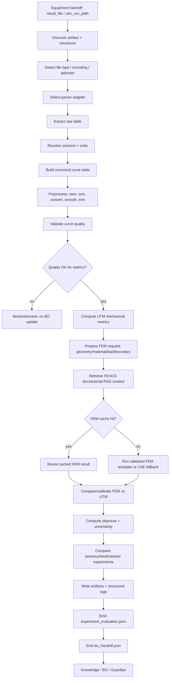

# 06. Analysis Agent 고도화안 - 실험 파일 자동 전처리/분석/비교/BO handoff 루프

작성일: 2026-05-28
대상: `agents/analysis_agent.py`, `graphs/modules/analysis/module.yaml`, `agents/bo_agent.py`, `experiments/schemas.py`, `knowledge/*`, Live GUI

## 1. 결론

Analysis Agent의 역할은 단순히 UTM curve에서 `objective_score`를 계산하는 것이 아니라, 실험 장비가 남긴 raw file을 다음 루프가 신뢰할 수 있는 표준 실험 기록으로 바꾸는 것이다.

권장 정체성:

```text
Analysis Agent = raw experiment artifact + FEM/CAE prediction artifact -> canonical dataset -> validated UTM/FEM metrics -> objective/evaluation -> BO-ready JSON owner
```

따라서 핵심 출력은 하나의 summary가 아니라 아래 네 가지여야 한다.

```text
1. analysis_report.json
2. preprocessed_curve.csv 또는 canonical_curve.jsonl
3. experiment_evaluation.json
4. bo_handoff.json
5. fem_request.json / fem_result.json / fem_cache_manifest.json
6. fem_utm_comparison.json
```

가장 중요한 원칙:

```text
raw file 읽기 성공 != 분석 성공
분석 성공 != BO 업데이트 가능
BO handoff 가능 != Knowledge/DB 기록 완료
```

특히 live mode에서는 파일이 없거나, column/unit 해석이 애매하거나, quality gate가 실패하면 BO에 넘기면 안 된다. BO는 잘못된 objective 하나에 꽤 크게 끌려가므로, Analysis Agent가 데이터 품질과 불확실성을 명시적으로 책임져야 한다.

## 2. 현재 로컬 코드 진단

### 2.1 이미 있는 좋은 기반

`agents/analysis_agent.py`는 이미 다음을 지원한다.

- `equipment_result`에서 inline curve 또는 file path 읽기
- CSV header, numeric CSV, JSON, JSONL parsing
- column alias:
  - displacement: `displacement_mm`, `extension_mm`, `stroke_mm`, `crosshead_mm`, `position_mm`, `displacement`, `extension`
  - force: `force_N`, `load_N`, `force`, `load`
  - time: `time_s`, `time_sec`, `seconds`, `time`
- live mode에서 UTM data 없으면 `UTM_DATA_REQUIRED`로 block
- test mode에서 synthetic curve 생성
- UTM metrics:
  - peak force
  - stiffness
  - compressive strength
  - apparent modulus
  - energy absorption
  - curve quality
- CAE tool이 있으면 UTM objective와 CAE structural score를 blend

`docs/agents/analysis_utm_runtime_guideline.txt`도 같은 방향을 이미 명시하고 있다.

### 2.2 지금 부족한 부분

현재 Analysis Agent는 "분석 결과 dict"는 만들지만, 완전 자율 실험실 기준으로는 아래가 부족하다.

1. 파일 자동 식별과 ingestion report가 약하다.
   - 실제 UTM export가 CSV일지 TXT, XLSX, JSON, vendor-specific text일지 아직 모른다.
   - 어떤 parser가 선택됐고 왜 선택됐는지 기록해야 한다.

2. raw -> canonical data 변환이 명시적 artifact로 남지 않는다.
   - 현재는 curve preview만 반환한다.
   - BO/Knowledge/Replay용으로 preprocessed full curve artifact가 필요하다.

3. unit normalization이 약하다.
   - `kN`, `N`, `kgf`, `mm`, `in`, `% strain` 등 UTM software마다 다를 수 있다.

4. quality gate가 BO handoff와 직접 연결되어 있지 않다.
   - curve_quality warning은 있지만, BO에 넣어도 되는지의 판단이 별도 schema로 없다.

5. 첫 루프 이후 이전 실험과 비교하는 구조가 약하다.
   - `state.experiment_evaluations`는 있지만 Analysis Agent가 직접 measured evaluation을 append하도록 만들지 않는다.

6. BO Agent에 넘길 표준 JSON이 없다.
   - BO는 `ExperimentEvaluationResult` 형태의 `objective_score`, `metrics`, `candidate parameters`를 기대한다.
   - Analysis Agent가 `experiment_evaluation`을 만들어주면 현재 controller/langgraph merge logic이 바로 활용할 수 있다.

7. logging/artifact lineage가 부족하다.
   - 프로젝트에는 `structured.jsonl`, `summary.log`, run artifact API가 이미 있다.
   - Analysis 단계도 parse/validation/metric/comparison/BO handoff trace를 artifact로 남겨야 한다.

## 3. 조사 사례 요약

### 3.1 Ada self-driving laboratory: 분석 결과를 BO로 넘기는 전형적인 구조

Nature Communications의 Ada self-driving laboratory 사례는 우리 구조와 매우 가깝다. 로봇이 샘플을 만들고 여러 characterization을 수행한 뒤, Python data pipeline이 결과를 자동 분석하고, 계산된 특성을 Bayesian optimizer에 넘겨 다음 실험을 고른다.

우리에게 주는 시사점:

1. Analysis Agent는 장비 raw output을 그대로 BO에 넘기면 안 된다.
2. 장비별 raw measurement를 domain metric으로 계산한 뒤 objective로 축약해야 한다.
3. 다음 실험 선택은 "모든 사용 가능한 데이터"를 기반으로 해야 하므로, 이전 실험 비교/누적 DB가 필수다.
4. multi-objective로 갈 가능성을 열어두어야 한다.

우리 UTM 기준으로 바꾸면:

```text
UTM raw curve
-> canonical force/displacement/stress/strain curve
-> peak/stiffness/energy/failure metrics
-> objective_score + uncertainty
-> experiment_evaluation.json
-> BO Agent
```

출처:

- Ada self-driving laboratory: https://www.nature.com/articles/s41467-022-28580-6

### 3.2 self-driving-lab-demo: raw/interim/processed 분리와 best-so-far 비교

`self-driving-lab-demo`는 저가형 self-driving lab 교육/프로토타입 사례다. 중요한 점은 실험에서 measured objective property를 받고, grid/random/Bayesian optimization을 비교하며, `best_so_far` trace를 시각화한다는 점이다. 프로젝트 구조도 `data/raw`, `data/interim`, `data/processed`로 나뉜다.

우리에게 주는 시사점:

1. Analysis artifact를 raw/interim/processed로 나눠야 replay와 debugging이 된다.
2. BO를 잘 하려면 매 루프마다 `best_so_far`, `delta_vs_previous`, `delta_vs_best`가 필요하다.
3. GUI에는 단일 점수보다 score trace와 이전 실험 비교가 더 유용하다.

출처:

- self-driving-lab-demo: https://github.com/sparks-baird/self-driving-lab-demo

### 3.3 SEARS: arbitrary file + JSON sidecar + immutable audit trail

SEARS는 multi-lab materials experiment data를 FAIR하게 저장하고 closed-loop analysis에 쓰기 위한 플랫폼이다. 설명에서 중요한 패턴은 "임의 파일 저장 + JSON sidecar + provenance/versioning + immutable audit trail + REST/Python SDK"다.

우리에게 주는 시사점:

1. UTM raw file은 그대로 보존한다.
2. raw file 옆에 sidecar JSON을 둔다.
3. sidecar에는 parser, unit mapping, checksum, schema version, source agent, run_id를 넣는다.
4. processed artifact와 objective는 raw artifact에 역추적 가능해야 한다.

출처:

- SEARS: https://www.sciencedirect.com/org/science/article/pii/S2635098X25002013

### 3.4 EOS: analysis도 runtime artifact/file browser 대상이어야 한다

EOS는 lab/device/task/protocol/optimizer를 포함한 실험 orchestration system이다. 주요 기능에 Web UI, real-time monitoring, device inspector, file browser, REST API, MCP server, optimizer가 포함된다.

우리에게 주는 시사점:

1. Analysis 결과는 내부 dict로만 있으면 안 되고 file browser에서 볼 수 있어야 한다.
2. AI agent가 쓰는 artifact와 사람이 보는 artifact가 같은 lineage를 공유해야 한다.
3. 분석 단계도 LangGraph 내부 node로 쪼개서 상태를 보여주는 것이 맞다.

출처:

- EOS: https://unc-robotics.github.io/eos/

### 3.5 Frictionless Data / W3C PROV: CSV라도 schema와 provenance가 있어야 한다

CSV는 단순하고 널리 지원되지만, 의미와 단위가 없으면 자동 실험 루프에서 위험하다. Frictionless Tabular Data Package는 CSV와 `datapackage.json`을 묶어 schema를 설명하는 패턴을 제안한다. W3C PROV는 data lineage/provenance를 표현하기 위한 공통 vocabulary를 제공한다.

우리에게 주는 시사점:

1. `preprocessed_curve.csv` 옆에는 반드시 `preprocessed_curve.schema.json` 또는 sidecar가 있어야 한다.
2. provenance는 최소한 `wasGeneratedBy`, `used`, `wasAssociatedWith`에 해당하는 정보를 담아야 한다.
3. BO record는 raw file, parser, preprocessing pipeline version, metric function version을 추적할 수 있어야 한다.

출처:

- Frictionless Tabular Data Package: https://specs.frictionlessdata.io/tabular-data-package/
- W3C PROV overview: https://www.w3.org/TR/prov-overview/

### 3.6 Pandas/PyArrow는 유용하지만 현재 환경에서는 optional이다

현재 프로젝트 의존성은 `numpy`, `scikit-image`, `trimesh` 중심이고 `pandas`, `pyarrow`는 기본 dependency가 아니다. 따라서 1차 고도화는 stdlib `csv/json` + `numpy`로 가는 것이 맞다.

다만 나중에 파일 크기가 커지거나 vendor CSV가 복잡해지면 PyArrow/Pandas를 optional parser backend로 추가할 가치가 있다.

추천:

```text
Phase 1: stdlib csv/json + numpy
Phase 2: optional pandas for Excel/dirty CSV support
Phase 3: optional pyarrow for large CSV, type inference, streaming
```

출처:

- PyArrow CSV docs: https://arrow.apache.org/docs/python/csv.html
- pandas read_csv docs: https://pandas.pydata.org/pandas-docs/stable/reference/api/pandas.read_csv.html

### 3.7 FEniCSx/FEM은 "LLM이 직접 해석 코드를 쓰는 구조"가 아니라 공식 문서 RAG + 검증된 template runner 구조가 맞다

FEniCS 프로젝트는 FEM으로 PDE를 풀기 위한 open-source computing platform이고, 현재 권장 축은 FEniCSx다. FEniCSx는 UFL, Basix, FFCx, DOLFINx로 구성되며, DOLFINx는 FEniCS Project의 next-generation problem solving interface다. 공식 DOLFINx 문서에는 static linear elasticity, Gmsh mesh generation, PyVista visualization 데모가 이미 있다. UFL은 variational weak form을 수학식에 가까운 notation으로 선언하는 DSL이므로, Analysis Agent가 FEM problem spec을 만들 때 공식 문서 기반 RAG와 궁합이 좋다.

중요한 판단:

1. LLM에게 live loop에서 arbitrary FEniCS 코드를 쓰게 하면 안 된다.
2. LLM은 `fem_plan.json`을 만들고, validator가 공식 문서/튜토리얼 출처와 schema를 확인한다.
3. 실제 실행은 검증된 FEniCSx template runner가 맡는다.
4. 같은 geometry/material/loading loop에서는 cache를 우선 조회한다.
5. FEM은 UTM을 대체하지 않고, UTM 전 예측과 UTM 후 보정에 모두 쓰는 2-way signal이어야 한다.

권장 RAG source set:

```text
fenics_docs/
  fenics_project_home
  fenicsx_download_install
  dolfinx_python_docs
  dolfinx_demo_elasticity
  dolfinx_demo_gmsh
  dolfinx_demo_pyvista
  ufl_user_manual
  dokken_fenicsx_tutorial
project_docs/
  docs/agents/cae_analysis_runtime_guideline.txt
  device_bridges/cae_bridge.py contract summary
```

출처:

- FEniCS project overview: https://fenicsproject.org/
- FEniCSx download/install notes: https://fenicsproject.org/download/
- FEniCSx documentation index: https://docs.fenicsproject.org/
- DOLFINx Python documentation: https://docs.fenicsproject.org/dolfinx/main/python/
- DOLFINx elasticity demo: https://docs.fenicsproject.org/dolfinx/main/python/demos/demo_elasticity.html
- DOLFINx Gmsh mesh demo: https://docs.fenicsproject.org/dolfinx/main/python/demos/demo_gmsh.html
- DOLFINx PyVista visualization demo: https://docs.fenicsproject.org/dolfinx/main/python/demos/demo_pyvista.html
- UFL documentation: https://docs.fenicsproject.org/ufl/2025.2.0.post0/
- J. S. Dokken FEniCSx tutorial: https://jsdokken.com/dolfinx-tutorial/
- Linear elasticity tutorial implementation: https://jsdokken.com/dolfinx-tutorial/chapter2/linearelasticity_code.html

### 3.8 더 고도화할 방향: FEM을 low-fidelity, UTM을 high-fidelity로 보는 multi-fidelity loop

완전 자율 실험실 목표에서는 FEM을 단순히 "분석 report에 붙는 보조 점수"로 두면 아깝다. 더 좋은 방향은 FEM/CAE를 low-fidelity signal, 실제 UTM을 high-fidelity signal로 정의하고, Analysis Agent가 두 fidelity의 관계를 계속 학습하게 하는 것이다.

조사상 multi-fidelity materials optimization은 simulation과 experiment를 하나의 probabilistic model에 넣어 비용 대비 정보량을 최적화하는 방향으로 발전하고 있다. npj Computational Materials의 multi-fidelity materials screening 논문은 실험/계산 fidelity 간 관계를 동적으로 학습하면 기존 computational funnel보다 전체 optimization cost를 줄일 수 있음을 보였다. BoTorch도 qMFKG 기반 continuous multi-fidelity BO tutorial을 제공하고, target fidelity와 낮은 fidelity evaluation cost를 acquisition에 반영하는 구조를 지원한다.

우리 시스템에 맞춘 추천:

1. Phase 1에서는 FEM score를 BO score에 바로 섞지 말고 `fem_fidelity_record`로 보존한다.
2. Phase 2에서 FEM-UTM 상관이 충분히 쌓이면 BO Agent에 `fidelity="fem"` / `fidelity="utm"` records를 같이 넘긴다.
3. Phase 3에서 Linux FEniCSx + optional BoTorch/Ax backend가 준비되면 multi-fidelity acquisition을 검토한다.
4. FEM이 UTM과 자주 어긋나는 구간은 "나쁜 FEM"이 아니라 "model discrepancy가 큰 설계영역"으로 저장한다.
5. LLM reasoning은 numeric optimizer를 대체하지 말고, fidelity 선택 이유, discrepancy 원인 가설, 다음 실험 제약 설명을 맡긴다.

추가로 physics-informed BO도 유망하다. 물리 법칙이나 해석 모델이 있는 재료 설계에서는 완전 black-box BO보다 physics-informed kernel/feature를 쓰는 BO가 데이터 효율을 높일 수 있다는 사례가 있다. 다만 지금 프로젝트 기본 dependency에는 BoTorch, Ax, SciPy, FEniCSx가 없으므로, 현재 환경에서는 schema와 artifact만 먼저 열어두는 것이 현실적이다.

추천 fidelity schema:

```json
{
  "fidelity_records": [
    {
      "fidelity": "fem_low",
      "source": "fenicsx_or_cae",
      "cost_class": "cheap_compute",
      "metrics": {
        "predicted_peak_force_N": 480.0,
        "predicted_stiffness_N_per_mm": 120.0,
        "max_von_mises_MPa": 8.2
      },
      "uncertainty": 0.25,
      "cache_key": "..."
    },
    {
      "fidelity": "utm_high",
      "source": "physical_utm",
      "cost_class": "expensive_physical",
      "metrics": {
        "peak_force_N": 520.0,
        "initial_stiffness_N_per_mm": 130.0
      },
      "uncertainty": 0.12
    }
  ],
  "fem_utm_agreement": {
    "peak_force_error_pct": 7.7,
    "stiffness_error_pct": 8.3,
    "agreement_score": 0.86,
    "discrepancy_tags": ["acceptable", "needs_more_samples_for_calibration"]
  }
}
```

출처:

- Multi-fidelity materials screening, npj Computational Materials: https://www.nature.com/articles/s41524-022-00947-9
- BoTorch multi-fidelity BO tutorial: https://botorch.org/docs/v0.16.0/tutorials/multi_fidelity_bo/
- Physics-informed BO for material design, npj Computational Materials: https://www.nature.com/articles/s41524-023-01173-7
- Constrained multi-objective BO in self-driving labs, npj Computational Materials: https://www.nature.com/articles/s41524-024-01274-x
- Bayesian calibration of computer models, Kennedy and O'Hagan: https://ideas.repec.org/a/bla/jorssb/v63y2001i3p425-464.html

## Live GUI 고도화 추가안 - 고도화안 기준

Analysis Agent의 Live GUI는 CSV를 읽었다는 로그가 아니라, raw UTM/FEM 데이터가 BO로 넘길 수 있는 신뢰 가능한 objective JSON으로 바뀌는 과정을 보여줘야 한다. 특히 고도화안에서 추가한 FEniCS 기반 2-way FEM, 튜토리얼/공식문서 RAG, cache 재사용 여부가 보고서에 명확히 남아야 한다.

### Live GUI chat에 떠야 할 메시지

- file intake: 새 raw file 감지, 파일 타입 추정, encoding/delimiter/unit confidence.
- preprocessing: header normalization, unit conversion, outlier/NaN 처리, strain/stress 계산 단계를 요약한다.
- metric extraction: modulus, strength, strain_at_break, energy absorption 등 목표 metric과 품질 플래그를 표시한다.
- previous loop comparison: 직전 실험 대비 개선/악화, 유효한 비교인지 여부를 표시한다.
- FEM run/cache: FEniCS cache hit/miss, fresh simulation 실행, 실험-FEM residual, calibration 필요성을 표시한다.
- BO handoff: `bo_observation.v1` JSON 생성 완료, objective/constraint/uncertainty 포함 여부를 보여준다.

### Analysis Agent 특화 보고서 페이지

- Raw data ledger: Windows 원본 경로, Linux 복사 경로, parser, checksum, acquisition metadata.
- Preprocessing notebook view: 처리 단계, dropped rows, unit mapping, validation warnings.
- Experiment metrics: UTM curve, derived metrics, confidence, failed metric reason.
- FEM panel: FEniCS problem template, mesh/material/boundary condition, cache key, residual plot.
- Loop comparison: previous loop table, delta metrics, statistically meaningful/insufficient flag.
- BO payload preview: generated JSON, objective vector, constraints, uncertainty, provenance refs.
- Quality gate: Analysis confidence가 낮으면 BO Agent로 넘기기 전에 Guardian/Operator confirmation을 요청한다.

### 현재 시스템에 맞춘 event/report 필드

- `live_chat_message.v1`: `agent_id=analysis`, `message_type=status|artifact|decision|warning|handoff`, `file_id`, `parser_confidence`, `fem_cache_status`, `bo_payload_ref`.
- report의 `artifacts`는 raw/interim/processed/FEM/BO JSON으로 타입을 나눈다.
- `decisions` 필드는 비워두지 말고 parser 선택, unit assumption, FEM cache 재사용, BO handoff 승인/보류를 기록한다.

### 참고 출처

- LangSmith observability는 model/tool call과 decision point trace를 저장하는 기준이다: https://docs.langchain.com/oss/python/langchain/observability
- OpenTelemetry semantic conventions는 logs/traces/metrics 명명 표준화에 적합하다: https://opentelemetry.io/docs/concepts/semantic-conventions/
- FEniCSx tutorial과 공식 문서는 FEM RAG/실행 검증의 기준 자료로 유지한다: https://jsdokken.com/dolfinx-tutorial/ 및 https://docs.fenicsproject.org/dolfinx/main/python/
- NN/g error prevention/recovery 원칙상 parser confidence와 unit assumption은 숨기면 안 된다: https://www.nngroup.com/articles/ten-usability-heuristics/

## 4. 권장 전체 루프



## 5. 파일 ingestion 설계

### 5.1 입력 후보

Equipment Agent가 다음 중 하나를 넘겨줄 수 있다.

```text
equipment_result.result_file
equipment_result.utm_csv_path
equipment_result.artifact_path
equipment_result.output_artifacts[]
equipment_report.data_acquisition.linux_path
```

Analysis Agent는 가장 신뢰도 높은 순서로 선택한다.

```text
1. equipment_report.data_acquisition.linux_path
2. equipment_result.utm_csv_path
3. equipment_result.result_file
4. equipment_result.output_artifacts[kind=utm_csv]
5. inline utm_curve / samples
```

### 5.2 file fingerprint

분석 시작 전에 반드시 파일 fingerprint를 만든다.

```json
{
  "artifact_id": "utm_csv_run001_specimen001",
  "path": "artifacts/equipment/run001/utm/specimen001.csv",
  "exists": true,
  "suffix": ".csv",
  "size_bytes": 42188,
  "sha256": "...",
  "modified_at": "2026-05-28T00:00:00Z",
  "encoding_guess": "utf-8-sig",
  "delimiter_guess": ",",
  "line_count_probe": 1200
}
```

### 5.3 parser adapter registry

지금은 `AnalysisAgent._read_curve_file` 안에 parsing logic이 들어가 있다. 고도화 후에는 parser adapter registry로 분리하는 것이 좋다.

```text
analysis.parsers.csv_header
analysis.parsers.csv_numeric
analysis.parsers.json_curve
analysis.parsers.jsonl_curve
analysis.parsers.vendor_text_table
analysis.parsers.excel_optional
analysis.parsers.inline_curve
```

각 adapter는 아래를 반환한다.

```json
{
  "ok": true,
  "parser_id": "analysis.parsers.csv_header",
  "parser_version": "v1",
  "raw_table": [],
  "warnings": [],
  "failure_code": null,
  "detected": {
    "has_header": true,
    "delimiter": ",",
    "encoding": "utf-8-sig"
  }
}
```

## 6. column/unit resolver

### 6.1 canonical columns

UTM 분석용 표준 column은 아래가 좋다.

```text
source_row_index
time_s
displacement_mm
force_N
stress_MPa
strain
segment
```

`stress_MPa`, `strain`은 raw에 없어도 geometry로 계산한다.

```text
stress_MPa = force_N / cross_section_area_mm2
strain = displacement_mm / gauge_length_mm
```

### 6.2 column alias 확장

현재 alias에 아래를 추가하는 것이 좋다.

```text
force:
  Force, Load, Load Cell, Standard force, Axial Force, kN, N, kgf

displacement:
  Extension, Stroke, Crosshead, Position, Travel, Compression, mm, in

time:
  Time, Elapsed Time, sec, s, min

stress:
  Stress, Compressive Stress, MPa, kPa, psi

strain:
  Strain, Engineering Strain, %, mm/mm
```

### 6.3 unit normalization

unit 추론은 파일명이나 header에 의존하되, 확신이 낮으면 live mode에서 block한다.

```text
kN -> N: multiply 1000
kgf -> N: multiply 9.80665
in -> mm: multiply 25.4
min -> s: multiply 60
% strain -> strain: divide 100
```

권장 confidence gate:

```text
column_mapping_confidence >= 0.85
unit_mapping_confidence >= 0.85
```

live mode에서 이보다 낮으면 `ANALYSIS_COLUMN_MAPPING_UNCERTAIN`으로 막는 것이 안전하다.

## 7. 전처리 설계

### 7.1 전처리 단계

처음에는 무거운 dependency 없이 `numpy` 기반으로 충분하다.

```text
1. numeric coercion
2. drop empty rows
3. unit conversion
4. sort by time/displacement
5. duplicate row removal
6. baseline zeroing
7. negative force clamp or preserve-with-warning
8. simple moving median/average smoothing
9. elastic region selection
10. full canonical curve export
```

### 7.2 baseline zeroing

UTM curve는 시작점에서 force/displacement offset이 있을 수 있다.

권장:

```text
force_offset = median(first N force samples)
displacement_offset = displacement at first valid contact or first sample
```

단, 자동 zeroing은 report에 반드시 남긴다.

```json
{
  "preprocessing": {
    "force_zero_offset_N": 1.82,
    "displacement_zero_offset_mm": 0.034,
    "smoothing": {"method": "moving_average", "window": 5},
    "trim": {"method": "none"}
  }
}
```

### 7.3 contact point detection

압축 시험에서 displacement=0과 실제 접촉 시작점이 다를 수 있다. 1차 구현에서는 아래 heuristic이 현실적이다.

```text
contact_index = first index where force_N > max(2 N, 0.01 * peak_force_N)
```

contact 이후 curve로 stiffness/modulus를 계산해야 한다.

## 8. quality gate

BO에 넘기기 전 data quality를 별도 gate로 만든다.

```json
{
  "quality_gate": {
    "ok_for_metrics": true,
    "ok_for_bo": true,
    "score": 0.92,
    "checks": {
      "min_row_count": true,
      "finite_numeric_values": true,
      "monotonic_displacement": true,
      "positive_force_detected": true,
      "peak_not_at_boundary": true,
      "unit_mapping_confident": true,
      "column_mapping_confident": true,
      "equipment_handoff_verified": true
    },
    "warnings": [],
    "failure_code": null
  }
}
```

권장 live blocking failure codes:

```text
ANALYSIS_FILE_MISSING
ANALYSIS_FILE_UNREADABLE
ANALYSIS_UNSUPPORTED_FORMAT
ANALYSIS_COLUMN_MAPPING_UNCERTAIN
ANALYSIS_UNIT_MAPPING_UNCERTAIN
ANALYSIS_TOO_FEW_ROWS
ANALYSIS_NO_POSITIVE_FORCE
ANALYSIS_NON_MONOTONIC_CURVE
ANALYSIS_PEAK_AT_BOUNDARY
ANALYSIS_PARSE_PROBE_FAILED
ANALYSIS_BO_HANDOFF_BLOCKED
```

## 9. metric 설계

### 9.1 1차 UTM metrics

현재 metrics는 유지하고, 아래를 추가 추천한다.

```text
peak_force_N
displacement_at_peak_mm
initial_stiffness_N_per_mm
compressive_strength_MPa
apparent_modulus_MPa
strain_at_peak
energy_absorption_mJ
energy_density_mJ_per_mm3
specific_energy_absorption_J_per_g

추가:
yield_like_force_N
failure_displacement_mm
failure_strain
plateau_force_N
plateau_stress_MPa
post_peak_drop_ratio
energy_to_peak_mJ
energy_to_50pct_peak_drop_mJ
curve_noise_ratio
contact_displacement_mm
```

### 9.2 목표별 objective

현재는 metric_name 문자열을 보고 score를 만든다. 고도화 후에는 objective schema를 더 명시적으로 쓰는 것이 좋다.

```json
{
  "objective": {
    "metric_name": "specific_energy_absorption_J_per_g",
    "direction": "maximize",
    "target_value": null,
    "normalization": {
      "method": "minmax_or_reference",
      "reference": {
        "specific_energy_absorption_J_per_g": 0.25,
        "compressive_strength_MPa": 5.0,
        "apparent_modulus_MPa": 80.0
      }
    },
    "penalties": {
      "curve_quality_warning": 0.1,
      "equipment_warning": 0.1,
      "high_uncertainty": 0.15
    }
  }
}
```

### 9.3 uncertainty

BO에는 score뿐 아니라 uncertainty도 넘겨야 한다.

권장 구성:

```text
uncertainty =
  file/parser uncertainty
+ column/unit mapping uncertainty
+ curve quality uncertainty
+ equipment handoff uncertainty
+ replicate/statistical uncertainty
+ FEM/CAE disagreement uncertainty
```

`Atlas` 같은 SDL 최적화 도구도 noisy objective와 constrained/mixed parameter optimization을 중요 기능으로 둔다. 우리 BO record도 `noise`, `uncertainty`, `constraint_violation`을 명시해야 나중에 고도화가 쉽다.

출처:

- Atlas: https://github.com/aspuru-guzik-group/atlas

### 9.4 FEniCS 기반 FEM metrics와 UTM 2-way calibration

FEM은 Analysis Agent 안에서 두 방향으로 돌아야 한다.

```text
Forward path:
  candidate geometry/material/loading
  -> FEM prediction
  -> risk/expected metrics
  -> BO/Guardian에 prior signal 제공

Backward path:
  physical UTM curve
  -> FEM prediction과 비교
  -> material/boundary/load correction factor 보정
  -> 같은 loop/비슷한 geometry cache에 calibration 반영
```

권장 FEM result metrics:

```text
predicted_peak_force_N
predicted_initial_stiffness_N_per_mm
predicted_energy_absorption_mJ
max_displacement_mm
max_von_mises_MPa
stress_concentration_factor
reaction_force_curve
solver_converged
mesh_quality_score
fem_confidence
```

권장 FEM-UTM agreement metrics:

```text
peak_force_error_pct
stiffness_error_pct
energy_error_pct
curve_shape_similarity
agreement_score
calibrated_modulus_scale
boundary_condition_mismatch_score
model_discrepancy_tags
```

처음에는 현재 `cae.run_static_analysis` contract를 유지하면서 `backend="deterministic_cae"`와 `backend="fenicsx"`를 나눌 수 있게 설계한다. Linux 환경에서 FEniCSx가 준비되면 같은 `fem_request.json`을 FEniCSx runner가 소비하게 만들면 된다.

### 9.5 FEM cache 설계

동일 실험 loop에서 같은 geometry/material/loading이면 FEM을 매번 다시 돌릴 필요가 없다. cache key는 최소한 아래 입력을 포함해야 한다.

```text
fem_cache_key = sha256(
  stl_hash
  + mesh_size_mm
  + material_model
  + material_parameters
  + boundary_condition
  + loading_mode
  + solver_backend
  + solver_version
  + rag_doc_version
  + fem_plan_version
  + calibration_version
)
```

cache status는 단순 hit/miss보다 세분화한다.

```text
cache_hit_exact
cache_hit_same_geometry_recalibrated_material
cache_miss_geometry_changed
cache_miss_solver_config_changed
cache_invalidated_by_utm_calibration
cache_invalidated_by_rag_doc_version
```

cache artifact:

```json
{
  "schema_version": "fem_cache_manifest_v1",
  "cache_key": "...",
  "hit": true,
  "reuse_reason": "same geometry/material/loading and same calibration_version",
  "invalidations": [],
  "source_result": "runs/run001/analysis/specimen001/fem_result.json",
  "solver": {
    "backend": "fenicsx",
    "version": "0.10.x"
  },
  "rag_context": {
    "doc_set_id": "fenicsx_docs_2026_05",
    "retrieved_sources": []
  }
}
```

## 10. 이전 실험 비교

첫 루프에서는 비교 대상이 없으므로 baseline을 만든다.

```json
{
  "comparison": {
    "mode": "first_loop",
    "previous": null,
    "best_so_far": null,
    "nearest_neighbor": null,
    "summary": "No prior measured experiment available."
  }
}
```

두 번째 루프부터는 최소 세 가지 비교를 한다.

```text
1. previous_loop: 직전 실험 대비
2. best_so_far: 현재까지 최고 objective 대비
3. nearest_neighbor: parameter distance가 가장 가까운 실험 대비
```

추천 schema:

```json
{
  "comparison": {
    "mode": "has_prior",
    "previous_loop": {
      "experiment_id": "exp-001",
      "objective_score": 0.61,
      "delta_objective": 0.08,
      "delta_percent": 13.1,
      "metric_deltas": {
        "peak_force_N": 42.1,
        "compressive_strength_MPa": 0.11,
        "energy_absorption_mJ": 180.0
      }
    },
    "best_so_far": {
      "experiment_id": "exp-000",
      "objective_score": 0.65,
      "is_new_best": true,
      "margin": 0.04
    },
    "nearest_neighbor": {
      "experiment_id": "exp-002",
      "parameter_distance": 0.17,
      "changed_parameters": ["relative_density", "wall_thickness_mm"]
    }
  }
}
```

## 11. BO handoff JSON

### 11.1 핵심 추천

Analysis Agent는 `AgentResult.data["experiment_evaluation"]`을 만들어야 한다. 현재 `controller.py`와 `langgraph_runtime.py`는 `data["experiment_evaluation"]`이 있으면 `state.experiment_evaluations`에 append하는 흐름이 이미 있다.

즉, Analysis Agent가 measured evaluation을 직접 만들면 BO Agent의 prior data 품질이 좋아진다.

### 11.2 ExperimentEvaluationResult 호환 record

```json
{
  "ok": true,
  "tool": "analysis.agent",
  "run_id": "run-001",
  "experiment_id": "exp-001",
  "session_id": "run-001",
  "evaluation_id": "eval-analysis-exp-001",
  "objective": {
    "objective_id": "bo-specimen-objective",
    "name": "Compression performance",
    "metric_name": "objective_score",
    "direction": "maximize",
    "constraints": {}
  },
  "candidate_id": "specimen-001",
  "mode": "live",
  "bridge": "analysis",
  "status": "measured_analysis_complete",
  "objective_score": 0.73,
  "metrics": {
    "geometry_type": "gyroid",
    "relative_density": 0.32,
    "wall_thickness_mm": 1.2,
    "cell_size_mm": 6.0,
    "peak_force_N": 520.0,
    "compressive_strength_MPa": 1.3,
    "specific_energy_absorption_J_per_g": 0.18,
    "uncertainty": 0.14,
    "quality_score": 0.92,
    "fem_utm_agreement_score": 0.86
  },
  "fidelity_records": {
    "utm_high": "runs/run001/analysis/specimen001/metrics.json",
    "fem_low": "runs/run001/analysis/specimen001/fem_result.json",
    "agreement": "runs/run001/analysis/specimen001/fem_utm_comparison.json"
  },
  "artifacts": {
    "raw_file": "artifacts/equipment/run001/utm/specimen001.csv",
    "analysis_report": "runs/run001/analysis/specimen001/analysis_report.json",
    "preprocessed_curve": "runs/run001/analysis/specimen001/preprocessed_curve.csv",
    "fem_result": "runs/run001/analysis/specimen001/fem_result.json",
    "fem_cache_manifest": "runs/run001/analysis/specimen001/fem_cache_manifest.json",
    "bo_handoff": "runs/run001/analysis/specimen001/bo_handoff.json"
  },
  "bridge_result": {
    "analysis_source": "equipment_result.utm_csv_path",
    "parser_id": "analysis.parsers.csv_header",
    "quality_gate": "passed"
  },
  "failure_code": null,
  "created_at": "2026-05-28T00:00:00Z"
}
```

### 11.3 BO 전용 compact handoff

`experiment_evaluation.json`은 표준 기록이고, BO에는 더 compact한 `bo_handoff.json`도 좋다.

```json
{
  "schema_version": "analysis_bo_handoff_v1",
  "ok_for_bo": true,
  "run_id": "run-001",
  "experiment_id": "exp-001",
  "candidate_id": "specimen-001",
  "parameters": {
    "geometry_type": "gyroid",
    "relative_density": 0.32,
    "wall_thickness_mm": 1.2,
    "cell_size_mm": 6.0,
    "tpms_thickness": 0.38,
    "orientation_deg": 0,
    "anisotropy_ratio": 1.0
  },
  "objective": {
    "metric_name": "objective_score",
    "direction": "maximize",
    "score": 0.73,
    "uncertainty": 0.14
  },
  "metrics": {
    "peak_force_N": 520.0,
    "compressive_strength_MPa": 1.3,
    "energy_absorption_mJ": 1850.0,
    "fem_utm_agreement_score": 0.86
  },
  "fidelity": {
    "mode": "single_high_fidelity_with_low_fidelity_context",
    "utm_high": {
      "objective_source": true,
      "artifact": "runs/run001/analysis/specimen001/metrics.json"
    },
    "fem_low": {
      "used_for_objective": false,
      "artifact": "runs/run001/analysis/specimen001/fem_result.json",
      "cache_hit": true
    }
  },
  "quality": {
    "quality_score": 0.92,
    "warnings": []
  },
  "comparison": {
    "delta_vs_previous": 0.08,
    "is_new_best": true
  },
  "artifacts": {
    "analysis_report": "runs/run001/analysis/specimen001/analysis_report.json",
    "preprocessed_curve": "runs/run001/analysis/specimen001/preprocessed_curve.csv"
  }
}
```

## 12. logging / artifact 설계

### 12.1 권장 디렉토리

현재 runtime은 run별 artifact API가 있으므로, Analysis도 run directory 안에 저장한다.

```text
runs/<run_id>/analysis/<specimen_id>/
  raw_input_sidecar.json
  parse_report.json
  canonical_curve.csv
  preprocessing_report.json
  quality_report.json
  metrics.json
  fem_request.json
  fem_plan.json
  fem_rag_reasoning.json
  fem_result.json
  fem_cache_manifest.json
  fem_utm_comparison.json
  comparison.json
  analysis_report.json
  experiment_evaluation.json
  bo_handoff.json
  analysis_trace.jsonl
```

### 12.2 structured log events

`logging_system`에는 JSONL structured logger가 이미 있다. Analysis Agent는 적어도 아래 event를 남기는 것이 좋다.

```text
analysis.file_discovered
analysis.parser_selected
analysis.column_mapping_completed
analysis.preprocessing_completed
analysis.quality_gate_passed
analysis.quality_gate_failed
analysis.metrics_computed
analysis.fem_rag_context_retrieved
analysis.fem_cache_checked
analysis.fem_run_completed
analysis.fem_utm_comparison_completed
analysis.fem_calibration_updated
analysis.comparison_completed
analysis.experiment_evaluation_created
analysis.bo_handoff_created
```

각 event payload에는 artifact path와 checksum을 넣는다.

## 13. Live GUI 표기안

Analysis Agent 패널은 다음을 보여야 한다.

1. File Intake
   - input file path
   - size/checksum
   - detected format
   - parser id

2. Column Mapping
   - raw column -> canonical column
   - unit conversion
   - mapping confidence

3. Preprocessing
   - zero offset
   - smoothing
   - contact point
   - trimmed rows

4. Curve Quality
   - row count
   - monotonicity
   - peak boundary check
   - warnings/failure code

5. Metrics
   - peak force
   - strength
   - stiffness/modulus
   - energy absorption
   - objective score
   - uncertainty

6. FEM / FEniCS
   - backend: deterministic_cae / fenicsx / skipped
   - RAG sources used
   - cache hit/miss
   - predicted stiffness/peak force/stress
   - FEM vs UTM agreement score
   - calibration version

7. Previous Comparison
   - delta vs previous
   - delta vs best
   - new best badge
   - nearest neighbor

8. BO Handoff
   - `ok_for_bo`
   - `experiment_evaluation.json`
   - `bo_handoff.json`
   - blocking reason

## 14. LangGraph 내부 graph 고도화

현재 `graphs/modules/analysis/module.yaml`은 4단계다.

```text
01_parse_utm_curve
02_compute_mechanical_metrics
03_run_cae_if_available
04_emit_objective_score
```

고도화 후 권장 내부 graph:

```text
01_receive_equipment_artifact
02_fingerprint_input_file
03_detect_format_and_parser
04_parse_raw_table
05_resolve_columns_and_units
06_build_canonical_curve
07_preprocess_curve
08_validate_curve_quality
09_compute_utm_metrics
10_prepare_fem_problem
11_retrieve_fenics_rag_context
12_validate_fem_plan
13_check_fem_cache
14_run_or_reuse_fem
15_compare_fem_with_utm
16_update_fem_calibration_if_same_loop
17_compute_objective_and_uncertainty
18_compare_with_previous_experiments
19_write_analysis_artifacts
20_emit_experiment_evaluation
21_emit_bo_handoff
```

stage transition 조건:

```text
analysis.ok == true
quality_gate.ok_for_metrics == true
fem_result exists or fem skipped with explicit reason
fem_utm_comparison exists when both FEM and UTM are available
experiment_evaluation exists
bo_handoff exists or explicit ok_for_bo=false reason exists
```

live mode에서 `ok_for_metrics=false`면 Knowledge/BO 업데이트를 막고 Guardian review로 넘기는 것이 맞다.

## 15. Knowledge / DB 연계

현재 `MemoryRecord`는 `run_id`, `experiment_id`, `summary`, `score`, `uncertainty`만 저장한다. 1차로는 유지해도 되지만, 완전 자율 실험실을 목표로 하면 Knowledge DB에는 최소한 아래가 필요하다.

```json
{
  "run_id": "",
  "experiment_id": "",
  "candidate_id": "",
  "summary": "",
  "score": 0.0,
  "uncertainty": 0.0,
  "metrics": {},
  "parameters": {},
  "artifact_refs": {},
  "quality": {},
  "failure_tags": [],
  "created_at": ""
}
```

단, 코드 구현 시에는 기존 `MemoryRecord`를 바로 깨지 말고 additive schema 또는 별도 `ExperimentAnalysisRecord`로 가는 것이 안전하다.

## 16. 실패 보완책

### 16.1 파일/파서 실패

증상:

- file missing
- unsupported suffix
- encoding error
- delimiter error
- header가 없거나 column이 vendor-specific

대응:

- parser probe 결과를 `parse_report.json`에 저장
- live mode에서는 모호하면 block
- test mode에서는 synthetic fallback 가능하지만 source를 명확히 표시
- unknown vendor format은 새 parser adapter 등록 대상으로 남김

### 16.2 unit/column 실패

증상:

- force가 kN인지 N인지 모름
- displacement가 mm인지 inch인지 모름
- stress/force column이 둘 다 있어 어느 것을 쓸지 애매함

대응:

- unit confidence 계산
- header regex + known vendor profile
- confidence 낮으면 `ANALYSIS_UNIT_MAPPING_UNCERTAIN`
- operator override를 GUI에서 허용하되, override도 provenance에 저장

### 16.3 curve quality 실패

증상:

- row 수 부족
- displacement가 역방향/중복/불연속
- peak가 첫/마지막 row
- force가 전부 0에 가까움
- 장비는 움직였지만 data stream이 비정상

대응:

- metrics는 계산 가능해도 `ok_for_bo=false`
- Knowledge에는 failure memory로 저장
- BO에는 success point로 넣지 않음

### 16.4 FEM/RAG/cache 실패

증상:

- FEniCS 공식 문서 RAG context를 못 찾음
- LLM이 만든 `fem_plan.json`이 schema나 허용 template를 벗어남
- cache hit처럼 보이지만 material/loading/calibration version이 다름
- FEniCSx/CAE runner 실패
- FEM 예측과 UTM 결과가 허용 오차보다 크게 어긋남

대응:

- `FEM_RAG_CONTEXT_MISSING`
- `FEM_PLAN_VALIDATION_FAILED`
- `FEM_CACHE_STALE`
- `FEM_SOLVER_FAILED`
- `FEM_UTM_DIVERGENCE_HIGH`
- FEM 실패가 UTM 분석 성공을 막지는 않되, FEM을 쓴 objective blend와 multi-fidelity handoff는 막음
- 큰 divergence는 실패가 아니라 중요한 지식일 수 있으므로 `model_discrepancy_tags`로 Knowledge에 저장

### 16.5 BO handoff 실패

증상:

- candidate parameters를 찾을 수 없음
- objective_score가 None
- uncertainty가 너무 큼
- quality gate failed

대응:

- `bo_handoff.json`에 `ok_for_bo=false`와 reason 저장
- `experiment_evaluation`은 실패/blocked record로 남기되 BO prior에는 success point로 쓰지 않음

## 17. 우리 환경 기준 구현 우선순위

지금 바로 가능한 것:

1. `analysis_report` schema 확정
2. `experiment_evaluation`을 Analysis Agent output에 추가
3. `bo_handoff` schema 확정
4. file fingerprint/checksum 추가
5. parse report와 column mapping report 추가
6. quality gate를 `ok_for_bo`와 연결
7. previous/best comparison을 `state.experiment_evaluations` 기반으로 계산
8. 분석 artifact를 run directory에 저장
9. `fem_request.json`, `fem_result.json`, `fem_cache_manifest.json` schema 확정
10. FEniCS 공식 문서/튜토리얼 RAG index manifest 설계
11. 현재 `cae.run_static_analysis`를 `backend="deterministic_cae"` fidelity record로 감싸기
12. FEM cache key/checksum 규칙 추가
13. FEM-UTM agreement를 objective와 분리된 진단 metric으로 저장

Linux/Windows live 환경 준비 후 가능한 것:

1. 실제 UTM vendor CSV/TXT sample 수집
2. vendor profile별 parser adapter 추가
3. GUI에서 column/unit override
4. 실제 preprocessed curve preview
5. BO Agent가 Analysis-generated measured evaluations만 prior로 쓰도록 필터링
6. Linux FEniCSx runner 설치 및 `fenicsx` backend 추가
7. Gmsh -> DOLFINx mesh conversion template 추가
8. FEM result를 UTM 후 material/boundary calibration에 반영

나중에 고려할 것:

1. `pandas` optional parser
2. `pyarrow` large CSV parser
3. `scipy` Savitzky-Golay smoothing
4. multi-objective BO handoff
5. replicate-aware statistical confidence
6. direct LIMS/ELN/FAIR metadata export
7. multi-fidelity BO handoff
8. physics-informed surrogate 또는 PINN은 충분한 FEM/UTM 데이터가 쌓인 뒤 optional
9. BoTorch/Ax backend는 Linux optional dependency로 격리

지금 하면 안 되는 것:

1. column/unit confidence 없이 live BO update
2. parser 실패를 synthetic data로 숨기기
3. raw file을 덮어쓰기
4. curve preview만 저장하고 full processed data를 버리기
5. objective_score만 넘기고 provenance/artifact를 누락하기

## 18. 최종 추천 방향

Analysis Agent는 다음 다섯 개 레이어로 나누는 것이 좋다.

```text
Data Ingestion Layer
  - raw artifact discovery, fingerprint, parser selection

Canonicalization Layer
  - column/unit mapping, canonical curve, preprocessing

Scientific Analysis Layer
  - UTM metrics, CAE blend, objective, uncertainty, quality

FEM / Simulation Intelligence Layer
  - FEniCS RAG plan, FEM cache, simulation result, FEM-UTM calibration, model discrepancy memory

Loop Handoff Layer
  - previous comparison, experiment_evaluation, bo_handoff, knowledge artifacts
```

Analysis Agent가 이 역할을 제대로 해주면, 뒤의 Knowledge/BO/Guardian은 훨씬 단순해진다. 완전 자율 실험실에서 "무엇을 실험했는가"보다 더 중요한 것은 "측정 결과와 시뮬레이션 결과를 다음 의사결정에 넣어도 되는가"이고, 그 판단의 주인이 Analysis Agent다.

## 19. 출처

- Ada self-driving laboratory, Nature Communications: https://www.nature.com/articles/s41467-022-28580-6
- self-driving-lab-demo repository: https://github.com/sparks-baird/self-driving-lab-demo
- EOS experiment orchestration system: https://unc-robotics.github.io/eos/
- SEARS FAIR platform for closed-loop materials experiments: https://www.sciencedirect.com/org/science/article/pii/S2635098X25002013
- Atlas, Bayesian optimization for self-driving laboratories: https://github.com/aspuru-guzik-group/atlas
- Frictionless Tabular Data Package: https://specs.frictionlessdata.io/tabular-data-package/
- W3C PROV overview: https://www.w3.org/TR/prov-overview/
- Apache Arrow CSV documentation: https://arrow.apache.org/docs/python/csv.html
- pandas read_csv documentation: https://pandas.pydata.org/pandas-docs/stable/reference/api/pandas.read_csv.html
- FEniCS project overview: https://fenicsproject.org/
- FEniCSx download/install notes: https://fenicsproject.org/download/
- FEniCSx documentation index: https://docs.fenicsproject.org/
- DOLFINx Python documentation: https://docs.fenicsproject.org/dolfinx/main/python/
- DOLFINx elasticity demo: https://docs.fenicsproject.org/dolfinx/main/python/demos/demo_elasticity.html
- DOLFINx Gmsh mesh demo: https://docs.fenicsproject.org/dolfinx/main/python/demos/demo_gmsh.html
- DOLFINx PyVista visualization demo: https://docs.fenicsproject.org/dolfinx/main/python/demos/demo_pyvista.html
- UFL documentation: https://docs.fenicsproject.org/ufl/2025.2.0.post0/
- J. S. Dokken FEniCSx tutorial: https://jsdokken.com/dolfinx-tutorial/
- J. S. Dokken linear elasticity tutorial implementation: https://jsdokken.com/dolfinx-tutorial/chapter2/linearelasticity_code.html
- Multi-fidelity materials screening, npj Computational Materials: https://www.nature.com/articles/s41524-022-00947-9
- BoTorch multi-fidelity BO tutorial: https://botorch.org/docs/v0.16.0/tutorials/multi_fidelity_bo/
- Physics-informed BO for material design, npj Computational Materials: https://www.nature.com/articles/s41524-023-01173-7
- Constrained multi-objective BO in self-driving labs, npj Computational Materials: https://www.nature.com/articles/s41524-024-01274-x
- Bayesian calibration of computer models, Kennedy and O'Hagan: https://ideas.repec.org/a/bla/jorssb/v63y2001i3p425-464.html
