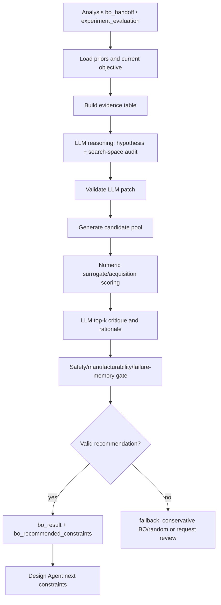

# 07. BO Agent 고도화안 - LLM reasoning이 보이는 유연한 자율 최적화 루프

작성일: 2026-05-28
대상: `agents/bo_agent.py`, `experiments/benchmark.py`, `learning/bo_engine.py`, `graphs/modules/bo/module.yaml`, `agents/design_agent.py`, `agents/analysis_agent.py`, Live GUI

## 1. 결론

BO Agent는 단순히 "다음 parameter 하나 고르는 optimizer"가 아니라, 이전 실험 결과를 읽고 다음 실험의 과학적 이유를 제시하는 연구 전략 agent가 되어야 한다.

권장 정체성:

```text
BO Agent = measured evidence + knowledge + failure memory를 읽고
           numeric BO와 LLM reasoning을 결합해
           다음 실험 후보와 그 이유를 생성하는 optimization scientist
```

핵심은 LLM을 surrogate model 자체로 믿는 것이 아니라, 아래 영역에서 reasoning 능력을 드러내는 것이다.

```text
1. 목표/제약 해석
2. 이전 실험 결과 요약과 가설 생성
3. search space 수정/축소/확장 제안
4. exploration vs exploitation 전략 선택
5. 후보군 top-k critique
6. 실패 패턴 기반 forbidden region 제안
7. Design Agent로 넘길 constraints 설명
```

최종 추천 구조:

```text
Analysis bo_handoff
-> prior/evidence ingestion
-> LLM science reasoning pass
-> search-space/acquisition patch
-> numeric candidate scoring
-> LLM top-k critique
-> safety/manufacturability validator
-> bo_recommended_constraints
-> Design Agent
```

LLM reasoning은 GUI에 크게 보여주되, 최종 후보는 schema validator와 numeric score gate를 통과해야 한다.

## 2. 현재 로컬 코드 진단

### 2.1 이미 있는 기반

`agents/bo_agent.py`는 이미 다음을 갖고 있다.

- `strategy`: `random`, `grid`, `bo`, `mbo`
- `acquisition`: `expected_improvement`, `upper_confidence_bound`, `probability_of_improvement`, `uncertainty_sampling`, `exploitation`, `exploration`
- default parameter space:
  - `geometry_type`
  - `relative_density`
  - `wall_thickness_mm`
  - `cell_size_mm`
  - `tpms_thickness`
  - `orientation_deg`
  - `anisotropy_ratio`
  - `skin_thickness_mm`
  - cap/skirt flags
- `cell_size_mm` lock
- gyroid `relative_density >= 0.20` guard
- `state.experiment_evaluations`를 prior로 읽는 구조
- Knowledge Agent context를 `bo_result.knowledge_context`에 넣는 구조
- `experiment_spec_update`로 Design Agent에 다음 제약을 넘기는 구조

`experiments/benchmark.py`도 현재 random/grid/bo 비교, best-so-far, surrogate trace 비슷한 구조를 이미 제공한다.

### 2.2 지금 부족한 부분

1. `graphs/modules/bo/module.yaml`에는 `llm_role: bo_policy`가 있지만 `BOAgent.run()`은 아직 LLM을 호출하지 않는다.
2. 현재 BO는 실제 GP/BoTorch가 아니라 candidate proxy + pool acquisition에 가깝다.
3. `mbo`는 prior를 쓰지만 "왜 이 prior가 다음 후보에 영향을 줬는지" 설명이 약하다.
4. Analysis Agent가 만들 `bo_handoff.json`과의 명시적 계약이 아직 없다.
5. 실패한 실험, 조작 실패, 프린팅 실패, 장비 실패가 search space 제약으로 환류되는 구조가 약하다.
6. 다목적 최적화가 아직 약하다.
   - 압축강도
   - stiffness
   - energy absorption
   - mass/material use
   - print time
   - failure risk
7. LLM reasoning artifact가 없다.
   - hypothesis
   - rationale
   - why-not-chosen
   - exploration/exploitation decision
8. 현재 dependency에는 `numpy`는 있지만 `botorch`, `ax-platform`, `optuna`, `scikit-learn`은 없다.
   - 따라서 1차 고도화는 현재 환경에 맞게 lightweight로 가야 한다.

## 3. 조사 사례 요약

### 3.1 BO는 expensive experiment에 잘 맞지만 surrogate/acquisition 선택이 중요하다

materials science에서 BO는 expensive experiment를 줄이기 위한 대표적인 active learning 방법이다. 다만 논문들은 surrogate model과 acquisition function 선택이 성능에 큰 영향을 준다고 말한다. 즉, "BO를 쓴다"만으로 충분하지 않고, 실험 도메인과 데이터 수에 맞는 전략을 선택해야 한다.

우리에게 주는 시사점:

1. BO Agent는 acquisition을 고정하지 말고 상황에 따라 바꿔야 한다.
2. 초기 데이터가 적을 때와 loop가 쌓인 뒤의 전략이 달라야 한다.
3. 후보 추천에는 best-so-far뿐 아니라 surrogate/acquisition trace를 보여줘야 한다.
4. 현재 heuristic BO라도 benchmark trace와 rationale을 보존하면 이후 real BO backend로 바꾸기 쉽다.

출처:

- Benchmarking BO in materials domains: https://www.nature.com/articles/s41524-021-00656-9
- Adaptive surrogate models for automated experimental design: https://www.nature.com/articles/s41524-021-00662-x

### 3.2 human/domain prior를 Bayesian loop에 넣으면 성능이 좋아질 수 있다

NIST의 human-in-the-loop Bayesian autonomous materials phase mapping 연구는 theory, simulation, literature, human intuition을 probabilistic prior로 통합하면 autonomous exploration이 좋아질 수 있다고 설명한다.

우리 환경에서는 human input 자리에 LLM reasoning + Knowledge Agent retrieval + 실패 memory가 들어갈 수 있다.

권장 해석:

```text
LLM reasoning = hard command가 아니라 soft prior / preference / constraint proposal
```

출처:

- NIST human-in-the-loop Bayesian autonomous phase mapping: https://www.nist.gov/publications/human-loop-bayesian-autonomous-materials-phase-mapping

### 3.3 LLAMBO: LLM을 BO의 warm-start, surrogate, candidate sampling에 쓰는 방향

LLAMBO는 BO 문제를 자연어로 표현하고, historical evaluations에 조건화해 LLM이 후보를 제안/평가하도록 만든다. 특히 sparse observations 상태에서 zero-shot warmstarting, surrogate modeling, candidate sampling에 도움이 된다고 보고한다.

우리에게 주는 시사점:

1. 첫 3-5회 실험에서 LLM warm-start가 특히 유용하다.
2. LLM은 "이전 실험 표"와 "제약/목표"를 읽고 후보를 제안할 수 있다.
3. fine-tuning 없이 in-context로 시작할 수 있어 현재 환경에 맞다.
4. 단, LLM이 만든 후보는 반드시 schema/range/manufacturing validator를 통과해야 한다.

출처:

- LLAMBO: https://arxiv.org/abs/2402.03921

### 3.4 LLM-HPO 연구: 제한된 budget에서는 LLM 후보 제안이 경쟁력 있을 수 있다

LLM을 hyperparameter optimization에 쓰는 연구는 제한된 search budget에서 LLM이 기존 HPO/BO와 경쟁하거나 더 좋은 결과를 낼 수 있음을 보여준다. 이 결과를 그대로 물리 실험에 옮길 수는 없지만, "작은 budget에서 LLM이 후보 생성/전략 조정에 유용하다"는 방향은 우리 시스템과 잘 맞다.

우리에게 주는 시사점:

1. UTM 실험은 비싸고 느리므로 small-budget optimization이다.
2. LLM이 후보를 직접 생성하되, numeric BO와 함께 앙상블로 쓰는 것이 좋다.
3. LLM reasoning은 "왜 이 후보가 정보가치가 있는가"를 설명하는 데 강점이 있다.

출처:

- Using Large Language Models for Hyperparameter Optimization: https://arxiv.org/abs/2312.04528

### 3.5 LGBO/LABO: LLM preference와 cheap evaluation을 BO loop에 계속 넣는 방향

최근 LLM-guided BO 연구들은 LLM을 단순 warm-start에만 쓰지 않고, 매 iteration에서 preference나 cheap evaluation으로 통합하려고 한다.

우리에게 주는 시사점:

1. LLM은 후보 region에 soft preference를 줄 수 있다.
2. 실제 UTM 실험 전에 cheap virtual evaluation을 많이 돌리는 구조가 좋다.
3. LLM 판단과 실제 실험 data가 충돌하면 실제 data를 우선해야 한다.

우리 시스템에 맞춘 적용:

```text
numeric_acquisition_score
+ llm_preference_weight * llm_preference_score
- failure_risk_penalty
- manufacturability_penalty
= combined_candidate_score
```

LLM preference는 최종 결정권이 아니라 acquisition bias로 쓰는 것이 안전하다.

출처:

- LLM-Guided Bayesian Optimization, ICLR 2026: https://arxiv.org/abs/2605.17976
- LABO: https://arxiv.org/abs/2605.22054

### 3.6 multi-agent LLM BO 연구의 주의점: implicit reasoning은 통제하기 어렵다

Multi-Agent LLMs for Adaptive Acquisition in Bayesian Optimization 논문은 LLM-based optimization이 historical evaluations에 대해 implicit prompt reasoning을 쓰기 때문에 exploration/exploitation 행동을 분석하고 통제하기 어렵다는 점을 지적한다.

우리에게 주는 시사점:

1. LLM reasoning은 반드시 JSON artifact로 저장해야 한다.
2. LLM이 선택한 acquisition과 그 이유를 GUI에 노출해야 한다.
3. numeric acquisition은 계속 명시적으로 유지해야 한다.
4. "LLM이 좋다 해서 선택"은 금지하고, score/range/safety gate를 통과해야 한다.

출처:

- Multi-Agent LLMs for Adaptive Acquisition in BO: https://arxiv.org/abs/2603.28959

### 3.7 constrained multi-objective BO는 우리 목표와 잘 맞다

EGBO는 self-driving lab에서 constrained multi-objective optimization을 다루며 feasible solution 제안을 강조한다. 우리도 압축 성능만 볼 수 없다. 출력 가능성, 조작 가능성, UTM 측정 가능성, 실패 위험, 재료 사용량 같은 constraint가 함께 들어간다.

우리에게 주는 시사점:

1. 단일 objective BO에서 시작하되 multi-objective/Pareto 구조를 열어둔다.
2. constraint violation probability를 BO result에 넣는다.
3. 실패한 프린팅/조작/장비 케이스도 optimizer가 배워야 한다.

출처:

- EGBO constrained multi-objective SDL: https://www.cambridge.org/engage/chemrxiv/article-details/64ed86aa3fdae147fa0be615

### 3.8 BoTorch/Ax는 장기 옵션, 지금은 lightweight가 맞다

BoTorch와 Ax는 강력한 BO stack이다. BoTorch는 analytic/Monte-Carlo acquisition을 지원하고, Ax는 adaptive experimentation platform 성격을 갖는다. 다만 현재 프로젝트 dependency에는 없다.

추천:

```text
Phase 1: 현재 experiment.benchmark + numpy + LLM reasoning
Phase 2: lightweight surrogate 개선
Phase 3: optional Ax/BoTorch backend
```

지금 바로 heavy dependency를 넣기보다는, backend interface만 열어두는 것이 낫다.

출처:

- BoTorch overview: https://botorch.org/docs/v0.13.0/overview/
- Ax platform: https://ax.dev/

## 4. 권장 전체 루프



## 5. LLM reasoning layer 설계

### 5.1 LLM이 해야 하는 일

LLM은 다음을 수행한다.

```text
1. current objective 해석
2. 이전 실험 성능 표 읽기
3. 성공/실패 패턴 요약
4. 가설 생성
5. search space 수정 제안
6. acquisition 선택 제안
7. top-k candidate critique
8. operator-facing explanation 작성
```

LLM이 하면 안 되는 일:

```text
1. hardware 직접 실행
2. schema 밖 parameter 생성
3. safety/manufacturability gate 우회
4. raw objective_score 조작
5. 실제 data보다 LLM 직감을 우선
```

### 5.2 reasoning prompt 입력

BO Agent가 LLM에 줄 context:

```json
{
  "active_goal": "",
  "objective": {},
  "parameter_space": {},
  "locked_parameters": {},
  "prior_evaluations": [
    {
      "candidate_id": "",
      "parameters": {},
      "objective_score": 0.0,
      "uncertainty": 0.0,
      "quality": {},
      "failure_tags": [],
      "summary": ""
    }
  ],
  "knowledge_context": {},
  "failure_memory": {},
  "analysis_comparison": {},
  "current_strategy_settings": {}
}
```

### 5.3 LLM output schema

LLM은 자유문이 아니라 strict JSON을 반환해야 한다.

```json
{
  "schema_version": "bo_reasoning_v1",
  "hypotheses": [
    {
      "id": "h1",
      "claim": "Increasing relative_density may improve peak force but may reduce print reliability.",
      "evidence": ["exp-001 > exp-000 in peak_force", "printer warning at high density"],
      "confidence": 0.62,
      "testable_by_next_candidate": true
    }
  ],
  "strategy_recommendation": {
    "strategy": "bo | mbo | random | grid | llm_warmstart | safe_constrained_bo | multi_objective",
    "acquisition": "expected_improvement | upper_confidence_bound | uncertainty_sampling | exploitation | exploration",
    "exploration_weight": 0.35,
    "exploitation_weight": 0.65,
    "reason": ""
  },
  "search_space_patch": {
    "narrow": {},
    "expand": {},
    "lock": {},
    "forbid": [
      {"condition": "relative_density < 0.20", "reason": "FDM continuous-shell rule"}
    ]
  },
  "preference_regions": [
    {
      "condition": "relative_density between 0.30 and 0.42 and wall_thickness_mm >= 1.4",
      "preference_score": 0.7,
      "reason": ""
    }
  ],
  "risk_flags": [],
  "operator_summary": ""
}
```

### 5.4 LLM preference를 numeric score에 합치는 방식

LLM의 preference는 soft score로만 쓴다.

```text
combined_score =
  numeric_acquisition_score
  + llm_weight * llm_preference_score
  - failure_risk_penalty
  - constraint_violation_penalty
```

초기 추천 weight:

```text
loop_count 0-3:   llm_weight = 0.25
loop_count 4-10:  llm_weight = 0.15
loop_count 10+:   llm_weight = 0.08
```

실험 data가 쌓일수록 LLM보다 measured evidence 비중을 키운다.

## 6. strategy 확장안

현재 strategy:

```text
random
grid
bo
mbo
```

추천 추가:

```text
llm_warmstart
llm_preference_bo
safe_constrained_bo
multi_objective_pareto
multi_fidelity_bo
novelty_search
batch_async_bo
```

### 6.1 `llm_warmstart`

첫 루프나 prior가 부족할 때 사용한다.

```text
LLM이 5-10개 후보를 생성
-> validator가 범위/제약 검사
-> numeric proxy로 ranking
-> diversity filter
-> 1개 추천
```

### 6.2 `llm_preference_bo`

현재 환경에서 가장 추천하는 중기 목표다.

```text
기존 experiment.benchmark 후보군
-> numeric acquisition
-> LLM preference score
-> combined score
-> top-k critique
```

### 6.3 `safe_constrained_bo`

프린팅/조작/장비 실패가 쌓이면 필요하다.

constraint examples:

```text
relative_density >= 0.20
cell_size_mm locked by operator
wall_thickness_mm >= nozzle_width * factor
no top cap unless UTM fixture clearance confirmed
avoid parameter region that caused failed ejection/manipulation
avoid high uncertainty if live run budget is low
```

### 6.4 `multi_objective_pareto`

장기적으로는 필수다.

목표:

```text
maximize compressive_strength_MPa
maximize energy_absorption_mJ
maximize specific_energy_absorption_J_per_g
minimize mass_g
minimize print_time_min
minimize failure_risk
```

초기 구현은 real qEHVI가 아니어도 된다. scalarization을 여러 개 돌려 후보를 비교하고 `pareto_status`를 report하면 충분하다.

### 6.5 `multi_fidelity_bo`

CAE/FEM은 싸고 UTM은 비싸다.

```text
low_fidelity: CAE / simulator / printability proxy / LLM cheap evaluation
high_fidelity: real UTM result
```

BO Agent는 real UTM을 너무 빨리 쓰지 말고, uncertainty가 크거나 promising한 region에만 physical experiment를 쓰도록 추천해야 한다.

## 7. evidence ingestion 설계

Analysis Agent가 만든 `bo_handoff.json`과 `experiment_evaluation`을 우선으로 쓴다.

권장 prior item:

```json
{
  "source": "analysis_experiment_evaluation",
  "candidate_id": "specimen-001",
  "parameters": {
    "geometry_type": "gyroid",
    "relative_density": 0.32,
    "wall_thickness_mm": 1.2,
    "cell_size_mm": 10.0,
    "tpms_thickness": 0.34,
    "orientation_deg": 0,
    "anisotropy_ratio": 1.0
  },
  "objective_score": 0.73,
  "uncertainty": 0.14,
  "quality_score": 0.92,
  "ok_for_bo": true,
  "failure_tags": [],
  "artifact_refs": {}
}
```

BO에 넣지 말아야 할 prior:

```text
ok_for_bo=false
analysis.ok=false
synthetic live fallback
equipment_result not verified
quality_gate failed
objective_score missing
parameter vector missing
```

다만 실패 prior는 버리지 말고 `failure_model`에 넣는다.

```json
{
  "failure_model": {
    "forbidden_regions": [],
    "risk_patterns": [
      {"condition": "relative_density > 0.46", "failure": "print_ejection_failed", "count": 2}
    ]
  }
}
```

## 8. candidate pool 설계

현재 `experiment.benchmark`는 grid pool을 만들고 BO가 그 pool에서 고른다. 이 방향은 현재 환경에 잘 맞다.

고도화 추천:

```text
candidate_pool =
  grid/random candidates
  + LLM warm-start candidates
  + local perturbations around best-so-far
  + exploration candidates far from prior points
  + safe baseline candidate
```

candidate마다 아래 score를 저장한다.

```json
{
  "candidate_id": "bo-candidate-003",
  "parameters": {},
  "numeric": {
    "surrogate_mean": 0.68,
    "uncertainty": 0.22,
    "acquisition_value": 0.74
  },
  "llm": {
    "preference_score": 0.61,
    "rationale": "",
    "hypothesis_ids": ["h1"]
  },
  "constraints": {
    "valid": true,
    "risk_score": 0.08,
    "warnings": []
  },
  "combined_score": 0.77
}
```

## 9. 출력 schema 고도화

기존 `bo_result` key는 유지한다.

추가 추천:

```json
{
  "bo_result": {
    "ok": true,
    "tool": "bo.agent",
    "strategy": "llm_preference_bo",
    "acquisition": "expected_improvement",
    "objective": {},
    "parameter_space": {},
    "prior_summary": {
      "prior_count": 5,
      "measured_count": 4,
      "failed_count": 1,
      "best_score": 0.73,
      "best_candidate_id": "specimen-004"
    },
    "reasoning": {
      "schema_version": "bo_reasoning_v1",
      "hypotheses": [],
      "strategy_recommendation": {},
      "search_space_patch": {},
      "preference_regions": [],
      "risk_flags": [],
      "operator_summary": ""
    },
    "candidate_pool": [],
    "recommendation": {
      "candidate_id": "",
      "parameters": {},
      "objective_score": null,
      "source_strategy": "llm_preference_bo",
      "reason": "",
      "why_this_candidate": "",
      "why_not_best_exploitation_only": "",
      "expected_information_gain": 0.0,
      "risk_assessment": {}
    },
    "artifacts": {
      "bo_reasoning_report": "runs/run001/bo/bo_reasoning_report.json",
      "candidate_pool": "runs/run001/bo/candidate_pool.json",
      "bo_next_candidate": "runs/run001/bo/bo_next_candidate.json"
    }
  }
}
```

`experiment_spec_update`는 기존대로 유지한다.

```json
{
  "experiment_spec_update": {
    "geometry_type": "gyroid",
    "relative_density": 0.38,
    "wall_thickness_mm": 1.6,
    "cell_size_mm": 10.0,
    "tpms_thickness": 0.40,
    "orientation_deg": 30,
    "anisotropy_ratio": 1.0
  }
}
```

## 10. Design Agent로 넘기는 계약

BO Agent는 최종적으로 `state.run_metadata["bo_recommended_constraints"]`에 저장되는 값을 만든다.

권장 constraints:

```json
{
  "preferred_geometry_type": "gyroid",
  "relative_density": 0.38,
  "wall_thickness_mm": 1.6,
  "tpms_thickness": 0.40,
  "orientation_deg": 30,
  "anisotropy_ratio": 1.0,
  "bottom_cap_enabled": true,
  "top_cap_enabled": false,
  "bo_reason": "Explore higher density with moderate wall thickness after previous specimen improved energy absorption but stayed below stiffness target.",
  "bo_hypothesis_ids": ["h1", "h3"],
  "bo_risk_flags": []
}
```

주의:

- `cell_size_mm`은 현재 코드처럼 operator/test-selected lock을 우선한다.
- Design Agent는 BO reason을 report에 남기되, manufacturability validation을 다시 수행해야 한다.
- BO 추천은 "실험 후보"이지 "제작 승인"이 아니다.

## 11. Live GUI 표기안

BO Agent 패널에는 numeric plot뿐 아니라 reasoning이 보여야 한다.

1. Evidence
   - measured prior count
   - failed prior count
   - best-so-far
   - last candidate delta

2. Hypotheses
   - LLM-generated hypothesis list
   - evidence links
   - confidence
   - next candidate tests which hypothesis

3. Strategy
   - selected strategy
   - acquisition
   - exploration/exploitation ratio
   - why this strategy

4. Search Space
   - locked parameters
   - narrowed/expanded ranges
   - forbidden regions
   - operator override

5. Candidate Pool
   - numeric score
   - LLM preference
   - risk penalty
   - combined score
   - duplicate/evaluated marker

6. Recommendation
   - next constraints
   - why this candidate
   - why not other top candidates
   - expected learning value
   - risk warning

7. Artifacts
   - `bo_reasoning_report.json`
   - `candidate_pool.json`
   - `bo_next_candidate.json`
   - BO progress SVG

## 12. LangGraph 내부 graph 고도화

현재:

```text
01_load_objective_history
02_fit_surrogate
03_evaluate_acquisition
04_recommend_next_constraints
```

권장:

```text
01_load_analysis_handoff
02_filter_valid_priors
03_summarize_evidence_table
04_llm_reasoning_hypothesis_pass
05_validate_reasoning_patch
06_update_search_space
07_generate_candidate_pool
08_score_numeric_acquisition
09_score_llm_preference
10_apply_constraint_and_failure_penalties
11_rank_top_k_candidates
12_llm_top_k_critique
13_select_recommendation
14_write_bo_artifacts
15_handoff_design_constraints
```

이렇게 하면 GUI에서 BO Agent의 사고 과정이 보인다.

## 13. 실패 보완책

### 13.1 LLM hallucination

증상:

- 존재하지 않는 parameter 추천
- 범위 밖 값 추천
- 이미 실패한 region 추천
- cell_size lock 무시

대응:

- JSON schema validation
- allowed parameter key whitelist
- numeric range clamp가 아니라 rejection 우선
- rejection reason을 `bo_result.reasoning.validation_errors`에 저장
- fallback은 기존 `bo` 또는 `random`

### 13.2 데이터 부족

증상:

- prior 없음
- objective_score 없음
- measured data가 모두 failed

대응:

- `llm_warmstart` 또는 space-filling random
- conservative baseline candidate 포함
- "정보수집 목적" candidate임을 recommendation에 명시

### 13.3 exploitation 과다

증상:

- 같은 region 반복 추천
- best-so-far 근처만 계속 탐색

대응:

- duplicate penalty
- novelty score
- minimum distance from evaluated points
- LLM critique에 "why not repeat best" 항목 필수

### 13.4 exploration 과다

증상:

- 위험한 후보를 계속 추천
- 물리 실험 budget 낭비

대응:

- failure risk penalty
- Guardian constraints
- uncertainty가 커도 risk가 높으면 virtual/CAE 먼저
- live mode에서는 `safe_constrained_bo` 우선

## 14. 우리 환경 기준 단계별 구현

### Phase 1. LLM reasoning artifact 추가

새 dependency 없이 가능하다.

- `BOAgent`에서 `ctx.complete("bo_policy", ...)` 호출
- strict JSON parsing + fallback
- `bo_result.reasoning` 추가
- `recommendation.why_this_candidate` 추가
- GUI에 reasoning section 표시

### Phase 2. Analysis handoff 우선 사용

- `state.experiment_evaluations` 중 Analysis-generated measured record만 prior로 우선 사용
- `ok_for_bo=false`는 failure model로 분리
- uncertainty/quality score를 acquisition penalty에 반영

### Phase 3. candidate pool 고도화

- LLM warm-start candidate 추가
- best-so-far 근처 local perturbation 추가
- novelty/diversity score 추가
- duplicate candidate reject

### Phase 4. LLM preference BO

- LLM preference regions를 candidate별 score로 변환
- combined score 도입
- `llm_weight`를 loop_count와 prior_count에 따라 자동 조정

### Phase 5. safe constrained BO

- 프린팅/조작/장비 실패를 forbidden/risky region으로 학습
- Guardian constraints와 연결
- risk-adjusted acquisition 도입

### Phase 6. optional real BO backend

Linux 환경에서 dependency가 허용되면 선택적으로 추가한다.

```text
bo_backend:
  lightweight_pool
  numpy_surrogate
  optuna_optional
  ax_optional
  botorch_optional
```

처음부터 Ax/BoTorch로 가지 말고 backend boundary만 설계한다. 현재 실험 횟수가 적고 parameter 수가 작으면 lightweight pool BO + LLM reasoning이 더 빨리 쓸 수 있다.

### Phase 7. multi-objective / multi-fidelity

- strength, energy, mass, print_time, failure_risk를 Pareto report로 표시
- CAE/FEM을 low-fidelity로 사용
- real UTM은 high-fidelity update로 사용

## 15. 지금 하면 안 되는 것

1. LLM output을 그대로 `bo_recommended_constraints`에 쓰기
2. invalid candidate를 clamp해서 몰래 valid로 만들기
3. Analysis quality gate 실패 데이터를 성공 prior로 넣기
4. failure data를 버리기
5. `cell_size_mm` lock 깨기
6. BO Agent가 printer/robot/equipment를 직접 실행하기
7. LLM reasoning을 GUI/JSON artifact 없이 summary 문자열로만 남기기
8. heavy BO dependency를 core runtime에 바로 강제하기

## 16. 추천 최종 방향

BO Agent는 아래 두뇌 구조가 가장 좋다.

```text
Measured Evidence Brain
  - Analysis handoff, experiment_evaluations, quality, uncertainty

Scientific Reasoning Brain
  - LLM hypothesis, literature/knowledge context, failure interpretation

Optimization Brain
  - candidate pool, surrogate/acquisition, exploration/exploitation

Safety/Feasibility Brain
  - manufacturability, printer/robot/equipment constraints, Guardian risk

Communication Brain
  - why this candidate, why not others, next Design Agent constraints
```

이렇게 만들면 사용자는 BO Agent가 단순 수식이 아니라 "왜 다음 실험이 이건지"를 말하는 연구 파트너처럼 느낄 수 있다. 동시에 final decision은 schema와 numeric gate로 묶여 있어서 자율 실험실 운영에 필요한 신뢰성도 확보된다.

## 17. 출처

- Benchmarking BO in materials domains, npj Computational Materials: https://www.nature.com/articles/s41524-021-00656-9
- Adaptive surrogate models for automated experimental design, npj Computational Materials: https://www.nature.com/articles/s41524-021-00662-x
- NIST human-in-the-loop Bayesian autonomous materials phase mapping: https://www.nist.gov/publications/human-loop-bayesian-autonomous-materials-phase-mapping
- LLAMBO, Large Language Models to Enhance Bayesian Optimization: https://arxiv.org/abs/2402.03921
- Using Large Language Models for Hyperparameter Optimization: https://arxiv.org/abs/2312.04528
- LLM-Guided Bayesian Optimization, ICLR 2026: https://arxiv.org/abs/2605.17976
- LABO, LLM-Accelerated Bayesian Optimization: https://arxiv.org/abs/2605.22054
- Multi-Agent LLMs for Adaptive Acquisition in Bayesian Optimization: https://arxiv.org/abs/2603.28959
- Evolution-guided Bayesian optimization for constrained multi-objective optimization in self-driving labs: https://www.cambridge.org/engage/chemrxiv/article-details/64ed86aa3fdae147fa0be615
- NLR autonomous experimentation overview: https://www.nlr.gov/materials-science/autonomous-experimentation
- BoTorch overview: https://botorch.org/docs/v0.13.0/overview/
- Ax adaptive experimentation platform: https://ax.dev/

## Live GUI 고도화 추가안 - 고도화안 기준

BO Agent의 Live GUI는 단순 "다음 파라미터 추천"이 아니라 surrogate/acquisition 계산과 LLM reasoning memo가 함께 보이는 optimizer cockpit이어야 한다. 사용자는 BO가 exploitation, exploration, constraint repair, FEM-informed candidate 중 무엇을 택했는지 이해할 수 있어야 한다.

### Live GUI chat에 떠야 할 메시지

- observation intake: Analysis Agent에서 받은 objective/constraint JSON과 데이터 품질 상태를 요약한다.
- model update: surrogate 갱신, observation count, noise/uncertainty, constraint model 상태를 표시한다.
- reasoning memo: LLM이 acquisition 결과를 해석해 "왜 이 후보가 다음 실험으로 좋은지" 짧게 설명한다.
- candidate recommendation: top-k 후보, expected improvement/uncertainty/constraint risk를 함께 보여준다.
- disagreement warning: BO 수치 추천과 LLM reasoning이 충돌하거나 Knowledge memory가 경고하면 Guardian/Operator review로 올린다.
- handoff: Design Agent로 넘길 `next_design_request.v1`과 objective intent를 표시한다.

### BO Agent 특화 보고서 페이지

- Observation table: loop_id, candidate_id, metrics, constraints, data_quality, FEM link.
- Surrogate panel: model type, kernel/acquisition, posterior uncertainty, constraint feasibility.
- Candidate ranking: top-k 후보, acquisition score, risk, reasoning tag, rejected reason.
- LLM reasoning audit: hidden chain-of-thought가 아니라 짧은 decision memo, assumptions, evidence refs.
- Exploration policy: search space, fixed constraints, allowed repair operations, diversity target.
- Decision register: selected candidate, backup candidate, why not others.
- Handoff packet: `next_design_request.v1` with target params/ranges, rationale, constraints, evidence.

### 현재 시스템에 맞춘 event/report 필드

- `live_chat_message.v1`: `agent_id=bo`, `message_type=status|decision|warning|handoff`, `candidate_id`, `acquisition_score`, `constraint_risk`, `reasoning_ref`.
- `/api/agents/bo/report`의 `role_specific`은 `surrogate_panel`, `candidate_ranking`, `reasoning_audit`, `handoff_packet`으로 확장한다.
- LLM reasoning은 계산기를 대체하지 않고, BO 수치 결과의 해석/repair/실험가능성 판단에 집중시킨다.

### 참고 출처

- BoTorch/Ax는 BO 모델과 adaptive experimentation UI/metadata 설계의 실무 기준이다: https://botorch.org/docs/v0.13.0/overview/ 및 https://ax.dev/
- LangSmith observability는 decision point와 metadata trace에 적합하다: https://docs.langchain.com/oss/python/langchain/observability
- AutoGen Studio는 workflow 결과, action, profiling을 사람이 검토하는 패턴을 제공한다: https://autogenhub.github.io/autogen/docs/autogen-studio/usage/
- NN/g recognition rather than recall 원칙상 BO 추천은 숫자만이 아니라 왜 추천했는지 함께 보여줘야 한다: https://www.nngroup.com/articles/ten-usability-heuristics/
