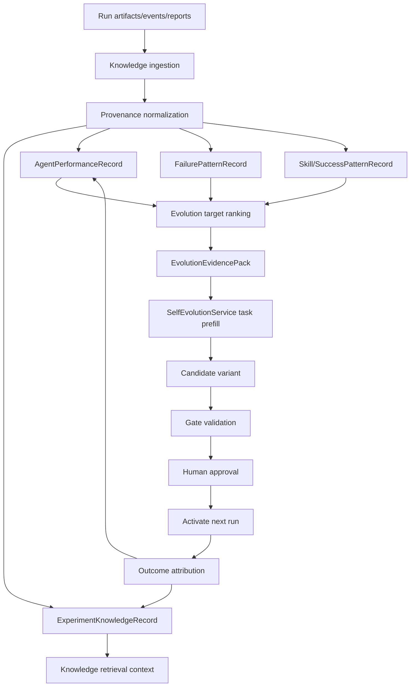
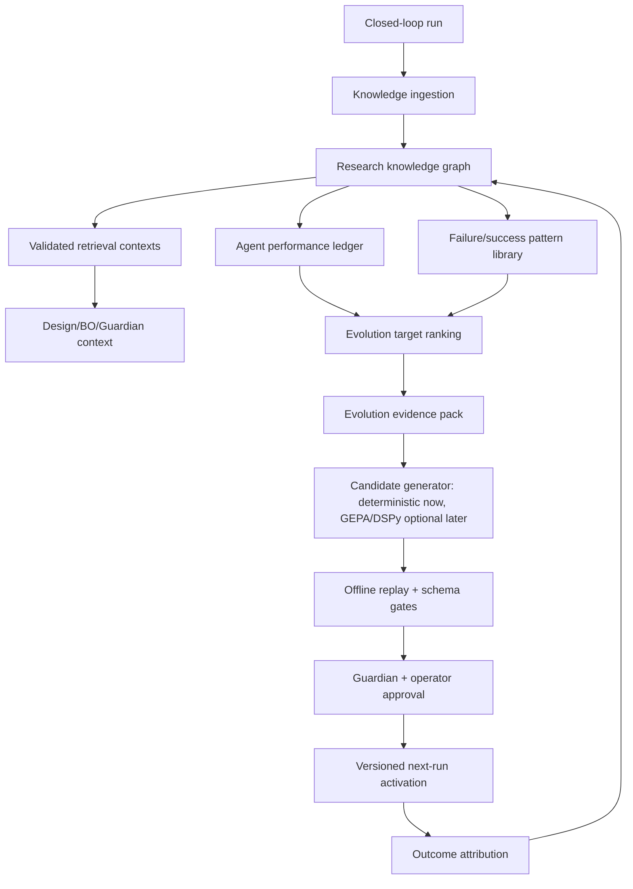

# 08. Knowledge Agent + Self-Evolution 고도화안 - 연구 기억, 실패 패턴, 에이전트 진화 증거 루프

작성일: 2026-05-28
대상: `agents/knowledge_agent.py`, `knowledge/*`, `memory/*`, `self_evolution/*`, `graphs/modules/knowledge/module.yaml`, Live GUI, Evolution Lab

## 1. 결론

Knowledge Agent는 단순 RAG 요약 담당이 아니라, 완전 자율 실험실의 장기 기억과 self-evolution의 근거를 책임져야 한다.

권장 역할:

```text
Knowledge Agent = Research Memory + Failure/Success Pattern Memory + Agent Performance Ledger + Self-Evolution Evidence Pack Builder
```

현재 `SelfEvolutionService`는 이미 run trace를 읽고 `prompt`, `graph`, `report`, `policy`, `tool`, `code_patch` variant를 만들 수 있다. 하지만 trace는 아직 event count, warning count, artifact list 중심이라 "왜 실패했는가", "어느 agent를 고쳐야 하는가", "무엇을 바꾸면 좋아지는가"를 충분히 담지 못한다. 이 빈칸을 Knowledge Agent가 채워야 한다.

즉 self-evolution은 다음 구조가 되어야 한다.

```text
Agent reports / artifacts / metrics / failures
-> Knowledge Agent가 구조화 memory + provenance + pattern으로 저장
-> target별 EvolutionEvidencePack 생성
-> SelfEvolutionService가 evidence pack으로 variant 생성
-> gate validation + human approval
-> next-run activation
-> Knowledge Agent가 before/after 효과를 기록
```

중요한 원칙:

1. Knowledge Agent는 variant를 직접 활성화하지 않는다.
2. Knowledge Agent는 self-evolution의 근거, 평가 기준, 금지 조건을 만든다.
3. SelfEvolutionService는 기존처럼 gate, approval, versioning, rollback을 담당한다.
4. 처음부터 graph DB나 prompt optimizer를 넣지 말고, 파일 기반 typed record와 evidence pack부터 만든다.

## 2. 현재 코드 진단

### 2.1 Knowledge Agent 현황

`agents/knowledge_agent.py`는 현재 다음 정도만 한다.

```text
1. active_goal + stage 기반 RAG query 생성
2. ctx.rag.retrieve(top_k_local=4)
3. LLM으로 concise constraints / reminders 생성
4. MemoryRecord(run_id, experiment_id, summary, score, uncertainty) 저장
```

`knowledge/schemas.py`의 `MemoryRecord`도 최소 필드만 가진다.

```text
run_id
experiment_id
summary
score
uncertainty
```

이 구조는 "실험 요약"에는 충분하지만 self-evolution에는 부족하다. prompt/graph/policy를 고도화하려면 어떤 stage가 실패했는지, 어떤 contract field가 빠졌는지, 어떤 artifact가 근거인지, 어떤 수정이 다음 run에서 검증되어야 하는지까지 필요하다.

### 2.2 Self-Evolution 현황

`self_evolution/service.py`는 이미 보수적인 메타 런타임으로 구현되어 있다.

지원 target:

```text
prompt
tool
graph
report
policy
code_patch
```

지원 lifecycle:

```text
create_task
run_task
generate_variant
evaluate_variant
approve_variant
activate_variant
rollback_variant
```

현재 좋은 점:

1. live hardware execution 없이 schema/dry-run gate만 수행한다.
2. graph variant는 compile/dry-run gate를 탄다.
3. prompt variant는 module schema와 handler 등록 여부를 검사한다.
4. activation은 version store를 통해 기록된다.
5. active run 중에는 activation이 막힌다.

현재 부족한 점:

1. variant 생성 근거가 trace event count 중심이다.
2. agent별 성능 ledger가 없다.
3. failure pattern이 자연어 요약으로만 흐를 가능성이 크다.
4. 어떤 target을 evolve할지 Knowledge가 추천하지 않는다.
5. evolution 전후 성능 비교가 Knowledge memory에 남지 않는다.

## 3. 웹 조사 요약과 시사점

### 3.1 동적 Knowledge Graph 기반 SDL: 지식 그래프가 실험 루프 자체를 움직인다

Nature Communications의 "A dynamic knowledge graph approach to distributed self-driving laboratories"는 분산 SDL에서 knowledge graph를 단순 저장소가 아니라 실험 workflow를 움직이는 동적 digital twin으로 사용한다. 이 논문은 ontology로 data/material flow를 표현하고, autonomous agents를 executable knowledge components로 두며, data provenance를 기록해 FAIR 원칙을 만족시키는 구조를 제안한다. Cambridge와 Singapore의 두 로봇을 연결해 closed-loop 최적화를 수행했고, knowledge graph는 goal request와 실험 결과에 따라 계속 갱신된다.

우리에게 주는 시사점:

1. Knowledge Agent는 RAG helper가 아니라 실험 loop의 상태와 근거를 표현하는 계층이어야 한다.
2. agent I/O, 실험 artifact, 장비 상태, 분석 결과, 의사결정은 같은 provenance 모델로 연결되어야 한다.
3. knowledge record는 사람이 읽는 summary와 기계가 읽는 structured relation을 동시에 가져야 한다.
4. self-evolution도 "knowledge graph가 workflow를 재구성하는 하나의 파생 작업"으로 볼 수 있다.

출처:

- A dynamic knowledge graph approach to distributed self-driving laboratories, Nature Communications: https://www.nature.com/articles/s41467-023-44599-9

### 3.2 A-Lab: 문헌/계산 DB/ML/active learning을 결합해야 진짜 실험 지능이 된다

A-Lab은 autonomous inorganic materials synthesis에서 robotics, ab initio database, ML-based interpretation, text-mined literature synthesis heuristic, active learning을 결합했다. 논문은 autonomous experimentation이 단순 자동화가 아니라 background knowledge, 다양한 data source, active learning의 결합을 필요로 한다고 말한다.

우리에게 주는 시사점:

1. Knowledge Agent는 내부 run memory만 보지 말고 프로젝트 문서, 공식 문서, tutorial, 논문/웹 RAG를 분리해서 관리해야 한다.
2. 실패한 synthesis/experiment는 버릴 데이터가 아니라 decision-making 개선 포인트다.
3. 실험 목표가 바뀌면 어떤 knowledge source를 우선할지도 달라져야 한다.
4. Analysis Agent의 FEM/UTM discrepancy, Vision evidence, Manipulation rollout evidence는 모두 Knowledge에 들어와야 한다.

출처:

- An autonomous laboratory for the accelerated synthesis of inorganic materials, Nature: https://www.nature.com/articles/s41586-023-06734-w

### 3.3 SEARS / FAIR / PROV: self-evolution 가능한 기억은 provenance-first여야 한다

SEARS는 multi-lab materials experiment 데이터를 FAIR하게 저장하고 programmatic API로 노출하는 플랫폼이다. 어떤 파일이든 업로드하고 JSON sidecar를 붙일 수 있으며, experiment history/versioning, REST API, FAIR export를 강조한다. W3C PROV는 data를 만든 entity/activity/person과 derivation을 표현해 data 품질과 신뢰성을 평가할 수 있게 한다.

우리에게 주는 시사점:

1. raw artifact는 절대 덮어쓰지 않고 sidecar로 해석을 붙인다.
2. Knowledge memory에는 `wasGeneratedBy`, `used`, `wasAssociatedWith`, `wasDerivedFrom`에 해당하는 필드가 필요하다.
3. self-evolution candidate는 어떤 trace/artifact/record에서 유래했는지 추적 가능해야 한다.
4. "좋아졌다"는 주장도 provenance가 있어야 한다. 어느 parent variant와 비교했는지 남겨야 한다.

출처:

- SEARS FAIR platform, Digital Discovery: https://pubs.rsc.org/en/content/articlehtml/2025/dd/d5dd00175g
- W3C PROV overview: https://www.w3.org/TR/prov-overview/
- Frictionless Tabular Data Package: https://specs.frictionlessdata.io/tabular-data-package/

### 3.4 Reflexion: weight update 없이 verbal feedback memory로 agent가 좋아질 수 있다

Reflexion은 LLM agent가 task feedback signal을 자연어 reflection으로 바꾸고, episodic memory buffer에 저장해 다음 trial 의사결정에 사용하는 구조다. 중요한 점은 model weight를 바꾸지 않고, 실패/성공에서 나온 언어적 강화 신호를 다음 실행 context로 넣는다는 것이다.

우리에게 주는 시사점:

1. Knowledge Agent는 각 agent별 `reflection_memory`를 만들어야 한다.
2. reflection은 단순 감상이 아니라 "다음 run에서 바꿀 행동"으로 구조화되어야 한다.
3. 실패 기록에는 scalar score와 free-form diagnosis를 같이 둔다.
4. self-evolution을 돌리기 전에도 Knowledge memory를 prompt context로 넣는 것만으로 개선 효과가 있을 수 있다.

출처:

- Reflexion: Language Agents with Verbal Reinforcement Learning: https://arxiv.org/abs/2303.11366

### 3.5 Voyager: 성공한 행동은 skill library로 저장되어야 한다

Voyager는 Minecraft 환경에서 automatic curriculum, executable skill library, environment feedback + execution error + self-verification 기반 iterative prompting으로 lifelong learning을 수행한다. 성공한 skill은 library에 저장되고 나중에 검색/합성된다.

우리에게 주는 시사점:

1. Knowledge Agent는 실패만 저장하면 안 된다. 성공한 agent 행동도 reusable skill로 저장해야 한다.
2. Manipulation의 성공 rollout, Equipment macro 성공 sequence, Analysis parser 성공 profile은 모두 skill 후보가 된다.
3. skill은 자연어 summary만으로 부족하다. input 조건, execution trace, artifact, success metric이 함께 있어야 한다.
4. code skill 자동 적용은 위험하므로 처음에는 "operator-reviewed procedure card"로 저장한다.

출처:

- Voyager: An Open-Ended Embodied Agent with Large Language Models: https://arxiv.org/abs/2305.16291

### 3.6 MemGPT / Generative Agents: memory는 계층화와 reflection이 필요하다

MemGPT는 limited context window 문제를 OS-style hierarchical memory로 다루고, Generative Agents는 observation memory를 higher-level reflection으로 합성한 뒤 planning에 다시 사용한다.

우리에게 주는 시사점:

1. 모든 raw event를 prompt에 넣지 말고 memory tier를 나눠야 한다.
2. hot memory: 이번 run에서 바로 필요한 constraints와 failures.
3. episodic memory: experiment/run 단위 record.
4. semantic memory: 반복 패턴, domain rule, agent rule.
5. archival memory: raw artifact, full trace, long video/image evidence.

출처:

- MemGPT: Towards LLMs as Operating Systems: https://arxiv.org/abs/2310.08560
- Generative Agents: Interactive Simulacra of Human Behavior: https://arxiv.org/abs/2304.03442

### 3.7 Hermes Self-Evolution / DSPy GEPA: trace-guided prompt evolution에는 좋은 eval set과 gate가 필요하다

Hermes Agent Self-Evolution은 DSPy + GEPA를 사용해 skills, prompts, tool descriptions, code를 execution trace 기반으로 개선한다. README에 따르면 GEPA는 trace를 읽고 실패 이유를 이해해 targeted improvement를 제안하고, candidate variants를 tests, size limits, benchmarks 같은 constraint gates로 거른다.

DSPy 문서도 optimizer가 program traces, data, metric을 기반으로 prompt instructions/few-shot examples를 개선한다고 설명한다. 특히 GEPA는 trajectory를 반성해 무엇이 작동했고 무엇이 실패했는지 보고 prompt를 제안하며, domain-specific textual feedback을 사용할 수 있다.

우리에게 주는 시사점:

1. SelfEvolutionService는 이미 좋은 뼈대가 있다.
2. 부족한 것은 optimizer보다 evaluation dataset과 domain feedback이다.
3. Knowledge Agent가 `EvolutionEvidencePack`을 만들면 지금의 deterministic variant generation도 훨씬 좋아진다.
4. 나중에 DSPy/GEPA를 붙이더라도 그 입력은 Knowledge가 만든 evidence pack이어야 한다.

출처:

- Hermes Agent Self-Evolution: https://github.com/NousResearch/hermes-agent-self-evolution
- DSPy optimizers: https://dspy.ai/learn/optimization/optimizers/

## Live GUI 고도화 추가안 - 고도화안 기준

Knowledge Agent의 Live GUI는 RAG 검색 결과 목록이 아니라, 실험실이 무엇을 배웠고 어떤 agent 개선 후보가 evidence를 갖췄는지 보여주는 memory/evolution board가 되어야 한다. 고도화안의 Knowledge + Self-Evolution 결합 구조를 기준으로, memory commit과 self-evolution proposal을 같은 화면에서 추적한다.

### Live GUI chat에 떠야 할 메시지

- memory write: 새 실험 결과, 실패 장면, FEM residual, BO decision, Guardian incident가 어떤 collection/graph node에 저장됐는지 표시한다.
- retrieval summary: 각 agent가 요청한 context에 대해 어떤 근거를 반환했는지, stale/low-confidence 여부를 표시한다.
- evidence completeness: 성공/실패 데이터, raw file, vision evidence, decision memo가 빠지면 누락 경고를 낸다.
- pattern 발견: 반복 실패, 특정 설계/장비 조건의 위험, policy drift 같은 패턴을 요약한다.
- self-evolution candidate: prompt/tool/schema/threshold 개선안이 evidence pack으로 준비됐는지, sandbox test 필요 여부를 표시한다.
- approval route: Evolution 제안은 Guardian + Operator 승인 전에는 runtime에 반영하지 않는다고 표시한다.

### Knowledge Agent 특화 보고서 페이지

- Memory ledger: record_id, source agent, evidence refs, confidence, retention policy.
- Retrieval panel: query, returned docs/experiments, relevance, contradiction/staleness warning.
- Failure/success library: print, manipulation, equipment, analysis, BO decision별 사례 모음.
- Self-evolution board: proposal_id, target agent, proposed change, evidence pack, test result, approval status.
- Data quality map: missing artifacts, duplicate records, inconsistent metadata.
- Agent performance memory: latency, failure rate, recovery success, recurring issue.
- Handoff packet: `knowledge_context.v1` and `evolution_proposal.v1`.

### 현재 시스템에 맞춘 event/report 필드

- `live_chat_message.v1`: `agent_id=knowledge`, `message_type=status|artifact|warning|decision|approval`, `record_id`, `retrieval_id`, `proposal_id`, `evidence_quality`.
- report의 `artifacts`는 memory records/evidence packs/evolution proposals/test reports로 분리한다.
- self-evolution은 chat에서 매력적으로 보여도 바로 적용하지 않는다. Live GUI에는 "proposed, tested, approved, deployed" 상태가 분리되어야 한다.

### 참고 출처

- LangSmith observability는 agent 실행 trace와 decision point를 memory evidence로 남기는 기준이다: https://docs.langchain.com/oss/python/langchain/observability
- OpenTelemetry semantic conventions는 cross-agent log/trace/metric 이름 통일에 쓸 수 있다: https://opentelemetry.io/docs/concepts/semantic-conventions/
- AutoGen Studio는 workflow artifact/export와 agent action 검토 UI 패턴을 제공한다: https://autogenhub.github.io/autogen/docs/autogen-studio/usage/
- NN/g recognition/recovery 원칙상 memory는 검색 결과보다 evidence completeness와 신뢰도를 같이 보여줘야 한다: https://www.nngroup.com/articles/ten-usability-heuristics/

## 4. 권장 전체 구조



## 5. Knowledge memory schema 제안

### 5.1 ExperimentKnowledgeRecord

실험 하나의 표준 기억이다. 현재 `MemoryRecord`를 바로 깨지 말고 additive schema 또는 별도 record로 간다.

```json
{
  "schema_version": "experiment_knowledge_v1",
  "run_id": "run-001",
  "experiment_id": "exp-001",
  "candidate_id": "specimen-001",
  "summary": "Gyroid specimen completed UTM with acceptable curve quality.",
  "parameters": {
    "geometry_type": "gyroid",
    "relative_density": 0.32,
    "wall_thickness_mm": 1.2
  },
  "metrics": {
    "objective_score": 0.73,
    "uncertainty": 0.14,
    "peak_force_N": 520.0,
    "fem_utm_agreement_score": 0.86
  },
  "quality": {
    "ok_for_bo": true,
    "ok_for_evolution": true,
    "warnings": []
  },
  "artifact_refs": {
    "design_report": "",
    "specimen_report": "",
    "vision_evidence": "",
    "manipulation_report": "",
    "equipment_report": "",
    "analysis_report": "",
    "bo_handoff": ""
  },
  "provenance": {
    "was_generated_by": "knowledge_agent",
    "used": ["analysis_report.json", "structured.jsonl"],
    "was_associated_with": ["analysis_agent", "knowledge_agent"],
    "was_derived_from": ["run-001"]
  }
}
```

### 5.2 AgentPerformanceRecord

agent별로 self-evolution이 읽을 성능 ledger다.

```json
{
  "schema_version": "agent_performance_v1",
  "run_id": "run-001",
  "agent_id": "analysis",
  "stage": "analysis",
  "status": "success",
  "score": 0.91,
  "signals": {
    "missing_required_fields": [],
    "warnings": ["fem_cache_hit_same_geometry_recalibrated_material"],
    "latency_s": 4.2,
    "retry_count": 0,
    "artifact_completeness": 0.95,
    "contract_validity": 1.0
  },
  "evolution_hint": {
    "needs_evolution": false,
    "target_type": "prompt",
    "target_id": "analysis",
    "reason": ""
  }
}
```

### 5.3 FailurePatternRecord

실패는 단일 event보다 반복 패턴이 중요하다.

```json
{
  "schema_version": "failure_pattern_v1",
  "pattern_id": "analysis-column-unit-uncertain",
  "affected_agents": ["analysis", "equipment"],
  "failure_type": "ANALYSIS_UNIT_MAPPING_UNCERTAIN",
  "recurrence_count": 3,
  "first_seen_run_id": "run-001",
  "last_seen_run_id": "run-004",
  "evidence_refs": [],
  "root_cause_hypothesis": "UTM export header lacks unit suffix and vendor profile is missing.",
  "do_not_repeat": [
    "Do not pass curve to BO when unit_mapping_confidence < 0.85."
  ],
  "recommended_evolution": {
    "target_type": "prompt",
    "target_id": "analysis",
    "objective": "Improve unit disambiguation and live blocking explanation for ambiguous UTM exports.",
    "constraints": {
      "must_preserve_live_blocking": true,
      "must_not_generate_synthetic_live_data": true
    }
  }
}
```

### 5.4 Skill/SuccessPatternRecord

성공도 기억해야 다음 loop가 빨라진다.

```json
{
  "schema_version": "success_pattern_v1",
  "skill_id": "equipment-utm-save-export-v1",
  "agent_id": "equipment",
  "scope": "windows_utm_macro",
  "preconditions": [
    "Windows bridge reachable",
    "UTM software main screen visible",
    "Vision confirms UTM idle"
  ],
  "procedure_summary": "Start test, wait for completion, export CSV, copy to Linux path.",
  "success_metrics": {
    "runs_successful": 4,
    "mean_latency_s": 31.0,
    "failure_rate": 0.0
  },
  "artifact_refs": [],
  "operator_review_required": true
}
```

### 5.5 EvolutionEvidencePack

이게 Knowledge + Self-Evolution 연결의 핵심 contract다.

```json
{
  "schema_version": "evolution_evidence_pack_v1",
  "pack_id": "evo-pack-run001-analysis",
  "created_by": "knowledge_agent",
  "target_type": "prompt",
  "target_id": "analysis",
  "priority": 0.82,
  "objective": "Reduce failed BO handoffs caused by ambiguous UTM unit/column mapping.",
  "why_this_target": [
    "analysis stage has repeated unit mapping warnings",
    "bo_handoff was blocked in 2 of last 5 runs"
  ],
  "supporting_records": {
    "experiment_records": [],
    "agent_performance_records": [],
    "failure_patterns": [],
    "artifact_refs": []
  },
  "recommended_changes": [
    "Add explicit unit confidence reasoning before metric computation",
    "Emit operator override request when confidence is below threshold",
    "Keep ok_for_bo=false until override is recorded"
  ],
  "constraints": {
    "no_live_synthetic_fallback": true,
    "preserve_raw_artifact": true,
    "must_emit_failure_code": true
  },
  "eval_metrics": {
    "primary": "bo_handoff_validity_rate",
    "secondary": ["missing_field_rate", "gate_pass_rate", "artifact_completeness"]
  },
  "blocked": false
}
```

## 6. Knowledge Agent 내부 graph 고도화

현재 `graphs/modules/knowledge/module.yaml`은 다음 4단계다.

```text
01_retrieve_prior_runs
02_summarize_failures
03_write_memory
04_handoff_bo
```

고도화 후 권장 내부 graph:

```text
01_collect_run_artifacts
02_normalize_provenance
03_ingest_agent_reports
04_write_experiment_knowledge_record
05_update_failure_patterns
06_update_success_patterns
07_update_agent_performance_ledger
08_build_bo_context
09_rank_self_evolution_targets
10_build_evolution_evidence_packs
11_emit_knowledge_report
12_emit_evolution_lab_prefill
```

stage transition 조건:

```text
knowledge_record exists
provenance.used is non-empty
agent_performance_records exist for completed stages
bo_context exists
evolution_evidence_packs exists or explicit no_evolution_needed reason exists
```

## 7. Self-Evolution 연계 방식

### 7.1 지금 바로 가능한 연결

현재 `SelfEvolutionService.create_task()`는 `target_type`, `target_id`, `source_run_ids`, `objective`, `constraints`를 받는다. Knowledge Agent가 `EvolutionEvidencePack`을 만들면 Evolution Lab은 이를 task prefill로 쓸 수 있다.

권장 prefill mapping:

```text
EvolutionEvidencePack.target_type -> EvolutionTaskCreate.target_type
EvolutionEvidencePack.target_id -> EvolutionTaskCreate.target_id
EvolutionEvidencePack.objective -> EvolutionTaskCreate.objective
EvolutionEvidencePack.constraints -> EvolutionTaskCreate.constraints
supporting run_ids -> EvolutionTaskCreate.source_run_ids
```

### 7.2 SelfEvolutionService 쪽 후속 고도화

지금 `TraceCollector`는 event count, warning count, stage counts를 잘 뽑는다. 여기에 Knowledge evidence pack을 추가로 읽게 하면 variant 생성 품질이 크게 좋아진다.

권장:

```text
runs/<run_id>/knowledge/evolution_evidence_packs.json
memory/knowledge/evolution_evidence_packs.jsonl
```

`_trace_guidance()`는 단순 event count 대신 다음을 포함해야 한다.

```text
- top failure patterns
- affected contract fields
- do_not_repeat rules
- recommended changes
- eval metrics
- safety constraints
- supporting artifact refs
```

### 7.3 Evolution outcome attribution

variant가 활성화된 뒤 다음 run에서 좋아졌는지 평가해야 한다.

```json
{
  "schema_version": "evolution_outcome_v1",
  "variant_id": "evo-var-...",
  "target_type": "prompt",
  "target_id": "analysis",
  "parent_version": "...",
  "activated_for_run_id": "run-005",
  "comparison_window": {
    "before_runs": ["run-001", "run-002", "run-003"],
    "after_runs": ["run-005"]
  },
  "metrics_delta": {
    "bo_handoff_validity_rate": 0.25,
    "missing_field_rate": -0.4,
    "warning_count": -2
  },
  "verdict": "promising_keep_observing",
  "rollback_recommended": false
}
```

## 8. 검색/RAG 설계

Knowledge Agent는 retrieval source를 구분해야 한다.

```text
source_type:
  project_guideline
  official_doc
  scientific_paper
  run_artifact
  experiment_memory
  failure_memory
  success_pattern
  evolution_variant
  operator_feedback
```

검색 결과는 출처 신뢰도를 가져야 한다.

```json
{
  "source_type": "run_artifact",
  "source_ref": "runs/run001/analysis/specimen001/analysis_report.json",
  "trust_level": "primary_runtime_evidence",
  "recency": "current_run",
  "retrieval_score": 0.91,
  "used_for": ["bo_context", "evolution_evidence_pack"]
}
```

RAG 답변은 아래 세 종류로 나눈다.

```text
1. Run-context RAG: 이번 run 의사결정용
2. Research RAG: 공식 문서/논문/튜토리얼 기반 지식
3. Evolution RAG: self-evolution candidate 생성용 실패/성공/성능 근거
```

## 9. Live GUI / Evolution Lab 표기안

Knowledge Agent 패널:

1. Memory Intake
   - run artifacts read
   - agent reports found/missing
   - provenance completeness

2. Experiment Memory
   - score/uncertainty
   - key parameters
   - artifact refs
   - quality flags

3. Failure/Success Patterns
   - repeated failures
   - do-not-repeat rules
   - reusable success procedures

4. Agent Performance Ledger
   - agent별 contract validity
   - missing fields
   - retry/warning/latency
   - evolution priority

5. Self-Evolution Evidence
   - recommended targets
   - objective draft
   - evidence count
   - blocked / ready for Evolution Lab

Evolution Lab에는 Knowledge pack을 표시한다.

```text
Evidence Pack
  - why this target
  - source runs
  - supporting artifacts
  - failure patterns
  - recommended changes
  - safety constraints
  - eval metrics
```

## 10. 우리 환경 기준 구현 우선순위

지금 바로 가능한 것:

1. `MemoryRecord`는 유지하고 별도 additive schema 정의
2. `knowledge_report.json` artifact 추가
3. `experiment_knowledge_record.json` 생성
4. `agent_performance_records.json` 생성
5. `failure_patterns.json` / `success_patterns.json` 생성
6. `evolution_evidence_packs.json` 생성
7. Knowledge Agent output에 `knowledge.self_evolution.evidence_packs` 추가
8. Evolution Lab task prefill에 evidence pack 연결
9. `TraceCollector`가 knowledge evidence pack artifact를 읽도록 확장

Linux/live 환경 준비 후 가능한 것:

1. 장기 memory를 JSONL에서 SQLite/DuckDB로 이동
2. artifact text indexing 확장
3. vision/manipulation video evidence를 lightweight metadata로 indexing
4. CalculiX 공식 문서 RAG와 FEM/UTM discrepancy memory 연결
5. BO Agent가 Knowledge의 failure/success pattern을 acquisition constraint로 사용

나중에 고려할 것:

1. graph DB 또는 RDF/PROV-O export
2. DSPy/GEPA backend
3. embedding vector store
4. agent별 skill library 자동 평가
5. operator feedback 기반 preference memory
6. multi-run causal attribution

지금 하면 안 되는 것:

1. Knowledge Agent가 직접 prompt/graph를 활성화
2. 실패 pattern 하나만 보고 자동 rollback
3. raw artifact 없이 summary만 memory로 저장
4. 출처 없는 LLM 판단을 사실 memory로 저장
5. code_patch를 자동 적용
6. live hardware 중 active variant를 바꾸기

## 11. 평가 지표

Knowledge Agent 자체 평가:

```text
provenance_completeness
artifact_link_coverage
agent_report_coverage
failure_pattern_precision
success_pattern_reuse_rate
retrieval_groundedness
bo_context_usefulness
evolution_pack_acceptance_rate
```

Self-evolution 연계 평가:

```text
recommended_target_precision
variant_gate_pass_rate
human_approval_rate
post_activation_improvement
rollback_rate
missing_field_rate_delta
warning_count_delta
contract_validity_delta
```

## 12. 최종 추천 방향

Knowledge Agent는 프로젝트의 "장기 기억"이 아니라 "검증 가능한 연구 기억"이어야 한다. self-evolution과 연결될 때 특히 그렇다. 잘못 기억하면 agent가 잘못 진화하고, 출처 없이 요약하면 rollback도 어렵다.

따라서 1차 목표는 거창한 knowledge graph가 아니지만, 최종 목표는 분명히 dynamic research knowledge graph + trace-guided self-evolution이다. 지금 우리 환경에서는 파일 기반 typed memory에서 시작하고, 최종적으로는 아래 구조까지 가는 것이 맞다.

```text
Phase 1:
  file-backed typed memory + provenance + evidence pack

Phase 2:
  Evolution Lab prefill + before/after attribution

Phase 3:
  optional vector/SQL/graph backend + DSPy/GEPA optimizer
```

Knowledge Agent가 이 구조를 갖추면 각 agent 개선안은 흩어진 문서가 아니라 self-evolution이 실제로 사용할 수 있는 평가 데이터가 된다. 완전 자율 실험실에서 "스스로 좋아지는 시스템"은 prompt를 자동으로 고치는 시스템이 아니라, 무엇을 고쳐야 하는지 증거를 모으고, 고친 뒤 좋아졌는지 추적하는 시스템이다.

## 13. 최종형 고도화안

### 13.1 최종 목표 상태

최종적으로 Knowledge + Self-Evolution은 다음 상태가 되어야 한다.

```text
1. 모든 run의 artifact, event, report, metric, operator feedback이 provenance와 함께 저장된다.
2. Knowledge Agent는 실험 결과뿐 아니라 agent별 성능과 실패/성공 패턴을 계속 갱신한다.
3. BO/Design/Analysis/Guardian은 Knowledge에서 검증된 memory만 읽는다.
4. SelfEvolutionService는 Knowledge evidence pack을 기반으로 prompt/graph/report/policy/tool candidate를 만든다.
5. candidate는 offline replay, schema validation, dry-run, Guardian rule, human approval을 모두 통과해야 next-run에만 적용된다.
6. 적용된 variant의 성능 변화가 다시 Knowledge에 기록되어 keep/rollback/observe 판단에 쓰인다.
```

최종 루프:



### 13.2 최종 시스템 컴포넌트

권장 모듈:

```text
knowledge/
  schemas.py
    MemoryRecord
    ExperimentKnowledgeRecord
    AgentPerformanceRecord
    FailurePatternRecord
    SuccessPatternRecord
    EvolutionEvidencePack
    EvolutionOutcomeRecord
    KnowledgeSourceRef
    ProvenanceRef

  stores.py
    KnowledgeStore
    JsonlKnowledgeStore
    SqliteKnowledgeStore optional
    GraphKnowledgeStore optional

  provenance.py
    build_provenance_ref
    validate_artifact_refs
    compute_artifact_fingerprint

  pattern_miner.py
    update_failure_patterns
    update_success_patterns
    rank_evolution_targets

  evolution_bridge.py
    build_evidence_packs
    map_pack_to_evolution_task
    score_evolution_outcome

  retrieval.py
    retrieve_run_context
    retrieve_research_context
    retrieve_evolution_context

self_evolution/
  service.py
    keep current lifecycle
    read Knowledge evidence packs before _trace_guidance

  evaluator.py future
    replay prompts against held-out traces
    compute target-specific metrics

  dspy_gepa_adapter.py future
    optional prompt optimizer backend
```

핵심은 Knowledge가 self-evolution 구현을 대체하지 않는 것이다. Knowledge는 memory/evidence/evaluation owner이고, SelfEvolutionService는 candidate lifecycle owner다.

### 13.3 최종 memory 계층

```text
Hot Memory
  - 이번 run에서 바로 필요한 constraints, warnings, failed gates
  - OrchestratorState.run_metadata["knowledge"]에 넣는다.

Episodic Memory
  - run/experiment 단위 ExperimentKnowledgeRecord
  - artifact refs와 provenance 포함

Semantic Memory
  - 반복 실패 패턴
  - 성공한 procedure/skill
  - agent별 성능 경향
  - BO/Design이 재사용할 domain rule

Evolution Memory
  - evidence pack
  - variant lineage
  - before/after outcome
  - rollback reason

Archival Memory
  - raw files, screenshots, videos, full traces
  - 직접 prompt에 넣지 않고 summary/index만 검색
```

### 13.4 최종 data backend 전략

우리 환경 기준으로는 backend를 단계적으로 바꾼다.

```text
Phase 1 backend:
  memory/knowledge/*.jsonl
  runs/<run_id>/knowledge/*.json

Phase 2 backend:
  SQLite 또는 DuckDB
  artifact fingerprint index
  run_id / experiment_id / agent_id / pattern_id query

Phase 3 backend:
  vector index for reports/docs/artifact summaries
  optional local embedding backend

Phase 4 backend:
  property graph 또는 RDF/PROV-O export
  Neo4j/RDF는 선택지이지 1차 필수는 아님

Phase 5 backend:
  distributed/lab-to-lab knowledge sync
  다른 장비/다른 lab으로 확장할 때 도입
```

Neo4j나 RDF를 바로 넣지 않는 이유는 현재 프로젝트가 lightweight Python stack이고, live 장비 안정성이 더 중요하기 때문이다. 그러나 schema는 graph로 이동할 수 있게 `subject`, `predicate`, `object`, `provenance` 스타일을 열어둔다.

### 13.5 최종 self-evolution 대상별 전략

#### Prompt evolution

대상:

```text
graphs/modules/<agent_id>/module.yaml prompt.developer
```

Knowledge가 제공할 evidence:

```text
- missing field 패턴
- repeated warning/failure
- 좋은 response examples
- 나쁜 response examples
- do-not-repeat rules
- target metric
```

gate:

```text
module schema valid
handler registered
prompt non-empty
held-out trace replay improves or preserves metric
no forbidden live behavior added
human approved
```

#### Graph evolution

대상:

```text
graphs/configs/*.yaml
graphs/modules/<agent_id>/module.yaml internal_graph
```

Knowledge가 제공할 evidence:

```text
- stage bottleneck
- repeated handoff failure
- missing cross-check
- stale route
- agent dependency mismatch
```

gate:

```text
GraphConfig schema valid
compiler validation pass
route/cycle check pass
handler availability pass
dry-run sequence pass
Guardian safety pass
operator approved
```

#### Report evolution

대상:

```text
agent report templates
Live GUI report sections
knowledge_report rendering
```

Knowledge가 제공할 evidence:

```text
- operator repeatedly asks same clarification
- report lacks artifact refs
- report omits safety/quality gates
- report hides failure code
```

gate:

```text
required sections present
source refs included
no unsupported claims
renders in Live GUI
human readable
```

#### Policy evolution

대상:

```text
retry_policy
recovery_policy
safe_stop_policy
dry_run_policy
```

Knowledge가 제공할 evidence:

```text
- false block / missed block history
- recovery success rate
- repeated hardware warning
- operator overrides
```

gate:

```text
never relax hard safety gates without explicit operator approval
test-mode simulation pass
live mode requires stricter or equal safety unless approved
rollback available
```

#### Tool evolution

대상:

```text
tool descriptions
tool preconditions
tool result schemas
tool routing hints
```

Knowledge가 제공할 evidence:

```text
- tool misuse
- ambiguous arguments
- repeated missing fields
- tool result misunderstood by downstream agent
```

gate:

```text
schema compatible
downstream consumers unaffected or migrated
dry-run tool call examples pass
```

#### Code patch evolution

최종형에서도 code patch는 가장 보수적으로 둔다.

```text
allowed:
  generate diff proposal
  attach evidence and tests
  open for human review

not allowed:
  auto-apply live hardware code
  bypass tests
  activate during active run
```

### 13.6 최종 Knowledge API 계약

SelfEvolutionService가 Knowledge를 읽기 위한 최소 API:

```text
GET /api/knowledge/evolution-packs?target_type=&target_id=&limit=
GET /api/knowledge/agent-performance?agent_id=&window=
GET /api/knowledge/failure-patterns?agent_id=&stage=&limit=
GET /api/knowledge/success-patterns?agent_id=&limit=
GET /api/knowledge/evolution-outcomes?target_id=&limit=
POST /api/knowledge/evolution-outcomes
```

Agent들이 Knowledge를 읽기 위한 최소 API:

```text
GET /api/knowledge/run-context?agent_id=&run_id=
GET /api/knowledge/design-context?objective_id=
GET /api/knowledge/bo-context?objective_id=
GET /api/knowledge/safety-context?stage=
```

초기에는 HTTP API 없이 Python service method로 시작해도 된다. 중요한 것은 payload schema를 먼저 고정하는 것이다.

### 13.7 최종 evaluation harness

Self-evolution은 "후보 생성"보다 "평가"가 더 중요하다. Knowledge Agent는 평가 데이터를 계속 만들어야 한다.

권장 eval dataset:

```text
prompt_eval_cases/
  input_state_snapshot.json
  expected_required_fields.json
  forbidden_behaviors.json
  reference_good_output.json optional
  metric_weights.json

graph_eval_cases/
  graph_config.yaml
  expected_stage_sequence.json
  failure_injection_cases.json

policy_eval_cases/
  warning_events.jsonl
  expected_policy_decision.json

report_eval_cases/
  source_artifacts.json
  required_sections.json
  unsupported_claims.json
```

공통 metric:

```text
schema_validity
contract_completeness
groundedness_to_artifacts
failure_code_precision
no_fake_success
safety_gate_preservation
operator_readability
downstream_usefulness
```

이 eval harness가 생기면 DSPy/GEPA 같은 optimizer를 붙일 때도 안전하다. optimizer는 후보를 많이 만들 뿐이고, 무엇이 좋은지는 eval harness가 정한다.

### 13.8 최종 GUI

Live GUI의 Knowledge 패널 최종형:

```text
Knowledge State
  - current run memory completeness
  - provenance health
  - artifact coverage

Research Memory
  - best/worst/nearest experiments
  - domain rules
  - FEM/UTM discrepancy patterns

Agent Ledger
  - Design / Specimen / Vision / Manipulation / Equipment / Analysis / BO / Guardian scores
  - missing fields
  - warnings
  - trend over runs

Pattern Library
  - repeated failures
  - reusable successful procedures
  - do-not-repeat rules

Evolution Readiness
  - top targets
  - evidence pack status
  - candidate count
  - active variants
  - outcome trend
```

Evolution Lab 최종형:

```text
Target
  - selected agent/module/policy/graph

Evidence
  - Knowledge evidence pack
  - source traces
  - artifact refs
  - repeated failure/success patterns

Candidate Leaderboard
  - generated variants
  - metric scores
  - gate pass/fail
  - diff preview

Replay
  - held-out traces
  - before/after output comparison
  - contract validity

Approval
  - Guardian verdict
  - operator approval
  - activate next run
  - rollback

Outcome
  - post-activation metric delta
  - keep / observe / rollback recommendation
```

### 13.9 최종 단계별 로드맵

Phase 0 - 현재 상태:

```text
KnowledgeAgent stores compact MemoryRecord.
SelfEvolutionService exists with trace-based deterministic candidate generation.
Evolution Lab exists.
```

Phase 1 - typed memory:

```text
Add ExperimentKnowledgeRecord, AgentPerformanceRecord, FailurePatternRecord,
SuccessPatternRecord, EvolutionEvidencePack.
Write JSON artifacts per run and append JSONL long-term memory.
```

Phase 2 - Knowledge -> Evolution bridge:

```text
Knowledge Agent ranks evolution targets.
Evolution Lab can open with evidence pack prefilled.
SelfEvolutionService reads evidence pack in _trace_guidance.
```

Phase 3 - outcome attribution:

```text
Track active variant per run.
Compare before/after metrics.
Knowledge writes EvolutionOutcomeRecord.
Rollback recommendation appears in Evolution Lab.
```

Phase 4 - replay/eval harness:

```text
Build prompt/graph/policy/report eval cases from past traces.
Gate variants against held-out traces.
Add failure injection cases for live-critical agents.
```

Phase 5 - richer retrieval:

```text
Upgrade retrieval from single local guide index to multi-source index:
project docs, official docs, run artifacts, reports, patterns, operator feedback.
Add source trust level and groundedness checks.
```

Phase 6 - optional optimizer backend:

```text
Add DSPy/GEPA only after eval harness exists.
Use GEPA for prompt/report/tool text.
Do not use optimizer for live graph activation without existing graph gates.
```

Phase 7 - dynamic research knowledge graph:

```text
Export typed memory as graph triples.
Represent agents, artifacts, experiments, devices, variants, failures, policies.
Support graph queries such as:
  - which agent caused the most BO blocks?
  - which specimen parameters correlate with manipulation failures?
  - which evolution variants improved contract validity?
  - which FEM discrepancy tags predict UTM failures?
```

Phase 8 - multi-lab / long-horizon memory:

```text
Synchronize selected FAIR records across machines/labs.
Keep private credentials and raw sensitive data local.
Share sidecars, metrics, provenance, and anonymized patterns.
```

### 13.10 최종 안전 정책

최종형에서도 아래는 불변이다.

```text
1. Knowledge recommends, SelfEvolutionService generates, Guardian/operator approves.
2. No evolved variant controls live hardware before approval.
3. No active-run activation.
4. Code patch is diff-only until explicit human implementation.
5. Every memory has source refs and confidence.
6. Every evolution outcome has parent version and comparison window.
7. Rollback must be available for every activated prompt/graph/module config.
8. Failed self-evolution attempts are also memory records.
```

### 13.11 최종 성공 기준

이 고도화가 성공했는지 보는 기준:

```text
Short-term:
  - Knowledge report includes artifact/provenance coverage.
  - Evolution Lab opens with useful target/objective prefill.
  - repeated failure pattern is visible before next run.

Mid-term:
  - prompt/report/policy variants pass gates more often.
  - missing field and handoff failure rates decrease.
  - BO receives cleaner context from Knowledge.
  - Guardian review becomes more evidence-grounded.

Long-term:
  - system can explain why an agent evolved.
  - system can show whether evolution helped.
  - successful procedures become reusable skills.
  - failure recurrence decreases across long runs.
  - knowledge graph can answer cross-agent causal questions.
```

## 14. 출처

- A dynamic knowledge graph approach to distributed self-driving laboratories, Nature Communications: https://www.nature.com/articles/s41467-023-44599-9
- An autonomous laboratory for the accelerated synthesis of inorganic materials, Nature: https://www.nature.com/articles/s41586-023-06734-w
- SEARS: a lightweight FAIR platform for multi-lab materials experiments and closed-loop optimization, Digital Discovery: https://pubs.rsc.org/en/content/articlehtml/2025/dd/d5dd00175g
- W3C PROV overview: https://www.w3.org/TR/prov-overview/
- Frictionless Tabular Data Package: https://specs.frictionlessdata.io/tabular-data-package/
- Reflexion: Language Agents with Verbal Reinforcement Learning: https://arxiv.org/abs/2303.11366
- Voyager: An Open-Ended Embodied Agent with Large Language Models: https://arxiv.org/abs/2305.16291
- MemGPT: Towards LLMs as Operating Systems: https://arxiv.org/abs/2310.08560
- Generative Agents: Interactive Simulacra of Human Behavior: https://arxiv.org/abs/2304.03442
- Hermes Agent Self-Evolution: https://github.com/NousResearch/hermes-agent-self-evolution
- DSPy optimizers: https://dspy.ai/learn/optimization/optimizers/
