# 09. Guardian Agent 고도화안 - 전역 안전 그래프, 런타임 실드, 사고기록 루프

작성일: 2026-05-28
대상: `agents/guardian_agent.py`, `graphs/modules/guardian/module.yaml`, `graphs/configs/atr_closed_loop.yaml`, `policies/*`, `knowledge/failure_memory.py`, Live GUI, Self-Evolution

## 1. 결론

Guardian Agent는 루프 끝에 붙는 사후 판정 노드가 아니라, 모든 에이전트와 그래프로 이어지는 전역 안전/품질/감사 계층이어야 한다.

현재 구조는 `bo -> guardian -> design`에 가까운 종단 게이트이므로, 큰 사고는 이미 각 stage 실행 중에 발생할 수 있다. 완전 자율 실험실 목표에서는 Guardian을 다음 역할로 확장하는 것이 맞다.

```text
Guardian Agent =
  graph-wide safety gate
+ runtime action shield
+ cross-agent contract auditor
+ data/provenance quality gate
+ incident/near-miss blackbox recorder
+ human approval coordinator
+ self-evolution safety board
```

핵심 설계 원칙은 다음과 같다.

1. 모든 agent 전후에 Guardian gate를 둔다.
2. 물리 장비를 움직이는 tool call은 실행 직전 Guardian sidecar가 한 번 더 검사한다.
3. Vision, Manipulation, Equipment, Analysis, BO, Knowledge, Self-Evolution의 출력은 다음 agent로 넘어가기 전에 Guardian이 계약/증거/위험도를 확인한다.
4. 모든 stop, recover, retry, near-miss, macro 실패, vision 불확실성, UTM 통신 실패, 데이터 결측, BO 위험 후보는 사고 기록으로 축적한다.
5. Guardian 판단은 LLM 단독이 아니라 deterministic policy + structured risk score + LLM explanation의 조합으로 만든다.

## 2. 현재 코드 진단

현재 `GuardianAgent`는 이미 좋은 출발점이 있다.

- `current_experiment_spec`의 제조 가능성, geometry, 크기, fixture limit, wall/cell 제약을 검사한다.
- `device.health`를 호출해 printer/camera/robot/utm/simulator 상태를 확인한다.
- SARM의 `failure_precursor`, `recovery_suggested`, vision anomaly, analysis uncertainty, retry pressure를 모아 `continue/recover/retry/safe_stop`을 결정한다.
- `FailureMemory`에 design validation 실패, device unhealthy, high precursor를 기록한다.
- graph config에는 `safety.guardian_required: true`, `live_device_dry_run_required_before_execution: true`가 있다.

하지만 지금 Guardian은 좁다.

- 루프 끝 또는 dispatch 경로 중심이라 stage 실행 중 안전을 충분히 막지 못한다.
- cross-agent contract, artifact provenance, raw data quality, human approval, self-evolution activation을 통합적으로 보지 않는다.
- `FailureMemory`가 memory-only append list라 장기 사고 DB, near-miss, root-cause, corrective action까지 이어지지 않는다.
- Vision/Manipulation/Equipment처럼 실제 물리 행동이 있는 agent의 실행 직전 tool-call shield가 없다.
- LLM reasoning은 설명에는 좋지만 안전 경로의 1차 판정자가 되면 안 된다.

## 3. 인터넷 조사에서 가져온 설계 근거

### 3.1 NIST AI RMF: Guardian은 끝단 노드가 아니라 전 생애주기 governance layer

NIST AI RMF Core는 AI risk management를 `govern`, `map`, `measure`, `manage`로 나누며, governance가 다른 기능 전체에 주입되는 cross-cutting function이라고 설명한다. 이는 Guardian이 특정 stage 뒤의 단일 노드가 아니라 전체 graph lifecycle에 붙어야 한다는 근거가 된다.

적용:

- `Govern`: live run 정책, 승인 책임, self-evolution activation policy, incident taxonomy 관리
- `Map`: stage별 위험, 장비별 hazard, 데이터 품질 위험, BO 후보 위험 식별
- `Measure`: risk score, uncertainty, device heartbeat, vision confidence, data integrity score 측정
- `Manage`: block/retry/recover/safe_stop/approval/rollback 실행

출처:

- NIST AI Risk Management Framework: https://www.nist.gov/itl/ai-risk-management-framework
- NIST AI RMF Core: https://airc.nist.gov/airmf-resources/airmf/5-sec-core/

### 3.2 LangGraph 공식 패턴: interrupt/checkpoint로 각 노드에서 멈추고 승인/복구 가능

LangGraph persistence는 graph state를 step마다 checkpoint로 저장하고, human-in-the-loop, time travel debugging, fault tolerance를 지원한다. interrupt는 특정 노드 안에서 graph 실행을 pause하고 JSON payload를 외부로 내보낸 뒤, 승인 또는 수정 후 resume하는 패턴이다.

적용:

- Guardian gate가 `requires_human_approval` 또는 `risk_score >= threshold`이면 interrupt/approval queue로 보낸다.
- UTM start, robot live rollout, self-evolution activation, unsafe BO candidate는 자동 진행하지 않고 승인 payload를 만든다.
- 모든 checkpoint를 incident replay와 root-cause 분석에 사용한다.

출처:

- LangGraph Persistence: https://docs.langchain.com/oss/python/langgraph/persistence
- LangGraph Interrupts: https://docs.langchain.com/oss/python/langgraph/interrupts
- LangChain Guardrails: https://docs.langchain.com/oss/python/langchain/guardrails

### 3.3 Safe-SDL: 자율 실험실은 syntax-to-safety gap을 별도 안전 계층으로 막아야 함

Safe-SDL 논문은 self-driving lab에서 AI가 문법적으로 맞는 명령을 만들어도 물리적으로 안전하다는 보장은 없다는 `Syntax-to-Safety Gap`을 핵심 문제로 본다. 제안 구성은 Operational Design Domain, Control Barrier Functions, Transactional Safety Protocol이다.

적용:

- Guardian은 "명령 형식이 맞다"가 아니라 "현재 물리 상태에서 실행 가능한가"를 판단해야 한다.
- ODD를 우리 실험실 버전으로 정의한다. 예: 로봇 workspace, UTM fixture zone, printer/basket zone, camera confidence, 사람이 개입 가능한 상태, allowed materials/load range.
- 물리 실행은 transaction처럼 `plan -> precheck -> commit -> observe -> verify -> record`로 다룬다.

출처:

- Safe-SDL: Establishing Safety Boundaries and Control Mechanisms for AI-Driven Self-Driving Laboratories: https://arxiv.org/abs/2602.15061

### 3.4 Robotics safety: 비정상/비일상 조건에서 사고가 많고, interlock/backup/stop이 필요

OSHA robotics 자료는 robot accident가 programming, maintenance, testing, setup, adjustment 같은 non-routine condition에서 많이 발생한다고 설명한다. 또한 hazard analysis, redundancy/backup, interlocked barrier, presence sensing, emergency stop, operating envelope stop, periodic safety-critical equipment check를 강조한다.

적용:

- Guardian software는 물리 E-stop과 interlock을 대체하지 않는다. 추가 감시 계층일 뿐이다.
- live robot rollout, UTM crosshead movement, printer auto-ejection은 모두 non-routine 자동화 조건으로 취급한다.
- Vision Agent의 zone occupancy와 device heartbeat가 확인되지 않으면 physical action을 block한다.
- safe_stop은 "정지 요청 발행"으로 끝나지 않고 "장비가 실제로 정지했는지" verification까지 포함한다.

출처:

- OSHA Robotics Overview: https://www.osha.gov/robotics
- OSHA Guidelines for Robotics Safety: https://www.osha.gov/enforcement/directives/std-01-12-002

### 3.5 Runtime verification / shielding: 고성능 controller 앞에 안전 필터를 둔다

NASA의 runtime verification 연구는 autonomous space system에서 sensors, software, hardware를 지속적으로 감시하고 safety/performance rule 위반을 탐지하는 system health management framework를 제안한다. Simplex architecture는 검증하기 어려운 advanced controller가 unsafe command를 낼 수 있으므로, runtime assurance가 안전한 backup controller로 전환할 수 있어야 한다고 본다. Safe MARL shielding 연구도 multi-agent actions를 shield가 감시하고 unsafe action을 수정/차단하는 방향을 제안한다.

적용:

- Pi0.5/VLA, PyAutoGUI macro, BO candidate는 advanced controller로 본다.
- Guardian sidecar는 실행 직전 action shield다.
- Manipulation Agent는 VLA가 unsafe action chunk를 내면 `pause_policy`, `retreat_pose`, `safe_stop`로 전환한다.
- Equipment Agent는 macro success만 믿지 않고 screenshot/vision/data artifact로 검증한다.

출처:

- NASA Runtime Verification for Autonomous Space Systems: https://www.nasa.gov/directorates/stmd/space-tech-research-grants/multi-platform-multi-architecture-runtime-verification-of-autonomous-space-systems/
- Black-Box Simplex Architecture for Runtime Assurance of Autonomous CPS: https://par.nsf.gov/biblio/10327769-black-box-simplex-architecture-runtime-assurance-autonomous-cps
- Safe Multi-Agent Reinforcement Learning via Shielding: https://arxiv.org/abs/2101.11196
- Control Barrier Functions via Reduced-Order Models: https://www.sciencedirect.com/science/article/pii/S1367578824000166

### 3.6 Data integrity / provenance: BO와 Knowledge는 증거가 없으면 업데이트하면 안 됨

FDA computerized system guidance는 전자 데이터가 attributable, original, accurate, contemporaneous, legible해야 한다고 설명하고, audit trail을 전자 기록의 생성/수정/삭제 과정을 재구성할 수 있는 time-stamped record로 정의한다. W3C PROV는 provenance를 표현하기 위한 표준 문서군과 conceptual model을 제공한다.

적용:

- UTM raw file, parser output, analysis result, FEM result, BO handoff JSON은 모두 provenance sidecar가 있어야 한다.
- `ready_for_bo=true`는 Analysis Agent가 아니라 Guardian quality gate가 최종 승인한다.
- Knowledge memory는 raw artifact 없이 요약만 저장하면 안 된다.
- self-evolution evidence pack도 어떤 run/event/artifact에서 나온 주장인지 연결해야 한다.

출처:

- FDA Computerized Systems Used in Clinical Trials Guidance: https://www.fda.gov/inspections-compliance-enforcement-and-criminal-investigations/fda-bioresearch-monitoring-information/guidance-industry-computerized-systems-used-clinical-trials
- W3C PROV Overview: https://www.w3.org/TR/prov-overview/

### 3.7 Incident / near-miss logging: 사고는 blame이 아니라 root-cause와 corrective action으로 남겨야 함

OSHA는 실제 injury뿐 아니라 close call 또는 near miss도 조사하라고 권장한다. 핵심은 개인 탓이 아니라 root cause와 systemic corrective action을 찾는 것이다.

적용:

- Guardian은 `safe_stop`만 기록하지 말고 `near_miss`, `blocked_unsafe_action`, `macro_mismatch`, `vision_uncertain`, `data_missing`, `cross_agent_contract_violation`도 사고 DB에 남긴다.
- root cause 후보, 직접 원인, 시스템 원인, corrective action, 재발 방지 gate까지 연결한다.
- Knowledge Agent는 사고 DB를 RAG 지식으로 가져가고, Self-Evolution은 사고 DB를 근거로 policy/report/graph variant를 제안한다.

출처:

- OSHA Incident Investigation: https://www.osha.gov/incident-investigation

### 3.8 HELAO / ORNL 자율 실험실: 개별 장비 자동화보다 workflow coordination이 핵심

HELAO-async는 여러 lab workflow가 독립적으로 start/stop하면서 shared equipment를 조정해야 하므로 resource manager와 orchestrator를 비동기 서버로 추상화하는 접근을 제안한다. ORNL은 self-driving lab을 AI, 자동화 실험, 첨단 장비가 closed feedback loop를 이루는 시스템으로 설명한다.

적용:

- Guardian은 agent 하나의 품질만 보지 말고 shared resource와 workflow interdependence를 본다.
- 예: Manipulation이 UTM fixture에 접근 중이면 Equipment는 UTM move 명령을 낼 수 없다.
- Vision이 basket occupancy를 확인하기 전에는 Manipulation pickup task를 시작하지 않는다.

출처:

- HELAO-async: https://www.sciencedirect.com/org/science/article/pii/S2635098X23001158
- ORNL Autonomous Science: https://www.ornl.gov/autonomousscience

## Live GUI 고도화 추가안 - 고도화안 기준

Guardian Agent의 Live GUI는 루프 마지막 검토 페이지가 아니라, 모든 agent와 연결된 graph-wide safety monitor로 보여야 한다. 고도화안에서 정의한 pre-action gate, runtime sidecar, incident/near-miss 기록, self-evolution safety board가 Live GUI의 핵심 페이지가 된다.

### Live GUI chat에 떠야 할 메시지

- gate decision: 어떤 agent의 어떤 action을 allow/warn/block/require_approval 했는지 표시한다.
- risk summary: collision, equipment, data integrity, sample identity, uncontrolled self-evolution 같은 risk class와 score를 보여준다.
- approval request: robot motion, UTM macro, objective/schema 변경, prompt/tool 배포 같은 critical action에 approve/edit/reject 버튼이 붙어야 한다.
- incident/near-miss: 실제 사고뿐 아니라 Vision uncertainty, UTM no-motion, wrong file, robot retry 같은 near-miss도 chat에 남긴다.
- recovery confirmation: safe stop, UTM return, robot retreat, data quarantine 완료를 표시한다.
- policy update notice: Guardian rule/version이 바뀌면 어떤 근거로 바뀌었는지 Knowledge Agent evidence와 연결한다.

### Guardian Agent 특화 보고서 페이지

- Graph-wide risk map: agent별 current risk, blocked action, stale signal.
- Gate timeline: action proposal, checks, decision, approver, resume command.
- Incident ledger: incident_id, severity, near-miss type, evidence, root cause hypothesis, corrective action.
- Approval queue: pending interrupts, required evidence, operator decision history.
- Policy/version panel: active rules, thresholds, last change, self-evolution approval status.
- Device/data integrity: robot/equipment/vision/file state consistency checks.
- Handoff packet: `guardian_decision.v1`, `incident_record.v1`, `corrective_action.v1`.

### 현재 시스템에 맞춘 event/report 필드

- `live_chat_message.v1`: `agent_id=guardian`, `message_type=decision|warning|approval|incident|status`, `risk_class`, `severity`, `decision`, `interrupt_id`.
- LangGraph interrupt payload는 JSON으로 만들어 GUI가 approve/edit/reject를 렌더링하게 한다. 위험 작업은 chat text만으로 승인하지 않는다.
- `recent_events`와 report `warnings`만으로는 부족하므로 `incidents`, `approvals`, `policy_version`, `corrective_actions` section을 추가한다.

### 참고 출처

- LangGraph interrupts는 승인, 검토/수정, tool call 전 pause/resume의 공식 패턴이다: https://docs.langchain.com/oss/python/langgraph/interrupts
- LangGraph frontend graph execution은 graph-wide 상태와 node update 렌더링에 맞다: https://docs.langchain.com/oss/python/langgraph/frontend/graph-execution
- OpenTelemetry semantic conventions는 incident와 trace를 연결하는 공통 attribute 설계에 유용하다: https://opentelemetry.io/docs/concepts/semantic-conventions/
- NN/g error prevention/recovery 원칙상 Guardian은 사고 후 기록뿐 아니라 action 전 차단과 회복 경로를 보여줘야 한다: https://www.nngroup.com/articles/ten-usability-heuristics/

## 4. 제안 구조: Guardian을 모든 agent와 그래프로 연결

현재 추천 구조는 두 계층이다.

```text
1. Graph Gate Guardian
   각 agent 실행 전후에 들어가는 typed node/edge gate.

2. Runtime Sidecar Guardian
   tool call, robot rollout, macro execution, file write, self-evolution activation 직전에 작동하는 action shield.
```

### 4.1 Graph 구조 변경안

종단형:

```text
Design -> Specimen -> Vision -> Manipulation -> Equipment -> Analysis -> Knowledge -> BO -> Guardian -> Design
```

권장형:

```text
Guardian.pre_design -> Design -> Guardian.post_design
Guardian.pre_specimen -> Specimen -> Guardian.post_specimen
Guardian.pre_vision -> Vision -> Guardian.post_vision
Guardian.pre_manipulation -> Manipulation -> Guardian.post_manipulation
Guardian.pre_equipment -> Equipment -> Guardian.post_equipment
Guardian.pre_analysis -> Analysis -> Guardian.post_analysis
Guardian.pre_knowledge -> Knowledge -> Guardian.post_knowledge
Guardian.pre_bo -> BO -> Guardian.post_bo
Guardian.loop_review -> Design or Complete or SafeStop
```

실제 LangGraph에서는 node를 너무 많이 늘리지 않기 위해 `guardian_gate(stage, phase)`를 재사용하는 공통 노드로 만들 수 있다.

```text
phase = pre | post | action | loop_review | incident_review | evolution_review
stage = design | specimen | vision | manipulation | equipment | analysis | knowledge | bo
```

### 4.2 Mermaid 개념도

```mermaid
flowchart LR
  D["Design Agent"] --> GD["Guardian post_design"]
  GD --> GS0["Guardian pre_specimen"] --> S["Specimen Agent"]
  S --> GS["Guardian post_specimen"]
  GS --> GV0["Guardian pre_vision"] --> V["Vision Agent"]
  V --> GV["Guardian post_vision"]
  GV --> GM0["Guardian pre_manipulation"] --> M["Manipulation Agent"]
  M --> GM["Guardian post_manipulation"]
  GM --> GE0["Guardian pre_equipment"] --> E["Lab Equipment Agent"]
  E --> GE["Guardian post_equipment"]
  GE --> GA0["Guardian pre_analysis"] --> A["Analysis Agent"]
  A --> GA["Guardian post_analysis"]
  GA --> GK0["Guardian pre_knowledge"] --> K["Knowledge Agent"]
  K --> GK["Guardian post_knowledge"]
  GK --> GB0["Guardian pre_bo"] --> B["BO Agent"]
  B --> GB["Guardian post_bo"]
  GB --> GL["Guardian loop_review"]
  GL --> D
  GL --> STOP["Safe Stop / Complete"]
```



## 5. Guardian이 반드시 수행해야 할 것

### 5.1 Pre-run gate

실험 시작 전에 아래 조건을 확인한다.

- active graph version hash, module versions, policy versions
- live/dry-run mode 일치
- 최근 dry-run evidence 존재
- printer/camera/robot/utm/windows bridge/simulator heartbeat
- operator approval 상태
- required user inputs 누락 여부
- allowed material, allowed geometry, allowed load range, allowed workspace
- physical E-stop/interlock check 결과가 있으면 그 timestamp
- 오늘 run의 risk budget: 최대 loop 수, 최대 print time, 최대 load, 최대 robot live rollout 횟수

### 5.2 Cross-agent contract gate

각 agent output은 다음 공통 envelope을 가져야 한다.

```json
{
  "run_id": "string",
  "loop_id": 1,
  "stage": "vision",
  "schema_version": "guardian_contract.v1",
  "status": "ok|warning|fail|blocked",
  "confidence": 0.0,
  "artifact_refs": [],
  "provenance_refs": [],
  "requires_human_approval": false,
  "ok_for_next_stage": true,
  "ok_for_bo": false,
  "failure_code": null,
  "risk_flags": []
}
```

Guardian은 누락 field, schema mismatch, confidence 부족, artifact 없음, provenance 없음, `ok_for_next_stage=false`를 block 또는 approval로 보낸다.

### 5.3 Stage별 gate

Design:

- geometry allowlist
- specimen size, fixture limit, nozzle/feature/wall/cell constraints
- expected mass/print time/load가 risk budget 안에 있는지
- 과거 실패 geometry/candidate 반복 여부
- BO가 제안한 후보가 operational design domain 안에 있는지

Specimen:

- STL/manufacturing artifact 존재
- slicing/gcode bounds
- printer profile, filament/material, bed state, auto-ejection mode 확인
- ejection 후 Vision이 basket occupancy를 확인하기 전에는 Manipulation으로 넘기지 않음
- print failure/partial ejection/bed collision 가능성 기록

Vision:

- camera heartbeat, frame timestamp, calibration version
- detection confidence, temporal stability, occlusion score
- basket/specimen/UTM fixture/robot gripper/crosshead zone 상태
- `agent_signals`가 충분히 안정적인지
- raw frame/video artifact 저장 여부

Manipulation:

- task는 long-horizon 하나가 아니라 `pick_to_utm`, `utm_to_discard` short skill로 분리
- Pi0.5/OpenPI/LeRobot policy checkpoint 승인 상태
- target pose가 workspace/fixture/robot envelope 안에 있는지
- Vision precondition: object present, fixture free, human/unknown object absent
- SARM failure precursor와 progress score
- live rollout action clamp, retreat pose, timeout, stop channel
- VLA output은 action shield를 통과해야 실행

Equipment:

- Windows PyAutoGUI bridge health
- macro program allowlist
- screenshot/vision assertion으로 UI state 확인
- UTM software start/stop/result/export 상태 확인
- 통신 오류, latency, no-motion, no-file, wrong-window, modal-popup 감지
- UTM 자동 저장 실패 시 save/export macro 수행
- Linux PC artifact path로 실제 파일이 들어왔는지 검증

Analysis:

- raw file 존재, parser confidence, units, timestamps, sample count
- preprocessing log, outlier handling, smoothing/filtering 기록
- previous loop와 비교 가능성
- FEM/CalculiX result가 cache hit인지 fresh run인지
- UTM vs FEM divergence가 threshold를 넘는지
- BO handoff JSON schema와 `ready_for_bo` 여부

BO:

- candidate bounds, constraints, uncertainty
- exploit/explore ratio와 unsafe extrapolation 여부
- 물리적으로 불가능한 후보, 과거 실패 반복 후보 block
- LLM reasoning은 후보 justification과 risk explanation에 사용하되, bounds/constraints는 deterministic check

Knowledge:

- memory record가 raw artifact/provenance와 연결되는지
- hallucinated summary 또는 근거 없는 conclusion block
- success/failure pattern이 structured evidence로 저장되는지
- self-evolution evidence pack이 충분한지

Self-Evolution:

- active live run 중 activation 금지
- generated variant는 schema validation, compile, dry-run, report preview, rollback plan 필요
- warning count, incident count가 높은 variant는 human approval 필요
- activation 후 performance ledger에서 before/after 비교

### 5.4 Runtime action shield

다음 행동은 항상 Guardian sidecar를 통과해야 한다.

- robot live rollout start
- robot action chunk execution
- UTM start/reset/move/export macro
- printer start/auto-eject
- graph active config activation
- self-evolution activation/rollback
- BO candidate commit to next experiment
- Knowledge memory commit when it affects future decisions

sidecar decision:

```json
{
  "decision": "allow|block|modify|require_approval|safe_stop",
  "reason_code": "ROBOT_ZONE_OCCUPIED",
  "stage": "manipulation",
  "tool": "lerobot.rollout_start",
  "risk_score": 0.82,
  "required_evidence": ["vision.zone.fixture_clear", "robot.heartbeat"],
  "missing_evidence": [],
  "fallback_action": "retreat_pose"
}
```

### 5.5 Logging + 사고 기록 축적

Guardian의 가장 중요한 장기 역할은 실험실 블랙박스다. 다음 event는 모두 append-only로 남긴다.

- 정상 stage transition
- Guardian allow/block/modify/approval/safe_stop decision
- tool call request/result
- physical action start/stop
- heartbeat loss/recovery
- camera confidence drop
- object/zone 상태 변화
- UTM no-motion, wrong-window, macro mismatch, export missing
- data parse fail, unit mismatch, outlier/drop record
- FEM cache hit/miss/divergence
- BO unsafe candidate block
- self-evolution variant proposal/evaluation/approval/rollback
- operator intervention
- near-miss
- incident

사고 기록은 최소 이 schema를 권장한다.

```json
{
  "incident_id": "inc_20260528_0001",
  "run_id": "run_...",
  "loop_id": 3,
  "stage": "equipment",
  "severity": "near_miss|minor|major|critical",
  "class": "hardware|robot|vision|equipment|data|optimization|self_evolution|operator|unknown",
  "event_time": "2026-05-28T00:00:00Z",
  "summary": "UTM start macro returned ok but crosshead did not move.",
  "detected_by": ["guardian", "vision_agent", "equipment_agent"],
  "immediate_cause": "macro_ok_without_physical_motion",
  "root_cause_hypotheses": [
    "wrong active UTM window",
    "UTM communication latency",
    "modal dialog blocked start"
  ],
  "evidence_refs": [
    "artifact://screenshots/utm_before.png",
    "artifact://vision/crosshead_motion_window.mp4",
    "artifact://logs/equipment_bridge.jsonl"
  ],
  "guardian_decision": "recover",
  "corrective_actions": [
    "add post-click screenshot assertion",
    "require crosshead motion confirmation before timer starts"
  ],
  "status": "open|mitigated|closed",
  "owner": "guardian_agent",
  "linked_policy_update": null
}
```

### 5.6 Live GUI 보고서

Guardian Live GUI는 단순 "passed/failed"가 아니라 다음을 보여줘야 한다.

- 현재 graph-wide gate 위치
- stage별 risk score heatmap
- blocked action list
- active approval queue
- live device heartbeat
- recent near-miss/incident list
- 현재 run의 safety budget 사용량
- latest Guardian decision와 reason code
- evidence completeness
- `safe_stop requested -> safe_stop verified` 상태
- self-evolution pending variants와 activation gate 상태

## 6. Guardian decision taxonomy

권장 action:

- `allow`: 다음 stage 또는 action 진행
- `allow_with_warning`: 진행하되 warning과 evidence를 남김
- `retry`: 같은 stage 재시도
- `recover`: recovery protocol로 이동
- `replan`: 이전 planning/design/BO 단계로 되돌림
- `require_human_approval`: LangGraph interrupt/approval queue
- `block`: action 또는 transition 차단
- `quarantine_artifact`: 분석/지식/BO 반영 금지
- `block_bo_update`: BO handoff 금지
- `safe_stop`: 즉시 안전 정지 요청
- `safe_stop_verified`: 실제 장비 정지 확인 완료
- `rollback_variant`: self-evolution 활성 variant rollback

권장 reason code:

```text
MISSING_REQUIRED_INPUT
CONTRACT_SCHEMA_INVALID
ARTIFACT_MISSING
PROVENANCE_MISSING
DEVICE_UNHEALTHY
HEARTBEAT_LOST
VISION_CONFIDENCE_LOW
ZONE_OCCUPIED
ROBOT_POLICY_UNAPPROVED
ROBOT_ACTION_OUT_OF_BOUNDS
UTM_MACRO_MISMATCH
UTM_NO_MOTION
UTM_EXPORT_MISSING
DATA_PARSE_FAILED
DATA_QUALITY_LOW
FEM_DIVERGENCE_HIGH
BO_CANDIDATE_UNSAFE
SELF_EVOLUTION_GATE_FAILED
HUMAN_APPROVAL_REQUIRED
OPERATOR_STOP_REQUESTED
SAFE_STOP_UNVERIFIED
```

## 7. Risk score 설계

Guardian은 단일 precursor 대신 다축 risk vector를 유지한다.

```json
{
  "risk_score": 0.74,
  "risk_vector": {
    "hardware": 0.2,
    "vision": 0.6,
    "robot": 0.8,
    "equipment": 0.4,
    "data": 0.1,
    "optimization": 0.3,
    "self_evolution": 0.0,
    "operator": 0.2
  },
  "dominant_risks": ["robot", "vision"],
  "recommended_action": "require_human_approval"
}
```

초기 threshold:

- `risk_score < 0.35`: allow
- `0.35 <= risk_score < 0.55`: allow_with_warning
- `0.55 <= risk_score < 0.75`: retry/recover/approval
- `0.75 <= risk_score < 0.9`: block or approval only
- `risk_score >= 0.9`: safe_stop

Live mode는 threshold를 더 보수적으로 둔다.

## 8. 현재 환경 기준 구현 우선순위

### Phase 0. 문서/정책 정렬

- Guardian을 end-of-loop node가 아니라 graph-wide gate로 명시
- 각 agent 개선안의 Guardian 관련 요구사항 통합
- `guardian_contract.v1`, `incident_record.v1`, `guardian_decision.v1` schema 정의

### Phase 1. 기존 코드에 가장 작은 변경으로 적용

- `FailureMemory`를 `IncidentMemory`로 확장하거나 별도 `knowledge/incident_memory.py` 생성
- memory-only가 아니라 `runs/<run_id>/guardian_events.jsonl` append-only 저장
- 기존 `GuardianAgent.run()`은 loop review 역할로 유지
- stage output validation 뒤에 `guardian_gate(stage, phase="post")` 호출 추가
- `validation_policy.py`를 stage별 contract check로 확장

### Phase 2. Live GUI 연결

- Guardian tab에 risk heatmap, blocked actions, incident log, approval queue 추가
- 각 agent report에 `Guardian Gate` section 추가
- operator가 incident/near-miss에 note를 붙일 수 있게 함

### Phase 3. Tool-call sidecar

- `ctx.tools.call()` 앞에 `guardian_pre_tool_call(tool, payload, state)` wrapper
- live hardware tool은 기본 `deny unless explicitly allowed`
- `equipment.pyautogui.run`, `lerobot.rollout_start`, `printer.start`, `self_evolution.activate`는 strict gate

### Phase 4. Physical verification

- Vision Agent의 zone signal을 Guardian이 구독
- Equipment macro 후 screenshot/vision/UTM file existence cross-check
- safe_stop 후 device health + vision no-motion + bridge status 확인

### Phase 5. 사고 DB + Knowledge/Self-Evolution 연결

- incident/near-miss를 Knowledge Agent가 RAG source로 사용
- 반복 incident가 특정 agent/policy/report/graph 개선 task로 연결
- Self-Evolution variant는 incident 근거 없이는 safety policy를 완화할 수 없게 함

### Phase 6. Fault-injection 평가

- vision frame missing
- camera stale frame
- robot action out-of-bounds
- UTM no-motion
- Windows macro wrong window
- CSV missing or malformed
- BO unsafe candidate
- self-evolution variant invalid graph

각 fault-injection은 Guardian이 block/recover/safe_stop/incident record를 제대로 남겼는지 확인한다.

## 9. 각 agent 개선안과의 연결

Design Agent:

- Guardian은 제조/장비/과거 실패 제약을 design 전후로 검사한다.
- BO가 준 후보가 실험실 ODD 밖이면 design으로 보내지 않는다.

Specimen Agent:

- printer execution은 Guardian pre-tool gate를 통과해야 한다.
- auto-ejection 뒤 Vision evidence 없이 Manipulation으로 넘어가지 않는다.

Vision Agent:

- Guardian은 Vision을 단순 observation producer가 아니라 safety sensor로 본다.
- stale frame, confidence low, occlusion high는 physical action block 사유다.

Manipulation Agent:

- Pi0.5/VLA는 bounded skill executor이고 Guardian이 runtime shield를 담당한다.
- `pick_to_utm`, `utm_to_discard`의 시작/종료 자세와 retreat pose를 gate로 관리한다.

Lab Equipment Agent:

- PyAutoGUI macro ok는 충분하지 않다.
- Guardian이 screenshot state, physical motion, data artifact를 cross-check한다.

Analysis Agent:

- Guardian이 raw file/provenance/parser confidence/quality score를 검사하고 `ok_for_bo`를 최종 승인한다.
- CAE/FEM result는 cache metadata와 divergence threshold를 확인한다.

BO Agent:

- LLM reasoning이 제안한 creative candidate라도 deterministic constraints를 통과해야 한다.
- unsafe extrapolation, 과거 실패 반복, 불확실성 과다 candidate는 block 또는 approval.

Knowledge + Self-Evolution:

- Guardian incident DB가 Knowledge와 Self-Evolution의 핵심 evidence source가 된다.
- Self-Evolution activation은 Guardian review + human approval + rollback plan이 있어야 한다.

## 10. 최종 권장안

Guardian Agent는 다음처럼 정의한다.

```text
Guardian은 모든 agent의 상위 감독자가 아니라,
모든 agent 사이에 있는 안전/품질/증거/승인 프로토콜이다.
```

실제 설계에서는 Guardian이 각 agent를 대체하거나 agent 내부 reasoning을 빼앗지 않는다. 대신 다음 네 가지 권한을 가진다.

1. 다음 stage로 넘어가도 되는지 결정
2. 물리 action/tool call을 실행해도 되는지 결정
3. 증거가 부족한 결과를 BO/Knowledge/Self-Evolution에 반영하지 못하게 막기
4. 사고/near-miss를 누적해 다음 정책과 개선의 근거로 만들기

가장 먼저 구현해야 할 것은 거대한 formal safety system이 아니라, 아래 세 가지다.

1. `guardian_contract.v1`
2. `guardian_events.jsonl` + `incident_record.v1`
3. `guardian_gate(stage, phase)`를 모든 agent transition에 넣는 graph 구조

이 세 가지가 들어가면 Guardian은 지금의 "마지막 판정자"에서 "완전 자율 실험실의 전역 안전 신경망"으로 바뀐다.

## 11. 참고 출처

- NIST AI Risk Management Framework: https://www.nist.gov/itl/ai-risk-management-framework
- NIST AI RMF Core: https://airc.nist.gov/airmf-resources/airmf/5-sec-core/
- LangGraph Persistence: https://docs.langchain.com/oss/python/langgraph/persistence
- LangGraph Interrupts: https://docs.langchain.com/oss/python/langgraph/interrupts
- LangChain Guardrails: https://docs.langchain.com/oss/python/langchain/guardrails
- Safe-SDL: Establishing Safety Boundaries and Control Mechanisms for AI-Driven Self-Driving Laboratories: https://arxiv.org/abs/2602.15061
- OSHA Robotics Overview: https://www.osha.gov/robotics
- OSHA Guidelines for Robotics Safety: https://www.osha.gov/enforcement/directives/std-01-12-002
- NASA Runtime Verification for Autonomous Space Systems: https://www.nasa.gov/directorates/stmd/space-tech-research-grants/multi-platform-multi-architecture-runtime-verification-of-autonomous-space-systems/
- Black-Box Simplex Architecture for Runtime Assurance of Autonomous CPS: https://par.nsf.gov/biblio/10327769-black-box-simplex-architecture-runtime-assurance-autonomous-cps
- Safe Multi-Agent Reinforcement Learning via Shielding: https://arxiv.org/abs/2101.11196
- Control Barrier Functions via Reduced-Order Models: https://www.sciencedirect.com/science/article/pii/S1367578824000166
- FDA Computerized Systems Used in Clinical Trials Guidance: https://www.fda.gov/inspections-compliance-enforcement-and-criminal-investigations/fda-bioresearch-monitoring-information/guidance-industry-computerized-systems-used-clinical-trials
- W3C PROV Overview: https://www.w3.org/TR/prov-overview/
- OSHA Incident Investigation: https://www.osha.gov/incident-investigation
- HELAO-async: https://www.sciencedirect.com/org/science/article/pii/S2635098X23001158
- ORNL Autonomous Science: https://www.ornl.gov/autonomousscience
