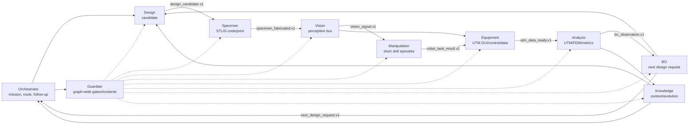

# 10. Orchestration Agent 고도화안 - Supervisor, 중간 의견 팔로업, 전역 실행 조율 루프

작성일: 2026-05-28
대상: `agents/orchestrator_agent.py`, `app/controller.py`, `orchestrator/langgraph_runtime.py`, `graphs/configs/atr_closed_loop.yaml`, `graphs/modules/*/module.yaml`, Live GUI

## 1. 결론

Orchestration Agent는 지금처럼 키워드 감지와 stage handoff만 담당하면 안 된다. 새로 만든 01-09 개선안 기준으로 보면, Orchestrator는 전체 자율 실험실의 "실험 진행 감독자"가 되어야 한다.

권장 역할은 다음이다.

```text
Orchestration Agent =
  mission intake / goal clarification
+ graph supervisor
+ context pack builder
+ handoff broker
+ intermediate opinion follow-up generator
+ decision register manager
+ Guardian/Operator approval coordinator
+ loop-level reflection writer
```

핵심은 "실험 수행" 같은 키워드를 기다렸다가 다음 agent로 넘기는 것이 아니라, 각 agent 사이에서 다음을 계속 해주는 것이다.

1. 지금 어떤 stage이고 무엇이 완료됐는지 해석한다.
2. 다음 agent에게 필요한 context를 정리해 handoff packet으로 넘긴다.
3. stage 중간/직후에 "내 판단은 이렇고, 이 점이 불확실하며, 다음은 이걸 추천한다"는 중간 의견 팔로업을 남긴다.
4. Guardian이 막은 것, Analysis/BO/Knowledge가 애매하게 본 것, Vision/Equipment가 불확실한 것을 operator에게 선택 가능한 형태로 보여준다.
5. loop가 끝날 때마다 이번 cycle의 의사결정, 실패, trade-off, 다음 cycle 방향을 기록한다.

## 2. 현재 코드 진단

현재 기반은 이미 있다.

- `orchestrator/langgraph_runtime.py`는 graph config 기반으로 stage를 실행한다.
- module config의 `pre_execution`, `internal_graph`, `safety.requires_human_approval`, retry/backoff, event emission이 존재한다.
- `app/controller.py`는 Live GUI planning chat, runtime event, approval queue, stage result formatting을 이미 갖고 있다.
- `graphs/configs/atr_closed_loop.yaml`은 `design -> specimen -> vision -> manipulation -> equipment -> analysis -> knowledge -> bo -> guardian -> design` route를 갖고 있다.

하지만 Orchestration Agent 자체는 좁다.

- `agents/orchestrator_agent.py`는 현재 `run_id`, `mode`, `stage`, `goal`, `loop_count`만 넣고 "Return short plan for the next stage"를 요청한다.
- Live GUI planning prompt는 "missing design values"와 "`실험 수행` keyword" 중심이다.
- `_should_trigger_design()`은 사실상 keyword trigger다.
- stage 결과 메시지는 존재하지만, "그래서 Orchestrator는 어떻게 판단하는가"가 빠져 있다.
- 새 개선안들에서 요구한 Vision signal, VLA task split, UTM data recovery, FEM/BO handoff, Knowledge/self-evolution, Guardian graph-wide gate를 하나의 운영 판단으로 묶지 못한다.

따라서 현재 Orchestrator는 supervisor라기보다 route helper에 가깝다.

## 3. 새 개선안 01-09 기준 Orchestrator가 맡아야 할 일

Design 개선안 기준:

- objective, constraints, 제조 가능성, BO candidate, failure memory를 한 번에 정리해 Design Agent에 넘긴다.
- Design 결과가 operator 목표와 맞는지 중간 의견을 남긴다.

Specimen 개선안 기준:

- STL/G-code/print path/digital thread가 끊기지 않게 handoff packet을 만든다.
- 실제 출력, 가상 출력, 설치 프린터, auto-ejection 여부를 operator에게 애매하지 않게 묻는다.

Vision 개선안 기준:

- Vision Agent를 단순 관측 agent가 아니라 "다음 agent에게 신호를 주는 perception bus"로 취급한다.
- basket/UTM/robot/GUI state signal을 사람이 이해할 수 있게 요약한다.

Manipulation 개선안 기준:

- `pick_to_utm`, `utm_to_discard`를 long-horizon 한 덩어리가 아니라 short skill 두 개로 관리한다.
- VLA/Pi0.5 inference는 Manipulation이 실행하지만, Orchestrator는 어떤 task를 언제 실행할지 stage plan으로 관리한다.

Lab Equipment 개선안 기준:

- PyAutoGUI macro ok만 믿지 않고 Vision/UTM data artifact cross-check가 끝났는지 follow-up한다.
- UTM 저장/회수 실패 시 Analysis로 넘기지 않고 recovery branch를 제안한다.

Analysis 개선안 기준:

- raw file -> preprocessing -> metrics -> FEM -> BO JSON의 pipeline status를 operator-friendly하게 설명한다.
- UTM/FEM divergence, parser confidence, previous loop comparison을 다음 loop 의사결정으로 연결한다.

BO 개선안 기준:

- BO candidate의 exploitation/exploration/uncertainty trade-off를 사람이 볼 수 있게 설명한다.
- LLM reasoning이 부각되도록 "왜 이 후보가 다음 실험인가"를 짧은 결정 메모로 남긴다.

Knowledge + Self-Evolution 개선안 기준:

- 성공/실패/incident/follow-up을 Knowledge memory와 Self-Evolution evidence pack으로 넘긴다.
- "어떤 agent를 고쳐야 하는가"를 loop reflection에서 후보로 만든다.

Guardian 개선안 기준:

- Guardian은 모든 agent 사이의 safety gate이고, Orchestrator는 그 gate 결과를 운영 언어로 번역한다.
- Guardian이 safety authority라면, Orchestrator는 workflow authority다.

## 4. 인터넷 조사 요약과 시사점

### 4.1 LangGraph supervisor: 지금 구조는 router가 아니라 supervisor로 가야 함

LangChain/LangGraph 문서는 supervisor pattern을 "central supervisor agent가 specialized worker agents를 coordinate하는 multi-agent architecture"로 설명한다. 또한 supervisor는 여러 domain tool을 한 agent에 몰아넣는 대신 worker를 나누고, 전체 workflow를 이해하는 상위 agent가 결과를 조합하는 구조에 적합하다고 한다.

우리 적용:

- Orchestrator는 Design/Specimen/Vision/Manipulation/Equipment/Analysis/Knowledge/BO/Guardian을 "subagent capability"로 이해해야 한다.
- 단순 stage router가 아니라, 각 agent의 결과를 읽고 다음 agent에 필요한 context를 만들고 operator에게 follow-up을 남기는 supervisor가 되어야 한다.
- 다만 실제 Python agent를 AutoGen식으로 새로 감싸기보다, 현재 LangGraph runtime 위에 supervisor layer를 얹는 것이 맞다.

출처:

- LangChain Supervisor Tutorial: https://docs.langchain.com/oss/python/langchain/supervisor
- LangChain Subagents: https://docs.langchain.com/oss/python/langchain/multi-agent/subagents

### 4.2 Supervisor와 Router는 다르다

LangChain subagents 문서는 supervisor는 ongoing conversation state를 유지하며 여러 turn에 걸쳐 동적으로 subagent를 호출하는 full agent이고, router는 보통 단일 classification step이라고 구분한다.

우리 현재 Orchestrator는 router/keyword detector에 더 가깝다. 목표는 다음이다.

```text
Before:
operator says keyword -> route to Design

After:
operator goal + runtime state + agent results + Guardian gate + evidence
-> Orchestrator forms opinion
-> asks only meaningful follow-up
-> builds handoff packet
-> records decision
-> routes graph
```

출처:

- LangChain Subagents: https://docs.langchain.com/oss/python/langchain/multi-agent/subagents
- LangChain Router: https://docs.langchain.com/oss/python/langchain/multi-agent/router

### 4.3 Handoff는 context engineering 문제다

LangChain handoffs 문서는 agent 사이에 전체 message history를 넘기면 receiving agent가 irrelevant internal reasoning 때문에 혼란스러워질 수 있고, token cost도 커진다고 설명한다. 필요한 context만 요약해 넘기는 것이 좋다.

우리 적용:

- Orchestrator는 전체 state dump를 넘기지 말고 stage별 `handoff_packet.v1`을 만든다.
- 예: Manipulation Agent에는 Design reasoning 전체가 아니라 `specimen_id`, `source_zone`, `target_zone`, `vision_pose`, `task_type`, `risk_flags`, `guardian_preconditions`만 넘긴다.
- Analysis Agent에는 Vision raw frame이 아니라 UTM file path, parser hints, specimen metadata, FEM cache key, expected objective만 넘긴다.

출처:

- LangChain Handoffs: https://docs.langchain.com/oss/python/langchain/multi-agent/handoffs

### 4.4 LangGraph frontend pattern: Live GUI는 node 상태와 streaming output을 보여줄 수 있다

LangGraph frontend 문서는 multi-step graph execution을 per-node status와 streaming content로 시각화하는 패턴을 제안한다. 이는 Orchestrator의 중간 의견 팔로업을 Live GUI timeline/agent tab에 붙이기 좋은 근거다.

우리 적용:

- 각 stage 시작/완료/불확실/blocked 시점에 `orchestrator.followup` event를 보낸다.
- Live GUI는 raw event만 보여주지 말고 "현재 판단", "추천", "선택지", "필요 응답"을 보여준다.

출처:

- LangGraph Frontend Overview: https://docs.langchain.com/oss/python/langgraph/frontend/overview

### 4.5 AutoGen: multi-agent는 대화형 조율과 human/tool 조합이 중요

Microsoft AutoGen 논문/프로젝트는 여러 agent가 서로 conversation하면서 task를 수행하고, LLM, human input, tools의 조합으로 flexible conversation pattern을 만들 수 있다고 설명한다.

우리 적용:

- 프레임워크를 AutoGen으로 바꿀 필요는 없다.
- 하지만 Orchestrator는 agent 간 "대화의 교환 형식"을 만들어야 한다.
- Agent outputs는 단순 data merge가 아니라 `claim`, `evidence`, `uncertainty`, `request_to_next_agent`, `question_to_operator`를 가져야 한다.

출처:

- Microsoft Research AutoGen: https://www.microsoft.com/en-us/research/publication/autogen-enabling-next-gen-llm-applications-via-multi-agent-conversation-framework/
- AutoGen Multi-agent Conversation Docs: https://microsoft.github.io/autogen/0.2/docs/Use-Cases/agent_chat

### 4.6 ReAct: reasoning과 acting을 interleaved해야 한다

ReAct 논문은 reasoning trace와 action을 interleaved하면 action plan update, exception handling, external observation 활용에 도움이 된다고 설명한다.

우리 적용:

- Orchestrator의 중간 의견 팔로업은 "보여주기용 말"이 아니라 observation을 보고 plan을 업데이트하는 작동 단위다.
- 예: Vision confidence가 낮으면 "추가 촬영 후 Manipulation"으로 계획을 바꾼다.
- 예: UTM macro ok지만 crosshead no-motion이면 "Equipment recovery -> Guardian incident"로 바꾼다.

출처:

- ReAct: https://arxiv.org/abs/2210.03629

### 4.7 Reflexion: loop 후 언어 피드백 memory가 다음 행동을 개선한다

Reflexion은 scalar/free-form feedback을 verbal reflection으로 저장해 다음 trial의 decision-making을 개선한다.

우리 적용:

- Orchestrator는 매 loop 끝에 `loop_reflection.v1`을 만든다.
- 이 reflection은 Knowledge Agent와 Self-Evolution으로 들어간다.
- "이번 loop에서 Orchestrator가 너무 늦게 질문했다", "Guardian gate가 뒤늦게 발동했다", "Equipment macro evidence가 부족했다" 같은 운영 개선점도 남긴다.

출처:

- Reflexion: https://arxiv.org/abs/2303.11366

### 4.8 ReWOO / LLMCompiler: 모든 것을 순차 ReAct로 돌리면 느리다

ReWOO는 reasoning과 tool observation을 분리해 token 효율과 robustness를 높이는 방향을 제안한다. LLMCompiler는 function calling plan을 만들고 독립 task를 병렬 실행해 latency/cost를 줄이는 구조를 제안한다.

우리 적용:

- 물리 action은 순차/보수적으로 가야 하지만, 문서 검색, Knowledge retrieval, candidate sanity check, FEM cache lookup, previous loop comparison은 병렬화할 수 있다.
- Orchestrator는 "어떤 것은 병렬 가능하고 어떤 것은 반드시 직렬이어야 하는지"를 mission plan에 표시해야 한다.

출처:

- ReWOO: https://arxiv.org/abs/2305.18323
- LLMCompiler: https://arxiv.org/abs/2312.04511

## 5. 권장 아키텍처

```text
Operator / Runtime Events
        |
        v
Mission Intake
        |
        v
Orchestration Plan Compiler
        |
        v
Context Pack Builder -> Handoff Broker -> Agent Stage
        |                              |
        |                              v
        |                       Stage Result / Evidence
        |                              |
        v                              v
Intermediate Opinion Follow-up <--- Result Critic
        |
        v
Guardian / Operator Approval Coordinator
        |
        v
Decision Register + Loop Reflection + Knowledge Memory
```

### 5.1 Mission Intake

현재처럼 "목표/재료/크기/구조"만 묻지 말고, 자율 실험실 실행에 필요한 mission contract를 만든다.

```json
{
  "mission_id": "mission_...",
  "goal": "maximize specific energy absorption of FDM-printable gyroid specimen",
  "mode": "test|live|replay",
  "operator_intent": "plan|dry_run|live_execute|pause|revise",
  "material": "PLA",
  "specimen_size_mm": [30, 30, 30],
  "objective_type": "specific_energy_absorption",
  "constraints": {},
  "safety_budget": {
    "max_loop_count": 5,
    "max_print_time_min": 120,
    "max_robot_live_rollouts": 2,
    "requires_guardian_gate": true
  }
}
```

### 5.2 Orchestration Plan Compiler

실험 루프를 매번 텍스트로만 말하지 말고, 실행 가능한 plan object로 만든다.

```json
{
  "schema": "orchestration_plan.v1",
  "run_id": "run_...",
  "loop_id": 1,
  "route": [
    "guardian.pre_design",
    "design",
    "guardian.post_design",
    "specimen",
    "vision",
    "manipulation.pick_to_utm",
    "equipment.utm_test",
    "analysis",
    "knowledge",
    "bo",
    "guardian.loop_review"
  ],
  "parallelizable_checks": [
    "knowledge.retrieve_prior_failures",
    "analysis.lookup_fem_cache",
    "guardian.preflight_devices"
  ],
  "serial_physical_actions": [
    "printer.start",
    "robot.pick_to_utm",
    "utm.start_test",
    "robot.utm_to_discard"
  ],
  "expected_artifacts": [
    "design_spec.json",
    "specimen.stl",
    "vision_frames",
    "utm_raw_file",
    "analysis_bo_handoff.json",
    "guardian_events.jsonl"
  ]
}
```

### 5.3 Context Pack Builder

각 agent에는 필요한 것만 준다.

```json
{
  "schema": "handoff_packet.v1",
  "from_stage": "vision",
  "to_stage": "manipulation",
  "task": "pick_to_utm",
  "objective": "Move specimen from basket/output zone to UTM fixture datum.",
  "inputs": {
    "specimen_id": "sp_001",
    "source_zone": "basket",
    "target_zone": "utm_fixture",
    "pose_estimate": {"x": 0.1, "y": 0.2, "theta": 0.0, "confidence": 0.82}
  },
  "required_outputs": [
    "task_status",
    "final_pose",
    "sarm_progress",
    "risk_flags",
    "evidence_refs"
  ],
  "guardian_preconditions": [
    "vision.zone.fixture_clear",
    "robot.heartbeat.ok",
    "policy.checkpoint.approved"
  ]
}
```

### 5.4 Intermediate Opinion Follow-up

이게 이번 개선안의 핵심이다. Orchestrator는 stage마다 operator에게 너무 많이 말하면 안 되지만, 의미 있는 불확실성/결정 지점에서는 짧게 의견을 남겨야 한다.

권장 schema:

```json
{
  "schema": "orchestrator_followup.v1",
  "run_id": "run_...",
  "loop_id": 1,
  "stage": "vision",
  "trigger": "post_stage|risk_change|missing_input|branch_decision|approval_required",
  "opinion": "Vision confidence is usable but not strong enough for direct live manipulation.",
  "confidence": 0.72,
  "evidence_refs": ["artifact://vision/frame_001.png"],
  "concerns": ["pose confidence below live manipulation preferred threshold"],
  "recommendation": "Capture 5 additional frames, then run Guardian pre_manipulation gate.",
  "options": [
    {"id": "continue", "label": "Proceed with caution", "risk": "medium"},
    {"id": "recapture", "label": "Recapture vision evidence", "risk": "low"}
  ],
  "question_to_operator": null,
  "requires_response": false
}
```

Korean Live GUI 문장 예:

```text
현재 제 판단: Vision은 시편 존재를 확인했지만 pose confidence가 live 조작 기준에는 살짝 애매합니다.
추천: 바로 Manipulation으로 넘기기보다 5프레임 추가 촬영 후 Guardian pre_manipulation gate를 통과시키는 쪽이 안전합니다.
```

### 5.5 Decision Register

모든 중요한 분기에는 결정 기록이 남아야 한다.

```json
{
  "schema": "decision_register.v1",
  "decision_id": "dec_...",
  "run_id": "run_...",
  "loop_id": 2,
  "stage": "bo",
  "decision": "select_candidate",
  "selected": "candidate_017",
  "alternatives": ["candidate_014", "candidate_021"],
  "reason": "Higher expected improvement with acceptable manufacturability risk.",
  "authority": "orchestrator|guardian|operator|bo_agent",
  "evidence_refs": ["artifact://analysis/bo_handoff.json"],
  "created_at": "2026-05-28T00:00:00Z"
}
```

## 6. Follow-up trigger 규칙

항상 follow-up:

- run start / mission intake complete
- stage handoff
- stage result
- Guardian block/recover/safe_stop
- human approval request
- loop review

조건부 follow-up:

- confidence 낮음
- missing artifact
- retry 발생
- risk score 상승
- UTM macro와 vision/physical state 불일치
- Analysis uncertainty 높음
- UTM/FEM divergence 높음
- BO가 risky candidate를 제안
- Knowledge가 evidence 부족 판정
- self-evolution variant가 제안됨

스팸 방지:

- 같은 stage에서 정상 진행이면 1개만
- `requires_response=false`인 의견은 짧게
- operator 질문은 선택지가 있을 때만
- Guardian 안전 판단은 Orchestrator가 덮어쓰지 않음

## 7. Agent별 follow-up 예시

Design 후:

```text
현재 판단: 설계는 objective와 제조 제약을 만족하지만 print time이 상한에 가깝습니다.
추천: 이번 loop에서는 진행하고, 다음 BO 후보에서는 wall thickness나 relative density를 살짝 낮추는 방향을 보겠습니다.
```

Specimen 후:

```text
현재 판단: STL과 slicer 준비는 끝났지만 auto-ejection evidence가 아직 없습니다.
추천: Vision Agent가 bed/basket 상태를 확인한 뒤 Manipulation으로 넘기겠습니다.
```

Vision 후:

```text
현재 판단: basket 안의 시편은 확인됐고 UTM fixture는 비어 있습니다.
추천: Manipulation task A, pick_to_utm을 실행해도 됩니다. Guardian pre_manipulation gate만 통과시키겠습니다.
```

Manipulation 후:

```text
현재 판단: 시편은 UTM fixture에 올라간 것으로 보이지만 SARM recovery hint가 약하게 떴습니다.
추천: Equipment Agent로 넘기기 전에 Vision이 fixture 정렬을 한 번 더 확인하는 쪽이 낫습니다.
```

Equipment 후:

```text
현재 판단: UTM macro는 성공으로 반환됐지만 결과 파일이 아직 Linux artifact path에 없습니다.
추천: Analysis로 넘기지 말고 save/export recovery를 먼저 수행하겠습니다.
```

Analysis 후:

```text
현재 판단: raw UTM 데이터는 분석 가능하지만 FEM 결과와 강성 차이가 큽니다.
추천: BO에는 보수적 uncertainty를 붙여 넘기고, Knowledge에는 divergence incident로 기록하겠습니다.
```

BO 후:

```text
현재 판단: BO 후보는 exploration 성격이 강합니다. 성능 개선 가능성은 있지만 제조 리스크가 이전 후보보다 큽니다.
추천: Guardian이 design constraints를 통과하면 다음 loop 후보로 채택하고, 아니면 second-best 후보로 내려가겠습니다.
```

Guardian 후:

```text
현재 판단: 안전상 즉시 중단할 정도는 아니지만 장비 health warning과 retry pressure가 누적됐습니다.
추천: 다음 loop를 바로 시작하지 말고 operator 승인 또는 dry-run 재검증을 받는 편이 좋습니다.
```

## 8. 현재 환경 기준 구현 방안

### Phase 0. Prompt/encoding 정리

`app/controller.py`의 Live GUI prompt와 일부 한국어 문구가 깨진 상태로 보인다. 우선 Orchestrator 관련 사용자-facing string을 UTF-8로 정리해야 한다.

정리 대상:

- `_build_live_orchestrator_prompt`
- `_build_test_mode_orchestrator_prompt`
- `_should_trigger_design`
- `_format_planning_stage_message`
- `_format_planning_bo_message`

### Phase 1. Keyword trigger를 intent state machine으로 교체

`실험 수행` 키워드는 유지하되, 유일한 trigger로 쓰지 않는다.

권장 intent:

```text
ask_question
revise_goal
set_constraint
approve_plan
start_dry_run
start_live_run
pause
resume
stop
request_status
select_option
operator_note
```

처음에는 deterministic extractor + LLM fallback이면 충분하다.

### Phase 2. `orchestrator_followup.v1` event 추가

현재 `emit_runtime_event`와 `_append_planning_message` 기반을 그대로 쓴다.

권장 추가 함수:

```text
_build_orchestrator_followup(stage, data, trigger, guardian_context)
_emit_orchestrator_followup(followup)
_append_followup_to_planning_timeline(followup)
```

`orchestrator/langgraph_runtime.py`의 `agent_result`, `retry`, `fatal_error`, `stage_transition`, `approval.requested` 뒤에 hook을 붙인다.

### Phase 3. Handoff packet 생성

각 stage transition 전에 Orchestrator가 `handoff_packet.v1`을 만들어 `state.run_metadata["handoff_packets"]`에 저장한다.

초기에는 Python 함수로 deterministic builder를 만들고, 복잡한 설명만 LLM이 보강한다.

### Phase 4. Loop reflection

Guardian loop review 이후 Orchestrator가 `loop_reflection.v1`을 생성한다.

```json
{
  "loop_id": 1,
  "what_worked": [],
  "what_failed_or_nearly_failed": [],
  "operator_visible_summary": "",
  "next_loop_recommendation": "",
  "knowledge_updates": [],
  "self_evolution_candidates": []
}
```

이 record는 Knowledge Agent와 Self-Evolution evidence pack으로 보낸다.

### Phase 5. Parallel planning checks

물리 실행은 직렬로 두되, 다음은 병렬화할 수 있다.

- prior failure retrieval
- FEM cache lookup
- BO candidate constraint check
- device health read-only check
- existing artifact lookup
- previous loop comparison

현재 환경에서는 `multi_tool_use.parallel` 같은 개념을 runtime 내부에 넣는 것이 아니라, LangGraph node 또는 async task로 작게 시작한다.

### Phase 6. Live GUI UX

Orchestrator tab은 다음을 보여준다.

- 현재 mission contract
- active route and stage
- latest follow-up opinion
- open questions
- decision register
- blocked/recovery items
- next recommended action
- operator response needed 여부

Agent tab에는 해당 agent와 관련된 Orchestrator follow-up만 필터링해 보여준다.

## 9. Orchestrator와 Guardian의 권한 분리

혼동을 피하려면 역할을 이렇게 나눈다.

```text
Guardian:
  safety, risk, policy, approval, block/safe_stop authority

Orchestrator:
  workflow, context, handoff, operator communication, decision narrative authority
```

예:

- Guardian: "robot action out of bounds, block"
- Orchestrator: "Manipulation을 멈추고 Vision recapture -> Guardian pre_manipulation으로 돌아가겠습니다."

- Guardian: "UTM export missing, block analysis"
- Orchestrator: "Equipment save/export recovery를 먼저 실행하고, 파일이 들어오면 Analysis로 넘기겠습니다."

## 10. 최종 권장안

Orchestration Agent의 최종 목표는 "키워드로 stage를 넘기는 agent"가 아니라 "모든 agent 사이에서 의미 있는 운영 판단을 이어주는 supervisor"다.

가장 먼저 해야 할 일은 크지 않다.

1. `orchestrator_followup.v1` schema를 만든다.
2. stage result마다 짧은 중간 의견을 생성한다.
3. keyword trigger를 intent state machine으로 바꾼다.
4. handoff packet을 stage별로 만든다.
5. loop reflection을 Knowledge/Self-Evolution으로 넘긴다.

이렇게 하면 Live GUI에서 사용자는 "지금 agent들이 뭐 하는지"뿐 아니라 "시스템이 지금 어떻게 판단하고 있고, 왜 다음 선택을 하려는지"를 볼 수 있다. 완전 자율 실험실에서는 이 차이가 크다. 자율성이 높아질수록 Orchestrator는 조용한 라우터가 아니라, 판단을 투명하게 남기는 운영 supervisor가 되어야 한다.

## 11. 참고 출처

- LangChain Supervisor Tutorial: https://docs.langchain.com/oss/python/langchain/supervisor
- LangChain Subagents: https://docs.langchain.com/oss/python/langchain/multi-agent/subagents
- LangChain Handoffs: https://docs.langchain.com/oss/python/langchain/multi-agent/handoffs
- LangChain Router: https://docs.langchain.com/oss/python/langchain/multi-agent/router
- LangGraph Frontend Overview: https://docs.langchain.com/oss/python/langgraph/frontend/overview
- LangGraph Persistence: https://docs.langchain.com/oss/python/langgraph/persistence
- LangGraph Interrupts: https://docs.langchain.com/oss/python/langgraph/interrupts
- Microsoft Research AutoGen: https://www.microsoft.com/en-us/research/publication/autogen-enabling-next-gen-llm-applications-via-multi-agent-conversation-framework/
- AutoGen Multi-agent Conversation Docs: https://microsoft.github.io/autogen/0.2/docs/Use-Cases/agent_chat
- ReAct: Synergizing Reasoning and Acting in Language Models: https://arxiv.org/abs/2210.03629
- Reflexion: Language Agents with Verbal Reinforcement Learning: https://arxiv.org/abs/2303.11366
- ReWOO: Decoupling Reasoning from Observations for Efficient Augmented Language Models: https://arxiv.org/abs/2305.18323
- LLMCompiler: An LLM Compiler for Parallel Function Calling: https://arxiv.org/abs/2312.04511

## Live GUI 고도화 추가안 - 고도화안 기준

Orchestration Agent의 Live GUI는 keyword router의 로그가 아니라 전체 autonomous lab run의 supervisor 화면이어야 한다. 새로 만든 모든 agent 고도화안을 기준으로, Orchestrator는 각 agent의 중간 의견을 follow-up하고, handoff packet을 검증하며, 사용자 질문/승인/수정이 필요한 지점을 Live GUI chat에 올린다. 별도 Objective Agent md가 없으므로 objective intake Live GUI 요구사항도 이 문서에 포함한다.

### Live GUI chat에 떠야 할 메시지

- mission intake: 사용자의 자연어 목표를 experiment contract로 해석한 결과와 누락 값을 표시한다.
- route selection: 이번 loop가 Design -> Specimen -> Vision -> Manipulation -> Equipment -> Analysis -> BO 순서인지, skip/retry가 있는지 표시한다.
- 중간 의견 follow-up: 각 agent가 낸 decision/warning/question을 Orchestrator가 "왜 중요한지" 한 줄로 번역해 chat에 올린다.
- handoff validation: 다음 agent에 넘길 packet이 schema/evidence/precondition을 만족하는지 표시한다.
- operator question: objective ambiguity, 위험 작업 승인, 데이터 품질 저하, BO 후보 선택 충돌 같은 질문을 interrupt UI로 올린다.
- loop reflection: 한 loop가 끝나면 성과, 실패/near-miss, 다음 loop 목표를 짧게 요약한다.

### Orchestration Agent 특화 보고서 페이지

- Mission contract: objective, constraints, sample id policy, success metric, stop condition.
- Graph route map: agent node status, current node, skipped/retried node, pending interrupt.
- Follow-up timeline: agent별 중간 의견, Orchestrator 판단, operator response.
- Handoff registry: `design_candidate.v1`, `specimen_fabricated.v1`, `vision_signal.v1`, `robot_task_result.v1`, `utm_data_ready.v1`, `bo_observation.v1`, `next_design_request.v1`, `knowledge_context.v1`, `evolution_proposal.v1`, `guardian_decision.v1`, `incident_record.v1`.
- Decision register: supervisor routing, retry/skip/stop/resume 이유.
- Global artifact ledger: STL/G-code/video/screenshots/raw data/FEM/BO JSON/evidence pack.
- Run health: latency, stale signal, missing evidence, Guardian risk summary.

### Live GUI 공통 메시지 계약

```json
{
  "schema": "live_chat_message.v1",
  "run_id": "run-...",
  "agent_id": "design|specimen|vision|manipulation|equipment|analysis|bo|knowledge|guardian|orchestrator",
  "message_type": "status|question|decision|warning|handoff|artifact|approval|incident|signal",
  "severity": "info|warning|error|critical",
  "headline": "one-line operator-facing update",
  "body": "short explanation grounded in current state",
  "requires_response": false,
  "actions": ["approve", "edit", "retry", "pause", "open_report"],
  "evidence_refs": ["artifact://...", "trace://...", "memory://..."],
  "handoff_packet_ref": "packet://...",
  "next_agent": "optional-agent-id"
}
```

### Live GUI 공통 보고서 계약

기존 `_agent_report_payload()`는 `overview`, `role_specific`, `messages`, `events`, `process_steps`, `tool_calls`, `artifacts`, `warnings`, `handoff`, `next_action`, `backend_refs`를 이미 반환한다. 여기에 고도화안 기준으로 다음 section을 공통 확장한다.

- `decisions`: 각 agent가 내린 선택과 근거.
- `metrics`: agent별 수치 상태. 예: confidence, acquisition score, parser confidence, risk score.
- `evidence_quality`: 필요한 이미지/파일/trace/memory가 충분한지.
- `interrupts`: 승인/수정/거절 대기 항목.
- `handoff_packets`: 다음 agent가 실제로 소비할 structured payload.
- `incident_refs`: Guardian/Knowledge에 축적되는 사고 및 near-miss 연결.

### 개선안 간 유기적 연결성 점검

현재 01-10 개선안은 한 줄 pipeline으로만 연결되는 구조가 아니라, 실행 plane, safety plane, memory/evolution plane, Live GUI plane이 겹쳐 움직이는 구조로 정리된다.



연결성 체크 결과:

- 핵심 실행 loop는 `Design -> Specimen -> Vision -> Manipulation -> Equipment -> Analysis -> BO -> Design`으로 닫힌다.
- Vision은 단순 관측자가 아니라 Specimen, Manipulation, Equipment, Guardian이 소비하는 `vision_signal.v1` bus다.
- Guardian은 loop 끝 검토자가 아니라 모든 물리 action, 장비 macro, 데이터 품질 저하, self-evolution 배포 전 gate다.
- Knowledge는 loop 후 기록 저장소가 아니라 Design/BO/Analysis가 읽는 context provider이고, Self-Evolution proposal을 Guardian 승인 대상으로 올린다.
- Orchestrator는 data owner가 아니라 handoff broker, 중간 의견 follow-up, interrupt coordinator다.
- Live GUI는 별도 장식이 아니라 모든 packet, decision, incident, evidence를 사람이 읽는 control surface다.

구현 전 반드시 맞춰야 하는 약한 연결점:

- 각 packet schema에 공통 필드 `run_id`, `loop_id`, `specimen_id`, `producer_agent`, `consumer_agent`, `evidence_refs`, `guardian_status`를 넣어야 한다.
- Vision signal의 freshness 기준이 필요하다. `vision_signal.v1`은 `timestamp`, `stable_for_ms`, `expires_at` 없이 쓰면 Manipulation/Equipment가 stale perception을 소비할 수 있다.
- Analysis/FEM 결과가 BO로 갈 때 실험값과 simulation residual을 분리해야 한다. BO가 FEM prediction을 실제 observation처럼 먹으면 loop가 잘못 학습한다.
- Knowledge/Self-Evolution 제안은 Orchestrator가 routing해도, 배포 권한은 Guardian + operator approval로 닫아야 한다.
- Live GUI report의 `decisions`가 비어 있으면 유기적 연결이 깨진다. agent마다 "왜 다음 stage로 넘겼는지"가 남아야 나중에 incident와 self-evolution이 가능하다.

### 참고 출처

- LangGraph graph execution은 node status와 streaming content를 Live GUI에 표시하는 기본 패턴이다: https://docs.langchain.com/oss/python/langgraph/frontend/graph-execution
- LangGraph interrupts는 approve/edit/reject와 resume을 지원하는 human-in-the-loop 패턴이다: https://docs.langchain.com/oss/python/langgraph/interrupts
- LangSmith observability는 tool call, decision point, metadata trace를 추적하는 기준이다: https://docs.langchain.com/oss/python/langchain/observability
- AutoGen Studio는 multi-agent workflow를 chat에서 테스트하고 inner monologue/action/profile을 보는 UI 사례다: https://autogenhub.github.io/autogen/docs/autogen-studio/usage/
- OpenTelemetry semantic conventions는 trace/log/metric 이름을 표준화하는 근거다: https://opentelemetry.io/docs/concepts/semantic-conventions/
- NN/g usability heuristics는 system status visibility, user control, error prevention/recovery의 UI 원칙으로 삼는다: https://www.nngroup.com/articles/ten-usability-heuristics/
