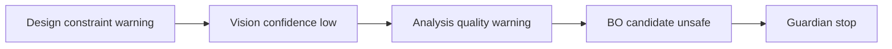
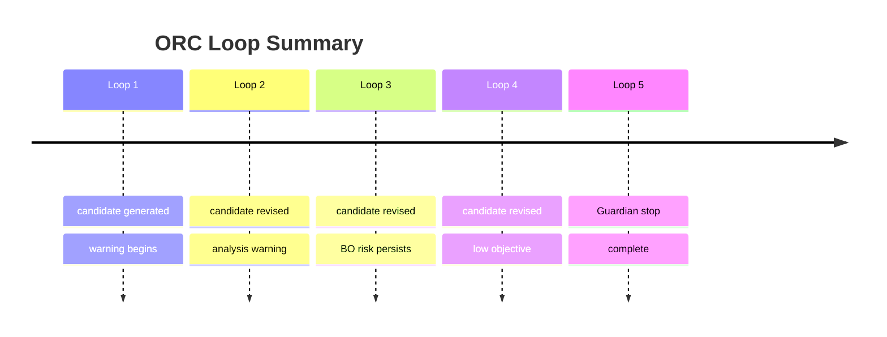

# ORC One-Page Briefing Upgrade Plan

## 0. 목적

현재 ORC 리포트는 데이터가 부족하다기보다, 오케스트레이터가 가진 판단 데이터를 한 화면에서 읽히는 형태로 압축하는 프론트엔드 계층이 부족하다.

목표는 ORC 리포트를 다음처럼 바꾸는 것이다.

> 한 페이지 안에서 현재 미션 결론, 중단/완료 이유, 위험 체인, 다음 조치, 런타임 건강 상태, handoff 품질을 즉시 파악하는 지휘관 브리핑 화면.

이번 문서는 구현 전 사고 정리용이다. 코드 수정은 포함하지 않는다.

## 1. 근거

### 1.1 현재 run 기준 관찰

최근 test run:

- Run ID: `run-20260612T161643Z-6aab68`
- 최종 stage: `complete`
- 종료 경로: `guardian -> complete`
- 최종 요약: `Loop 5 finished with Guardian decision=stop. 50 supervisor decisions and 50 follow-ups are recorded.`
- GPU/RAM telemetry: 정상
- 주요 warning:
  - `test_protocol` missing
  - `cell_size_mm below 3x wall thickness rule`
  - `VISION_CONFIDENCE_LOW`
  - `BO_CANDIDATE_UNSAFE`
  - observed objective below expected proxy score

현재 ORC payload에는 아래 데이터가 이미 존재한다.

- `role_specific.orchestrator_control_plane`
- `mission_contract`
- `route_state`
- `missing_inputs`
- `decision_register`
- `followup_timeline`
- `handoff_registry`
- `parallel_check_batches`
- `latest_loop_reflection`

문제는 데이터 부재가 아니라, 이 데이터를 보고서가 아닌 command briefing으로 재구성하지 못하는 점이다.

### 1.2 외부 자료에서 가져올 원칙

- NN/g는 dashboard를 single-page at-a-glance 정보로 보고, 빠른 판단과 낮은 cognitive load를 강조한다. 특히 operational dashboard는 즉시 판단해야 하는 상태, deviation, resource를 빠르게 보여줘야 한다.  
  Source: https://www.nngroup.com/articles/dashboards-preattentive/

- Microsoft Power BI 문서는 dashboard가 한 페이지 canvas이며 핵심 story의 highlights만 담고, 상세는 underlying report로 drill-down하게 설계하라고 설명한다.  
  Source: https://learn.microsoft.com/en-us/power-bi/create-reports/service-dashboards

- Power BI design tips는 가장 중요한 정보를 top-left/high-level에 두고, clutter와 scrollbar를 줄이며, 같은 크기의 텍스트/시각요소가 초점을 흐리지 않게 하라고 한다.  
  Source: https://learn.microsoft.com/en-us/power-bi/create-reports/service-dashboards-design-tips

- Apache ECharts는 다양한 chart type, Canvas/SVG renderer, dataset transform, responsive design, accessibility-friendly description/decal pattern을 지원한다.  
  Source: https://echarts.apache.org/

- Vega-Lite는 common visualization을 concise declarative spec으로 만들고, 고급 케이스는 Vega로 확장할 수 있다.  
  Source: https://vega.github.io/vega-lite/

- Cytoscape.js는 graph theory visualization과 graph analysis를 위한 JS library로, route/risk graph나 handoff network가 복잡해질 때 후보가 된다.  
  Source: https://js.cytoscape.org/

- Mermaid는 flowchart, state diagram, timeline, sankey 등 문서/설계 단계의 diagram 표현에 적합하다.  
  Source: https://mermaid.ai/open-source/syntax/flowchart.html

## 2. 핵심 판단

ORC 리포트는 "데이터 카드 모음"이 아니라 "mission commander briefing"이어야 한다.

현재 부족한 사용자 질문은 네 가지다.

1. 지금 결론이 뭔가?
2. 왜 그렇게 판단했나?
3. 어느 agent/gate가 병목이었나?
4. 다음에 뭘 고치면 다시 잘 돈다?

따라서 ORC 화면의 첫 화면은 아래 정보만 강하게 보여줘야 한다.

- Mission verdict
- Stop or continue reason
- Risk chain
- Next action
- Runtime readiness
- Handoff quality

상세 decision, raw trace, artifact list, full event log는 같은 페이지 안에서 접히거나 drill-down되어야 한다.

## 3. 한 페이지 정보 구조

### 3.1 Desktop, chat collapsed or report focus

```text
--------------------------------------------------------------------------------+
| ORC BRIEFING                                                                  |
| COMPLETE / Guardian-directed stop      Next: fix protocol + candidate rules    |
| Run, mode, loop, backend, runtime health                                      |
+--------------------------------------------------------------------------------+
| Verdict             | Runtime Readiness       | Missing / Approval Gate        |
| - complete          | - OpenAI ready          | - test_protocol missing        |
| - guardian stop     | - Windows fallback ok   | - no pending approvals         |
| - loop 5            | - GPU/RAM ready         | - allow_with_warning path      |
+--------------------------------------------------------------------------------+
| Risk Chain                                                                     |
| Design rule warning -> Vision low confidence -> Analysis boundary -> BO unsafe |
| -> Guardian stop                                                               |
+--------------------------------------------------------------------------------+
| Route Execution Rail                                                           |
| DSN -> SPC -> VIS -> MAN -> EQP -> ANL -> KNW -> BO -> GRD                    |
+--------------------------------------------------------------------------------+
| Decision Audit                  | Handoff QA Matrix                            |
| latest 3-5 key decisions         | producer -> consumer / evidence / warning   |
+--------------------------------------------------------------------------------+
| Loop Timeline                                                                  |
| Loop 1 ... Loop 5, compact run story                                           |
+--------------------------------------------------------------------------------+
```

### 3.2 Desktop, chat visible

Chat이 열려 있을 때는 center panel 폭이 줄어든다. 이때 ORC는 카드 수를 줄이고 세부표를 접는다.

```text
--------------------------------------------------------------------------------+
| ORC BRIEFING: verdict + reason + next action                                  |
+--------------------------------------------------------------------------------+
| Risk Chain compact strip                                                       |
+--------------------------------------------------------------------------------+
| Route Rail                                                                     |
+--------------------------------------------------------------------------------+
| Decision Audit tabs: Decisions / Handoffs / Loops                              |
+--------------------------------------------------------------------------------+
```

### 3.3 Mobile or narrow viewport

모바일은 desktop grid를 단순 세로로 쌓지 않는다. 핵심 브리핑을 먼저 보여주고, route/risk/details는 accordion으로 간다.

```text
[Verdict]
[Next Action]
[Risk Chain]
[Route Rail]
[Details accordion: decisions, handoffs, loops, runtime]
```

## 4. ORC 전용 시각화 인벤토리

| Layer | Analytical job | Data source | Recommended visual | Renderer |
| --- | --- | --- | --- | --- |
| Mission Verdict | status summary | `state`, `latest_loop_reflection`, `guardian_decision` | large status card + short reason line | HTML/CSS |
| Risk Chain | causal flow | `warnings`, `incident_records`, `risk_register`, events | left-to-right severity chain | SVG or HTML/CSS |
| Route Execution | stage progress | `route_state.route` | compact stage rail with status chips | HTML/CSS, optional SVG |
| Decision Audit | latest key choices | `decision_register.items` | 3-5 decision rows, grouped by selected transition | HTML/CSS table |
| Handoff QA | producer/consumer quality | `handoff_registry`, handoff packets | matrix: from, to, evidence, warning, status | HTML/CSS table |
| Runtime Readiness | live ops health | `/api/state`, backend status, device state | small readiness ledger | HTML/CSS + mini bars |
| Loop Timeline | time change | loop reflections, stage transitions | horizontal strip or sparkline timeline | SVG/ECharts |
| Backend Detail | evidence drill-down | backend trace endpoint | collapsed details, raw JSON only on demand | existing backend view |

## 5. 추천 시각화 방향

### 5.1 기본 원칙

- Hover 없이 핵심 값이 보여야 한다.
- Color는 severity/category 보조 신호로만 쓰고, status text와 icon/shape를 같이 쓴다.
- Pie, donut, gauge는 쓰지 않는다. ORC는 빠른 비교/상태판독이 필요하므로 length, position, explicit label 중심이 낫다.
- 모든 chart는 "무슨 결론을 말하는지"가 title 자체에 있어야 한다.
- Raw JSON은 report에 직접 노출하지 않고 Backend/Trace로 보낸다.

### 5.2 라이브러리 후보

Primary:

- HTML/CSS + small inline SVG
  - ORC의 1차 목표는 reporting dashboard가 아니라 operational briefing이므로, DOM 기반 카드/rail/matrix가 가장 유지보수 쉽다.

Secondary:

- Apache ECharts
  - loop timeline, runtime trend, acquisition/progress chart처럼 반복 chart가 많고 responsive + accessibility가 필요한 곳에 적합하다.
  - Canvas/SVG 전환과 dataset transform이 있어 Live GUI의 stream/update 패턴에 잘 맞는다.

- Vega-Lite
  - static report-like chart spec을 backend에서 내려주거나, report figure를 재생성 가능한 JSON spec으로 보관할 때 적합하다.

- Mermaid
  - 개선안 문서, 설계 artifact, static flow 설명에 적합하다.
  - runtime rendering에는 control이 약하므로 production ORC 화면의 core renderer로는 쓰지 않는다.

- Cytoscape.js
  - future phase에서 graph/handoff network가 커져서 pan/zoom/selection이 필요할 때만 사용한다.
  - 현재 ORC 한 페이지에는 과하다.

## 6. 제안하는 ORC 카드 계층

### 6.1 Commander Brief

화면 최상단 고정 카드. ORC의 존재 이유.

필드:

- `verdict`: `COMPLETE`, `RUNNING`, `WAITING`, `ERROR`, `SAFE_STOP`
- `verdict_driver`: `Guardian-directed stop`, `operator approval`, `normal complete`
- `why`: 1줄 원인
- `next_action`: 1줄 조치
- `evidence_summary`: loops, warnings, completed route count, pending approvals

예시:

```text
COMPLETE / Guardian-directed stop
Why: BO candidate unsafe after analysis boundary warning and low vision confidence.
Next: define test_protocol, tighten cell-size/wall constraints, rerun design.
Evidence: loop 5, 9/9 route complete, 7 guardian incidents, 0 pending approvals.
```

### 6.2 Risk Chain

ORC가 왜 그런 결론을 냈는지 causal chain으로 보여준다.



UI에서는 각 node를 severity chip으로 표현한다.

- amber: warning
- red: blocking/safe-stop
- cyan: evidence exists
- muted: inferred/not direct

### 6.3 Route Execution Rail

기존 route rail을 유지하되, "현재 stage"보다 "이번 run의 완료/경고/병목"에 초점을 둔다.

```text
DSN done -> SPC warn -> VIS warn -> MAN warn -> EQP warn -> ANL warn -> KNW done -> BO warn -> GRD stop
```

각 stage는 다음 mini metadata를 가진다.

- status
- warning count
- artifact count
- handoff completeness

### 6.4 Decision Audit

50개 decision을 전부 보여주는 것은 ORC 브리핑이 아니다. 기본은 최근 핵심 3-5개만 보여준다.

기본 노출:

- latest transition
- latest guardian decision
- latest BO decision
- latest unresolved warning source
- latest operator decision if any

상세는 `View all decisions`로 backend/detail panel에 연결한다.

### 6.5 Handoff QA Matrix

단순 producer -> consumer가 아니라, 각 handoff가 소비자에게 충분했는지 보여준다.

| From | To | Required output | Evidence | Warning | QA |
| --- | --- | --- | --- | --- | --- |
| Design | Specimen | candidate spec | present | wall/cell rule | warn |
| Vision | Manipulation | bounded signal | present | low confidence | warn |
| Analysis | BO | observed metric | present | boundary peak | warn |
| BO | Guardian | candidate ranking | present | unsafe candidate | warn |

### 6.6 Runtime Readiness Strip

ORC는 전체 지휘관이므로 backend/runtime 상태를 한 줄로 갖고 있어야 한다.

```text
Backend: OpenAI ready
Windows fallback: active
GPU: ready
RAM: ready
CalculiX/Gmsh: available
Server: live
```

이 strip은 `Backend` 탭을 대체하지 않는다. 단지 첫 화면에서 "실패가 시스템 문제인지 실험 문제인지"를 가르는 신호다.

### 6.7 Loop Timeline

Loop 1~5가 있었는데 현재 ORC 화면은 이 story를 압축하지 못한다.

필요한 표시:

- loop number
- selected candidate/specimen
- objective/proxy value if available
- dominant warning
- route outcome



## 7. Data adapter 필요성

지금 `planning.js`가 raw payload를 여기저기서 직접 읽는다. ORC가 고도화되려면 renderer 앞에 adapter가 필요하다.

제안 adapter:

```text
buildOrcBriefingModel(report, liveState, liveRunEvents, liveArtifacts) -> OrcBriefingModel
```

예상 schema:

```json
{
  "verdict": {
    "status": "complete",
    "driver": "guardian_stop",
    "why": "BO candidate unsafe after analysis and vision warnings.",
    "next_action": "Resolve test_protocol and tighten design constraints."
  },
  "route": [],
  "risk_chain": [],
  "decision_audit": [],
  "handoff_qa": [],
  "runtime_readiness": [],
  "loop_timeline": []
}
```

이 adapter가 있어야 ORC 화면이 backend raw shape에 덜 흔들리고, 나중에 agent report 모듈화에도 연결된다.

## 8. 구현 단계 제안

아직 구현하지 않는다. 구현한다면 아래 순서가 낫다.

1. ORC model adapter 작성
   - raw `report`에서 `OrcBriefingModel` 생성
   - unit test로 최근 run payload fixture 검증

2. Commander Brief + Risk Chain 우선 구현
   - 첫 화면 체감이 가장 크게 바뀐다.
   - 기존 `Mission Control`, `Gate Board`, `Supervisor Signals` 중복을 줄인다.

3. Route Rail + Decision Audit 재배치
   - 현재 route rail은 살리되 status semantics를 보강한다.

4. Handoff QA Matrix 추가
   - backend에 없는 값은 우선 "unknown"으로 표시하고, raw trace 링크를 붙인다.

5. Runtime Readiness Strip 추가
   - `/api/state`, `/api/cae/config`, backend selection 상태를 얕게 연결한다.

6. Loop Timeline 추가
   - loop reflection, decision register, stage transition에서 간단히 구성한다.

7. Responsive QA
   - chat collapsed
   - chat visible
   - 100%, 125%, 150% browser zoom
   - 1366px, 1920px, mobile portrait

## 9. QA 기준

성공 기준:

- 1920x1080에서 ORC 핵심 브리핑이 첫 화면 안에 들어온다.
- chat visible 상태에서도 결론, 위험 체인, route 상태가 접히지 않는다.
- `test_protocol missing`처럼 이상해 보이는 상태가 숨겨지지 않고 explanation이 붙는다.
- GPU/RAM/backend 문제가 아닌 실험 품질 문제로 종료된 경우, 사용자가 바로 구분한다.
- hover 없이 verdict, why, next action, risk chain을 읽을 수 있다.
- 모든 색상 status는 텍스트/icon으로 중복 인코딩한다.
- Backend 탭은 raw trace용으로 남고, Report 탭은 raw JSON dump를 하지 않는다.

실패 기준:

- 카드가 늘어났는데 여전히 "그래서 왜 멈췄는지"가 안 보인다.
- 한 화면에 들어오게 하려고 글자를 지나치게 줄인다.
- donut/gauge/3D 장식이 많아지고 실제 판단력이 떨어진다.
- ORC만 예뻐지고 다른 agent report와 정보 구조가 충돌한다.

## 10. 결론

ORC 리포트는 현재 "기록 화면"에 가깝다. 다음 단계는 기록을 늘리는 것이 아니라, frontend adapter와 presentation hierarchy를 통해 "지휘관 브리핑"으로 바꾸는 것이다.

가장 중요한 첫 구현 단위는 다음 네 가지다.

1. `Commander Brief`
2. `Risk Chain`
3. `Decision Audit`
4. `Runtime Readiness Strip`

이 네 개가 들어가면 ORC 화면은 단순 리포트가 아니라, 사용자가 한 페이지에서 다음 행동을 결정할 수 있는 Live GUI의 중심 화면이 된다.
